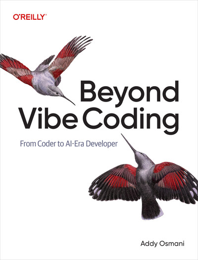
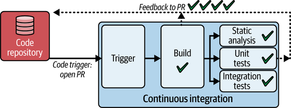
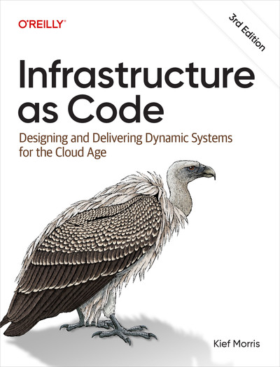

<!-- 
_backgroundColor: #0a1929
_color: white
_class: title dark
-->

# バイブコーディングと 継続的デプロイメント

### AI-Native Software Deliveryの世界

2025/09/30  
AI時代のソフトウェアデリバリー 
@nwiizo 15min

---

<!-- _backgroundColor: white -->

## nwiizo

株式会社スリーシェイクで
プロのソフトウェアエンジニアをやっているものです
格闘技、読書、グラビアが趣味でよく本を紹介しています

人生を通して"<strong>運動、睡眠、読書</strong>"をきちんとやりたい

---

## about 3-shake

  

---

## We are Hiring!!

3-shakeは一緒にSRE界隈を盛り上げてくれる<strong>仲間を大募集中</strong>です！
Mobility、FinTech、通信など大規模SREを存分に経験できます
（最近社内はGenAI / GPU / Kubernetesが盛り上がってます）
是非、カジュアル面談しましょう！！！！

  

---

## 本発表の目的

### 約束と現実のギャップを知る

本発表は<strong>バイブコーディングと継続的デプロイメント</strong>の統合において、現場で何が起きているのかをお伝えします。

<strong>簡単にアプリが作れる ≠ 簡単にビジネスが回る</strong>。よく検討されていないアプリケーションはビジネスを崩壊させる。アプリケーションは意外に簡単に壊れる。Knight Capitalは45分で4億6000万ドルを失った。

<strong>複雑性は解決されたのか、それとも別の層へ移動しただけなのか？</strong>測定できないものは制御できない。速度は上がったが、品質は向上していない。本発表では、<strong>こういう課題もあるのだと知っていただければ</strong>と思います。

---

## バイブコーディングとは

### HOWからWHATへ - 開発の民主化

Andrej Karpathy氏が2025年2月に提唱した概念。「もはやコーディングとは言えない。画面を見て、指示を出して、実行して、コピペするだけ」

<strong>HOW（実装詳細）からWHAT（意図）へのパラダイムシフト</strong>。自然言語で「何を作りたいか」を伝えるだけで、AIが実装を生成する。<strong>簡単にアプリが作れるようになった</strong>。

AI-Native DevOps 2.0 は、自動化を超えた知的エージェント、エンドツーエンドの自動化、シンプルな開発者体験を約束する。

---

## AI-Native が生む新たな問題 ①

### 簡単に作れるから、機能が増える

バイブコーディングにより、自然言語で指示するだけで機能が実装される。<strong>機能は少なければ少ないほどよい</strong>。しかし簡単に作れるため、機能はどんどん増える。

機能が増えすぎると、<strong>何が作りたかったのか分からなくなる</strong>。本来の目的を見失い、機能を追加すること自体が目的になる。

<strong>組み合わせ爆発</strong>: n個のフィーチャーフラグは 2^n 通りの状態を生む。10個で1024通り、20個で100万通り以上。機能が増えれば増えるほど、テスト不可能になる。

<strong>作るのは簡単だが、何を作っているのか分からなくなり、テストするのは不可能になる</strong>。

出典: Beyond Vibe Coding 
https://learning.oreilly.com/library/view/beyond-vibe-coding/9798341634749/

---

## AI-Native が生む新たな問題 ②

### 制御を失いかけている現場

<strong>説明可能性の欠如</strong>: AIは自動プロモーション判断やリスク検出を行うが、<strong>なぜその判断をしたのか説明できない</strong>。作るのは簡単だが、理解するのは難しい。AIの判断ミスの責任は誰が負うのか？

<strong>McNamara Fallacy</strong>: 測定できるもの（クリック率、コンバージョン率）だけを重視し、測定できない害（ユーザーの不満、信頼の喪失、プライバシー侵害）を無視する。作るのは簡単だが、影響を測定するのは難しい。

<strong>ガバナンスの崩壊</strong>: 非エンジニアでも簡単にアプリが作れるため、管理されないまま公開される。レビュープロセスを経ずに本番環境に到達する。どこも対応に追われている。

<strong>理想は人間とAIの協調だった。しかし現実は、簡単に作れるがゆえに制御を失いかけている</strong>。

出典: Beyond Vibe Coding 
https://learning.oreilly.com/library/view/beyond-vibe-coding/9798341634749/

---

## AI-Native Software Deliveryとは

<strong>開発からデプロイまでの全工程をAIが支援する新時代</strong>。従来のDevOps 1.0では手動デプロイの苦痛、ツールスプロール、不完全な自動化、10以上のツール統合が課題だった。

AI-Native DevOps 2.0は<strong>自律的AIエージェント、エンドツーエンド自動化、知的な意思決定、シンプルな開発者体験</strong>を約束する。<strong>単なる自動化から知的エージェントによる自律的最適化への質的飛躍</strong>を目指している。

出典: AI-Native Software Delivery 
https://learning.oreilly.com/library/view/ai-native-software-delivery/9781098171988/

---

## AI-Native Software Deliveryとは

### 人間以外の能力が必要になる

バイブコーディングや生成AIにより、<strong>誰でも簡単にコードが書けるようになった</strong>。しかし、良い品質のソフトウェアを保つためには、人間だけでは対応しきれない。

<strong>人間の限界</strong>: 機能が増え続けると、すべてをレビューし、テストすることは不可能になる。AIが生成したコードの意図を完全に理解することも難しい。制御を失いかけている現場では、<strong>人間以外の能力を持って品質を追加する必要がある</strong>。

<strong>AI-Native な品質管理</strong>: 自動テスト生成、AIによるコードレビュー、自動的な脆弱性検出、継続的な品質監視。人間の判断とAIの能力を組み合わせて、初めて持続可能な品質が実現できる。

簡単に作れるようになったからこそ、<strong>作った後の品質管理が新たな課題</strong>となる。

出典: AI-Native Software Delivery 
https://learning.oreilly.com/library/view/ai-native-software-delivery/9781098171988/

---

## DevOpsの歴史的進化

過去の<strong>戦争室（War Room）の悪夢</strong>—デプロイ失敗時に全員が集まって深夜や週末に火消し作業をする緊急対応の場—では、数週間の開発が数時間のデプロイで破綻し、依存関係地獄と互換性のないライブラリ、忘れられたマイグレーションに苦しんだ。

DevOps 1.0 (2009- ) は多数のツール（GitHub Actions, Docker, K8s, ArgoCD, Helm, Terraform, Prometheus, Grafana...）により、10以上のツール統合の複雑性という新たな問題を生んだ。この時代は今も続いている。Accelerate（2018年出版の DevOps 研究書）で提唱された4つのパフォーマンス指標—デプロイ頻度、リードタイム、平均復旧時間、変更失敗率—への挑戦が始まる。

出典: 10+ Deploys Per Day 
https://www.slideshare.net/slideshow/10-deploys-per-day-dev-and-ops-cooperation-at-flickr/1628368

---

## AI-Native DevOps 2.0 の約束と現実

AI-Native DevOps 2.0 (現在) は自動化を超えた知的エージェントを約束したが、<strong>現実には新たな抽象化レイヤー（MCP/ACP などのプロトコル）による複雑性の増大をもたらしている</strong>。

ソフトウェア設計の原則が示すように、「<strong>複雑性は排除できない。ただ移動させることができるだけ</strong>」という本質がある。AIは複雑性を解決するのか、それとも新たな複雑性を生み出すだけなのか？かつて DevOps が解決しようとした<strong>「開発と運用の壁」は、AI時代には「人間とAIの壁」、そして「理解と制御の壁」へと変貌した</strong>。

出典: Building Applications with AI Agents 
https://learning.oreilly.com/library/view/building-applications-with/9781098176495/

---

## Knight Capital の4億6000万ドルの教訓

### 2012年8月1日、45分間の崩壊

2012年8月1日、フィーチャーフラグの誤設定により、一部のサーバーでレガシーコードが再活性化。古い取引アルゴリズムが暴走し、<strong>45分間で4億6000万ドルの損失</strong>を出し、Knight Capitalは事実上の倒産に追い込まれた。

表面的な原因は、手動デプロイメントの人為的エラー、不十分なフィーチャーフラグ管理、限定的な自動化だった。

出典: WSJ 
https://www.wsj.com/articles/SB10000872396390443866404577564772083961412

---

## 複雑性は常に人間の理解を超える

<strong>本質的な問題は複雑性が常に人間の理解を超えることにある</strong>。単一の原因ではなく、<strong>複数の防御層が同時的に失敗する</strong>。すべての防御メカニズムが機能していても、システムは崩壊しうる。

皮肉なことに、<strong>フィーチャーフラグは「解決策」として導入されたが、それ自体が史上最悪の金融災害の直接的原因となった</strong>。これは<strong>技術至上主義（Technological Solutionism）の罠</strong>—問題を引き起こしたテクノロジーを、更なるテクノロジーで解決しようとする姿勢—を象徴している。

---

## GitOps と単一の真実という理想

### バージョン管理の進化

バージョン管理は中央集権型（CVS/Subversion）から分散型（Git）へと進化した。Gitの登場により、コードの履歴を複数の場所に分散して保持できるようになった。

GitOps はこの Git を<strong>システムの望ましい状態を記述する唯一の信頼できる情報源</strong>として扱う。Git に記述された状態と実際のシステムの状態を常に比較し、差分があれば自動的に修正する。これにより、<strong>設定ミスによるエラーを理論上は排除できる</strong>はずだった。

出典: AI-Native Software Delivery 
https://learning.oreilly.com/library/view/ai-native-software-delivery/9781098171988/

---

## 単一の真実という幻想

### 現実の複雑性

しかし<strong>真実は本当に一つなのか？</strong>実際には状況に応じて異なる設定が必要になる。

宣言的な定義では表現できない暗黙知が存在する。ネットワーク遅延やリソース競合といった非決定論的な要素も現実には避けられない。地理的に分散した複数のクラスターを運用する場合、<strong>グローバルに統一された「真実」と、各地域固有の設定のどちらを優先すべきか？</strong>

GitOps の理想と現実のシステム運用には、埋めがたいギャップが存在する。

出典: Managing Kubernetes 
https://learning.oreilly.com/library/view/managing-kubernetes/9781492033905/

---

## AI時代の所有権と責任

<strong>AIが生成したコードの「作者」は誰か？</strong>コミットメッセージはAIか人間か？<strong>責任と所有権の再定義という未解決問題</strong>が残る。

AIへの過度な依存はプラットフォームロックイン、認知負荷の増大、責任の所在の曖昧化をもたらす。<strong>所有権と責任をどう定義するかは未解決の問題だが、チームや組織ごとに決めることが重要</strong>である。

---

## 継続的インテグレーション (CI) の知性化

### テストの自動化から知性化へ

Test-Driven Development (TDD) はテストを先に書くという逆転の発想で、「動く」から「正しい」へとパラダイムシフトを起こした。テストピラミッドは基盤に大量のユニットテスト、中層に統合テスト、頂点に手動テストを配置する。

AI-Native のテスト知性化は変更に関連するテストのみを実行し、テスト依存関係を自動理解する。意図ベースのテストでは「商品を購入する」と記述すれば、AIがステップを生成する。

出典: AI-Native Software Delivery 
https://learning.oreilly.com/library/view/ai-native-software-delivery/9781098171988/

---

## Infrastructure as Code (IaC) の理想と現実

### 宣言的定義が約束したもの

IaCは<strong>再現性、バージョン管理、宣言的定義、自動化</strong>を約束した。Terraform / OpenTofu、AWS CloudFormation、Ansible、Puppet などのツールにより、インフラを手動設定から解放することを目指した。

しかし現実には複雑性が存在する。非決定論的要素（ネットワーク遅延、リソース競合）、状態の乖離、コード化できない暗黙知、対応していない機能、そして新たな<strong>「IaCでは動いた」問題</strong>が発生する。

すべてをコード化することは、すべてを制御できることを意味しない。

出典: Infrastructure as Code, 3rd Edition 
https://learning.oreilly.com/library/view/infrastructure-as-code/9781098150341/

---

## システムの限界: 観測と破壊

### 複雑性は制御できない

2024年12月11日、OpenAIの新しいテレメトリーサービスがK8sコントロールプレーンを圧倒し、DNS障害ですべてのサービスが停止。<strong>観測しようとしたシステムが、観測によって破壊された</strong>。

カオスエンジニアリングは本番環境で「制御された破壊」を行うが、仮説検証には限界がある。200msのレイテンシ注入が成功したら、500msでも同様だろうか？

Normal Accidents 理論が示すように、<strong>複雑で密結合なシステムでは事故は避けられない</strong>。そしてAIは新たな複雑性と密結合を生む。

出典: Chaos Engineering 
https://learning.oreilly.com/library/view/chaos-engineering/9781492043850/

---

## AI-Native の現実

### 複雑性は移動しただけ

AI-Native DevOps 2.0 は<strong>自動化を超えた知的エージェント、エンドツーエンドの自動化、シンプルな開発者体験</strong>を約束した。しかし現実には<strong>新たな抽象化レイヤー（MCP/ACP などのプロトコル、テスト知性化、IaC）による複雑性の増大</strong>が生じている。

ソフトウェア設計の原則が示すように、「<strong>複雑性は排除できない。ただ移動させることができるだけ</strong>」。複雑性を管理するツールが、新たな複雑性を生む。Knight Capitalの教訓—解決策が新たな問題の原因になる—は今も有効だ。

<strong>速度は上がったが、品質は向上していない</strong>。では何が問題なのか？

出典: The Frugal Architect 
https://thefrugalarchitect.com/laws/

---

## The Frugal Architect についてちゃんと考える ①

### 測定されないコストの問題

<strong>簡単にアプリが作れるようになった結果、機能が無秩序に増え、コストが爆発的に増大している</strong>。しかし、作るのは簡単だが運用コストを誰も測定していない。<strong>測定できなければ、管理できない</strong>。

The Frugal Architect（倹約アーキテクチャ）の第1法則: <strong>「コストを非機能要件にせよ（Make Cost a Non-functional Requirement）」</strong>。非機能要件は現在、アーキテクチャ特性と呼ばれる。

パフォーマンス、可用性、セキュリティといったアーキテクチャ特性と同様に、<strong>コストも設計段階から考慮すべき重要な特性</strong>である。AI-Native時代だからこそ、コストを意識したアーキテクチャが必要になる。

出典: The Frugal Architect 
https://thefrugalarchitect.com/laws/

---

## The Frugal Architect についてちゃんと考える ②

### AI-Native時代の隠れたコスト

<strong>GPU利用料、API従量課金だけではない</strong>。AIの判断を人間が検証する工数、説明できない判断を説明する時間、ベンダーロックインによる選択肢の喪失、組み合わせ爆発によるテストコスト。

<strong>人的コスト</strong>: 増え続ける機能を理解し続ける認知負荷、制御を失いかけている現場での燃え尽き症候群、AIへの過度な依存による技術力の低下。これらすべてを設計時に考慮する必要がある。

<strong>測定できなければ、管理できない</strong>。簡単に作れるからこそ、コストを設計の一部として扱い、継続的に測定し、最適化することが、持続可能なシステムを作る鍵となる。

出典: The Frugal Architect 
https://thefrugalarchitect.com/laws/

---

## 凡庸な結論: 銀の弾丸はない

### 課題を知り、環境に適応する

Fred Brooks の警告は40年経った今も有効だ。<strong>ソフトウェア工学に銀の弾丸は存在しない</strong>。AI-Native も例外ではない。

<strong>簡単にアプリが作れるようになった。しかし、よく検討されていないアプリケーションはビジネスを崩壊させる</strong>。複雑性は移動しただけだ。測定できないものは制御できない。速度は上がったが、品質は向上していない。

<strong>生成AIは環境になった</strong>。戦うのではなく、<strong>適応していかなければならない</strong>。<strong>不完全な理解のまま前進し、部分的な制御を受け入れ、不確実性と共存する</strong>。本発表で<strong>こういう課題もあるのだと知っていただけたなら</strong>、それが第一歩となる。

---

## 参考資料 ①

**① AI-Native Software Delivery**
https://learning.oreilly.com/library/view/ai-native-software-delivery/9781098171988/

**② Beyond Vibe Coding**
https://learning.oreilly.com/library/view/beyond-vibe-coding/9798341634749/

**③ Building Applications with AI Agents**
https://learning.oreilly.com/library/view/building-applications-with/9781098176495/

**④ Infrastructure as Code, 3rd Edition**
https://learning.oreilly.com/library/view/infrastructure-as-code/9781098150341/

**⑤ Managing Kubernetes**
https://learning.oreilly.com/library/view/managing-kubernetes/9781492033905/

---

## 参考資料 ②

**⑥ Chaos Engineering**
https://learning.oreilly.com/library/view/chaos-engineering/9781492043850/

**⑦ The Frugal Architect**
https://thefrugalarchitect.com/laws/

**⑧ Accelerate: The Science of Lean Software and DevOps**
Nicole Forsgren, Jez Humble, Gene Kim (2018)
https://itrevolution.com/product/accelerate/

**⑨ The DevOps Handbook (2nd Edition)**
Gene Kim, Jez Humble, Patrick Debois, John Willis, Nicole Forsgren
https://itrevolution.com/product/the-devops-handbook-second-edition/

**⑩ A Philosophy of Software Design (2nd Edition)**
John Ousterhout
https://web.stanford.edu/~ouster/cgi-bin/book.php

---

## 参考資料 ③

**⑪ The Mythical Man-Month: Essays on Software Engineering**
Fred Brooks
https://www.oreilly.com/library/view/mythical-man-month-the/0201835959/

**⑫ Thinking in Systems: A Primer**
Donella H. Meadows
https://www.chelseagreen.com/product/thinking-in-systems/

**⑬ Normal Accidents: Living with High-Risk Technologies**
Charles Perrow
https://press.princeton.edu/books/paperback/9780691004129/normal-accidents

---

<!--
_backgroundColor: #0a1929
_color: white
_class: title dark
-->

<!-- タイトルページ左上に大きなロゴを表示 -->

  

# ありがとうございました

### ご質問・ご相談はお気軽にお問い合わせください

@nwiizo | https://3-shake.com

