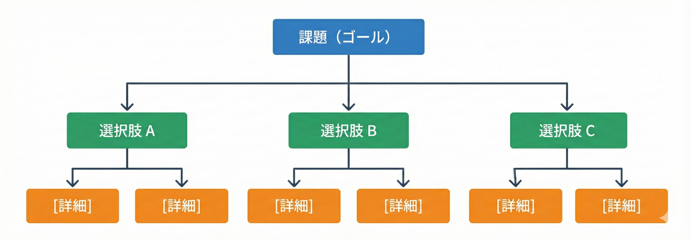

<!--
_backgroundColor: #0a1929
_color: white
_class: title dark
-->


<div class="title" style="text-align: left; margin-top: 100px; margin-left: 20px; padding-left: 0; max-width: 70%;">

# <span style="font-size: 1.2em;">おい、テックブログを書け</span>

### 3年目までに身につけたい技術ブログの書き方

</div>

<div class="author-info" style="text-align: left; padding-left: 0; text-indent: 0;">
2025/12/05 Forkwell Community </br>
おい、テックブログを書け</br>
@nwiizo 30min
</div>

---

<!-- _backgroundColor: white -->


## nwiizo

<div class="info-box">
株式会社スリーシェイクで
プロのソフトウェアエンジニアをやっているものです
格闘技、読書、グラビアが趣味でよく本を紹介しています
</div>

<p style="margin-top: 30px !important;">人生を通して"<strong>運動、睡眠、読書</strong>"をきちんとやりたい</p>

https://github.com/nwiizo

---

## about 3-shake

<div style="text-align: center; margin-top: 30px;">
  
</div>

---

## We are Hiring!!

<div style="text-align: center; margin-top: 30px;">

3-shakeは一緒にSRE界隈を盛り上げてくれる<strong>仲間を大募集中</strong>です！
Mobility、FinTech、通信など大規模SREを存分に経験できます
（最近社内はGenAI / GPU / Kubernetesが盛り上がってます）
是非、カジュアル面談しましょう！！！！

  
</div>

---

## 今日お話しすること

<div style="font-size: 0.75em;">

<div style="display: flex; gap: 30px; margin-top: 20px;">
<div style="flex: 1; background-color: #f5f5f5; padding: 15px; border-radius: 8px;">

**1. なぜ書くべきなのか**
- 「書かない理由」を潰す
- 書かないコストを直視する

**2. 何を書くか：ネタの見つけ方**
- 日常からネタを発掘する技術
- THINK BIGGER：6ステップの発想法

**3. どう書くか：記事の書き方**
- 技術ブログの種類と構成
- タイトル・導入文・本文の型

</div>
<div style="flex: 1; background-color: #f5f5f5; padding: 15px; border-radius: 8px;">

**4. より良い記事にするために**
- 読みやすさを高めるテクニック
- 防御力の高いブログを書く
- 公開前チェックリスト

**5. 実践編**
- どこに・いつ書くか
- よくある失敗パターン
- AI活用の注意点

</div>
</div>

</div>

---

## この発表で解決できること

### 「書けない」「書かない」を終わらせる

<div style="font-size: 0.75em;">

<div style="display: flex; gap: 20px; margin-top: 15px;">
<div style="flex: 1; background-color: #f5f5f5; padding: 15px; border-radius: 8px;">

**こんな悩みを持っていませんか？**

- 書こうと思っているけど、始められない
- 何を書けばいいかわからない
- 書き始めても途中で止まる
- 公開するのが怖い
- 続かない

</div>
<div style="flex: 1; background-color: #f5f5f5; padding: 15px; border-radius: 8px;">

**この30分で持ち帰れるもの**

- 「書くべき理由」の腹落ち
- ネタを見つける6ステップの発想法
- 記事の型とチェックリスト
- 公開への心理的ハードルの下げ方
- AIとの正しい付き合い方

</div>
</div>

<div style="margin-top: 15px; padding: 12px; background-color: #e0e0e0; border-radius: 5px; text-align: center;">
<span style="color: #e65100; font-weight: bold;">目標：この発表を聞いた人が、今週1本ブログを書く</span>
</div>

</div>

---

## なぜ技術ブログを書くべきなのか

### 「書かない理由」を全部潰す

<div style="font-size: 0.75em;">

<div style="display: flex; gap: 20px; margin-top: 15px;">
<div style="flex: 1; padding: 15px; background-color: #f5f5f5; border-radius: 8px;">

**❌「時間がない」**

→ 30分の苦労を記事にすれば、100人の30分を救う。**書かない方が時間の無駄**

</div>
<div style="flex: 1; padding: 15px; background-color: #f5f5f5; border-radius: 8px;">

**❌「もう誰かが書いている」**

→ 同じ技術でも、環境・前提・視点が違う。**あなたの言葉で救われる人がいる**

</div>
</div>

<div style="display: flex; gap: 20px; margin-top: 15px;">
<div style="flex: 1; padding: 15px; background-color: #f5f5f5; border-radius: 8px;">

**❌「間違ったことを書くのが怖い」**

→ 間違いは指摘されて直せばいい。**書かなければ永遠に間違いに気づけない**

</div>
<div style="flex: 1; padding: 15px; background-color: #f5f5f5; border-radius: 8px;">

**❌「自分なんてまだ経験が浅い」**

→ 初心者の「わからない→わかった」は、専門家には書けない。**鮮度が価値**

</div>
</div>

</div>

---

## 「書かない」という選択のコスト

### 失われるものを直視する

<div style="font-size: 0.75em;">

<div style="display: flex; gap: 20px; margin-top: 15px;">
<div style="flex: 1; background-color: #f5f5f5; padding: 15px; border-radius: 8px;">

**🧠 学習効果の損失**

読んだだけ、やっただけでは定着しない。書くことで初めて「自分の知識」になる。**書かなければ、3ヶ月後には忘れる**

</div>
<div style="flex: 1; background-color: #f5f5f5; padding: 15px; border-radius: 8px;">

**👤 存在証明の機会損失**

GitHubは「何を作ったか」を示す。ブログは「どう考えたか」を示す。**思考が見えないエンジニアは選ばれない**

</div>
</div>

<div style="display: flex; gap: 20px; margin-top: 15px;">
<div style="flex: 1; background-color: #f5f5f5; padding: 15px; border-radius: 8px;">

**🔄 同じ説明を繰り返すコスト**

チームで何度も同じことを説明していないか？記事にすれば1回で済む。**書かないから同じ苦労を繰り返す**

</div>
<div style="flex: 1; background-color: #f5f5f5; padding: 15px; border-radius: 8px;">

**🌐 コミュニティへの負債**

あなたも誰かの記事に救われた。受け取るだけで返さないのは**フリーライダー**。書いて返せ

</div>
</div>

</div>

---

## 技術ブログ執筆がもたらす3つの価値

### 書くことの最大の受益者は、書いた本人だ

<div style="font-size: 0.75em;">

<div style="display: flex; gap: 20px;">
<div style="flex: 1; background-color: #f5f5f5; padding: 15px; border-radius: 8px;">

**🪞 理解の穴が見える**

曖昧に理解していたつもりが、言語化しようとした瞬間に「説明できない」と気づく

→ 調べ直し、考え直し、書ける
→ <strong>理解は確実に深まる</strong>

</div>
<div style="flex: 1; background-color: #f5f5f5; padding: 15px; border-radius: 8px;">

**📚 知識が構造化される**

散らばった知識が、書くことで整理される。「なんとなく分かった」が「説明できる」に変わる

→ <strong>半年後の自分が助かる</strong>

</div>
<div style="flex: 1; background-color: #f5f5f5; padding: 15px; border-radius: 8px;">

**🔥 継続の原動力になる**

他者に読まれなくても、この価値は消えない。「書いたことで自分は確実に賢くなった」

→ <strong>他者の評価に依存しない</strong>

</div>
</div>

</div>

---

## 他者への価値だけを見ていないか

### PV・はてブ・「参考になりました」だけが価値？

<div style="font-size: 0.75em;">

<div style="display: flex; gap: 20px;">
<div style="flex: 1; background-color: #f5f5f5; padding: 15px; border-radius: 8px;">

**他者からの反応を価値の尺度にしすぎると**

- PVが伸びないと落ち込む
- 反応がないと書く気が失せる
- 「誰も読まないかも」で手が止まる

→ **継続できなくなる**

</div>
<div style="flex: 1; background-color: #f5f5f5; padding: 15px; border-radius: 8px;">

**自分への価値を軸にすると**

- 書くこと自体が報酬になる
- 反応がなくても価値がある
- 「自分のため」だからハードルが下がる

→ **継続できる**

</div>
</div>

<div style="margin-top: 15px; padding: 10px; background-color: #e0e0e0; border-radius: 5px; text-align: center;">
💡 <strong>問題は「書くかどうか」ではない。「何を書くか」だ</strong>
</div>

</div>

---

<!--
_backgroundColor: #0a1929
_color: white
-->

<div style="display: flex; flex-direction: column; justify-content: center; align-items: center; height: 80%; text-align: center;">

<div style="font-size: 1.5em; font-weight: bold;">

書く価値はわかった。では、何を書くか？

</div>

<div style="font-size: 0.9em; margin-top: 30px; color: #aaa;">

「書くことがない」は思い込み。日常にネタは転がっている<br/>
→ ネタの見つけ方と、発想を広げる6ステップを紹介します

</div>

</div>

---

## 日常からネタを発掘する技術

### ブログネタは探すものではない、気づくもの

<div style="font-size: 0.75em;">

<div style="display: flex; gap: 15px;">
<div style="flex: 1; background-color: #f5f5f5; padding: 12px; border-radius: 5px;">

**🤔 学習過程での「なぜ？」**

理解するのに時間がかかった概念
直感に反する仕様は
記事になりやすいトピック

</div>
<div style="flex: 1; background-color: #f5f5f5; padding: 12px; border-radius: 5px;">

**🔄 繰り返し説明していること**

チーム内で何度も同じ説明をしている内容は
記事化する価値が高い

</div>
</div>

<div style="display: flex; gap: 15px; margin-top: 10px;">
<div style="flex: 1; background-color: #f5f5f5; padding: 12px; border-radius: 5px;">

**🔍 検索で見つからなかった問題**

検索して出てこなかった答えを
あなたが書けば、次の誰かは3秒で見つかる

</div>
<div style="flex: 1; background-color: #f5f5f5; padding: 12px; border-radius: 5px;">

**❓ 「あれ？」と思った瞬間**

予想通りに動かなかった。なぜ？
意外な挙動を示した。なぜ？
**この「なぜ？」が記事の種**

</div>
</div>

</div>

---

## でも、ネタはあっても形にならない

### 「書きたいこと」を「書ける記事」に変えるには？

<div style="font-size: 0.75em;">

<div style="display: flex; gap: 20px; margin-top: 15px;">
<div style="flex: 1; background-color: #f5f5f5; padding: 15px; border-radius: 8px;">

**よくある悩み**

- ネタはあるけど、どう膨らませればいいかわからない
- 書き始めても途中で手が止まる
- 「で、何が言いたいの？」と自分でも思う
- 構成がぐちゃぐちゃになる

</div>
<div style="flex: 1; background-color: #f5f5f5; padding: 15px; border-radius: 8px;">

**必要なのは「発想の型」**

ネタを記事に変えるには、体系的なアプローチが必要

→ 「選択の科学」で有名なシーナ・アイエンガー氏の**THINK BIGGER**を紹介

**6ステップで「書けない」を解消する**

</div>
</div>

</div>

---

## シーナ・アイエンガー氏とは

### 「ジャムの法則」で有名なコロンビア大学教授

<div style="font-size: 0.75em;">

<div style="display: flex; gap: 20px; margin-top: 15px;">
<div style="flex: 1; background-color: #f5f5f5; padding: 15px; border-radius: 8px;">

**ジャムの法則（2000年）**

スーパーでジャムの試食ブースを設置
- **24種類**を並べた場合
- **6種類**を並べた場合

結果：24種類の方が足を止める人は多いが、
**実際に購入したのは6種類の方が圧倒的に多かった**

</div>
<div style="flex: 1; background-color: #f5f5f5; padding: 15px; border-radius: 8px;">

**この実験が示すこと**

選択肢が多すぎると、人は「選ぶ」という行為自体ができなくなる

→ **選択の科学**（2010年）で世界的ベストセラーに

→ その後10年かけて「選択肢すらない場合、どうすればいいか」を研究

</div>
</div>

<div style="margin-top: 15px; padding: 10px; background-color: #e0e0e0; border-radius: 5px; text-align: center;">
💡 <strong>THINK BIGGER（2023年）は、その研究成果をまとめた13年ぶりの新作</strong>
</div>

</div>

---

## THINK BIGGER：6ステップの発想法

### 「新しいものごとは、要素が新しいのではない。組み合わせ方が新しいのだ」

<div style="font-size: 0.75em;">

<div style="background-color: #e0e0e0; padding: 15px; border-radius: 8px; margin-bottom: 10px;">

**📝 この6ステップを「ブログの執筆」に応用します**

</div>

<div style="background-color: #f5f5f5; padding: 15px; border-radius: 8px;">

**天才のイノベーターが無意識に行っていた思考を、誰でも再現できる6ステップに分解**

ガンディー、Netflix、ピカソ、コロナワクチン開発...歴史に残る「ビッグアイデア」は、ゼロからの発明ではなく「既存の要素の新しい組み合わせ」から生まれている。ブレストで量を出すのではなく、**質を追求**する発想法。

</div>

<div style="display: flex; gap: 10px; margin-top: 15px;">
<div style="flex: 1; background-color: #f5f5f5; padding: 10px; border-radius: 8px; text-align: center;">

**Step 1**
課題を選ぶ

</div>
<div style="flex: 1; background-color: #f5f5f5; padding: 10px; border-radius: 8px; text-align: center;">

**Step 2**
課題を分解

</div>
<div style="flex: 1; background-color: #f5f5f5; padding: 10px; border-radius: 8px; text-align: center;">

**Step 3**
望みを比較

</div>
<div style="flex: 1; background-color: #f5f5f5; padding: 10px; border-radius: 8px; text-align: center;">

**Step 4**
箱の中と外

</div>
<div style="flex: 1; background-color: #f5f5f5; padding: 10px; border-radius: 8px; text-align: center;">

**Step 5**
選択マップ

</div>
<div style="flex: 1; background-color: #f5f5f5; padding: 10px; border-radius: 8px; text-align: center;">

**Step 6**
第三の目

</div>
</div>

<div style="margin-top: 15px; padding: 10px; background-color: #e0e0e0; border-radius: 5px; text-align: center;">
💡 <strong>「書けない」は才能の問題じゃない。この6ステップのどこかが詰まっているだけ</strong>
</div>

</div>

---

## まずは「何を書くか」から

### Step 1：課題を選ぶ

<div style="font-size: 0.85em;">

<div style="background-color: #f5f5f5; padding: 20px; border-radius: 8px; text-align: center;">

6ステップの最初は **「テーマ選び」**

</div>

<div style="margin-top: 20px; text-align: center;">

「書きたいことはあるけど、何から手をつければ...」

↓

**まず「1記事で書けるサイズ」に絞る**

</div>

</div>

---

## Step 1：課題を選ぶ

### 一言で言うと：「何について書くか」を決める

<div style="font-size: 0.75em;">

<div style="background-color: #e0e0e0; padding: 15px; border-radius: 8px;">

**このステップでやること** → 記事のテーマを決める

</div>

<div style="display: flex; gap: 20px; margin-top: 15px;">
<div style="flex: 1; background-color: #f5f5f5; padding: 15px; border-radius: 8px;">

**ポイント：サイズ感が重要**

- 大きすぎると書ききれない
- 小さすぎると内容が薄い
- **「1記事で完結する」サイズを探す**

</div>
<div style="flex: 1; background-color: #f5f5f5; padding: 15px; border-radius: 8px;">

**具体例で比較**

- ❌「Kubernetesの使い方」→ 大きすぎ
- ❌「kubectl getコマンド」→ 小さすぎ
- ✅「本番障害を防いだリソース制限の設定」

</div>
</div>

<div style="margin-top: 15px; padding: 10px; background-color: #e0e0e0; border-radius: 5px; text-align: center;">
💡 <strong>「誰かの役に立つ」かつ「自分が書ける」サイズを見つける</strong>
</div>

</div>

---

## Step 1：よくある失敗パターン

### テーマ選びでつまずく人の共通点

<div style="font-size: 0.75em;">

<div style="display: flex; gap: 20px; margin-top: 15px;">
<div style="flex: 1; background-color: #f5f5f5; padding: 15px; border-radius: 8px;">

**❌ 大きすぎるテーマを選ぶ**

「Kubernetesについて」「AWSの使い方」

→ 書ききれない → 途中で挫折

</div>
<div style="flex: 1; background-color: #f5f5f5; padding: 15px; border-radius: 8px;">

**❌ 小さすぎるテーマを選ぶ**

「このコマンドのオプション」

→ 内容が薄い → 書く意味を見失う

</div>
</div>

<div style="background-color: #e0e0e0; padding: 15px; border-radius: 8px; margin-top: 15px;">

**✅ ちょうどいいテーマの見つけ方**

「自分が2〜3日かけて解決したこと」がベスト
→ 深みがある & 1記事で完結する

</div>

</div>

---

## Step 1：課題のレベルを上げ下げする

### ちょうどいいサイズを探す技術

<div style="font-size: 0.75em;">

<div style="display: flex; gap: 20px; margin-top: 15px;">
<div style="flex: 1; background-color: #f5f5f5; padding: 15px; border-radius: 8px;">

**レベルを上げる（抽象化）**

「CI/CDパイプラインの高速化」
↑
「GitHub Actionsのキャッシュ設定」

より大きな視点で課題を捉え直す

</div>
<div style="flex: 1; background-color: #f5f5f5; padding: 15px; border-radius: 8px;">

**レベルを下げる（具体化）**

「GitHub Actionsのキャッシュ設定」
↓
「node_modulesのキャッシュで3分短縮した話」

より具体的に分解する

</div>
</div>

<div style="background-color: #f5f5f5; padding: 15px; border-radius: 8px; margin-top: 15px;">

**技術ブログの「おいしいサイズ」**

- 1記事で完結する / 読者が再現できる / 自分の経験が活きる
- 上げ下げしながら「書きやすく、読まれやすい」ところを探す

</div>

</div>

---

## テーマが決まった。次は「構成」

### Step 1 → Step 2

<div style="font-size: 0.85em;">

<div style="background-color: #f5f5f5; padding: 20px; border-radius: 8px; text-align: center;">

**Step 1 完了**：書くテーマが決まった

</div>

<div style="margin-top: 20px; text-align: center;">

「テーマは決まったけど、何から書けば...」

↓

**次は「何を、どの順番で書くか」を決める**

</div>

</div>

---

## Step 2：課題を分解する

### 一言で言うと：「記事の目次」を作る

<div style="font-size: 0.75em;">

<div style="background-color: #e0e0e0; padding: 15px; border-radius: 8px;">

**このステップでやること** → テーマを「書くべきこと」に分解する（5つまで）

</div>

<div style="display: flex; gap: 20px; margin-top: 15px;">
<div style="flex: 1; background-color: #f5f5f5; padding: 15px; border-radius: 8px;">

**なぜ分解するのか**

「〇〇の話を書こう」だけでは手が動かない

→ **「何を、どの順番で書くか」を決める**

</div>
<div style="flex: 1; background-color: #f5f5f5; padding: 15px; border-radius: 8px;">

**分解 = 記事の骨格を作る**

- 分解した項目がそのまま見出しになる
- 5つまでに絞ると焦点が定まる

</div>
</div>

</div>

---

## Step 2：分解の具体例

### テーマを見出しに分解する

<div style="font-size: 0.75em;">

<div style="background-color: #f5f5f5; padding: 12px; border-radius: 8px;">

**テーマ：「OOMで落ちたPodを調査した話」**

</div>

<div style="background-color: #e0e0e0; padding: 15px; border-radius: 8px; margin-top: 15px;">

**分解結果（= 見出し）**

1. 何が起きたか（症状）
2. どう調査したか（手順）
3. 原因は何だったか（分析）
4. どう解決したか（対策）
5. 再発防止（教訓）

</div>

<div style="margin-top: 15px; padding: 10px; background-color: #f5f5f5; border-radius: 5px; text-align: center;">
💡 <strong>分解すると記事の構成が見えてくる</strong>
</div>

</div>

---

## Step 2：分解の実践例

### 「OOM調査」をさらに分解してみる

<div style="font-size: 0.7em;">

<div style="display: flex; gap: 20px; margin-top: 10px;">
<div style="flex: 1; background-color: #f5f5f5; padding: 12px; border-radius: 8px;">

**最初の分解（大きい）**

1. 症状
2. 調査
3. 原因
4. 解決
5. 再発防止

</div>
<div style="flex: 1; background-color: #f5f5f5; padding: 12px; border-radius: 8px;">

**さらに分解（細かい）**

1. 症状 → エラーログ、影響範囲
2. 調査 → コマンド、ツール
3. 原因 → 仮説、検証
4. 解決 → 設定変更、確認
5. 再発防止 → 監視設定

</div>
</div>

<div style="background-color: #e0e0e0; padding: 12px; border-radius: 8px; margin-top: 15px;">

**分解のコツ**

- 最初は大きく分解 → 書きながら細かくする
- 「これは1段落で書ける？」が目安
- 細かくしすぎると読みにくい → バランスが大事

</div>

</div>

---

## Step 2：なぜ「5つまで」なのか

### ジャムの法則をここでも活かす

<div style="font-size: 0.75em;">

<div style="display: flex; gap: 20px; margin-top: 15px;">
<div style="flex: 1; background-color: #f5f5f5; padding: 15px; border-radius: 8px;">

**選択肢が多すぎると選べない**

ジャムの法則と同じ。サブ課題を10個も20個も出すと、どれに注力すべきか分からなくなる。

**5つに絞る効果**

- 本当に重要なものを見極められる
- 各サブ課題に十分な時間を割ける
- 記事の構成がシンプルになる

</div>
<div style="flex: 1; background-color: #f5f5f5; padding: 15px; border-radius: 8px;">

**絞る過程で見えてくるもの**

「これは本当に必要か？」と自問すると...

- 実は同じことを言っている項目
- なくても成立する項目
- 別の記事にした方がいい項目

→ **削ることで本質が見える**

</div>
</div>

<div style="margin-top: 15px; padding: 10px; background-color: #f5f5f5; border-radius: 5px; text-align: center;">
⚠️ <strong>「網羅的に」より「絞って深く」の方が読者に刺さる</strong>
</div>

</div>

---

## 構成ができた。次は「視点」

### Step 2 → Step 3

<div style="font-size: 0.85em;">

<div style="background-color: #f5f5f5; padding: 20px; border-radius: 8px; text-align: center;">

**Step 2 完了**：記事の構成（目次）ができた

</div>

<div style="margin-top: 20px; text-align: center;">

「構成は決まった。でも、どんなトーンで書けば...」

↓

**次は「誰の視点で書くか」を決める**

</div>

</div>

---

## Step 3：望みを比較する

### 一言で言うと：「誰のために書くか」を決める

<div style="font-size: 0.75em;">

<div style="background-color: #e0e0e0; padding: 15px; border-radius: 8px;">

**このステップでやること** → 「自分・読者・会社」の望みを整理し、優先順位をつける

</div>

<div style="display: flex; gap: 20px; margin-top: 15px;">
<div style="flex: 1; background-color: #f5f5f5; padding: 15px; border-radius: 8px;">

**3つの望み**

1. **自分** → 書きたいこと、伝えたいこと
2. **読者** → 知りたいこと、解決したいこと
3. **会社** → 宣伝、採用、ブランディング

</div>
<div style="flex: 1; background-color: #f5f5f5; padding: 15px; border-radius: 8px;">

**結論：自分を優先してOK**

全部満たそうとすると薄くなる。

**まず自分が書きたいことを書く**
→ 熱量のある記事は読者にも伝わる

</div>
</div>

<div style="margin-top: 15px; padding: 10px; background-color: #e0e0e0; border-radius: 5px; text-align: center;">
💡 <strong>「誰かのために」より「自分のために」書いた記事の方が刺さる</strong>
</div>

</div>

---

## Step 3：具体例で考える

### 同じテーマでも「誰のため」で変わる

<div style="font-size: 0.7em;">

<div style="background-color: #f5f5f5; padding: 12px; border-radius: 8px;">

**テーマ：「GitHub Actionsでテストを高速化した話」**

</div>

<div style="display: flex; gap: 20px; margin-top: 15px;">
<div style="flex: 1; background-color: #f5f5f5; padding: 12px; border-radius: 8px;">

**自分の望み優先の記事**

- 試行錯誤の過程を詳しく
- 失敗した方法も書く
- 自分の学びを残す

→ 技術的に深い記事に

</div>
<div style="flex: 1; background-color: #f5f5f5; padding: 12px; border-radius: 8px;">

**読者の望み優先の記事**

- 結論を先に
- コピペで使える設定
- 手順だけシンプルに

→ 実用的な記事に

</div>
</div>

<div style="margin-top: 15px; padding: 10px; background-color: #e0e0e0; border-radius: 5px; text-align: center;">
→ どちらも正解。**今回どちらで書くか**を決めるのがこのステップ
</div>

</div>

---

## Step 3：望みの対立を認める

### 全部は満たせない、だから選ぶ

<div style="font-size: 0.75em;">

<div style="display: flex; gap: 20px; margin-top: 15px;">
<div style="flex: 1; background-color: #f5f5f5; padding: 15px; border-radius: 8px;">

**よくある対立**

- 自分：詳しく書きたい
- 読者：早く結論を知りたい
- 会社：会社の宣伝を入れてほしい

**全部を満たそうとすると...**

→ 長くて読まれない記事になる

</div>
<div style="flex: 1; background-color: #f5f5f5; padding: 15px; border-radius: 8px;">

**選択する勇気**

- 今回は「自分の学び」を優先
- 今回は「読者の課題解決」を優先
- 今回は「会社への貢献」を優先

**1記事1テーマで強弱をつける**

</div>
</div>

<div style="margin-top: 15px; padding: 10px; background-color: #f5f5f5; border-radius: 5px; text-align: center;">
⚠️ <strong>全方位に良い顔をしようとすると、誰にも刺さらない</strong>
</div>

</div>

---

## 視点が決まった。次は「材料集め」

### Step 3 → Step 4

<div style="font-size: 0.85em;">

<div style="background-color: #f5f5f5; padding: 20px; border-radius: 8px; text-align: center;">

**Step 3 完了**：誰のための記事か決まった

</div>

<div style="margin-top: 20px; text-align: center;">

「方向性は決まった。でも、内容をどう膨らませれば...」

↓

**次は「参考になる事例」を集める**

</div>

</div>

---

## Step 4：箱の中と外を探す

### 一言で言うと：「書く前に下調べ」をする

<div style="font-size: 0.75em;">

<div style="background-color: #e0e0e0; padding: 15px; border-radius: 8px;">

**このステップでやること** → 記事の材料になる情報を集める

</div>

<div style="display: flex; gap: 20px; margin-top: 15px;">
<div style="flex: 1; background-color: #f5f5f5; padding: 15px; border-radius: 8px;">

**箱の中（同じテーマ）**

- 公式ドキュメント
- 他の人の同テーマの記事
- GitHub Issues、Stack Overflow

→ **正確性を担保する・抜け漏れ防止**

</div>
<div style="flex: 1; background-color: #f5f5f5; padding: 15px; border-radius: 8px;">

**箱の外（自分の経験）**

- 実際に試した結果
- ハマったポイントと解決策
- 自分なりの工夫や改善

→ **オリジナリティの源泉**

</div>
</div>

<div style="margin-top: 15px; padding: 10px; background-color: #e0e0e0; border-radius: 5px; text-align: center;">
💡 <strong>「調べた情報」+「自分の経験」= 価値のある記事</strong>
</div>

</div>

---

## Step 4：下調べの具体的な方法

### どこで何を調べるか

<div style="font-size: 0.75em;">

<div style="display: flex; gap: 20px; margin-top: 15px;">
<div style="flex: 1; background-color: #f5f5f5; padding: 15px; border-radius: 8px;">

**正確性のための調査**

- 公式ドキュメントで仕様を確認
- 他の記事と自分の理解を照合
- バージョン情報を確認
- 最新の情報かどうかチェック

→ **間違いを書かないために**

</div>
<div style="flex: 1; background-color: #f5f5f5; padding: 15px; border-radius: 8px;">

**差別化のための整理**

- 他の記事にない視点は何か？
- 自分だけが経験したことは？
- より詳しく書ける部分は？
- 図解できる部分は？

→ **読む価値を作るために**

</div>
</div>

<div style="margin-top: 15px; padding: 10px; background-color: #e0e0e0; border-radius: 5px; text-align: center;">
💡 <strong>「正しさ」と「独自性」の両方を意識して材料を集める</strong>
</div>

</div>

---

## Step 4：よくある下調べの失敗

### これをやると記事の質が下がる

<div style="font-size: 0.75em;">

<div style="display: flex; gap: 20px; margin-top: 15px;">
<div style="flex: 1; background-color: #f5f5f5; padding: 15px; border-radius: 8px;">

**❌ 下調べ不足**

- 公式ドキュメントを読まずに書く
- 古い情報をそのまま引用
- 自分の環境でしか試していない

→ **間違った情報を広めてしまう**

</div>
<div style="flex: 1; background-color: #f5f5f5; padding: 15px; border-radius: 8px;">

**❌ 下調べしすぎ**

- 完璧に理解してから書こうとする
- 他の記事を読みすぎて書けなくなる
- 「もう書かれてる」と諦める

→ **いつまでも書き始められない**

</div>
</div>

<div style="margin-top: 15px; padding: 10px; background-color: #e0e0e0; border-radius: 5px; text-align: center;">
💡 <strong>「正確性を担保できる程度」の下調べでOK。完璧を目指さない</strong>
</div>

</div>

---

## Step 4：他の記事との差別化

### 「既に書かれてる」は気にしない

<div style="font-size: 0.75em;">

<div style="display: flex; gap: 20px; margin-top: 15px;">
<div style="flex: 1; background-color: #f5f5f5; padding: 15px; border-radius: 8px;">

**同じテーマでも価値が出せる理由**

- 環境が違う（OS、バージョン、構成）
- 文脈が違う（なぜそれをしたか）
- 深さが違う（どこまで掘り下げるか）
- 切り口が違う（何を強調するか）

</div>
<div style="flex: 1; background-color: #f5f5f5; padding: 15px; border-radius: 8px;">

**あなたの記事にしかない価値**

- **あなたの環境**で動いた事実
- **あなたがハマった**ポイント
- **あなたの言葉**での説明
- **あなたの図解**や整理

→ これが読者にとっての価値

</div>
</div>

<div style="margin-top: 15px; padding: 10px; background-color: #e0e0e0; border-radius: 5px; text-align: center;">
💡 <strong>「n番煎じ」でも、あなたの経験を加えれば価値になる</strong>
</div>

</div>

---

## 材料が揃った。次は「選択」

### Step 4 → Step 5

<div style="font-size: 0.85em;">

<div style="background-color: #f5f5f5; padding: 20px; border-radius: 8px; text-align: center;">

**Step 4 完了**：参考事例と表現方法を集めた

</div>

<div style="margin-top: 20px; text-align: center;">

「材料は揃った。でも、どれを使えばいい...？」

↓

**次は「選択マップ」で情報を整理し、何を書くか決める**

</div>

</div>

---

## Step 5：選択マップ

### 一言で言うと：「集めた情報を整理して、何を書くか選ぶ」

<div style="font-size: 0.75em;">

<div style="background-color: #e0e0e0; padding: 15px; border-radius: 8px;">

**このステップでやること** → 調べた情報を「選択マップ」で整理し、記事に使うものを決める

</div>

<div style="display: flex; gap: 20px; margin-top: 15px;">
<div style="flex: 1; background-color: #f5f5f5; padding: 15px; border-radius: 8px;">

**選択マップとは**

THINK BIGGERで紹介されている思考ツール

**集めた選択肢を視覚的に整理し、最適な組み合わせを見つける方法**

</div>
<div style="flex: 1; background-color: #f5f5f5; padding: 15px; border-radius: 8px;">

**なぜ必要か**

- 調べた情報が多すぎて迷う
- 何を書くべきか決められない
- 全部詰め込むと散漫になる
- **「選ぶ」ことで記事が締まる**

</div>
</div>

</div>

---

## Step 5：選択マップの考え方

### THINK BIGGERでの選択マップ

<div style="font-size: 0.75em;">

**選択マップの基本構造**

<div style="text-align: center;">

</div>

**ポイント**：課題から分岐して選択肢を並べ、各選択肢のメリット・デメリットを可視化する

</div>

---

## Step 5：選択マップの目的

### 「何を選ぶか」を明確にする

<div style="font-size: 0.75em;">

<div style="display: flex; gap: 20px; margin-top: 15px;">
<div style="flex: 1; background-color: #f5f5f5; padding: 15px; border-radius: 8px;">

**選択マップが解決する問題**

- 調べた情報が多すぎる
- どれも良さそうに見える
- 判断基準が曖昧
- 「全部書く」は読者に不親切

</div>
<div style="flex: 1; background-color: #f5f5f5; padding: 15px; border-radius: 8px;">

**選択マップで得られること**

- 選択肢の全体像が見える
- 比較軸が明確になる
- **「なぜこれを選んだか」が説明できる**
- 記事の焦点が定まる

</div>
</div>

<div style="margin-top: 15px; padding: 10px; background-color: #e0e0e0; border-radius: 5px; text-align: center;">
💡 <strong>選択マップは「選ぶ理由」を可視化するツール</strong>
</div>

</div>

---

## Step 5：技術ブログでの選択マップ

### ブログ記事で「選ぶ」もの

<div style="font-size: 0.75em;">

<div style="background-color: #f5f5f5; padding: 15px; border-radius: 8px;">

**技術ブログで選択マップを使う場面**

| 記事の種類 | 選択マップで整理するもの |
|:---|:---|
| ライブラリ比較 | どのライブラリを推奨するか |
| トラブルシュート | どの解決策を紹介するか |
| 設計パターン | どのアプローチを詳しく書くか |
| 導入記事 | どの手順・設定を載せるか |

</div>

</div>

---

## Step 5：選択マップを使う例

### 「OOMKilled 調査」記事の場合

<div style="font-size: 0.75em;">

<div style="background-color: #f5f5f5; padding: 15px; border-radius: 8px;">

**調査方法は複数ある**

- kubectl top
- Grafana
- pprof
- 3rd party tool

</div>

<div style="margin-top: 15px; padding: 10px; background-color: #e0e0e0; border-radius: 5px; text-align: center;">

**読者に最も役立つのはどれか？** を選択マップで整理する

</div>

</div>

---

## Step 5：選択マップの具体例

### 「OOM調査方法」の選択マップ

<div style="font-size: 0.65em;">

<div style="background-color: #f5f5f5; padding: 15px; border-radius: 8px;">

```
              ┌─────────────────────────────────┐
              │ OOMKilledの調査方法を紹介したい │
              └─────────────────────────────────┘
                              │
        ┌───────────────┬─────┴─────┬───────────────┐
        ▼               ▼           ▼               ▼
  ┌───────────┐  ┌───────────┐ ┌─────────┐  ┌────────────┐
  │kubectl top│  │ Grafana   │ │ pprof   │  │3rd party   │
  └───────────┘  └───────────┘ └─────────┘  └────────────┘
        │               │           │               │
   ◎ 簡単          ◎ 可視化     △ 詳細        △ 導入コスト
   ◎ すぐ使える   ○ 履歴見れる  △ 設定必要    △ 学習コスト
   △ 瞬間値のみ   △ 要セットアップ ○ 根本原因    ○ 高機能
```

</div>

**選択結果**：読者の多くは「まず何が起きてるか知りたい」
→ **kubectl top + Grafana** を中心に書く（pprof は発展編として軽く触れる）

</div>

---

## Step 5：選択マップから記事構成へ

### 選んだものを「どう並べるか」

<div style="font-size: 0.75em;">

<div style="display: flex; gap: 20px; margin-top: 15px;">
<div style="flex: 1; background-color: #f5f5f5; padding: 15px; border-radius: 8px;">

**選択マップの結果**

- kubectl top：◎（簡単、すぐ使える）
- Grafana：○（履歴が見える）
- pprof：△（上級者向け）

→ **kubectl top + Grafana を中心に書く**

</div>
<div style="flex: 1; background-color: #f5f5f5; padding: 15px; border-radius: 8px;">

**記事構成に落とし込む**

1. 問題発生（何が起きたか）
2. kubectl top で現状確認
3. Grafana で推移を可視化
4. 原因特定と解決
5. （発展）pprof で深掘り

</div>
</div>

<div style="margin-top: 15px; padding: 10px; background-color: #e0e0e0; border-radius: 5px; text-align: center;">
💡 <strong>選択マップで「選んだもの」を軸に記事構成を作る</strong>
</div>

</div>

---

## Step 5：選択マップのメリット

### 「なぜこれを書いたか」が説明できる

<div style="font-size: 0.75em;">

<div style="display: flex; gap: 20px; margin-top: 15px;">
<div style="flex: 1; background-color: #f5f5f5; padding: 15px; border-radius: 8px;">

**選択マップなしで書くと**

- 「なんとなく」で内容を決める
- 後から「あれも書けばよかった」
- 読者から「なぜこれだけ？」と思われる
- 自分でも選んだ理由が説明できない

</div>
<div style="flex: 1; background-color: #f5f5f5; padding: 15px; border-radius: 8px;">

**選択マップで整理すると**

- 選択肢を網羅した上で選べる
- <strong>「読者にとって最適だから選んだ」</strong>と言える
- 記事の冒頭で説明できる
- 書いてないことへの言い訳もできる

</div>
</div>

<div style="margin-top: 15px; padding: 10px; background-color: #e0e0e0; border-radius: 5px; text-align: center;">
💡 <strong>選択マップは「選ばなかったものへの説明責任」も果たせる</strong>
</div>

</div>

---

## Step 5：技術ブログでの現実的なやり方

### 選択マップは「頭の中で」やることも多い

<div style="font-size: 0.75em;">

<div style="display: flex; gap: 20px; margin-top: 15px;">
<div style="flex: 1; background-color: #f5f5f5; padding: 15px; border-radius: 8px;">

**実際の執筆では**

- 選択マップを図に描かないことも多い
- <strong>まず全部書いてみる</strong>
- 書いた後に「これは要らない」と削る
- 結果的に選択が行われる

</div>
<div style="flex: 1; background-color: #f5f5f5; padding: 15px; border-radius: 8px;">

**大事なのは「選ぶ意識」**

- 全部詰め込まない
- 読者にとって最適なものを選ぶ
- 書いた後に見直して削る勇気
- <strong>「書かない」も選択</strong>

</div>
</div>

<div style="margin-top: 15px; padding: 10px; background-color: #e0e0e0; border-radius: 5px; text-align: center;">
💡 <strong>選択マップは考え方。図に描くかどうかは自由</strong>
</div>

</div>

---

## 記事構成が決まった。最後は「検証」

### Step 5 → Step 6

<div style="font-size: 0.85em;">

<div style="background-color: #f5f5f5; padding: 20px; border-radius: 8px; text-align: center;">

**Step 5 完了**：選択マップで情報を整理し、記事構成を決めた

</div>

<div style="margin-top: 20px; text-align: center;">

「書き終わった。でも、これで大丈夫？」

↓

**最後は「自分以外の目」でチェックする**

</div>

</div>

---

## Step 6：第三の目で検証する

### 一言で言うと：「一晩寝かせてから見直す」

<div style="font-size: 0.75em;">

<div style="background-color: #e0e0e0; padding: 15px; border-radius: 8px;">

**このステップでやること** → 時間を置いて、または他者の視点で記事をチェックする

</div>

<div style="display: flex; gap: 20px; margin-top: 15px;">
<div style="flex: 1; background-color: #f5f5f5; padding: 15px; border-radius: 8px;">

**方法①：次の日の朝に読む**

- 書いた直後は「完璧」に見える
- 一晩寝ると冷静に読める
- <strong>「なんでこんな書き方した？」</strong>が見つかる

→ **時間が「第三の目」になる**

</div>
<div style="flex: 1; background-color: #f5f5f5; padding: 15px; border-radius: 8px;">

**方法②：AIにチェックしてもらう**

- ChatGPT / Claude に記事を貼る
- 「わかりにくい部分を指摘して」
- 「誤字脱字をチェックして」

→ **24時間使える校閲者**

</div>
</div>

<div style="margin-top: 15px; padding: 10px; background-color: #e0e0e0; border-radius: 5px; text-align: center;">
💡 <strong>「書いた直後に公開」は危険。最低でも翌朝チェック</strong>
</div>

</div>

---

## Step 6：なぜ検証が必要か

### 書いた本人には見えない穴がある

<div style="font-size: 0.75em;">

<div style="display: flex; gap: 20px; margin-top: 15px;">
<div style="flex: 1; background-color: #f5f5f5; padding: 15px; border-radius: 8px;">

**書いた本人あるある**

- 「当然わかるでしょ」と省略
- 専門用語を説明なしで使う
- 論理の飛躍に気づかない
- 誤字脱字を見落とす

→ **自分では完璧に見える**

</div>
<div style="flex: 1; background-color: #f5f5f5; padding: 15px; border-radius: 8px;">

**読者の視点で見ると**

- 「なんでこうなるの？」
- 「この用語わからない」
- 「話が飛んでる」
- 「誤字があると信頼度↓」

→ **書いた本人には見えない**

</div>
</div>

<div style="margin-top: 15px; padding: 10px; background-color: #e0e0e0; border-radius: 5px; text-align: center;">
💡 <strong>「自分以外の目」を通すだけで、記事の質が劇的に上がる</strong>
</div>

</div>

---

## Step 6：最終確認

### 技術ブログならではのチェックポイント

<div style="font-size: 0.75em;">

<div style="display: flex; gap: 20px; margin-top: 15px;">
<div style="flex: 1; background-color: #f5f5f5; padding: 15px; border-radius: 8px;">

**技術的な正確性**

- コードは実際に動くか？
- バージョン情報は正しいか？
- コマンドの出力は正確か？
- リンク切れはないか？

→ **動かないコードは信頼を失う**

</div>
<div style="flex: 1; background-color: #f5f5f5; padding: 15px; border-radius: 8px;">

**読みやすさ**

- 専門用語に説明はあるか？
- コードブロックは見やすいか？
- 図や画像は適切か？
- 長すぎるセクションはないか？

→ **公開前に一度通して読む**

</div>
</div>

<div style="margin-top: 15px; padding: 10px; background-color: #f5f5f5; border-radius: 5px; text-align: center;">
💡 <strong>未来の自分が読んだ時に「わかりやすい」と思えるか</strong>
</div>

</div>

---

## 6ステップのまとめ①

### どこで詰まっているかを特定する

<div style="font-size: 0.7em;">

<div style="display: flex; gap: 12px; margin-top: 15px;">
<div style="flex: 1; background-color: #f5f5f5; padding: 10px; border-radius: 8px;">

**🎯 Step 1が不足**

課題が大きすぎ/小さすぎ

→ レベルを上げ下げ
→ 「書ける」サイズに

</div>
<div style="flex: 1; background-color: #f5f5f5; padding: 10px; border-radius: 8px;">

**🔧 Step 2が不足**

課題が漠然としている

→ サブ課題に分解
→ 5つまでに絞る

</div>
<div style="flex: 1; background-color: #f5f5f5; padding: 10px; border-radius: 8px;">

**💭 Step 3が不足**

誰向けか曖昧

→ 望みを書き出す
→ 優先順位をつける

</div>
</div>

<div style="display: flex; gap: 12px; margin-top: 12px;">
<div style="flex: 1; background-color: #f5f5f5; padding: 10px; border-radius: 8px;">

**🔍 Step 4が不足**

視点が狭い

→ 領域外の事例を探す
→ 成功事例に注目

</div>
<div style="flex: 1; background-color: #f5f5f5; padding: 10px; border-radius: 8px;">

**🗺️ Step 5が不足**

構成が決まらない

→ まず全部書いて削る
→ 「選ぶ意識」を持つ

</div>
<div style="flex: 1; background-color: #f5f5f5; padding: 10px; border-radius: 8px;">

**👁️ Step 6が不足**

独りよがりになる

→ 他者に説明する
→ 説明し返してもらう

</div>
</div>

</div>

---

## 6ステップのまとめ②

### 選択の連続で記事は生まれる

<div style="font-size: 0.75em;">

<div style="background-color: #f5f5f5; padding: 12px; border-radius: 8px;">

**THINK BIGGERの本質：「選ぶ」ことの連続**

課題を選ぶ → サブ課題を選ぶ → 望みを選ぶ → 戦術を選ぶ → 組み合わせを選ぶ → 検証で磨く

</div>

<div style="display: flex; gap: 8px; margin-top: 12px;">
<div style="flex: 1; text-align: center; padding: 8px; background-color: #f5f5f5; border-radius: 5px;">

**🎯 選ぶ** →

</div>
<div style="flex: 1; text-align: center; padding: 8px; background-color: #f5f5f5; border-radius: 5px;">

**🔧 分解** →

</div>
<div style="flex: 1; text-align: center; padding: 8px; background-color: #f5f5f5; border-radius: 5px;">

**💭 比較** →

</div>
<div style="flex: 1; text-align: center; padding: 8px; background-color: #f5f5f5; border-radius: 5px;">

**🔍 探す** →

</div>
<div style="flex: 1; text-align: center; padding: 8px; background-color: #f5f5f5; border-radius: 5px;">

**🗺️ マップ** →

</div>
<div style="flex: 1; text-align: center; padding: 8px; background-color: #f5f5f5; border-radius: 5px;">

**👁️ 検証**

</div>
</div>

<div style="margin-top: 12px; padding: 10px; background-color: #e0e0e0; border-radius: 5px; text-align: center;">
💡 <strong>「書けない」は才能の問題じゃない。この6ステップのどこかが詰まっているだけ</strong>
</div>

</div>

---

<!--
_backgroundColor: #0a1929
_color: white
-->

<div style="display: flex; flex-direction: column; justify-content: center; align-items: center; height: 80%; text-align: center;">

<div style="font-size: 1.5em; font-weight: bold;">

ネタは見つかった。では、どう書くか？

</div>

<div style="font-size: 0.9em; margin-top: 30px; color: #aaa;">

記事の種類を選び、型に沿って書けば迷わない<br/>
→ 記事タイプ・タイトル・導入文・本文の型を紹介します

</div>

</div>

---

## 技術ブログの種類①

### 学習ログ＆チュートリアル体験記

<div style="font-size: 0.75em;">

**新人に特におすすめ** 🌱

新しい技術やツールを学んだ過程を記録するブログ

<div style="display: flex; gap: 20px; margin-top: 15px;">
<div style="flex: 1; background-color: #f5f5f5; padding: 15px; border-radius: 8px;">

**書き方のポイント**
- 学習の目的と背景を明確に
- **つまずいたポイントと解決法を詳細に**
- 公式ドキュメントにない気づきを強調
- スクリーンショットやコードで手順を明確に

</div>
<div style="flex: 1; background-color: #f5f5f5; padding: 12px; border-radius: 5px;">

**構成例**
1. 学習の動機
2. 前提知識と環境
3. 学習プロセス（つまずきを含む）
4. 得られた気づきと学び
5. 次のステップ

</div>
</div>

<div style="margin-top: 15px; padding: 10px; background-color: #e0e0e0; border-radius: 5px; text-align: center;">
💡 <strong>英語チュートリアルを日本語でやってみた、だけで立派な記事になる</strong>
</div>

</div>

---

## 技術ブログの種類②

### バグハント記事

<div style="font-size: 0.75em;">

**バグを発見し、追跡し、修正するまでの旅を共有**

<div style="display: flex; gap: 20px; margin-top: 15px;">
<div style="flex: 1; background-color: #f5f5f5; padding: 15px; border-radius: 8px;">

**書き方のポイント**
- 問題の症状と影響を具体的に
- **調査プロセスを時系列で詳細に**
- ログ、診断データなどの「証拠」を提示
- どんな思考で原因に辿り着いたか

</div>
<div style="flex: 1; background-color: #f5f5f5; padding: 12px; border-radius: 5px;">

**構成例**
1. 問題の概要（何が起きたか）
2. 調査の開始（最初の仮説）
3. 原因の特定
4. 解決策と学んだ教訓

</div>
</div>

<div style="margin-top: 15px; padding: 10px; background-color: #e0e0e0; border-radius: 5px; text-align: center;">
💡 <strong>「この方法じゃダメだった」は「この方法でいけた」と同じくらい価値がある</strong>
</div>

</div>

---

## 技術ブログの種類③

### 環境構築ガイド

<div style="font-size: 0.75em;">

開発環境や特定のツールのセットアップ方法を解説

<div style="display: flex; gap: 20px; margin-top: 15px;">
<div style="flex: 1; background-color: #f5f5f5; padding: 15px; border-radius: 8px;">

**書き方のポイント**
- 対象読者を明確に（初心者か上級者か）
- 前提条件と必要なツールを明示
- **手順をステップバイステップで説明**
- トラブルシューティング情報を含める
- なぜその設定をするのか理由も説明

</div>
<div style="flex: 1; background-color: #f5f5f5; padding: 12px; border-radius: 5px;">

**構成例**
1. 目的と概要
2. 前提条件と必要なもの
3. インストール手順
4. 設定と最適化
5. 動作確認の方法
6. よくあるトラブルと解決法

</div>
</div>

<div style="margin-top: 10px; padding: 8px; background-color: #e0e0e0; border-radius: 5px; text-align: center;">
💡 <strong>一度苦労して書いた手順は、半年後の自分を救う贈り物</strong>
</div>

</div>

---

## 技術ブログの種類④

### 学んだ教訓記事

<div style="font-size: 0.75em;">

プロジェクトや技術的課題から得た教訓や気づきを共有

<div style="display: flex; gap: 20px; margin-top: 15px;">
<div style="flex: 1; background-color: #f5f5f5; padding: 15px; border-radius: 8px;">

**書き方のポイント**
- 率直かつ謙虚なトーンで
- 具体的な状況と文脈を提供
- **失敗や間違った判断からの学びを強調**
- 他のエンジニアに適用できる一般的な教訓を抽出
- 時系列に沿った「日記的」な構成も有効

</div>
<div style="flex: 1; background-color: #f5f5f5; padding: 12px; border-radius: 5px;">

**構成例**
1. 状況と背景
2. 直面した課題
3. 取った行動と判断
4. 結果と振り返り
5. 学んだ教訓
6. 次回への活かし方

</div>
</div>

<div style="margin-top: 10px; padding: 8px; background-color: #e0e0e0; border-radius: 5px; text-align: center;">
💡 <strong>「〜だと思っていたけど実際は違った」←読者が最も求めている情報</strong>
</div>

</div>

---

## 記事の種類が決まったら、次は「見せ方」

### タイトルと構成で読まれるかどうかが決まる

<div style="font-size: 0.75em;">

<div style="display: flex; gap: 20px; margin-top: 15px;">
<div style="flex: 1; background-color: #f5f5f5; padding: 15px; border-radius: 8px;">

**同じ内容でも、見せ方で反応が変わる**

- タイトルで読むか読まないかが決まる
- 導入文で読み続けるかが決まる
- 本文の構成で理解度が決まる

</div>
<div style="flex: 1; background-color: #f5f5f5; padding: 15px; border-radius: 8px;">

**これから紹介すること**

- タイトルの付け方（テンプレート）
- 導入文の書き方（型）
- 本文の構成パターン
- コードブロック・図解の活用

</div>
</div>

</div>

---

## タイトルの付け方①

### タイトルと冒頭3行で8割決まる

<div style="font-size: 0.75em;">

<div style="background-color: #f5f5f5; padding: 15px; border-radius: 8px;">

**なぜタイトルが重要なのか**

- 検索結果で最初に目に入る / SNSでシェアされるときに見える部分
- 読者が「読むか読まないか」を判断する唯一の材料

</div>

<div style="display: flex; gap: 20px; margin-top: 15px;">
<div style="flex: 1; background-color: #f5f5f5; padding: 15px; border-radius: 8px;">

**良いタイトルの条件**

1. **具体的** であること
2. **読者のメリット** が見えること
3. **検索キーワード** を含むこと
4. **適度な長さ**（30〜50文字）

</div>
<div style="flex: 1; background-color: #f5f5f5; padding: 15px; border-radius: 8px;">

**タイトルを決めるタイミング**

- 最初は仮タイトルでOK
- 本文を書き終えてから確定する
- **タイトルは最後に決める**のが鉄則

</div>
</div>

</div>

---

## タイトルの付け方②

### テンプレートを活用する（体験談・入門系）

<div style="font-size: 0.75em;">

<div style="display: flex; gap: 20px; margin-top: 15px;">
<div style="flex: 1; background-color: #f5f5f5; padding: 15px; border-radius: 8px;">

**体験談系**

- 「〇〇で△△した話」
- 「〇〇を導入して□□になった」
- 「〇〇で苦労したこと」

例：「Next.js 14に移行して表示速度が3倍になった話」

</div>
<div style="flex: 1; background-color: #f5f5f5; padding: 15px; border-radius: 8px;">

**入門・解説系**

- 「〇〇入門：△△から始める」
- 「〇〇とは？基本から解説」
- 「初心者向け〇〇の始め方」

例：「Terraform入門：AWSインフラをコード化する」

</div>
</div>

</div>

---

## タイトルの付け方③

### テンプレートを活用する（問題解決・比較系）

<div style="font-size: 0.75em;">

<div style="display: flex; gap: 20px; margin-top: 15px;">
<div style="flex: 1; background-color: #f5f5f5; padding: 15px; border-radius: 8px;">

**問題解決系**

- 「〇〇エラーの原因と解決方法」
- 「〇〇できない時の対処法」
- 「〇〇トラブルを解決した手順」

例：「OOMKilledの原因と解決方法：Kubernetesメモリ管理」

</div>
<div style="flex: 1; background-color: #f5f5f5; padding: 15px; border-radius: 8px;">

**比較・選定系**

- 「〇〇 vs △△：どっちを選ぶ？」
- 「〇〇を比較してみた」
- 「なぜ〇〇ではなく△△を選んだか」

例：「pnpm vs npm vs yarn：2025年の選び方」

</div>
</div>

</div>

---

## タイトルの付け方④

### NG例と改善例

<div style="font-size: 0.75em;">

<div style="display: flex; gap: 20px; margin-top: 15px;">
<div style="flex: 1; background-color: #f5f5f5; padding: 15px; border-radius: 8px;">

**❌ ダメなタイトル**

- 「Dockerについて」「今日やったこと」
- 「メモ」「備忘録」

→ 何が書いてあるかわからない
→ 読む価値があるか判断できない

</div>
<div style="flex: 1; background-color: #f5f5f5; padding: 15px; border-radius: 8px;">

**✅ 改善後**

- 「Docker Composeで開発環境を5分で構築」
- 「Next.js App Routerでハマった3つの罠」
- 「GitHub Actionsでテスト30分→5分に短縮」

→ 具体的な技術名＋数字＋結果

</div>
</div>

</div>

---

## タイトルで興味を引いた。次は導入文

### クリックした読者を逃さない

<div style="font-size: 0.75em;">

<div style="display: flex; gap: 20px; margin-top: 15px;">
<div style="flex: 1; background-color: #f5f5f5; padding: 15px; border-radius: 8px;">

**タイトルと導入文の役割分担**

- **タイトル**: 検索結果やSNSで目を引く
- **導入文**: 「読み続ける価値があるか」を判断させる

→ タイトルでクリックさせても、導入文で離脱されたら意味がない

</div>
<div style="flex: 1; background-color: #f5f5f5; padding: 15px; border-radius: 8px;">

**導入文で答えるべき問い**

読者は最初の3行でこう思っている：

- 「これは自分の悩みを解決してくれる？」
- 「読む価値はある？」
- 「どのくらい時間がかかる？」

</div>
</div>

</div>

---

## 導入文の書き方①

### 最初の3行で読者の心を掴む

<div style="font-size: 0.75em;">

<div style="background-color: #f5f5f5; padding: 15px; border-radius: 8px;">

**導入文の役割**

- 記事を読む価値があるか判断させる
- 読者の課題と記事の内容をマッチングさせる
- 期待値を適切に設定する

</div>

<div style="background-color: #e0e0e0; padding: 15px; border-radius: 8px; margin-top: 15px;">

**読者が導入文で考えていること**

- 「これは自分の悩みを解決してくれる？」
- 「読む価値はある？時間の無駄にならない？」
- 「どのくらい時間がかかる？」

</div>

</div>

---

## 導入文の書き方②

### NG例とOK例

<div style="font-size: 0.75em;">

<div style="display: flex; gap: 20px; margin-top: 15px;">
<div style="flex: 1; background-color: #f5f5f5; padding: 12px; border-radius: 5px;">

**❌ ダメな導入文**

「こんにちは。〇〇について書いてみました。備忘録です。間違っていたらすみません」

→ 読む価値があるかわからない

</div>
<div style="flex: 1; background-color: #f5f5f5; padding: 12px; border-radius: 5px;">

**✅ 良い導入文**

「OOMKilledで2日悩んだ。原因はresource limitsの設定ミス。同じ問題で悩む人のために調査過程と解決策を共有する」

→ 何が得られるか明確

</div>
</div>

<div style="margin-top: 15px; padding: 10px; background-color: #e0e0e0; border-radius: 5px; text-align: center;">
💡 <strong>「この記事を読むと何がわかるか」を最初に伝える</strong>
</div>

</div>

---

## 導入文の書き方③

### 導入文のテンプレート

<div style="font-size: 0.75em;">

<div style="background-color: #f5f5f5; padding: 15px; border-radius: 8px;">

**基本構成**：**問題提示** → **解決予告** → **読者メリット**

</div>

<div style="display: flex; gap: 20px; margin-top: 15px;">
<div style="flex: 1; background-color: #f5f5f5; padding: 15px; border-radius: 8px;">

**問題解決型**

「〇〇でハマりました。調査の結果△△が原因でした。この記事では原因と解決方法を解説します」

</div>
<div style="flex: 1; background-color: #f5f5f5; padding: 15px; border-radius: 8px;">

**学習記録型**

「〇〇を学んだので、学習過程とつまずいたポイントを共有します」

</div>
</div>

</div>

---

## 導入文の書き方④

### 絶対にやってはいけないこと

<div style="font-size: 0.75em;">

<div style="display: flex; gap: 20px; margin-top: 15px;">
<div style="flex: 1; background-color: #f5f5f5; padding: 15px; border-radius: 8px;">

**🚫 NG行為**

- 過度な謝罪「初心者なので間違いがあるかも」
- 長すぎる前置き（本題まで500文字）
- 大言壮語「完璧な解説」「絶対に失敗しない」

</div>
<div style="flex: 1; background-color: #f5f5f5; padding: 15px; border-radius: 8px;">

**✅ OK：限定で誠実さを示す**

- 「私の環境で試した結果」
- 「執筆時点（2025年12月）の情報」
- 「〇〇については扱いません」
- 環境情報の明示（OS、バージョン）

</div>
</div>

<div style="margin-top: 15px; padding: 10px; background-color: #e0e0e0; border-radius: 5px; text-align: center;">
💡 <strong>謙虚さは「限定」で表現する。謝罪で表現しない</strong>
</div>

</div>

---

## 本文の構成パターン①

### 問題解決型（最も汎用的）

<div style="font-size: 0.75em;">

<div style="background-color: #f5f5f5; padding: 15px; border-radius: 8px;">

**構成**：問題 → 調査 → 解決 → 結果

バグ修正、トラブルシューティング、エラー解消に最適

</div>

<div style="display: flex; gap: 15px; margin-top: 12px; font-size: 0.9em;">
<div style="flex: 1; background-color: #f5f5f5; padding: 10px; border-radius: 5px;">

1. **問題**：症状・発生状況・影響範囲
2. **調査**：仮説→試行錯誤→原因特定

</div>
<div style="flex: 1; background-color: #f5f5f5; padding: 10px; border-radius: 5px;">

3. **解決**：解決策・コード・理由
4. **結果**：解決後の状態・再発防止・学び

</div>
</div>

<div style="margin-top: 15px; padding: 10px; background-color: #e0e0e0; border-radius: 5px; text-align: center;">
💡 <strong>迷ったら「問題解決型」から始めよう。最も読者ニーズが高い</strong>
</div>

</div>

---

## 本文の構成パターン②

### チュートリアル型・比較検討型

<div style="font-size: 0.75em;">

<div style="display: flex; gap: 20px; margin-top: 15px;">
<div style="flex: 1; background-color: #f5f5f5; padding: 15px; border-radius: 8px;">

**チュートリアル型**

**構成**：完成像 → 手順 → 確認

環境構築、セットアップに最適

- まず何ができるようになるか
- ステップバイステップで説明
- 動作確認の方法

</div>
<div style="flex: 1; background-color: #f5f5f5; padding: 15px; border-radius: 8px;">

**比較検討型**

**構成**：背景 → 選択肢 → 比較 → 結論

技術選定、ツール比較に最適

- なぜ比較が必要になったか
- 評価軸と比較結果
- 選んだ理由と根拠

</div>
</div>

</div>

---

## 本文の構成パターン③

### 振り返り型・概念解説型

<div style="font-size: 0.75em;">

<div style="display: flex; gap: 20px; margin-top: 15px;">
<div style="flex: 1; background-color: #f5f5f5; padding: 15px; border-radius: 8px;">

**振り返り型**

**構成**：実施 → 良かった点 → 改善点

経験談、プロジェクト振り返りに最適

- 何をやったかの概要
- うまくいったこと / 改善すべきこと
- 次回への教訓

</div>
<div style="flex: 1; background-color: #f5f5f5; padding: 15px; border-radius: 8px;">

**概念解説型**

**構成**：What → Why → How

技術解説、入門記事に最適

- それは何か（定義）
- なぜ必要か（背景）
- どう使うか（実例）

</div>
</div>

</div>

---

## コードブロックの使い方①

### コードの見せ方で記事の質が決まる

<div style="font-size: 0.75em;">

<div style="display: flex; gap: 20px; margin-top: 15px;">
<div style="flex: 1; background-color: #f5f5f5; padding: 12px; border-radius: 5px;">

**❌ 悪い例**

コードだけ貼る

```yaml
resources:
  limits:
    memory: "128Mi"
    cpu: "500m"
```

→ 何のコードかわからない
→ なぜこの値かわからない
→ コピペしても意味がわからない

</div>
<div style="flex: 1; background-color: #f5f5f5; padding: 12px; border-radius: 5px;">

**✅ 良い例**

前に説明 → コード → 後に補足

「Podのメモリ上限を128MiBに設定します」

```yaml
resources:
  limits:
    memory: "128Mi"  # これを超えるとOOMKilled
    cpu: "500m"      # 0.5コア分のCPU
```

「128MiBは小さめの値です。アプリの実際の使用量に合わせて調整してください」

</div>
</div>

<div style="margin-top: 15px; padding: 10px; background-color: #e0e0e0; border-radius: 5px; text-align: center;">
💡 <strong>コードは「何を」「なぜ」「どう使うか」とセットで</strong>
</div>

</div>

---

## コードブロックの使い方②

### 実践的なルール

<div style="font-size: 0.75em;">

<div style="display: flex; gap: 20px; margin-top: 15px;">
<div style="flex: 1; background-color: #f5f5f5; padding: 15px; border-radius: 8px;">

**長さのルール**

- **理想**：20行以内 / **許容**：50行まで
- **それ以上**：分割する
- 長いコードは読まれない

</div>
<div style="flex: 1; background-color: #f5f5f5; padding: 15px; border-radius: 8px;">

**コメント・その他**

- 重要な行に「なぜ」を説明
- 実行結果も載せる（動作の証拠）
- 言語指定を忘れずに（ハイライト）

</div>
</div>

</div>

---

## 図解とスクリーンショットの活用①

### 図解を入れるべき場面

<div style="font-size: 0.75em;">

<div style="display: flex; gap: 15px; margin-top: 15px;">
<div style="flex: 1; background-color: #f5f5f5; padding: 12px; border-radius: 5px;">

**🏗️ アーキテクチャ図**

システム構成、コンポーネント間の関係
→ 文章だけでは伝わらない

</div>
<div style="flex: 1; background-color: #f5f5f5; padding: 12px; border-radius: 5px;">

**🔄 フロー図**

データの流れ、処理の順序
→ シーケンスが重要な場合

</div>
</div>

<div style="display: flex; gap: 15px; margin-top: 10px;">
<div style="flex: 1; background-color: #f5f5f5; padding: 12px; border-radius: 5px;">

**📸 スクリーンショット**

GUI操作手順、エラーメッセージ
→ 「この画面のこのボタン」が一目でわかる

</div>
<div style="flex: 1; background-color: #f5f5f5; padding: 12px; border-radius: 5px;">

**📊 比較表・グラフ**

パフォーマンス比較、機能比較
→ 数値の違いが視覚的にわかる

</div>
</div>

<div style="margin-top: 15px; padding: 10px; background-color: #e0e0e0; border-radius: 5px; text-align: center;">
💡 <strong>「文章で説明するより図の方が早い」と思ったら図解する</strong>
</div>

</div>

---

## 図解とスクリーンショットの活用②

### おすすめツールと図解のコツ

<div style="font-size: 0.75em;">

<div style="display: flex; gap: 20px; margin-top: 15px;">
<div style="flex: 1; background-color: #f5f5f5; padding: 15px; border-radius: 8px;">

**おすすめツール**

- **CleanShot X**（Mac）注釈・GIF録画
- **draw.io**（無料、多機能）
- **Excalidraw**（手書き風）
- **Mermaid**（コードで書ける）
- **Napkin AI**（AIで自動図解）
- **生成AI**（Gemini等で画像生成）

</div>
<div style="flex: 1; background-color: #f5f5f5; padding: 15px; border-radius: 8px;">

**図解のコツ**

- 色は3色まで / 矢印の向きを統一
- 余白を十分に取る
- 文字は読める大きさ（最低12px）
- キャプションを必ず付ける

</div>
</div>

</div>

---

## 読者を惹きつける記事構成

### ストーリーで読ませる

<div style="font-size: 0.75em;">

<div style="background-color: #f5f5f5; padding: 15px; border-radius: 8px;">

**読者は「物語」を求めている**

単なる情報の羅列ではなく、あなたの「物語」を共有する

</div>

<div style="display: flex; gap: 10px; margin-top: 15px;">
<div style="flex: 1; background-color: #f5f5f5; padding: 10px; border-radius: 5px; text-align: center;">

**1. 問題提起**

何に困ったか

</div>
<div style="flex: 1; background-color: #f5f5f5; padding: 10px; border-radius: 5px; text-align: center;">

**2. コンテキスト**

状況説明

</div>
<div style="flex: 1; background-color: #f5f5f5; padding: 10px; border-radius: 5px; text-align: center;">

**3. 探求の旅**

試行錯誤

</div>
<div style="flex: 1; background-color: #f5f5f5; padding: 10px; border-radius: 5px; text-align: center;">

**4. 発見と学び**

解決・気づき

</div>
<div style="flex: 1; background-color: #f5f5f5; padding: 10px; border-radius: 5px; text-align: center;">

**5. 次のステップ**

応用・展望

</div>
</div>

<div style="margin-top: 15px; padding: 10px; background-color: #e0e0e0; border-radius: 5px; text-align: center;">
💡 <strong>失敗したアプローチも正直に書くと信頼性が上がる</strong>
</div>

</div>

---

## 読みやすさを高める実践テクニック

### 流し読みしやすい記事を目指す

<div style="font-size: 0.75em;">

<div style="display: flex; gap: 20px; margin-top: 15px;">
<div style="flex: 1; background-color: #f5f5f5; padding: 15px; border-radius: 8px;">

**🎯 最初の3行で掴む**

- 問題提起や具体的な価値を示す
- 「この記事を読むとわかること」を明示

</div>
<div style="flex: 1; background-color: #f5f5f5; padding: 15px; border-radius: 8px;">

**📑 見出しを上手に使う**

- 見出しだけ読んで概要把握可能に
- h2で大きな流れ、h3で詳細

</div>
</div>

<div style="display: flex; gap: 20px; margin-top: 15px;">
<div style="flex: 1; background-color: #f5f5f5; padding: 15px; border-radius: 8px;">

**📝 段落を短く**

- 1段落3〜4行まで
- 空行を恐れない

</div>
<div style="flex: 1; background-color: #f5f5f5; padding: 15px; border-radius: 8px;">

**🔢 箇条書きを活用**

- 3つ以上の項目は箇条書き
- 視覚的に流し読みしやすい

</div>
</div>

</div>

---

## 書けた。でも、公開が怖い

### 批判されたらどうしよう...という不安への対処

<div style="font-size: 0.75em;">

<div style="display: flex; gap: 20px; margin-top: 15px;">
<div style="flex: 1; background-color: #f5f5f5; padding: 15px; border-radius: 8px;">

**公開をためらう理由**

- 「間違ってたら叩かれるかも」
- 「マサカリが飛んでくるかも」
- 「炎上したらどうしよう」

→ 実際、批判より「参考になった」の方が圧倒的に多い

</div>
<div style="flex: 1; background-color: #f5f5f5; padding: 15px; border-radius: 8px;">

**でも、備えは必要**

批判を完全に避けることはできないが、**書き方次第でリスクは下げられる**

→ 「防御力の高い」書き方を紹介

</div>
</div>

</div>

---

## 防御力の高いブログを書く①

### 炎上しない・批判されにくい書き方

<div style="font-size: 0.75em;">

<div style="display: flex; gap: 20px; margin-top: 15px;">
<div style="flex: 1; background-color: #f5f5f5; padding: 15px; border-radius: 8px;">

**❌ 防御力が低い表現**

- 「XXはYYより優れている」
- 「これが正しい方法だ」
- 「〇〇はオワコン」

→ 反例を出されて炎上リスク

</div>
<div style="flex: 1; background-color: #f5f5f5; padding: 15px; border-radius: 8px;">

**✅ 防御力が高い表現**

- 「私のケースでは」
- 「〇〇の条件下では」
- 「2025年12月時点では」

→ 経験の共有は反論しにくい

</div>
</div>

<div style="margin-top: 15px; padding: 10px; background-color: #e0e0e0; border-radius: 5px; text-align: center;">
💡 <strong>断言は反発を招く。経験の共有は対話を生む</strong>
</div>

</div>

---

## 防御力の高いブログを書く②

### 具体的なテクニック

<div style="font-size: 0.75em;">

<div style="display: flex; gap: 20px; margin-top: 15px;">
<div style="flex: 1; background-color: #f5f5f5; padding: 15px; border-radius: 8px;">

**🎯 限定する・根拠を示す**

- 「私の環境では」「執筆時点の情報」
- 「公式ドキュメントによると」
- 出典のリンクを貼る

</div>
<div style="flex: 1; background-color: #f5f5f5; padding: 15px; border-radius: 8px;">

**🤔 逆の視点・推奨の使い分け**

- 「一方で〇〇という意見もある」
- 「おすすめ」→「私は〇〇を使った」
- 主語を「私」にする

</div>
</div>

<div style="margin-top: 15px; padding: 10px; background-color: #e0e0e0; border-radius: 5px; text-align: center;">
💡 <strong>ディスるな、推せ。批評は検証ログとして社内や小さなコミュニティで共有</strong>
</div>

</div>

---

## 公開前チェックリスト①

### 内容のチェック

<div style="font-size: 0.75em;">

<div style="display: flex; gap: 20px; margin-top: 15px;">
<div style="flex: 1; background-color: #f5f5f5; padding: 15px; border-radius: 8px;">

**📝 基本事項**

- [ ] タイトルは具体的か
- [ ] 導入文で何がわかるか明示
- [ ] 結論・まとめがあるか

</div>
<div style="flex: 1; background-color: #f5f5f5; padding: 15px; border-radius: 8px;">

**💻 技術的内容**

- [ ] コードは動作確認済みか
- [ ] 環境情報あるか
- [ ] 実行結果を載せたか

</div>
</div>

<div style="margin-top: 12px; padding: 8px; background-color: #e0e0e0; border-radius: 5px; text-align: center;">
💡 <strong>動かないコードを載せると信頼を失う。必ず手元で確認</strong>
</div>

</div>

---

## 公開前チェックリスト②

### 読みやすさとリスク回避

<div style="font-size: 0.75em;">

<div style="display: flex; gap: 15px; margin-top: 15px;">
<div style="flex: 1; background-color: #f5f5f5; padding: 12px; border-radius: 5px;">

**👀 パッと見で読みやすいか**

- [ ] 見出しだけで流れがわかる
- [ ] 段落は短く（3〜4行）
- [ ] 視覚的要素は適切か
- [ ] 一晩寝かせて読み返したか

</div>
<div style="flex: 1; background-color: #f5f5f5; padding: 12px; border-radius: 5px;">

**⚠️ 公開して大丈夫か**

- [ ] **情報漏洩**：機密・APIキー・顧客情報
- [ ] **防御力**：断定表現を避け限定しているか
- [ ] **誤字脱字**：textlintを実行する

</div>
</div>

<div style="margin-top: 12px; padding: 8px; background-color: #e0e0e0; border-radius: 5px; text-align: center;">
💡 <strong>一晩寝かせると、見えなかった粗が見える</strong>
</div>

</div>

---

<!--
_backgroundColor: #0a1929
_color: white
-->

<div style="display: flex; flex-direction: column; justify-content: center; align-items: center; height: 80%; text-align: center;">

<div style="font-size: 1.5em; font-weight: bold;">

書き方はわかった。あとは実践あるのみ

</div>

<div style="font-size: 0.9em; margin-top: 30px; color: #aaa;">

どこで書くか、いつ書くか、そしてよくある落とし穴<br/>
→ 続けるためのコツを紹介します

</div>

</div>

---

## どこに書くか①

### プラットフォームの選び方

<div style="font-size: 0.75em;">

<div style="display: flex; gap: 15px; margin-top: 15px;">
<div style="flex: 1; background-color: #f5f5f5; padding: 12px; border-radius: 5px;">

**Zenn / Qiita**

- 技術記事に特化したプラットフォーム
- 機能はほぼ同じ、設計思想・運営思想に違いあり
- マークダウンで書ける、検索流入が多い
- 初心者が始めやすい

→ **どちらが合うか、調べて選ぼう**

</div>
<div style="flex: 1; background-color: #f5f5f5; padding: 12px; border-radius: 5px;">

**はてなブログ**（私の選択）

- 尊敬するまつもとりーさんが使っていた
- デザインの自由度が高い
- はてなブックマークとの相性◎（拡散力）
- テックブログ専用機能は少なめ

→ **憧れの人と同じ場所で書く**のも良い

</div>
</div>

<div style="margin-top: 15px; padding: 10px; background-color: #e0e0e0; border-radius: 5px; text-align: center;">
💡 <strong>初心者はZennかQiitaで始めよう。両方に投稿してもOK</strong>
</div>

</div>

---

## どこに書くか②

### その他の選択肢

<div style="font-size: 0.75em;">

<div style="display: flex; gap: 15px; margin-top: 15px;">
<div style="flex: 1; background-color: #f5f5f5; padding: 12px; border-radius: 5px;">

**🏠 個人ブログ**（Hugo/Astro等）

- デザイン・機能を完全にコントロール
- SEO・収益化は自己責任
- 技術的挑戦も楽しみたい人に

</div>
<div style="flex: 1; background-color: #f5f5f5; padding: 12px; border-radius: 5px;">

**🏢 会社の技術ブログ**

- 会社名で信頼性UP・採用広報にも
- レビュー体制あり・業務時間で書ける場合も
- 注意：機密情報・退職後の扱い

</div>
</div>

<div style="background-color: #f5f5f5; padding: 10px; border-radius: 5px; margin-top: 12px; font-size: 0.9em;">

**Tips: はてブのコメントが気になる人へ**

`<meta name="Hatena::Bookmark" content="nocomment" />` をサイトに入れるとコメント非表示にできる

</div>

<div style="margin-top: 12px; padding: 10px; background-color: #e0e0e0; border-radius: 5px; text-align: center;">
💡 <strong>会社ブログと個人ブログ、両方やるのがベスト</strong>
</div>

</div>

---

## 場所は決まった。では、いつ書くか

### 「時間がない」を乗り越える

<div style="font-size: 0.75em;">

<div style="display: flex; gap: 20px; margin-top: 15px;">
<div style="flex: 1; background-color: #f5f5f5; padding: 15px; border-radius: 8px;">

**よくある悩み**

- 「仕事が忙しくて時間がない」
- 「休日はゆっくりしたい」
- 「まとまった時間が取れない」

→ 実は「いつ書くか」より「どうやって習慣化するか」が重要

</div>
<div style="flex: 1; background-color: #f5f5f5; padding: 15px; border-radius: 8px;">

**結論を先に言うと**

- まとまった時間は不要
- 15分あれば書ける
- 問題解決直後が最強のタイミング

→ 具体的なタイミングと習慣化のコツを紹介

</div>
</div>

</div>

---

## いつ書くか①

### 最適な執筆タイミング

<div style="font-size: 0.75em;">

<div style="display: flex; gap: 15px; margin-top: 15px;">
<div style="flex: 1; background-color: #f5f5f5; padding: 12px; border-radius: 5px;">

**🌅 朝イチ（15分だけ）**

- 頭がクリアな状態
- 割り込みが少ない
- 「今日やった」感が得られる
- 出社前の習慣に組み込みやすい

</div>
<div style="flex: 1; background-color: #f5f5f5; padding: 12px; border-radius: 5px;">

**🌙 業務終了直後**

- 「今日やったこと」が新鮮
- 記憶が残っているうちに
- 振り返りとして機能
- 明日の自分への引き継ぎ

</div>
</div>

<div style="display: flex; gap: 15px; margin-top: 10px;">
<div style="flex: 1; background-color: #f5f5f5; padding: 12px; border-radius: 5px;">

**📅 週末のまとまった時間**

- 腰を据えて書ける
- 推敲・編集の時間が取れる
- 平日のメモを記事化

</div>
<div style="flex: 1; background-color: #f5f5f5; padding: 12px; border-radius: 5px;">

**⚡ 問題解決直後**

- 最も記憶が鮮明
- 「次の人のため」という動機
- 感情が乗りやすい

</div>
</div>

<div style="margin-top: 15px; padding: 10px; background-color: #e0e0e0; border-radius: 5px; text-align: center;">
💡 <strong>「解決した直後」が最強のタイミング</strong>
</div>

</div>

---

## いつ書くか②

### 習慣化のコツ

<div style="font-size: 0.75em;">

<div style="display: flex; gap: 15px; margin-top: 15px;">
<div style="flex: 1; background-color: #f5f5f5; padding: 12px; border-radius: 5px;">

**🎯 ハードルを極限まで下げる**

- 「1行だけ」から始める
- 完成させなくていい
- 下書きのまま保存OK
- 毎日やらなくてもいい

「今日は見出しだけ書いた」でも勝ち

</div>
<div style="flex: 1; background-color: #f5f5f5; padding: 12px; border-radius: 5px;">

**⏰ トリガーを決める**

- 「コーヒーを入れたら書く」
- 「電車に乗ったらメモする」
- 「PRをマージしたら書く」
- 既存の習慣にくっつける

行動のきっかけを固定する

</div>
</div>

<div style="background-color: #f5f5f5; padding: 12px; border-radius: 8px; margin-top: 10px;">

**継続のための心構え**：ほぼ毎日 / 記録をつける / 80%で公開 / 反応を気にしすぎない / 仲間を作る

</div>

<div style="margin-top: 10px; padding: 8px; background-color: #e0e0e0; border-radius: 5px; text-align: center;">
💡 <strong>継続の敵は「完璧主義」と「孤独」</strong>
</div>

</div>

---

## よくある失敗パターン①

### 書けない・出せない

<div style="font-size: 0.65em;">

<div style="display: flex; gap: 10px; margin-top: 10px;">
<div style="flex: 1; background-color: #f5f5f5; padding: 8px; border-radius: 5px;">

**❌ 完璧主義で出せない**

「もっと調べてから」「もっと良い文章に」「誰かに突っ込まれるかも」→ いつまでも下書きのまま

</div>
<div style="flex: 1; background-color: #f5f5f5; padding: 8px; border-radius: 5px;">

**✅ 対策**

**80%で出す** / 後から直せる（Webの良さ）/ 批判より「参考になった」の方が多い

</div>
</div>

<div style="display: flex; gap: 10px; margin-top: 6px;">
<div style="flex: 1; background-color: #f5f5f5; padding: 8px; border-radius: 5px;">

**❌ ネタがない**

「書くほどのことじゃない」「誰かがもう書いてる」「大したことしてない」

</div>
<div style="flex: 1; background-color: #f5f5f5; padding: 8px; border-radius: 5px;">

**✅ 対策**

あなたの言葉で書く価値がある / 同じ内容でも視点が違う / 「ハマったこと」は全部ネタ

</div>
</div>

<div style="margin-top: 8px; padding: 6px; background-color: #e0e0e0; border-radius: 5px; text-align: center;">
💡 <strong>出さなければゼロ。出せば1。直せば1.1</strong>
</div>

</div>

---

## よくある失敗パターン②

### 読まれない・伝わらない

<div style="font-size: 0.65em;">

<div style="display: flex; gap: 10px; margin-top: 10px;">
<div style="flex: 1; background-color: #f5f5f5; padding: 8px; border-radius: 5px;">

**❌ 情報の羅列で終わる**

コードを貼っただけ / 公式ドキュメントの要約 / 「私」が不在 → 読者「で、何が言いたいの？」

</div>
<div style="flex: 1; background-color: #f5f5f5; padding: 8px; border-radius: 5px;">

**✅ 対策**

「**私はこう使った**」「**私はこう思った**」を入れる / なぜその方法を選んだか / 失敗談も書く

</div>
</div>

<div style="display: flex; gap: 10px; margin-top: 6px;">
<div style="flex: 1; background-color: #f5f5f5; padding: 8px; border-radius: 5px;">

**❌ 結論がわからない**

最後まで読まないとわからない / 「で、どうすればいいの？」

</div>
<div style="flex: 1; background-color: #f5f5f5; padding: 8px; border-radius: 5px;">

**✅ 対策**

**最初に結論を書く** / タイトルに結論を含める / 「TL;DR」セクションを設ける

</div>
</div>

<div style="margin-top: 8px; padding: 6px; background-color: #e0e0e0; border-radius: 5px; text-align: center;">
💡 <strong>「私」を入れるだけで、記事は生きる</strong>
</div>

</div>

---

## 「AIに書かせればいいのでは？」

### その疑問に答えておく

<div style="font-size: 0.75em;">

<div style="display: flex; gap: 20px; margin-top: 15px;">
<div style="flex: 1; background-color: #f5f5f5; padding: 15px; border-radius: 8px;">

**よくある期待**

- ChatGPTに書かせれば楽では？
- AIで記事を量産できるのでは？
- 時間がないからAIに任せたい

</div>
<div style="flex: 1; background-color: #f5f5f5; padding: 15px; border-radius: 8px;">

**結論から言うと**

AIは強力なツールだが、**使い方を間違えると逆効果**

→ 人間とAIの役割分担を明確にすれば、執筆効率は上がる

</div>
</div>

</div>

---

## AIに記事を書かせるとは何か

### 人間とAIの役割分担

<div style="font-size: 0.75em;">

<div style="display: flex; gap: 20px; margin-top: 15px;">
<div style="flex: 1; background-color: #f5f5f5; padding: 15px; border-radius: 8px;">

**🧠 人間が供給するもの**

**身体性** = 一人称の体験

- ハマった経験、試行錯誤の過程
- 「腑に落ちた」瞬間の記録
- 自分だけの気づきと発見
- エラーと格闘した時間

→ **これはAIには絶対に作れない**

</div>
<div style="flex: 1; background-color: #f5f5f5; padding: 15px; border-radius: 8px;">

**🤖 AIが担う役割**

**構造化** = 読める文章に

- メモの整理と推敲・校正
- 構成の提案と改善
- タイトル案の生成
- 誤字脱字チェック

→ **編集者・アシスタントの役割**

</div>
</div>

<div style="margin-top: 15px; padding: 10px; background-color: #e0e0e0; border-radius: 5px; text-align: center;">
💡 <strong>AIの出力の質は、人間が供給する「素材」の質で決まる</strong>
</div>

</div>

---

## 身体性とは何か

### 「知っている」と「できる」の間にある深い溝

<div style="font-size: 0.75em;">

<div style="background-color: #f5f5f5; padding: 15px; border-radius: 8px;">

ドキュメントを読んで「わかった」つもり。でもコードは書けない = **身体性が欠落している**

</div>

<div style="display: flex; gap: 20px; margin-top: 15px;">
<div style="flex: 1; background-color: #f5f5f5; padding: 15px; border-radius: 8px;">

**身体性のある知識**

- 手を動かして得た理解
- エラーと格闘した経験
- 「なるほど！」と腑に落ちた瞬間

→ 他者に伝わる「**生きた知見**」になる

</div>
<div style="flex: 1; background-color: #f5f5f5; padding: 15px; border-radius: 8px;">

**身体性のない知識**

- ドキュメントを読んだだけ
- コピペで動かしただけ
- なぜ動くかわからない

→ **薄っぺらい記事**になる

</div>
</div>

<div style="margin-top: 15px; padding: 10px; background-color: #e0e0e0; border-radius: 5px; text-align: center;">
💡 <strong>苦しんで掴んだ理解だけが、他者に伝わる「生きた知見」になる</strong>
</div>

</div>

---

## AIに何を頼むか / 頼まないか

<div style="font-size: 0.75em;">

<div style="display: flex; gap: 20px; margin-top: 15px;">
<div style="flex: 1; background-color: #f5f5f5; padding: 15px; border-radius: 8px;">

**✅ 頼んでいいこと**

- 記事構成の相談
- 下書きのレビュー
- 文章のリライト
- タイトル案の生成
- 誤字脱字チェック

→ 「**相談**」「**壁打ち**」「**編集**」の姿勢で

</div>
<div style="flex: 1; background-color: #f5f5f5; padding: 15px; border-radius: 8px;">

**🚫 頼んではいけないこと**

- 経験の捏造
- 技術的判断の丸投げ
- 記事全体の自動生成
- 動作確認なしのコード掲載

→ 「**書いて**」は危険

</div>
</div>

<div style="margin-top: 15px; padding: 10px; background-color: #e0e0e0; border-radius: 5px; text-align: center;">
💡 <strong>「書いて」ではなく「相談」「壁打ち」の姿勢で付き合う</strong>
</div>

</div>

---

## AIを使うとしても、最後の仕上げは人間

### 「AIっぽさ」を消す一手間が差を生む

<div style="font-size: 0.75em;">

<div style="display: flex; gap: 20px; margin-top: 15px;">
<div style="flex: 1; background-color: #f5f5f5; padding: 15px; border-radius: 8px;">

**AIの出力の特徴**

- 正しいけど、誰が書いても同じ文章
- 「〜と言えるでしょう」「〜が重要です」
- 具体的なエピソードがない
- 読んでも心に残らない

</div>
<div style="flex: 1; background-color: #f5f5f5; padding: 15px; border-radius: 8px;">

**人間が手を入れるべき理由**

- **「私」がいない文章は読まれない**
- 同じ情報でも、体験談があると刺さる
- AIにはあなたの失敗談は書けない

→ 具体的な「手の入れ方」を紹介

</div>
</div>

</div>

---

## AIの出力をそのまま使わない

### 「私」を入れて、書き手の存在を感じさせる

<div style="font-size: 0.75em;">

<div style="display: flex; gap: 20px; margin-top: 15px;">
<div style="flex: 1; background-color: #f5f5f5; padding: 15px; border-radius: 8px;">

**Before（AIそのまま）**

「リソース制限は非常に重要な設定項目と言えるでしょう」

→ 正しいが**誰が書いても同じ**

</div>
<div style="flex: 1; background-color: #f5f5f5; padding: 15px; border-radius: 8px;">

**After（人間の手入れ）**

「正直、リソース制限をナメていた。OOMKilledで落ちるまでは」

→ 体験が伝わる、**「私」がいる**

</div>
</div>

<div style="background-color: #f5f5f5; padding: 15px; border-radius: 8px; margin-top: 15px;">

**手を入れるポイント**
- 「私は」を入れる
- エピソードを追加する
- 感情・気づきを入れる
- 自分の言葉で言い換える

</div>

<div style="margin-top: 15px; padding: 10px; background-color: #e0e0e0; border-radius: 5px; text-align: center;">
💡 <strong>AIは下書き。「私は」を入れて、書き手の存在を感じさせる</strong>
</div>

</div>

---

## まとめ：今日から、書け

<div style="display: flex; gap: 15px; margin-top: 20px;">
<div style="flex: 1; background-color: #f5f5f5; padding: 15px; border-radius: 8px; text-align: center;">

**人との差異は武器**

</div>
<div style="flex: 1; background-color: #f5f5f5; padding: 15px; border-radius: 8px; text-align: center;">

**80%で出せ**

</div>
<div style="flex: 1; background-color: #f5f5f5; padding: 15px; border-radius: 8px; text-align: center;">

**ディスるな、推せ**

</div>
<div style="flex: 1; background-color: #f5f5f5; padding: 15px; border-radius: 8px; text-align: center;">

**AIと共に書け**

</div>
</div>

<div style="margin-top: 30px; padding: 15px; background-color: #e0e0e0; border-radius: 8px; text-align: center; font-size: 1.3em;">

<span style="color: #e65100; font-weight: bold;">まず自分のために書け。結果として、それが誰かを救う</span>

</div>

---

<!--
_backgroundColor: #0a1929
_color: white
_class: title dark
-->


<!-- タイトルページ左上に大きなロゴを表示 -->
<div style="position: absolute !important; top: 5px !important; left: 5px !important; z-index: 9999 !important; margin: 0 !important; padding: 0 !important;">
  
</div>

<div style="text-align: center; margin-top: 200px;">

# ありがとう<span class="highlight-yellow">ございました</span>

### おい、テックブログを書け。今週、1本。

@nwiizo | https://3-shake.com
</div>
