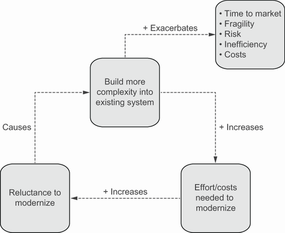
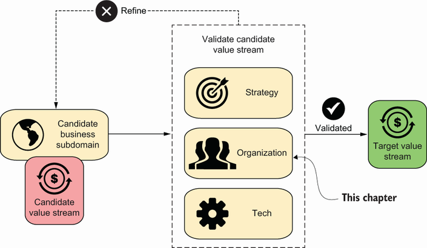

<!--
_backgroundColor: #0a1929
_color: white
_class: title dark
-->


<div class="title" style="text-align: left; margin-top: 100px; margin-left: 20px; padding-left: 0; max-width: 70%;">

# <span style="font-size: 0.85em;">30分でわかる</br><span class="highlight-yellow">アーキテクチャ</span></br><span class="highlight-yellow">モダナイゼーション</span></span>

### 書籍の全体像を掴む

</div>

<div class="author-info" style="text-align: left; padding-left: 0; text-indent: 0;">
2026/02/19 3-shake SRE Tech Talk 特別回</br>
@nwiizo 30min（19:35〜20:05）
</div>

---

<!-- _backgroundColor: white -->


## nwiizo

<div class="info-box">
株式会社スリーシェイクで</br>プロのソフトウェアエンジニアをやっているものです</br>
格闘技、読書、グラビアが趣味でよく本を紹介してます</br>
</div>

<p style="margin-top: 30px !important;">人生を通して"<strong>運動、睡眠、読書</strong>"をちゃんとやりたい</p>

---

## about 3-shake

<div style="text-align: center; margin-top: 30px;">
  
</div>

---

## Sreakeのお仕事

<div style="font-size: 0.68em;">

<div style="background-color: #f5f5f5; padding: 12px; border-radius: 8px; margin-bottom: 12px;">

**クラウドネイティブなアプローチで、お客様の事業をより安全に、競争力のあるサービスへ**

</div>

### 提供サービス

<div style="display: flex; gap: 8px; flex-wrap: wrap;">
<div style="flex: 1; min-width: 180px; background-color: #f5f5f5; padding: 10px; border-radius: 8px;">

**SRE/DevOps支援**

- Kubernetes構築・運用
- クラウドネイティブ化推進
- Observability導入

</div>
<div style="flex: 1; min-width: 180px; background-color: #f5f5f5; padding: 10px; border-radius: 8px;">

**アーキテクチャモダナイゼーション**

- 現状分析・戦略策定
- 段階的な移行支援
- 内製化・伴走支援

</div>
<div style="flex: 1; min-width: 180px; background-color: #f5f5f5; padding: 10px; border-radius: 8px;">

**データ活用支援**

- データ基盤構築
- BigQuery/Snowflake
- 分析基盤最適化

</div>
</div>

<div style="margin-top: 12px; padding: 12px; background-color: #e0e0e0; border-radius: 8px; text-align: center;">
<span style="color: #e65100; font-weight: bold; font-size: 1.1em;">ご依頼・ご相談お待ちしております</span></br>
<span style="font-size: 0.9em;">https://sreake.com/</span>
</div>

</div>

</div>

---

## 本日の目的

<div style="font-size: 0.8em;">

<div style="background-color: #f5f5f5; padding: 20px; border-radius: 8px; margin-bottom: 15px;">

**書籍「アーキテクチャモダナイゼーション」の全体像を30分で掴む**

17章、約500ページの内容を凝縮してお伝えします。

</div>

<div style="display: flex; gap: 20px;">
<div style="flex: 1; background-color: #f5f5f5; padding: 15px; border-radius: 8px;">

**やること**

- 書籍の構成と流れ
- 各章の核心メッセージ
- 読むべきポイントの案内

</div>
<div style="flex: 1; background-color: #f5f5f5; padding: 15px; border-radius: 8px;">

**やらないこと**

- 各章の詳細な解説
- 実践的なワークショップ
- すべての概念の網羅

</div>
</div>

<div style="margin-top: 15px; padding: 12px; background-color: #e0e0e0; border-radius: 5px; text-align: center;">
<span style="color: #e65100; font-weight: bold;">書籍を読むための「地図」を手に入れる</span>
</div>

</div>

---

## 書籍の概要

<div style="display: flex; gap: 30px;">
<div style="width: 25%;">

</div>

<div style="flex: 1; font-size: 0.75em;">

### アーキテクチャモダナイゼーション

- **著者**: Nick Tune, Jean-Georges Perrin
- **翻訳**: 株式会社スリーシェイク
- **原書**: Manning Publications, 2024

### 本書の一言要約

**レガシーシステムを競争優位性に転換するための包括的ガイド。技術だけでなく、ビジネス・組織・文化の変革を含む総合的なアプローチを提示。**

</div>
</div>

---

## 書籍は6つのパートで構成されている

<div style="font-size: 0.75em;">

| Part | テーマ | 章 | 問い |
|------|-------|-----|------|
| **1. Why** | 理解 | Ch.1-3 | なぜモダナイゼーションが必要か？ |
| **2. Discovery** | 発見 | Ch.4-6 | 現状をどう把握するか？ |
| **3. Design** | 設計 | Ch.7-9 | 何を作るべきか？ |
| **4. Organization** | 組織 | Ch.10-11 | 誰がどう作るか？ |
| **5. Technical** | 技術 | Ch.12-14 | どう作るか？ |
| **6. Execute** | 実行 | Ch.15-17 | どう進めるか？ |

<div style="margin-top: 15px; padding: 12px; background-color: #e0e0e0; border-radius: 5px; text-align: center;">
<span style="color: #e65100; font-weight: bold;">Why → Discovery → Design → Organization → Technical → Execute の流れ</span>
</div>

</div>

---

<!--
_backgroundColor: #0a1929
_color: white
_class: transition
-->

<div style="display: flex; flex-direction: column; justify-content: center; align-items: center; height: 80%; text-align: center;">

<div style="font-size: 1.5em; font-weight: bold;">

# Part 1: Why（理解）

Ch.1-3

</div>

</div>

---

## Ch.1 アーキテクチャモダナイゼーションとは

<div style="font-size: 0.75em;">

<div style="background-color: #f5f5f5; padding: 15px; border-radius: 8px; margin-bottom: 15px;">

**定義：時代遅れのアーキテクチャをビジネス競争優位性へ転換すること**

単なる技術のアップグレードではない。ビジネス・組織・技術を同時に変革する**ソシオテクニカル**なアプローチ。

</div>

### 核心的な概念

<div style="display: flex; gap: 15px;">
<div style="flex: 1; background-color: #f5f5f5; padding: 12px; border-radius: 8px;">

**BVSSH**

Better Value Sooner Safer Happier — 成果指標としての5つの軸

</div>
<div style="flex: 1; background-color: #f5f5f5; padding: 12px; border-radius: 8px;">

**独立した価値ストリーム**

ドメイン整合、チーム自律、成果志向、疎結合

</div>
</div>

<div style="margin-top: 12px; padding: 10px; background-color: #e0e0e0; border-radius: 5px; text-align: center;">
<span style="color: #e65100; font-weight: bold;">3-6ヶ月以内に価値を提供し始めることができる長期投資</span>
</div>

</div>

---

## BVSSHで成功を測る

<div style="font-size: 0.72em;">

<div style="background-color: #f5f5f5; padding: 12px; border-radius: 8px; margin-bottom: 12px;">

**Better Value Sooner Safer Happier** — 「もっと良い価値を、早く、安全に、幸福に」

</div>

| 軸 | 意味 | 測定例 |
|---|------|--------|
| **Better** | より良い価値 | 顧客満足度、品質指標 |
| **Value** | ビジネス価値 | 収益貢献、市場シェア |
| **Sooner** | より早く | リードタイム、デプロイ頻度 |
| **Safer** | より安全に | 障害率、セキュリティ指標 |
| **Happier** | より幸せに | 従業員エンゲージメント、離職率 |

<div style="margin-top: 10px; padding: 10px; background-color: #e0e0e0; border-radius: 5px; text-align: center;">
<span style="color: #e65100; font-weight: bold;">5つすべてを同時に改善することが目標。トレードオフではない。</span>
</div>

</div>

---

## 独立した価値ストリームとは

<div style="font-size: 0.72em;">

<div style="display: flex; gap: 20px;">
<div style="width: 40%;">

</div>
<div style="flex: 1;">

### 4つの特徴

<div style="display: flex; gap: 8px; flex-wrap: wrap;">
<div style="flex: 1; min-width: 150px; background-color: #f5f5f5; padding: 8px; border-radius: 8px; font-size: 0.9em;">

**ドメイン整合** — ビジネスドメインと一致した境界

</div>
<div style="flex: 1; min-width: 150px; background-color: #f5f5f5; padding: 8px; border-radius: 8px; font-size: 0.9em;">

**チーム自律** — 他チームへの依存なく意思決定

</div>
<div style="flex: 1; min-width: 150px; background-color: #f5f5f5; padding: 8px; border-radius: 8px; font-size: 0.9em;">

**成果志向** — 機能ではなくビジネス成果で評価

</div>
<div style="flex: 1; min-width: 150px; background-color: #f5f5f5; padding: 8px; border-radius: 8px; font-size: 0.9em;">

**疎結合** — 他ストリームと最小限の依存関係

</div>
</div>

<div style="margin-top: 10px; padding: 10px; background-color: #e0e0e0; border-radius: 5px; text-align: center;">
<span style="color: #e65100; font-weight: bold;">独立した価値ストリームの数 = 組織の並列処理能力</span>
</div>

</div>
</div>

</div>

---

## Ch.2 旅への準備

<div style="font-size: 0.75em;">

<div style="background-color: #f5f5f5; padding: 15px; border-radius: 8px; margin-bottom: 15px;">

**技術的な準備と同じくらい、組織と人的準備が重要**

</div>

### 準備すべきこと

<div style="display: flex; gap: 15px;">
<div style="flex: 1; background-color: #f5f5f5; padding: 12px; border-radius: 8px;">

**経営層の準備**

本気のコミットメント、長期的視点、変革への覚悟

</div>
<div style="flex: 1; background-color: #f5f5f5; padding: 12px; border-radius: 8px;">

**避けるべき罠**

銀の弾丸思考、構造とプロセスの幻想、ボルトオン型モダナイゼーション

</div>
</div>

<div style="margin-top: 12px; padding: 10px; background-color: #e0e0e0; border-radius: 5px; text-align: center;">
<span style="color: #e65100; font-weight: bold;">モダナイゼーションは技術プロジェクトではなく、人と組織の変革である</span>
</div>

</div>

---

## 避けるべき3つの罠

<div style="font-size: 0.7em;">

<div style="display: flex; gap: 12px;">
<div style="flex: 1; background-color: #f5f5f5; padding: 12px; border-radius: 8px;">

### 1. 銀の弾丸思考

「マイクロサービスにすれば解決」「クラウドに移行すれば解決」

**問題**: 技術だけで組織の問題は解決しない

**対策**: 技術は手段、目的はビジネス成果

</div>
<div style="flex: 1; background-color: #f5f5f5; padding: 12px; border-radius: 8px;">

### 2. 構造とプロセスの幻想

「組織図を変えれば変わる」「新しいプロセスを導入すれば変わる」

**問題**: 文化とマインドセットが変わらなければ形骸化

**対策**: 小さな成功体験から文化を変える

</div>
<div style="flex: 1; background-color: #f5f5f5; padding: 12px; border-radius: 8px;">

### 3. ボルトオン型

古いシステムの横に新しいシステムを「付け足す」

**問題**: 複雑性が倍増、依存関係も増加

**対策**: 段階的な置き換え、Strangler Figパターン

</div>
</div>

<div style="margin-top: 10px; padding: 10px; background-color: #e0e0e0; border-radius: 5px; text-align: center;">
<span style="color: #e65100; font-weight: bold;">罠を知ることが、罠を避ける第一歩</span>
</div>

</div>

---

## Ch.3 ビジネス目標

<div style="font-size: 0.75em;">

<div style="background-color: #f5f5f5; padding: 15px; border-radius: 8px; margin-bottom: 15px;">

**モダナイゼーションはビジネス戦略と明確に結びついていなければならない**

</div>

### ビジネス上の正当な理由

- 競争優位性の維持
- 市場機会への対応速度
- 運用効率化とコスト削減
- 技術的負債の返済

### 重要な問い

**「このモダナイゼーションは、どのビジネス成果に貢献するのか？」**

<div style="margin-top: 12px; padding: 10px; background-color: #e0e0e0; border-radius: 5px; text-align: center;">
<span style="color: #e65100; font-weight: bold;">投資の正当性はビジネス成果の向上にある</span>
</div>

</div>

---

<!--
_backgroundColor: #0a1929
_color: white
_class: transition
-->

<div style="display: flex; flex-direction: column; justify-content: center; align-items: center; height: 80%; text-align: center;">

<div style="font-size: 1.5em; font-weight: bold;">

# Part 2: Discovery（発見）

Ch.4-6

</div>

</div>

---

## Ch.4 リスニング＆マッピングツアー

<div style="font-size: 0.75em;">

<div style="background-color: #f5f5f5; padding: 15px; border-radius: 8px; margin-bottom: 15px;">

**ビジョンを押し付けるのではなく、現場の課題を理解することが先決**

</div>

### 実施内容

<div style="display: flex; gap: 15px;">
<div style="flex: 1; background-color: #f5f5f5; padding: 12px; border-radius: 8px;">

**リスニングツアー**

経営層からエンジニアまで、多様なステークホルダーの声を聴く

</div>
<div style="flex: 1; background-color: #f5f5f5; padding: 12px; border-radius: 8px;">

**マッピングツアー**

システム間の依存関係、チーム構造、責任範囲を可視化

</div>
</div>

<div style="margin-top: 12px; padding: 10px; background-color: #e0e0e0; border-radius: 5px; text-align: center;">
<span style="color: #e65100; font-weight: bold;">聴くことは、説得するための最初のステップである</span>
</div>

</div>

---

## リスニングツアーの実践方法

<div style="font-size: 0.7em;">

<div style="background-color: #f5f5f5; padding: 12px; border-radius: 8px; margin-bottom: 12px;">

**目的**: 現場の痛みと願望を、先入観なく理解する

</div>

### 聴くべき質問

<div style="display: flex; gap: 12px;">
<div style="flex: 1; background-color: #f5f5f5; padding: 10px; border-radius: 8px;">

**痛みを探る**

- 日常業務で最も困っていることは？
- 「もっとこうだったら」と思うことは？
- 顧客への価値提供を妨げているものは？

</div>
<div style="flex: 1; background-color: #f5f5f5; padding: 10px; border-radius: 8px;">

**理想を探る**

- 半年後、どうなっていたら成功か？
- チームが最も活躍できる条件は？
- 会社のどこに誇りを感じるか？

</div>
</div>

### インタビュー対象

経営層 → プロダクトマネージャー → 開発者 → 運用チーム → カスタマーサポート

<div style="margin-top: 8px; padding: 10px; background-color: #e0e0e0; border-radius: 5px; text-align: center;">
<span style="color: #e65100; font-weight: bold;">聴いた内容をそのまま伝えることで、共感の連鎖が生まれる</span>
</div>

</div>

---

## Ch.5 Wardley Mapping

<div style="font-size: 0.75em;">

<div style="background-color: #f5f5f5; padding: 15px; border-radius: 8px; margin-bottom: 15px;">

**バリューチェーンと技術進化の関係を可視化して戦略を立案する**

</div>

### Wardley Mapの軸

| 軸 | 内容 |
|---|------|
| 縦軸 | ユーザーニーズからの距離（価値チェーン） |
| 横軸 | 進化段階（Genesis → Custom → Product → Commodity） |

### 戦略サイクル

Purpose（目的）→ Landscape（景観）→ Climate（気候）→ Doctrine（教義）→ Leadership

<div style="margin-top: 12px; padding: 10px; background-color: #e0e0e0; border-radius: 5px; text-align: center;">
<span style="color: #e65100; font-weight: bold;">戦略を視覚化することで、組織全体が同じ方向を向く</span>
</div>

</div>

---

## Wardley Mapの例

<div style="font-size: 0.7em;">

<div style="display: flex; gap: 15px;">
<div style="width: 55%;">

</div>
<div style="flex: 1;">

### 横軸は進化の4段階

| 段階 | 特徴 |
|------|------|
| **Genesis** | 発明されたばかり、不確実 |
| **Custom** | 作り込み、差別化要因 |
| **Product** | 複数ベンダーが存在 |
| **Commodity** | 標準化、どこでも入手可能 |

### 縦軸は可視性

ユーザーに近い（上）↔ インフラに近い（下）

<div style="margin-top: 8px; padding: 8px; background-color: #e0e0e0; border-radius: 5px; text-align: center; font-size: 0.9em;">
<span style="color: #e65100; font-weight: bold;">位置関係で投資優先度を判断</span>
</div>

</div>
</div>

</div>

---

## Ch.6 プロダクトタクソノミー

<div style="font-size: 0.75em;">

<div style="background-color: #f5f5f5; padding: 15px; border-radius: 8px; margin-bottom: 15px;">

**アーキテクチャを記述するための統一された構成要素の定義**

</div>

### 階層構造

```
独立した価値ストリーム
  └── ドメイン
        └── サブドメイン
              └── プロダクト
                    └── 機能（Feature）
                          └── ケイパビリティ
```

マクロ視点からミクロ視点まで一貫した言語で語れるようになる。

<div style="margin-top: 12px; padding: 10px; background-color: #e0e0e0; border-radius: 5px; text-align: center;">
<span style="color: #e65100; font-weight: bold;">プロダクト分類体系はアーキテクチャと組織の橋渡し</span>
</div>

</div>

---

<!--
_backgroundColor: #0a1929
_color: white
_class: transition
-->

<div style="display: flex; flex-direction: column; justify-content: center; align-items: center; height: 80%; text-align: center;">

<div style="font-size: 1.5em; font-weight: bold;">

# Part 3: Design（設計）

Ch.7-9

</div>

</div>

---

## Ch.7 ビッグピクチャーイベントストーミング

<div style="font-size: 0.72em;">

<div style="background-color: #f5f5f5; padding: 15px; border-radius: 8px; margin-bottom: 12px;">

**ドメイン境界は「思いつき」で決めるべきではない。多様なステークホルダーの知見を統合する。**

</div>

### イベントストーミングとは

Alberto Brandolini考案のワークショップ手法。ビジネスで発生する出来事（ドメインイベント）を時系列で可視化し、複雑なビジネスプロセスを全員で理解する。

### 参加者

ドメイン専門家、ソフトウェア開発者、プロダクト担当者、UXスペシャリストなど多職種

### 成果物

- ビジネスプロセスの可視化
- ホットスポット（複雑性が高い領域）の特定
- ドメイン境界の候補

<div style="margin-top: 10px; padding: 10px; background-color: #e0e0e0; border-radius: 5px; text-align: center;">
<span style="color: #e65100; font-weight: bold;">複雑な現実を、誰もが理解できるかたちで可視化する</span>
</div>

</div>

---

## イベントストーミングの様子

<div style="font-size: 0.68em;">

<div style="display: flex; gap: 15px;">
<div style="width: 55%;">

</div>
<div style="flex: 1;">

### 付箋の色

| 色 | 要素 |
|---|------|
| 🟧 オレンジ | **ドメインイベント**（〜された） |
| 🟦 青 | **コマンド**（〜する） |
| 🟨 黄色 | **アクター**（誰が） |
| 🟪 紫 | **ポリシー**（自動処理） |
| 🟥 赤/ピンク | **ホットスポット**（問題点） |

### フロー

**Phase 1**: 発散 → **Phase 2**: 時系列整理 → **Phase 3**: ホットスポット特定 → **Phase 4**: 境界線

</div>
</div>

</div>

---

## Ch.8 プロダクトとドメインのモダナイゼーション

<div style="font-size: 0.75em;">

<div style="background-color: #f5f5f5; padding: 15px; border-radius: 8px; margin-bottom: 15px;">

**古いシステムの欠陥をそのまま新システムに持ち込む失敗を避ける**

</div>

### フルスタックモダナイゼーション

| レイヤー | 内容 |
|---------|------|
| UX | ユーザー体験の改善 |
| 技術 | 技術スタックの刷新 |
| ドメインモデル | ビジネスモデルの洗練 |
| ビジネスプロセス | 業務フローの最適化 |

<div style="margin-top: 12px; padding: 10px; background-color: #e0e0e0; border-radius: 5px; text-align: center;">
<span style="color: #e65100; font-weight: bold;">モダナイゼーションは、本質から再設計する機会である</span>
</div>

</div>

---

## よくある失敗パターンを避ける

<div style="font-size: 0.7em;">

<div style="background-color: #f5f5f5; padding: 12px; border-radius: 8px; margin-bottom: 12px;">

**レガシーの欠陥をそのまま新システムに移行してしまう** — 最もよくある失敗

</div>

### 4つのアンチパターン

<div style="display: flex; gap: 10px; flex-wrap: wrap;">
<div style="flex: 1; min-width: 220px; background-color: #f5f5f5; padding: 10px; border-radius: 8px;">

**Lift and Shift**

コードをそのままクラウドに移行。問題も一緒に移行される。

</div>
<div style="flex: 1; min-width: 220px; background-color: #f5f5f5; padding: 10px; border-radius: 8px;">

**Big Bang Rewrite**

一括リプレース。リスクが大きく、失敗率が高い。

</div>
<div style="flex: 1; min-width: 220px; background-color: #f5f5f5; padding: 10px; border-radius: 8px;">

**Copy-Paste Architecture**

既存の設計を新技術で再実装。根本的な改善なし。

</div>
<div style="flex: 1; min-width: 220px; background-color: #f5f5f5; padding: 10px; border-radius: 8px;">

**技術のみのモダナイゼーション**

ドメインモデル・プロセスを見直さない。

</div>
</div>

<div style="margin-top: 10px; padding: 8px; background-color: #e0e0e0; border-radius: 5px; text-align: center;">
<span style="color: #e65100; font-weight: bold;">新しい技術は、新しい設計と一緒に導入する</span>
</div>

</div>

---

## Ch.9 ドメインとサブドメインの識別

<div style="font-size: 0.72em;">

<div style="background-color: #f5f5f5; padding: 15px; border-radius: 8px; margin-bottom: 12px;">

**よいドメイン境界は、組織とソフトウェアの両者で依存関係を減らし、チームの自律性を高める**

</div>

### ドメイン境界を見つけるヒューリスティック

<div style="display: flex; gap: 15px;">
<div style="flex: 1; background-color: #f5f5f5; padding: 12px; border-radius: 8px;">

**一緒に変わる概念をまとめる**

変更頻度が似ているものを同じ境界に

</div>
<div style="flex: 1; background-color: #f5f5f5; padding: 12px; border-radius: 8px;">

**凝集性の高いものを整理**

関連するビジネス概念をグループ化

</div>
<div style="flex: 1; background-color: #f5f5f5; padding: 12px; border-radius: 8px;">

**チーム境界との適合性**

1チームが担当できる範囲に

</div>
</div>

<div style="margin-top: 10px; padding: 10px; background-color: #e0e0e0; border-radius: 5px; text-align: center;">
<span style="color: #e65100; font-weight: bold;">ドメイン特定は科学ではなく、アート＋経験則の組み合わせ</span>
</div>

</div>

---

## ドメイン境界を見つける9つのヒューリスティック

<div style="font-size: 0.65em;">

<div style="display: flex; gap: 10px; flex-wrap: wrap;">
<div style="flex: 1; min-width: 280px; background-color: #f5f5f5; padding: 10px; border-radius: 8px;">

**1. ユビキタス言語の境界**

同じ言葉が異なる意味を持つ場所で区切る

**2. ビジネスケイパビリティ**

ビジネスが「できること」単位で分ける

**3. 揮発性（変更頻度）**

変更頻度が異なるものを分離する

</div>
<div style="flex: 1; min-width: 280px; background-color: #f5f5f5; padding: 10px; border-radius: 8px;">

**4. 規制とコンプライアンス**

法規制の対象となる領域を分離

**5. サブドメインの分離**

Core / Supporting / Generic で分類

**6. サービス配置プレースメント**

デプロイ単位との整合性

</div>
<div style="flex: 1; min-width: 280px; background-color: #f5f5f5; padding: 10px; border-radius: 8px;">

**7. 組織構造**

Conway's Law — 組織とアーキテクチャは相似形

**8. 既存の境界を尊重**

レガシーシステムの境界を活用

**9. イベントストーミングの結果**

ワークショップで見えた自然な区切り

</div>
</div>

<div style="margin-top: 8px; padding: 8px; background-color: #e0e0e0; border-radius: 5px; text-align: center;">
<span style="color: #e65100; font-weight: bold;">複数のヒューリスティックを組み合わせて総合的に判断する</span>
</div>

</div>

---

<!--
_backgroundColor: #0a1929
_color: white
_class: transition
-->

<div style="display: flex; flex-direction: column; justify-content: center; align-items: center; height: 80%; text-align: center;">

<div style="font-size: 1.5em; font-weight: bold;">

# Part 4: Organization（組織）

Ch.10-11

</div>

</div>

---

## Ch.10 戦略的ITポートフォリオ

<div style="font-size: 0.7em;">

<div style="display: flex; gap: 15px;">
<div style="width: 50%;">

</div>
<div style="flex: 1;">

### コアドメインチャート

| 分類 | 差別化 | 投資戦略 |
|------|-------|---------|
| **コアドメイン** | 高 | 自社開発、最先端技術 |
| **支援ドメイン** | 中 | バランス型 |
| **汎用ドメイン** | 低 | 購買、外部委託 |

すべてのサブドメインに等しく投資してはならない。

<div style="margin-top: 8px; padding: 8px; background-color: #e0e0e0; border-radius: 5px; text-align: center; font-size: 0.9em;">
<span style="color: #e65100; font-weight: bold;">ポートフォリオ視点で投資を最適化</span>
</div>

</div>
</div>

</div>

---

## Ch.11 Team Topologies

<div style="font-size: 0.68em;">

<div style="display: flex; gap: 15px;">
<div style="width: 45%;">

</div>
<div style="flex: 1;">

### 4つのチームタイプ

| チーム | 役割 |
|-------|------|
| **Stream-aligned** | 価値ストリームに沿ってEnd-to-End |
| **Platform** | 共通基盤を提供 |
| **Enabling** | 他チームの能力向上を支援 |
| **Complicated-subsystem** | 専門知識が必要な複雑なサブシステム |

### 5つの原則（抜粋）

- You build it, you run it
- 認知的負荷の最小化
- チームファーストの考え方

<div style="margin-top: 8px; padding: 8px; background-color: #e0e0e0; border-radius: 5px; text-align: center; font-size: 0.9em;">
<span style="color: #e65100; font-weight: bold;">チーム構造がアーキテクチャを決定する</span>
</div>

</div>
</div>

</div>

---

## 認知的負荷がチーム設計を制約する

<div style="font-size: 0.7em;">

<div style="background-color: #f5f5f5; padding: 12px; border-radius: 8px; margin-bottom: 12px;">

**認知的負荷** = チームが担当範囲を理解・管理するために必要な精神的労力

</div>

### 3つの認知的負荷

| タイプ | 説明 | 対策 |
|-------|------|------|
| **内在的** | ドメイン固有の複雑さ | 最小化できない、受け入れる |
| **外在的** | 環境・ツール由来の複雑さ | プラットフォームで軽減 |
| **状況的** | 一時的な学習コスト | ドキュメント、ペアリングで軽減 |

### チームサイズの目安

**5〜9人**が認知的負荷と協調のバランスが取れる規模。これを超えると、サブドメインを分割してチームを分ける。

<div style="margin-top: 8px; padding: 8px; background-color: #e0e0e0; border-radius: 5px; text-align: center;">
<span style="color: #e65100; font-weight: bold;">認知的負荷が主な制約要因である</span>
</div>

</div>

---

<!--
_backgroundColor: #0a1929
_color: white
_class: transition
-->

<div style="display: flex; flex-direction: column; justify-content: center; align-items: center; height: 80%; text-align: center;">

<div style="font-size: 1.5em; font-weight: bold;">

# Part 5: Technical（技術）

Ch.12-14

</div>

</div>

---

## Ch.12 疎結合なソフトウェアアーキテクチャ

<div style="font-size: 0.68em;">

<div style="display: flex; gap: 15px;">
<div style="width: 50%;">

</div>
<div style="flex: 1;">

### 結合の4つのタイプ（弱い順）

| タイプ | 目指すべき？ |
|-------|------------|
| **契約的結合** | ✅ 理想 |
| **モデル的結合** | △ 許容 |
| **機能的結合** | ⚠️ 注意 |
| **侵入的結合** | ❌ 避ける |

独立した価値ストリームを実現するには、疎結合が必須。

<div style="margin-top: 8px; padding: 8px; background-color: #e0e0e0; border-radius: 5px; text-align: center; font-size: 0.9em;">
<span style="color: #e65100; font-weight: bold;">疎結合 = チームの独立性</span>
</div>

</div>
</div>

</div>

---

## Ch.13 Internal Developer Platform

<div style="font-size: 0.75em;">

<div style="background-color: #f5f5f5; padding: 15px; border-radius: 8px; margin-bottom: 15px;">

**高速なフロー実現には、優れた開発者体験（DX）が必須**

</div>

### IDPの3つの側面

<div style="display: flex; gap: 15px;">
<div style="flex: 1; background-color: #f5f5f5; padding: 12px; border-radius: 8px;">

**プラットフォーム機能**

テンプレート、CI/CD、インフラ管理をセルフサービスで提供

</div>
<div style="flex: 1; background-color: #f5f5f5; padding: 12px; border-radius: 8px;">

**プロダクトマインド**

IDPは「ツール集」ではなく「プロダクト」として運営

</div>
</div>

<div style="margin-top: 12px; padding: 10px; background-color: #e0e0e0; border-radius: 5px; text-align: center;">
<span style="color: #e65100; font-weight: bold;">IDPは、チームが高速にイノベーションできる基盤</span>
</div>

</div>

---

## IDPが提供すべき機能

<div style="font-size: 0.68em;">

<div style="background-color: #f5f5f5; padding: 10px; border-radius: 8px; margin-bottom: 10px;">

**ゴールデンパス** = 推奨される開発・デプロイの道筋。強制ではなく「舗装された道」を提供する。

</div>

### 主要なケイパビリティ

<div style="display: flex; gap: 10px; flex-wrap: wrap;">
<div style="flex: 1; min-width: 200px; background-color: #f5f5f5; padding: 10px; border-radius: 8px;">

**インフラストラクチャ**

- セルフサービスプロビジョニング
- 環境管理
- セキュリティ自動化

</div>
<div style="flex: 1; min-width: 200px; background-color: #f5f5f5; padding: 10px; border-radius: 8px;">

**開発者体験**

- プロジェクトテンプレート
- ドキュメント自動生成
- 開発環境統一

</div>
<div style="flex: 1; min-width: 200px; background-color: #f5f5f5; padding: 10px; border-radius: 8px;">

**デリバリー**

- CI/CDパイプライン
- 観測可能性（Observability）
- フィーチャーフラグ

</div>
</div>

<div style="margin-top: 8px; padding: 8px; background-color: #e0e0e0; border-radius: 5px; text-align: center;">
<span style="color: #e65100; font-weight: bold;">開発者が「本来の仕事」に集中できる環境を作る</span>
</div>

</div>

---

## Ch.14 Data Mesh

<div style="font-size: 0.68em;">

<div style="display: flex; gap: 15px;">
<div style="width: 50%;">

</div>
<div style="flex: 1;">

### 4つの原則

| 原則 | 内容 |
|------|------|
| **ドメイン駆動** | 各ドメインがデータを所有・管理 |
| **データをプロダクトとして** | 使用されるまでの責任を持つ |
| **セルフサービス基盤** | 品質管理、ガバナンスを提供 |
| **分散ガバナンス** | 相互運用性を確保 |

データアーキテクチャもモダナイゼーションの対象。

<div style="margin-top: 8px; padding: 8px; background-color: #e0e0e0; border-radius: 5px; text-align: center; font-size: 0.9em;">
<span style="color: #e65100; font-weight: bold;">チーム権限委譲がデータの価値を解き放つ</span>
</div>

</div>
</div>

</div>

---

<!--
_backgroundColor: #0a1929
_color: white
_class: transition
-->

<div style="display: flex; flex-direction: column; justify-content: center; align-items: center; height: 80%; text-align: center;">

<div style="font-size: 1.5em; font-weight: bold;">

# Part 6: Execute（実行）

Ch.15-17

</div>

</div>

---

## Ch.15 AMET（イネーブリングチーム）

<div style="font-size: 0.75em;">

<div style="background-color: #f5f5f5; padding: 15px; border-radius: 8px; margin-bottom: 15px;">

**モダナイゼーションの勢いを維持するには、専門の支援チームが必要**

</div>

### AMETの役割

| 課題 | AMETの対応 |
|------|-----------|
| 取り組み始動の困難 | 取り組み始動を支援 |
| 他業務との競合 | 高い勢いを維持 |
| 設計知識の不足 | よりよいアーキテクチャ設計を支援 |
| 従来のやり方への逆戻り | 長期的で持続可能な変化を促進 |

**重要**: AMETは実装チームではなく、イネーブリング・ファシリテーション役

<div style="margin-top: 10px; padding: 10px; background-color: #e0e0e0; border-radius: 5px; text-align: center;">
<span style="color: #e65100; font-weight: bold;">AMETは、変化を定着させるための触媒</span>
</div>

</div>

---

## AMETの具体的な活動

<div style="font-size: 0.68em;">

<div style="background-color: #f5f5f5; padding: 10px; border-radius: 8px; margin-bottom: 10px;">

**AMET** = Architecture Modernization Enabling Team（アーキテクチャモダナイゼーションイネーブリングチーム）

</div>

### 主要な活動

<div style="display: flex; gap: 10px; flex-wrap: wrap;">
<div style="flex: 1; min-width: 200px; background-color: #f5f5f5; padding: 10px; border-radius: 8px;">

**ファシリテーション**

- イベントストーミングの進行
- ドメイン境界ワークショップ
- コンテキストマッピング

</div>
<div style="flex: 1; min-width: 200px; background-color: #f5f5f5; padding: 10px; border-radius: 8px;">

**コーチング**

- DDD/Team Topologiesの指導
- 設計レビュー支援
- ペアリング/モブプログラミング

</div>
<div style="flex: 1; min-width: 200px; background-color: #f5f5f5; padding: 10px; border-radius: 8px;">

**調整**

- ステークホルダー間の橋渡し
- 優先順位付けの支援
- 進捗の可視化

</div>
</div>

### 注意点

AMETは「代わりにやる」チームではない。チームが自走できるよう能力を引き上げる。

<div style="margin-top: 8px; padding: 8px; background-color: #e0e0e0; border-radius: 5px; text-align: center;">
<span style="color: #e65100; font-weight: bold;">支援は一時的、能力向上は永続的</span>
</div>

</div>

---

## Ch.16 戦略とロードマップ

<div style="font-size: 0.75em;">

<div style="background-color: #f5f5f5; padding: 15px; border-radius: 8px; margin-bottom: 15px;">

**説得力のあるビジョンがなければ、モダナイゼーションは始まらない**

</div>

### 3つのステップ

<div style="display: flex; gap: 15px;">
<div style="flex: 1; background-color: #f5f5f5; padding: 12px; border-radius: 8px; text-align: center;">

**Think Big**

説得力のあるビジョン構築

</div>
<div style="flex: 1; background-color: #f5f5f5; padding: 12px; border-radius: 8px; text-align: center;">

**Start Small**

3〜6ヶ月以内に価値提供

</div>
<div style="flex: 1; background-color: #f5f5f5; padding: 12px; border-radius: 8px; text-align: center;">

**Scale It**

組織全体への展開

</div>
</div>

**Nail it then scale it**: 小規模でアイデア検証 → 価値と学びを示す → 組織全体へ展開

<div style="margin-top: 10px; padding: 10px; background-color: #e0e0e0; border-radius: 5px; text-align: center;">
<span style="color: #e65100; font-weight: bold;">小さな成功の積み重ねが、組織を旅に導く</span>
</div>

</div>

---

## ロードマップの作り方

<div style="font-size: 0.68em;">

<div style="background-color: #f5f5f5; padding: 10px; border-radius: 8px; margin-bottom: 10px;">

**アダプティブ・ロードマップ** — 固定された計画ではなく、学びに応じて進化する計画

</div>

### フェーズ構成

| フェーズ | 期間目安 | 目的 |
|---------|---------|------|
| **Discover** | 2-4週間 | 現状理解、課題特定、ステークホルダー合意 |
| **Design** | 4-8週間 | ターゲットアーキテクチャ設計、優先順位付け |
| **Deliver** | 継続的 | 段階的な実装、価値提供、フィードバック |

### 成功の鍵

<div style="display: flex; gap: 10px;">
<div style="flex: 1; background-color: #f5f5f5; padding: 10px; border-radius: 8px;">

**早期に価値を示す**

3〜6ヶ月以内に具体的な成果

</div>
<div style="flex: 1; background-color: #f5f5f5; padding: 10px; border-radius: 8px;">

**学びを共有する**

失敗も含めて透明に

</div>
<div style="flex: 1; background-color: #f5f5f5; padding: 10px; border-radius: 8px;">

**段階的に拡大**

成功パターンを横展開

</div>
</div>

</div>

---

## Ch.17 学習とスキルアップ

<div style="font-size: 0.75em;">

<div style="background-color: #f5f5f5; padding: 15px; border-radius: 8px; margin-bottom: 15px;">

**モダナイゼーション成功の最も重要な投資は、人的な学習とスキルアップ**

</div>

### 学習文化の醸成

<div style="display: flex; gap: 15px;">
<div style="flex: 1; background-color: #f5f5f5; padding: 12px; border-radius: 8px;">

**Seeding**

小さな読書会やCoP（実践共同体）から始める

</div>
<div style="flex: 1; background-color: #f5f5f5; padding: 12px; border-radius: 8px;">

**Nurturing**

継続的な学習イベント、メンタリング

</div>
<div style="flex: 1; background-color: #f5f5f5; padding: 12px; border-radius: 8px;">

**Cultivating**

組織全体への浸透

</div>
</div>

<div style="margin-top: 12px; padding: 10px; background-color: #e0e0e0; border-radius: 5px; text-align: center;">
<span style="color: #e65100; font-weight: bold;">人への投資なしにアーキテクチャは進化しない</span>
</div>

</div>

---

## 学習の具体的アプローチ

<div style="font-size: 0.68em;">

<div style="background-color: #f5f5f5; padding: 10px; border-radius: 8px; margin-bottom: 10px;">

**Community of Practice (CoP)** = 実践共同体。同じ関心を持つ人々が集まり、知識を共有・深化させる場

</div>

### 効果的な学習形式

<div style="display: flex; gap: 10px; flex-wrap: wrap;">
<div style="flex: 1; min-width: 200px; background-color: #f5f5f5; padding: 10px; border-radius: 8px;">

**読書会**

書籍を輪読し、実践への応用を議論

- 週1回、1章ずつ
- 実務との接点を意識

</div>
<div style="flex: 1; min-width: 200px; background-color: #f5f5f5; padding: 10px; border-radius: 8px;">

**ハンズオン**

実際に手を動かして体験

- イベントストーミング
- Wardley Mapping

</div>
<div style="flex: 1; min-width: 200px; background-color: #f5f5f5; padding: 10px; border-radius: 8px;">

**振り返り**

実践の経験を共有

- 成功・失敗の共有
- 改善アイデアの創出

</div>
</div>

### 必須スキル領域

DDD / Team Topologies / イベントストーミング / Wardley Mapping / 疎結合設計

<div style="margin-top: 8px; padding: 8px; background-color: #e0e0e0; border-radius: 5px; text-align: center;">
<span style="color: #e65100; font-weight: bold;">学ぶことは、変わることの始まり</span>
</div>

</div>

---

## 書籍全体のメッセージ

<div style="font-size: 0.75em;">

<div style="background-color: #f5f5f5; padding: 20px; border-radius: 8px; margin-bottom: 15px;">

### 3つの統合

| 軸 | 内容 |
|---|------|
| **ビジネス** | なぜ変えるのか、どこに投資するのか |
| **組織** | 誰がどうやって変えるのか |
| **技術** | 何をどう作るのか |

この3つを**同時に**設計・変革する必要がある。

</div>

<div style="padding: 15px; background-color: #e0e0e0; border-radius: 8px; text-align: center; font-size: 1.1em;">
<span style="color: #e65100; font-weight: bold;">モダナイゼーションは技術プロジェクトではなく、</br>ビジネス・組織・技術の総合的な変革である</span>
</div>

</div>

---

## どこから読むか

<div style="font-size: 0.72em;">

<div style="display: flex; gap: 15px;">
<div style="flex: 1; background-color: #f5f5f5; padding: 12px; border-radius: 8px;">

**全体像を掴みたい**

Ch.1 → Ch.2 → Ch.16

なぜ・どう進めるかの骨格

</div>
<div style="flex: 1; background-color: #f5f5f5; padding: 12px; border-radius: 8px;">

**設計手法を学びたい**

Ch.7 → Ch.9 → Ch.12

イベントストーミング→ドメイン→疎結合

</div>
<div style="flex: 1; background-color: #f5f5f5; padding: 12px; border-radius: 8px;">

**組織設計を学びたい**

Ch.11 → Ch.10 → Ch.15

Team Topologies→ポートフォリオ→AMET

</div>
</div>

<div style="margin-top: 15px; background-color: #f5f5f5; padding: 15px; border-radius: 8px;">

### 特におすすめの章

- **Ch.7 イベントストーミング** — 実践ですぐ使える
- **Ch.11 Team Topologies** — 組織設計の基盤
- **Ch.12 疎結合アーキテクチャ** — 技術設計の核心

</div>

</div>

---

## 本日のまとめ

<div style="font-size: 0.75em;">

<div style="display: flex; gap: 20px;">
<div style="flex: 1; background-color: #f5f5f5; padding: 15px; border-radius: 8px;">

**書籍の構成**

Why → Discovery → Design → Organization → Technical → Execute の6パート・17章

</div>
<div style="flex: 1; background-color: #f5f5f5; padding: 15px; border-radius: 8px;">

**核心メッセージ**

技術だけでなく、ビジネス・組織・文化を同時に変革するソシオテクニカルなアプローチ

</div>
</div>

<div style="margin-top: 15px; padding: 15px; background-color: #e0e0e0; border-radius: 8px; text-align: center;">

**書籍を読むための「地図」は手に入りましたか？**

詳細は書籍で。今日の発表が読書のきっかけになれば幸いです。

</div>

</div>

---

## 参考資料

<div style="font-size: 0.7em;">

### 書籍

- [Architecture Modernization](https://www.manning.com/books/architecture-modernization) - Nick Tune, Jean-Georges Perrin
- [Team Topologies](https://teamtopologies.com/) - Matthew Skelton, Manuel Pais
- [Domain-Driven Design](https://www.domainlanguage.com/ddd/) - Eric Evans
- [EventStorming](https://www.eventstorming.com/) - Alberto Brandolini

### 関連記事

- [現代システムの三体問題](https://syu-m-5151.hatenablog.com/entry/2025/01/21/124130) - Architecture Modernization 読書感想文

</div>

---

<!--
_backgroundColor: #0a1929
_color: white
_class: title dark
-->


<div style="position: absolute !important; top: 5px !important; left: 5px !important; z-index: 9999 !important; margin: 0 !important; padding: 0 !important;">
  
</div>

<div style="text-align: center; margin-top: 200px;">

# ありがとう<span class="highlight-yellow">ございました</span>

### ご質問・ご相談はお気軽にお問い合わせください

@nwiizo | https://3-shake.com
</div>
