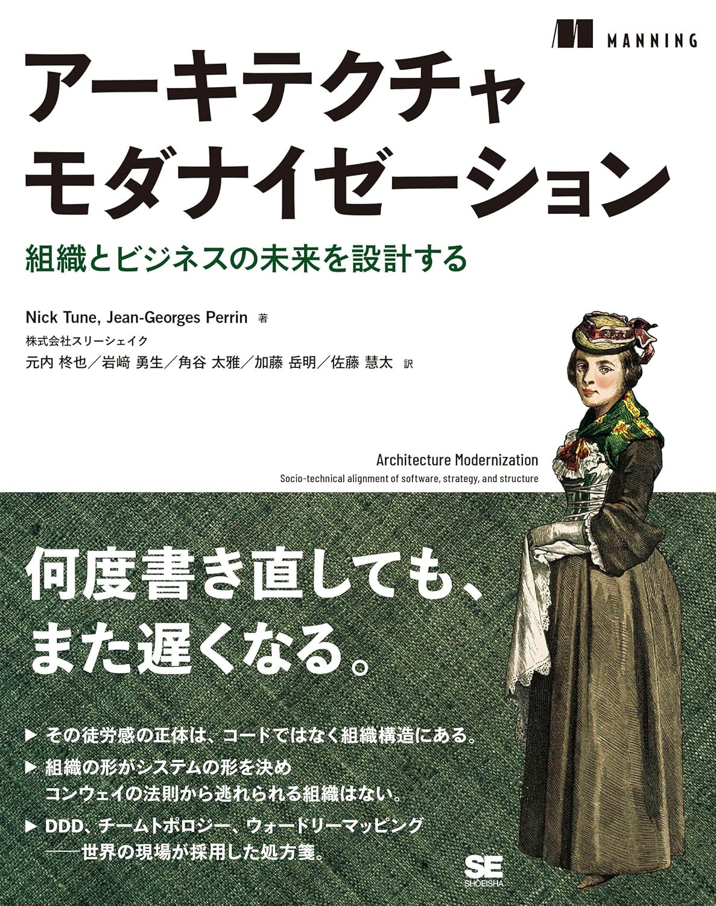
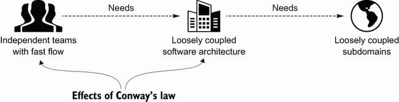
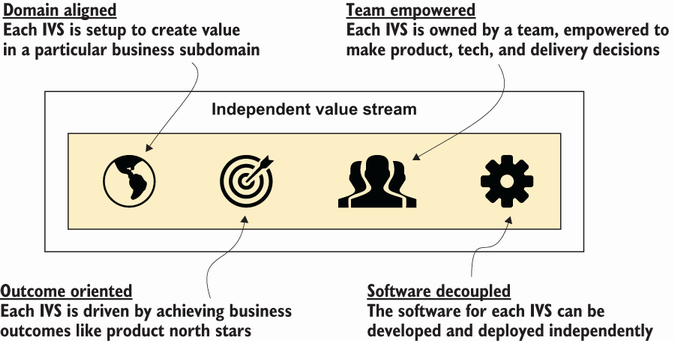
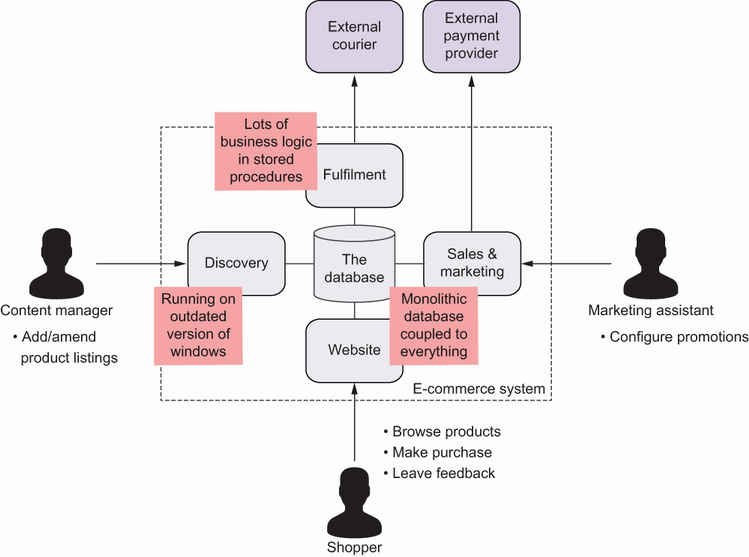
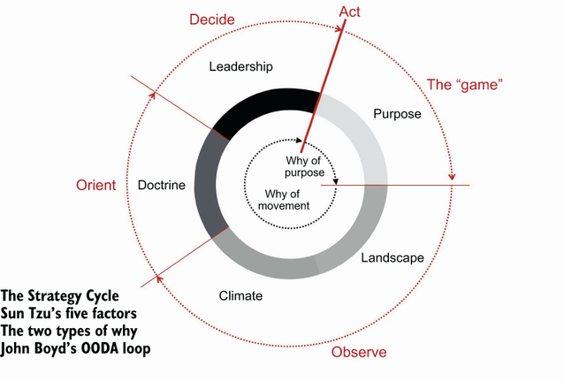
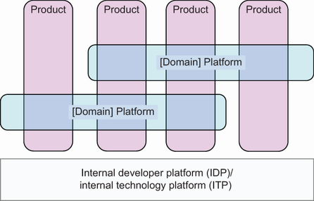
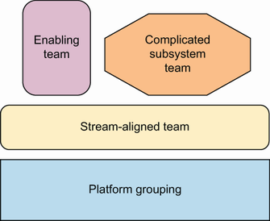
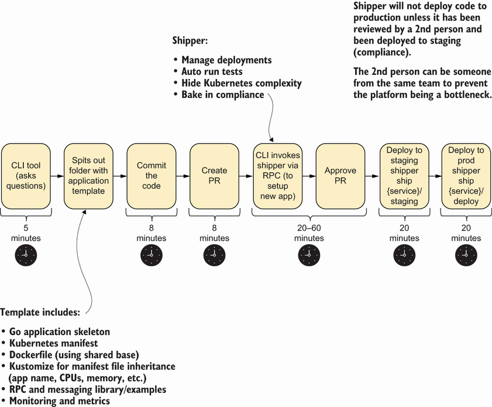
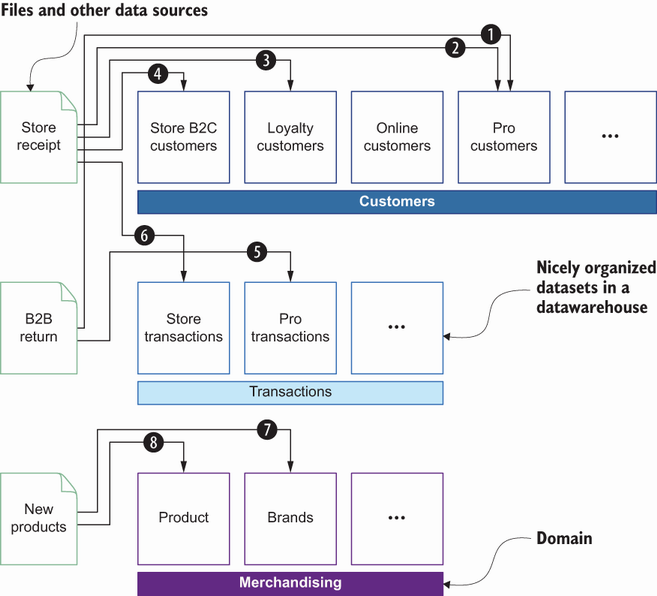
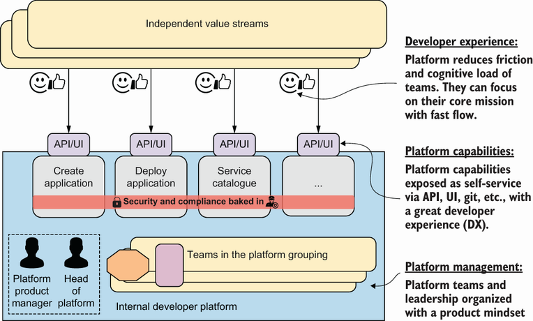

<!--
_backgroundColor: #0a1929
_color: white
_class: title dark
-->


<div class="title" style="text-align: left; margin-top: 100px; margin-left: 20px; padding-left: 0; max-width: 70%;">

# <span style="font-size: 0.85em;">30分でわかる</br><span class="highlight-yellow">アーキテクチャ</span></br><span class="highlight-yellow">モダナイゼーション</span></span>

### 書籍の全体像を掴む

</div>

<div class="author-info" style="text-align: left; padding-left: 0; text-indent: 0;">
2026/02/19 3-shake SRE Tech Talk 特別回</br>
@nwiizo 30min（19:35〜20:05）
</div>

---

<!-- _backgroundColor: white -->


## nwiizo

<div class="info-box">
株式会社スリーシェイクで</br>プロのソフトウェアエンジニアをやっているものです</br>
格闘技、読書、グラビアが趣味でよく本を紹介してます</br>
</div>

<p style="margin-top: 30px !important;">人生を通して"<strong>運動、睡眠、読書</strong>"をちゃんとやりたい</p>

---

## about 3-shake

<div style="text-align: center; margin-top: 30px;">
  
</div>

---

## Sreakeのお仕事

<div style="font-size: 0.68em;">

<div style="background-color: #f5f5f5; padding: 12px; border-radius: 8px; margin-bottom: 12px;">

**クラウドネイティブなアプローチで、お客様の事業をより安全に、競争力のあるサービスへ**

</div>

### 提供サービス

<div style="display: flex; gap: 8px; flex-wrap: wrap; align-items: center;">
<div style="flex: 1; min-width: 180px; background-color: #f5f5f5; padding: 10px; border-radius: 8px;">

**SRE/DevOps支援**

- Kubernetes構築・運用
- クラウドネイティブ化推進
- Observability導入

</div>
<div style="flex: 1; min-width: 180px; background-color: #f5f5f5; padding: 10px; border-radius: 8px;">

**アーキテクチャモダナイゼーション**

- 現状分析・戦略策定
- 段階的な移行支援
- 内製化・伴走支援

</div>
<div style="flex: 1; min-width: 180px; background-color: #f5f5f5; padding: 10px; border-radius: 8px;">

**データ活用支援**

- データ基盤構築
- BigQuery/Snowflake
- 分析基盤最適化

</div>
</div>

<div style="margin-top: 12px; padding: 12px; background-color: #e0e0e0; border-radius: 8px; text-align: center;">
<span style="font-weight: bold; font-size: 1.1em;">ご依頼・ご相談お待ちしております</span></br>
<span style="font-size: 0.9em;">https://sreake.com/</span>
</div>

</div>

---

## 本日の目的

<div style="font-size: 0.8em;">

<div style="background-color: #f5f5f5; padding: 20px; border-radius: 8px; margin-bottom: 15px;">

**書籍「アーキテクチャモダナイゼーション」の全体像を30分で掴む**

17章、約500ページの内容を凝縮してお伝えします。

</div>

<div style="display: flex; gap: 20px; align-items: center;">
<div style="flex: 1; background-color: #f5f5f5; padding: 15px; border-radius: 8px;">

**やること**

- 書籍の構成と流れ
- 各章の核心メッセージ
- 読むべきポイントの案内

</div>
<div style="flex: 1; background-color: #f5f5f5; padding: 15px; border-radius: 8px;">

**やらないこと**

- 各章の詳細な解説
- 実践的なワークショップ
- すべての概念の網羅

</div>
</div>

<div style="margin-top: 15px; padding: 12px; background-color: #e0e0e0; border-radius: 5px; text-align: center;">
<span style="color: #e65100; font-weight: bold;">書籍を読むための「地図」を手に入れる</span>
</div>

</div>

---

## この発表で解決できること

<div style="font-size: 0.75em;">

<div style="background-color: #f5f5f5; padding: 15px; border-radius: 8px; margin-bottom: 12px;">

**こんな悩みを持っていませんか？**

</div>

<div style="display: flex; gap: 15px; align-items: center;">
<div style="flex: 1; background-color: #f5f5f5; padding: 12px; border-radius: 8px;">

**500ページの本を読む時間がない**

→ 17章の核心を30分で掴める地図を提供します

</div>
<div style="flex: 1; background-color: #f5f5f5; padding: 12px; border-radius: 8px;">

**どこから手をつければいいか分からない**

→ 読者のタイプ別に読書ルートを案内します

</div>
<div style="flex: 1; background-color: #f5f5f5; padding: 12px; border-radius: 8px;">

**経営層への説明に使える概念がほしい**

→ ビジネス言語で語れるフレームワークを紹介します

</div>
</div>

<div style="margin-top: 12px; padding: 10px; background-color: #e0e0e0; border-radius: 5px; text-align: center;">
<span style="color: #e65100; font-weight: bold;">今日の30分で「この本、読んでみよう」と思えるようになること</span>
</div>

</div>

---

## 書籍の概要

<div style="display: flex; gap: 30px; align-items: center;">
<div style="width: 25%;">

</div>

<div style="flex: 1; font-size: 0.75em;">

### アーキテクチャモダナイゼーション

- **著者**: Nick Tune, Jean-Georges Perrin
- **翻訳**: 株式会社スリーシェイク
- **原書**: Manning Publications, 2024

### 本書の一言要約

**レガシーシステムを競争優位性に転換するための包括的ガイド。技術だけでなく、ビジネス・組織・文化の変革を含む総合的なアプローチを提示。**

</div>
</div>

---

## 本日の流れ

<div style="font-size: 0.75em;">

<div style="display: flex; gap: 20px; align-items: center;">
<div style="flex: 1; background-color: #f5f5f5; padding: 15px; border-radius: 8px;">

1. **Part 1: Why（理解）** — なぜモダナイゼーションが必要か
2. **Part 2: Discovery（発見）** — 現状をどう把握するか
3. **Part 3: Design（設計）** — 何を作るべきか

</div>
<div style="flex: 1; background-color: #f5f5f5; padding: 15px; border-radius: 8px;">

4. **Part 4: Organization（組織）** — 誰がどう作るか
5. **Part 5: Technical（技術）** — どう作るか
6. **Part 6: Execute（実行）** — どう進めるか

</div>
</div>

<div style="margin-top: 15px; padding: 12px; background-color: #e0e0e0; border-radius: 5px; text-align: center;">
<strong>書籍の構成に沿って、各パートの核心を紹介します</strong>
</div>

</div>

---

## 書籍は6つのパートで構成されている

<div style="font-size: 0.75em;">

| Part                | テーマ | 章       | 問い                             | 主要な概念・手法                                              |
| ------------------- | ------ | -------- | -------------------------------- | ------------------------------------------------------------- |
| **1. Why**          | 理解   | Ch.1-3   | なぜモダナイゼーションが必要か？ | BVSSH、独立した価値ストリーム、負のサイクル                   |
| **2. Discovery**    | 発見   | Ch.4-6   | 現状をどう把握するか？           | リスニングツアー、Wardley Mapping、プロダクトタクソノミー     |
| **3. Design**       | 設計   | Ch.7-9   | 何を作るべきか？                 | イベントストーミング、Bounded Context、コンテキストマッピング |
| **4. Organization** | 組織   | Ch.10-11 | 誰がどう作るか？                 | コアドメインチャート、Team Topologies、認知的負荷             |
| **5. Technical**    | 技術   | Ch.12-14 | どう作るか？                     | 疎結合アーキテクチャ、IDP、Data Mesh                          |
| **6. Execute**      | 実行   | Ch.15-17 | どう進めるか？                   | AMET、アダプティブロードマップ、学習文化                      |

<div style="margin-top: 15px; padding: 12px; background-color: #e0e0e0; border-radius: 5px; text-align: center;">
<strong>Why → Discovery → Design → Organization → Technical → Execute の流れ</strong>
</div>

</div>

---

## 翻訳者として伝えたいこと

<div style="font-size: 0.72em;">

<div style="background-color: #f5f5f5; padding: 12px; border-radius: 8px; margin-bottom: 12px;">

**5人で翻訳しました。** 最初にこの本を読んだとき、戸惑いました。アーキテクチャの本なのに、組織論とかビジネス戦略の話がやたら多くて。でも訳を進めるうちに、これが著者Nick Tuneの視点——技術と組織を一体として設計する視点——なんだとわかったんです。

</div>

<div style="display: flex; gap: 15px; align-items: center;">
<div style="flex: 1; background-color: #f5f5f5; padding: 12px; border-radius: 8px;">

**訳しながら気づいたこと**

モダナイゼーションって「負債を返す」作業じゃない。**「資産を再構築する」作業**。過去を否定するんじゃなくて、過去の上に未来を積む。この視点の違い、けっこう大きいと思うんです。

</div>
<div style="flex: 1; background-color: #f5f5f5; padding: 12px; border-radius: 8px;">

**ヨーロッパと日本は近い**

EventStormingの「協調的な問題解決」は日本の合意形成文化そのもの。「持続可能な開発」は「カイゼン」そのもの。日本企業はすでに文化的な土台を持っている——ソフトウェアに**翻訳**できていないだけ。

</div>
</div>

<div style="margin-top: 12px; padding: 10px; background-color: #e0e0e0; border-radius: 5px; text-align: center;">
<span style="color: #e65100; font-weight: bold;">モダナイゼーションは「やるかやらないか」ではなく「どうやるか」の問題</span>
</div>

</div>

---

<!--
_backgroundColor: #0a1929
_color: white
_class: transition
-->

<div style="display: flex; flex-direction: column; justify-content: center; align-items: center; height: 80%; text-align: center;">

<div style="font-size: 1.5em; font-weight: bold;">

# Part 1: Why（理解）

Ch.1-3

</div>

**最初の問い：「なぜモダナイゼーションが必要なのか？」**

</div>

---

## Ch.1 アーキテクチャモダナイゼーションとは

<div style="font-size: 0.72em;">

<div style="display: flex; gap: 20px; align-items: center;">
<div style="width: 40%;">

<div style="font-size: 0.55em; color: #999; text-align: center; margin-top: 5px;">Figure 2.1 Fast flow requires loosely coupled software architecture, which requires loosely coupled domains. より引用</div>
</div>
<div style="flex: 1;">

**定義：時代遅れのアーキテクチャをビジネス競争優位性へ転換すること**

単なる技術のアップグレードではない。ビジネス・組織・技術を同時に変革する**ソシオテクニカル**なアプローチ。書籍はこの「同時に変革する」という視点を一貫して貫いている。

### 核心的な概念

- **BVSSH** — Better Value Sooner Safer Happier（品質・価値・速度・安全・幸福の5軸）
- **独立した価値ストリーム** — ドメイン整合、チーム自律、成果志向、疎結合

<div style="margin-top: 10px; padding: 8px; background-color: #e0e0e0; border-radius: 5px; text-align: center;">
<span style="color: #e65100; font-weight: bold;">3-6ヶ月以内に価値を提供し始めることができる長期投資</span>
</div>

</div>
</div>

</div>

---

## ソシオテクニカルとは何か

<div style="font-size: 0.68em;">

<div style="background-color: #f5f5f5; padding: 10px; border-radius: 8px; margin-bottom: 10px;">

**ソシオテクニカル** = 社会的システム（人・組織・文化）と技術的システム（アーキテクチャ・ツール）を**一体として**設計すること

</div>

### 技術だけ変えても失敗する例

| やったこと             | 結果                                     | 根本原因                                   |
| ---------------------- | ---------------------------------------- | ------------------------------------------ |
| マイクロサービス化     | チーム間調整が増えて逆に遅くなった       | チーム構造を変えずにアーキテクチャだけ変更 |
| クラウド移行           | 同じ非効率なプロセスがクラウドで動くだけ | 承認フローや組織文化はそのまま             |
| 最新フレームワーク導入 | 使いこなせる人がいなくて品質低下         | スキルアップの時間と予算を確保せず         |

### ソシオテクニカルに変えると

| 技術の変更         | 組織の変更                           | 文化の変更                 |
| ------------------ | ------------------------------------ | -------------------------- |
| マイクロサービス化 | チームを機能別から価値ストリーム別へ | 「自分たちで決める」文化へ |
| クラウド移行       | 運用チームをプラットフォームチームへ | 実験と学習を奨励           |
| 最新フレームワーク | 学習時間を業務時間に組み込む         | 失敗から学ぶ文化へ         |

<div style="margin-top: 8px; padding: 8px; background-color: #e0e0e0; border-radius: 5px; text-align: center;">
<span style="color: #e65100; font-weight: bold;">技術・組織・文化を三位一体で変える</span>
</div>

</div>

---

## BVSSHで成功を測る

<div style="font-size: 0.68em;">

<div style="background-color: #f5f5f5; padding: 10px; border-radius: 8px; margin-bottom: 10px;">

**なぜBVSSH？** — Jon Smartが提唱したフレームワーク。「速度」だけを追うと品質が下がり、「品質」だけを追うと遅くなる。**5つ同時に**改善することで、本当の成功が測れる。

</div>

| 軸          | 問い                   | 目指す姿               | 測定指標例                 |
| ----------- | ---------------------- | ---------------------- | -------------------------- |
| **Better**  | 品質は上がったか？     | テスト自動化で品質担保 | バグ密度、顧客満足度       |
| **Value**   | 顧客に価値を届けたか？ | 顧客の課題を解決       | 機能利用率、コンバージョン |
| **Sooner**  | 早く届けられたか？     | 2週間でデプロイ        | リードタイム、デプロイ頻度 |
| **Safer**   | リスクは下がったか？   | 障害時も即座に復旧     | MTTR、変更失敗率           |
| **Happier** | チームは幸せか？       | 成長実感、やりがい     | eNPS、離職率               |

<div style="margin-top: 8px; padding: 8px; background-color: #e0e0e0; border-radius: 5px; text-align: center;">
<strong>「速度 vs 品質」はトレードオフではない。両方追求できる。</strong>
</div>

</div>

---

## 独立した価値ストリームとは

<div style="font-size: 0.72em;">

<div style="display: flex; gap: 20px; align-items: center;">
<div style="width: 40%;">

<div style="font-size: 0.55em; color: #999; text-align: center; margin-top: 5px;">Figure 1.5 The four key characteristics of an independent value stream より引用</div>
</div>
<div style="flex: 1;">

### 4つの特徴

<div style="display: flex; gap: 8px; flex-wrap: wrap; align-items: center;">
<div style="flex: 1; min-width: 150px; background-color: #f5f5f5; padding: 8px; border-radius: 8px; font-size: 0.9em;">

**ドメイン整合** — ビジネスドメインと一致した境界

</div>
<div style="flex: 1; min-width: 150px; background-color: #f5f5f5; padding: 8px; border-radius: 8px; font-size: 0.9em;">

**チーム自律** — 他チームへの依存なく意思決定

</div>
<div style="flex: 1; min-width: 150px; background-color: #f5f5f5; padding: 8px; border-radius: 8px; font-size: 0.9em;">

**成果志向** — 機能ではなくビジネス成果で評価

</div>
<div style="flex: 1; min-width: 150px; background-color: #f5f5f5; padding: 8px; border-radius: 8px; font-size: 0.9em;">

**疎結合** — 他ストリームと最小限の依存関係

</div>
</div>

<div style="margin-top: 10px; padding: 10px; background-color: #e0e0e0; border-radius: 5px; text-align: center;">
<span style="color: #e65100; font-weight: bold;">独立した価値ストリームの数 = 組織の並列処理能力</span>
</div>

</div>
</div>

</div>

---

## 目指す姿はわかった。では、どう始めるか？

<div style="font-size: 0.75em;">

<div style="background-color: #f5f5f5; padding: 15px; border-radius: 8px;">

Ch.1では**ソシオテクニカルなアプローチ**と**独立した価値ストリーム**という目指す姿を見てきました。

しかし「良い目標」があるだけでは始められない。Ch.2-3では、**旅に出る前の準備**——避けるべき罠、経営層への説明、ビジネスケースの作り方を扱います。

</div>

</div>

---

## Ch.2 旅への準備

<div style="font-size: 0.72em;">

<div style="background-color: #f5f5f5; padding: 12px; border-radius: 8px; margin-bottom: 12px;">

**技術的な準備と同じくらい、組織と人的準備が重要。** レガシーシステムには「負のサイクル」が潜んでいる——技術的負債の蓄積 → 開発速度の低下 → 優秀な人材の流出 → さらなる負債の蓄積。この悪循環を断ち切るための準備がCh.2のテーマ。

</div>

### 準備すべきこと

<div style="display: flex; gap: 12px; align-items: center;">
<div style="flex: 1; background-color: #f5f5f5; padding: 12px; border-radius: 8px;">

**経営層の準備**

本気のコミットメント、長期的視点。「3ヶ月で成果を見せつつ、3年かけて変える」覚悟。

</div>
<div style="flex: 1; background-color: #f5f5f5; padding: 12px; border-radius: 8px;">

**避けるべき罠**

銀の弾丸思考、構造とプロセスの幻想、ボルトオン型。次のスライドで詳しく解説。

</div>
</div>

<div style="margin-top: 10px; padding: 8px; background-color: #e0e0e0; border-radius: 5px; text-align: center;">
<strong>モダナイゼーションは技術プロジェクトではなく、人と組織の変革である</strong>
</div>

</div>

---

## 負のサイクルとは

<div style="font-size: 0.65em;">

<div style="display: flex; gap: 15px; align-items: center;">
<div style="width: 40%;">

<div style="font-size: 0.55em; color: #999; text-align: center; margin-top: 5px;">Figure 1.3 Better Value Sooner Safer Happier. (Source: Smart et al., Sooner Safer Happier [IT Revolution, 2020]) より引用</div>
</div>
<div style="flex: 1;">

**負のサイクル** = レガシーシステムが組織を蝕み、組織がさらにレガシーを生む悪循環

### 具体的な症状

| 段階 | 何が起きるか                           | 結果                |
| ---- | -------------------------------------- | ------------------- |
| 1    | 「時間がない」でリファクタリング先送り | 技術的負債が蓄積    |
| 2    | 変更に時間がかかる                     | リリース頻度低下    |
| 3    | 優秀なエンジニアが離職                 | さらに開発速度低下  |
| 4    | 障害対応が主業務に                     | イノベーション停止  |
| 5    | 競合に市場を奪われる                   | 売上減少 → 投資減少 |

<div style="margin-top: 6px; padding: 6px; background-color: #e0e0e0; border-radius: 5px; text-align: center;">
<span style="color: #e65100; font-weight: bold;">負のサイクルを断ち切るには、意図的な投資が必要</span>
</div>

</div>
</div>

</div>

---

## 避けるべき3つの罠

<div style="font-size: 0.7em;">

<div style="display: flex; gap: 12px; align-items: center;">
<div style="flex: 1; background-color: #f5f5f5; padding: 12px; border-radius: 8px;">

### 1. 銀の弾丸思考

「マイクロサービスにすれば解決」「クラウドに移行すれば解決」

**問題**: 技術だけで組織の問題は解決しない

**対策**: 技術は手段、目的はビジネス成果

</div>
<div style="flex: 1; background-color: #f5f5f5; padding: 12px; border-radius: 8px;">

### 2. 構造とプロセスの幻想

「組織図を変えれば変わる」「新しいプロセスを導入すれば変わる」

**問題**: 文化とマインドセットが変わらなければ形骸化

**対策**: 小さな成功体験から文化を変える

</div>
<div style="flex: 1; background-color: #f5f5f5; padding: 12px; border-radius: 8px;">

### 3. ボルトオン型

古いシステムの横に新しいシステムを「付け足す」

**問題**: 複雑性が倍増、依存関係も増加

**対策**: 段階的な置き換え、Strangler Figパターン

</div>
</div>

<div style="margin-top: 10px; padding: 10px; background-color: #e0e0e0; border-radius: 5px; text-align: center;">
<strong>罠を知ることが、罠を避ける第一歩</strong>
</div>

</div>

---

## エンジニアだけが「やりたい」では始まらない

<div style="font-size: 0.75em;">

<div style="background-color: #f5f5f5; padding: 15px; border-radius: 8px;">

罠を知っているだけでは十分じゃない。**経営層が「やるべきだ」と判断しなければ**、モダナイゼーションには予算もチームもつかない。Ch.3では、技術者の言葉をビジネスの言葉に翻訳する方法を扱います。

</div>

</div>

---

## Ch.3 ビジネス目標

<div style="font-size: 0.68em;">

<div style="background-color: #f5f5f5; padding: 10px; border-radius: 8px; margin-bottom: 10px;">

**「技術的負債を返済したい」だけでは経営層は動かない。ビジネス言語で語る必要がある。**

</div>

### 経営層が理解できるビジネス目標の例

| 技術者の言葉             | ビジネスの言葉                     | 経営層へのアピールポイント                   |
| ------------------------ | ---------------------------------- | -------------------------------------------- |
| マイクロサービス化したい | 新機能のリリースを月1回から週1回に | 競合より先に市場投入、顧客フィードバック加速 |
| 技術的負債を返済したい   | 障害対応コストを年間30%削減        | 運用コスト削減、エンジニアを新規開発に再配置 |
| モダンな技術を使いたい   | 採用競争力を上げて優秀な人材を確保 | 人材獲得競争で優位、離職率低下               |
| テスト自動化したい       | 本番障害を50%減らし顧客満足度向上  | 顧客離反防止、ブランド価値向上               |

### 経営層への説明テンプレート

「**[ビジネス課題]** を解決するために、**[技術的アプローチ]** を行い、**[期間]** で **[測定可能な成果]** を達成します」

<div style="margin-top: 8px; padding: 8px; background-color: #e0e0e0; border-radius: 5px; text-align: center;">
<strong>技術の言葉ではなく、ビジネスの言葉で語る</strong>
</div>

</div>

---

## ビジネスケースの構成要素

<div style="font-size: 0.75em;">

<div style="background-color: #f5f5f5; padding: 15px; border-radius: 8px; margin-bottom: 12px;">

**ビジネスケース** = 経営層が「やるべき」と判断できる根拠。ROI、リスク、戦略的価値を含む

</div>

| 要素                   | 内容                       | 例                          |
| ---------------------- | -------------------------- | --------------------------- |
| **現状の問題**         | 今何が起きているか         | リリースに3ヶ月かかる       |
| **ビジネスインパクト** | その問題が何を引き起こすか | 競合に機能で負けている      |
| **目標**               | どうなりたいか             | リリースを2週間に           |
| **アプローチ**         | どうやって達成するか       | ドメイン分割とチーム再編    |
| **投資**               | 何が必要か                 | 6ヶ月、5人のチーム          |
| **期待効果**           | 何が得られるか             | 開発速度6倍、顧客満足度向上 |

「問題 → インパクト → 目標 → 手段 → コスト → 効果」の流れで、経営層が意思決定できるストーリーを作る。

</div>

---

## 経営層が気にすること

<div style="font-size: 0.75em;">

ビジネスケースを持っていっても、経営層が見るポイントは決まっている。

<div style="display: flex; gap: 15px; align-items: center;">
<div style="flex: 1; background-color: #f5f5f5; padding: 12px; border-radius: 8px;">

**💰 ROI**

投資に見合うリターンがあるか。「技術的負債を返済する」ではなく「開発速度が6倍になり、年間○○万円のコスト削減」と数字で示す。

</div>
<div style="flex: 1; background-color: #f5f5f5; padding: 12px; border-radius: 8px;">

**⏰ いつ効果が出るか**

3年後ではなく、3ヶ月後に見える成果を示す。段階的なマイルストーンが信頼を生む。

</div>
<div style="flex: 1; background-color: #f5f5f5; padding: 12px; border-radius: 8px;">

**🎯 リスク**

失敗したらどうなるか、どう軽減するか。最悪のシナリオと撤退基準を事前に提示する。

</div>
</div>

<div style="margin-top: 12px; padding: 10px; background-color: #e0e0e0; border-radius: 5px; text-align: center;">
<span style="color: #e65100; font-weight: bold;">数字で語る。感情ではなく、データで説得する。</span>
</div>

</div>

---

## 翻訳者ノート — Part 1を終えて

<div style="font-size: 0.75em;">

<div style="background-color: #f5f5f5; padding: 20px; border-radius: 8px;">

訳していて一番衝撃だったのは、<strong>「負債を返す」ではなく「資産を再構築する」</strong>という視点でした。

「レガシー」という言葉には後ろ向きな響きがある。でもNick Tuneは一貫して、過去のシステムを否定しない。それが生み出してきた価値を認めた上で、次のステージに進もうとしている。この視点の違いは、チームの士気に大きく影響します。

</div>

</div>

---

<!--
_backgroundColor: #0a1929
_color: white
_class: transition
-->

<div style="display: flex; flex-direction: column; justify-content: center; align-items: center; height: 80%; text-align: center;">

<div style="font-size: 1.5em; font-weight: bold;">

# Part 2: Discovery（発見）

Ch.4-6

</div>

</div>

---

## Ch.4 リスニング＆マッピングツアー

<div style="font-size: 0.72em;">

<div style="display: flex; gap: 20px; align-items: center;">
<div style="width: 45%;">

<div style="font-size: 0.55em; color: #999; text-align: center; margin-top: 5px;">Figure 4.4 A visual summary from a listening tour より引用</div>
</div>
<div style="flex: 1;">

**ビジョンを押し付けるのではなく、現場の課題を理解することが先決**

### 実施内容

<div style="background-color: #f5f5f5; padding: 10px; border-radius: 8px; margin-bottom: 8px;">

**リスニングツアー** — 経営層からエンジニアまで、多様なステークホルダーの声を聴く

</div>
<div style="background-color: #f5f5f5; padding: 10px; border-radius: 8px;">

**マッピングツアー** — システム間の依存関係、チーム構造、責任範囲を可視化

</div>

<div style="margin-top: 10px; padding: 8px; background-color: #e0e0e0; border-radius: 5px; text-align: center;">
<span style="color: #e65100; font-weight: bold;">聴くことは、説得するための最初のステップ</span>
</div>

</div>
</div>

</div>

---

## リスニングツアーの実践方法

<div style="font-size: 0.7em;">

<div style="background-color: #f5f5f5; padding: 12px; border-radius: 8px; margin-bottom: 12px;">

**目的**: 現場の痛みと願望を、先入観なく理解する

</div>

### 聴くべき質問

<div style="display: flex; gap: 12px; align-items: center;">
<div style="flex: 1; background-color: #f5f5f5; padding: 10px; border-radius: 8px;">

**痛みを探る**

- 日常業務で最も困っていることは？
- 「もっとこうだったら」と思うことは？
- 顧客への価値提供を妨げているものは？

</div>
<div style="flex: 1; background-color: #f5f5f5; padding: 10px; border-radius: 8px;">

**理想を探る**

- 半年後、どうなっていたら成功か？
- チームが最も活躍できる条件は？
- 会社のどこに誇りを感じるか？

</div>
</div>

### インタビュー対象

経営層 → プロダクトマネージャー → 開発者 → 運用チーム → カスタマーサポート

<div style="margin-top: 8px; padding: 10px; background-color: #e0e0e0; border-radius: 5px; text-align: center;">
<strong>聴いた内容をそのまま伝えることで、共感の連鎖が生まれる</strong>
</div>

</div>

---

## マッピングツアーで現状を「地図」にする

<div style="font-size: 0.75em;">

<div style="background-color: #f5f5f5; padding: 15px; border-radius: 8px; margin-bottom: 12px;">

**マッピングツアー** = システム・チーム・依存関係を可視化して、現状を「地図」にする

</div>

### システム地図と依存関係地図

<div style="display: flex; gap: 15px; align-items: center;">
<div style="flex: 1; background-color: #f5f5f5; padding: 12px; border-radius: 8px;">

**システム地図**

- どんなシステムがあるか
- どのシステムが重要か
- どれがレガシーか

</div>
<div style="flex: 1; background-color: #f5f5f5; padding: 12px; border-radius: 8px;">

**依存関係地図**

- 誰が誰に依存しているか
- ボトルネックはどこか
- 変更の影響範囲は

</div>
</div>

まずシステムの全体像を把握し、次にシステム間の依存関係を明らかにする。**何があるか**と**どう繋がっているか**が最初の問い。

</div>

---

## マッピングツアーでチームと痛みを可視化する

<div style="font-size: 0.75em;">

### チーム地図と痛みの地図

<div style="display: flex; gap: 15px; align-items: center;">
<div style="flex: 1; background-color: #f5f5f5; padding: 12px; border-radius: 8px;">

**チーム地図**

- 誰がどのシステムを担当
- チーム間の境界は明確か
- 責任の空白地帯はないか

</div>
<div style="flex: 1; background-color: #f5f5f5; padding: 12px; border-radius: 8px;">

**痛みの地図**

- どこで問題が起きているか
- 頻繁に障害が起きる箇所
- 変更が困難な箇所

</div>
</div>

### 成果物の例

「決済システムは在庫・配送・顧客管理の3システムに依存。変更のたびに4チームの調整が必要。」

<div style="margin-top: 10px; padding: 10px; background-color: #e0e0e0; border-radius: 5px; text-align: center;">
<strong>地図がなければ、どこに行くべきか分からない</strong>
</div>

</div>

---

## 現場の声が集まった。次は投資判断

<div style="font-size: 0.75em;">

<div style="background-color: #f5f5f5; padding: 15px; border-radius: 8px;">

リスニング＆マッピングツアーで「痛み」と「構造」が見えてきました。ただ、痛い場所をすべて直す余裕はない。**どこに集中投資すべきか？** Ch.5のWardley Mappingは、その判断を可視化するツールです。

</div>

</div>

---

## Ch.5 Wardley Mapping

<div style="font-size: 0.75em;">

<div style="background-color: #f5f5f5; padding: 15px; border-radius: 8px; margin-bottom: 15px;">

**バリューチェーンと技術進化の関係を可視化して戦略を立案する**

</div>

### Wardley Mapの軸

| 軸   | 内容                                               |
| ---- | -------------------------------------------------- |
| 縦軸 | ユーザーニーズからの距離（価値チェーン）           |
| 横軸 | 進化段階（Genesis → Custom → Product → Commodity） |

### 戦略サイクル

Purpose（目的）→ Landscape（景観）→ Climate（気候）→ Doctrine（教義）→ Leadership

<div style="margin-top: 12px; padding: 10px; background-color: #e0e0e0; border-radius: 5px; text-align: center;">
<strong>戦略を視覚化することで、組織全体が同じ方向を向く</strong>
</div>

</div>

---

## Wardley Mapで戦略を可視化する

<div style="font-size: 0.65em;">

<div style="display: flex; gap: 15px; align-items: center;">
<div style="width: 45%;">

<div style="font-size: 0.55em; color: #999; text-align: center; margin-top: 5px;">Figure 5.1 The Strategy Cycle (Source: Simon Wardley) より引用</div>
</div>
<div style="flex: 1;">

### 進化段階ごとの戦略

| 段階          | 特徴           | 戦略               | 例                 |
| ------------- | -------------- | ------------------ | ------------------ |
| **Genesis**   | 不確実         | 実験、失敗を許容   | 新しいAI機能       |
| **Custom**    | 差別化要因     | 自社で作り込む     | 独自のレコメンド   |
| **Product**   | 複数選択肢あり | 最適なものを選ぶ   | CRMツール          |
| **Commodity** | 標準化済み     | 購入、クラウド利用 | メール、ストレージ |

### よくある間違い

| 間違い                      | 正しいアプローチ           |
| --------------------------- | -------------------------- |
| Commodity（認証）を自社開発 | Auth0, Okta等のIDaaS活用   |
| Genesis（新機能）を外部委託 | 内製で知識とノウハウを蓄積 |

<div style="margin-top: 6px; padding: 6px; background-color: #e0e0e0; border-radius: 5px; text-align: center;">
<strong>「どこで勝負するか」を明確にして、メリハリをつける</strong>
</div>

</div>
</div>

</div>

---

## 「内製かSaaSか」で終わらない議論

<div style="font-size: 0.68em;">

<div style="background-color: #f5f5f5; padding: 12px; border-radius: 8px; margin-bottom: 12px;">

**「内製かSaaSか」は問いの立て方が間違っている。** 正しい問いは「このドメインは自社にとってCore・Supporting・Genericのどれか」。

</div>

### Core Domain Chartで判断する

| 分類           | 判断基準                   | やるべきこと                       | やってはいけないこと               |
| -------------- | -------------------------- | ---------------------------------- | ---------------------------------- |
| **Core**       | 競合との差別化に直結       | 内製。ここに最高の人材を投入       | SaaSで代替して差別化を放棄         |
| **Supporting** | 重要だが差別化要因ではない | 状況に応じて判断。効率を重視       | Core並みの投資をして消耗           |
| **Generic**    | どの企業でも同じ           | SaaS/OSSを活用。車輪を再発明しない | 「自社要件が特殊」と言い張って内製 |

### 議論が無限に続く本当の理由

「内製かSaaSか」が決まらないのは、**何がCoreで何がGenericかの合意がない**から。Wardley Mapで進化段階を、Core Domain Chartで差別化価値を評価すれば、Build or Buyは議論ではなく**判断**になる。

<div style="margin-top: 8px; padding: 8px; background-color: #e0e0e0; border-radius: 5px; text-align: center;">
<span style="color: #e65100; font-weight: bold;">技術選定の前にドメイン戦略。「何がCoreか」を合意してから議論せよ</span>
</div>

</div>

---

## 戦略はできた。次は共通言語を揃える

<div style="font-size: 0.75em;">

<div style="background-color: #f5f5f5; padding: 15px; border-radius: 8px;">

Wardley Mapで「どこに投資するか」が見えた。CoreドメインとGenericドメインの区別もついた。しかし、経営層・PdM・エンジニアが**同じ粒度で議論する言語がない**と、会話がかみ合いません。Ch.6のプロダクトタクソノミーは、そのための共通語彙です。

</div>

</div>

---

## Ch.6 プロダクトタクソノミー

<div style="font-size: 0.72em;">

<div style="display: flex; gap: 20px; align-items: center;">
<div style="width: 40%;">

<div style="font-size: 0.55em; color: #999; text-align: center; margin-top: 5px;">Figure 6.6 A product taxonomy より引用</div>
</div>
<div style="flex: 1;">

**アーキテクチャを記述するための統一された構成要素の定義**

### 階層構造

```
独立した価値ストリーム
  └── ドメイン
        └── サブドメイン
              └── プロダクト
                    └── 機能（Feature）
```

マクロ視点からミクロ視点まで一貫した言語で語れるようになる。

<div style="margin-top: 8px; padding: 8px; background-color: #e0e0e0; border-radius: 5px; text-align: center;">
<strong>アーキテクチャと組織の橋渡し</strong>
</div>

</div>
</div>

</div>

---

## プロダクトタクソノミーの具体例

<div style="font-size: 0.68em;">

<div style="background-color: #f5f5f5; padding: 10px; border-radius: 8px; margin-bottom: 10px;">

**ECサイトの例** — 抽象から具体へ分解する

</div>

### 階層の具体例

| レベル             | 例                        | 説明                             | 責任者                  |
| ------------------ | ------------------------- | -------------------------------- | ----------------------- |
| **価値ストリーム** | 購買体験                  | 顧客が商品を見つけて購入するまで | 事業部長、VP of Product |
| **ドメイン**       | 検索、カート、決済、配送  | ビジネス的に意味のあるまとまり   | ドメインオーナー、PdM   |
| **サブドメイン**   | 決済→請求、返金、ポイント | ドメイン内の細分化               | チームリード            |
| **プロダクト**     | 請求→請求書発行サービス   | 具体的なシステム/アプリ          | テックリード            |
| **機能**           | 請求書PDF生成、メール送信 | 最小の機能単位                   | 開発者                  |

### この階層が役に立つ場面

- **投資判断**: 「検索ドメインに集中投資」
- **チーム編成**: 「決済ドメインに1チーム」
- **優先順位**: 「まず決済ドメインからモダナイゼーション」

<div style="margin-top: 8px; padding: 8px; background-color: #e0e0e0; border-radius: 5px; text-align: center;">
<strong>共通言語があれば、経営層からエンジニアまで同じ話ができる</strong>
</div>

</div>

---

## 翻訳者ノート — Part 2を終えて

<div style="font-size: 0.75em;">

<div style="background-color: #f5f5f5; padding: 20px; border-radius: 8px;">

リスニングツアーは地味ですが、翻訳でいう**「行間を読む」**と同じ原理です。

原著の文字だけ追っても良い翻訳にはならない。著者が何を伝えたかったのか、読者がどう受け取るか、言葉にされていない前提は何か——聴かなければ始まらない。リスニングツアーも同じで、「聴く」という行為自体が変化の始まりになります。

</div>

</div>

---

<!--
_backgroundColor: #0a1929
_color: white
_class: transition
-->

<div style="display: flex; flex-direction: column; justify-content: center; align-items: center; height: 80%; text-align: center;">

<div style="font-size: 1.5em; font-weight: bold;">

# Part 3: Design（設計）

Ch.7-9

</div>

</div>

---

## Ch.7 ビッグピクチャーイベントストーミング

<div style="font-size: 0.68em;">

<div style="background-color: #f5f5f5; padding: 10px; border-radius: 8px; margin-bottom: 10px;">

**なぜやるのか？** — エンジニアだけで設計すると、ビジネスの現実と乖離する。ビジネス担当者だけで語ると、技術的制約が見えない。**全員で一緒に**ビジネスを可視化することで、共通理解が生まれる。

</div>

### 具体的な進め方

| ステップ                  | やること                                               | 所要時間目安 |
| ------------------------- | ------------------------------------------------------ | ------------ |
| **1. 嵐を起こす**         | オレンジの付箋にイベントを書きまくる。順番は気にしない | 30分         |
| **2. タイムラインを作る** | イベントを時系列に並べる                               | 30分         |
| **3. 問題を見つける**     | 赤い付箋で「ここがおかしい」「ここが分からない」を貼る | 20分         |
| **4. 境界を引く**         | 自然なまとまりを見つけて線を引く                       | 20分         |

### 成果物

**ビジネスの全体像を可視化した壁**（通常8m〜15mの長さになる）

<div style="margin-top: 8px; padding: 8px; background-color: #e0e0e0; border-radius: 5px; text-align: center;">
<span style="color: #e65100; font-weight: bold;">「混沌」から始めて「構造」を発見する</span>
</div>

</div>

---

## イベントストーミングの様子

<div style="font-size: 0.68em;">

<div style="display: flex; gap: 15px; align-items: center;">
<div style="width: 55%;">

<div style="font-size: 0.55em; color: #999; text-align: center; margin-top: 5px;">Figure 7.1 Big Picture EventStorming より引用</div>
</div>
<div style="flex: 1;">

### 付箋の色

| 色           | 要素                             |
| ------------ | -------------------------------- |
| 🟧 オレンジ  | **ドメインイベント**（〜された） |
| 🟦 青        | **コマンド**（〜する）           |
| 🟨 黄色      | **アクター**（誰が）             |
| 🟪 紫        | **ポリシー**（自動処理）         |
| 🟥 赤/ピンク | **ホットスポット**（問題点）     |

### フロー

**Phase 1**: 発散 → **Phase 2**: 時系列整理 → **Phase 3**: ホットスポット特定 → **Phase 4**: 境界線

</div>
</div>

</div>

---

## ホットスポットの種類と対処法

<div style="font-size: 0.75em;">

<div style="background-color: #f5f5f5; padding: 15px; border-radius: 8px; margin-bottom: 12px;">

<strong>ホットスポット</strong> = 赤い付箋で示された「問題点」「疑問点」「意見の相違」

</div>

| 種類                        | 例                             | 対処法                         |
| --------------------------- | ------------------------------ | ------------------------------ |
| <strong>知識の欠如</strong> | 「このプロセス、誰が詳しい？」 | 詳しい人を呼ぶ、後で調査       |
| <strong>意見の相違</strong> | 「いや、この順番は違う」       | 両方の付箋を貼って、後で議論   |
| <strong>問題の発見</strong> | 「ここ、いつもトラブル」       | 改善候補としてマーク           |
| <strong>曖昧さ</strong>     | 「承認って誰がやるの？」       | 明確化が必要な箇所としてマーク |

ホットスポットを「解決すべき問題」ではなく「発見すべきシグナル」として扱う。この段階では解決策を出さず、ひたすら集める。

</div>

---

## ホットスポットは宝の山

<div style="font-size: 0.75em;">

ホットスポットが多い場所こそ、モダナイゼーションの優先候補になる。

| ホットスポットが集中する場所 | 意味                     |
| ---------------------------- | ------------------------ |
| 部門の境界                   | チーム間の連携に問題     |
| 特定のプロセス               | ボトルネック、複雑すぎる |
| 特定のシステム               | レガシー、技術的負債     |

集中している箇所を俯瞰すると、組織の構造的な問題が浮かび上がる。個別のホットスポットではなく、<strong>パターン</strong>を読み取ることが重要。

<div style="margin-top: 12px; padding: 10px; background-color: #e0e0e0; border-radius: 5px; text-align: center;">
<strong>ホットスポット = モダナイゼーションの優先候補</strong>
</div>

</div>

---

## 実はここが最も失敗しやすいポイント

<div style="font-size: 0.75em;">

<div style="background-color: #f5f5f5; padding: 15px; border-radius: 8px;">

ホットスポットが見つかると、つい「技術を新しくすれば解決する」と思いがちです。**でもそれが一番よくある失敗パターン。** 古い業務フローや使いにくいUIをそのまま新技術に載せ替えると、「新しくて使いにくいシステム」ができるだけ。Ch.8ではこの落とし穴を扱います。

</div>

</div>

---

## Ch.8 プロダクトとドメインのモダナイゼーション

<div style="font-size: 0.68em;">

<div style="background-color: #f5f5f5; padding: 10px; border-radius: 8px; margin-bottom: 10px;">

**問題**: 技術を新しくしても、業務の複雑さや使いにくいUIをそのまま引き継ぐと、**新しくて使いにくいシステム**ができるだけ。

</div>

### フルスタックモダナイゼーション

| レイヤー             | 古いシステムの問題例    | モダナイゼーションで改善             |
| -------------------- | ----------------------- | ------------------------------------ |
| **UX**               | 10画面遷移で注文完了    | 3クリックで注文完了                  |
| **技術**             | オンプレ・モノリス      | クラウドネイティブ・マイクロサービス |
| **ドメインモデル**   | 「商品」に100以上の属性 | 文脈ごとに必要な属性だけ             |
| **ビジネスプロセス** | 5部署の承認が必要       | 自動化＋1承認                        |

<div style="margin-top: 8px; padding: 8px; background-color: #e0e0e0; border-radius: 5px; text-align: center;">
<strong>技術だけでなく、業務・UX・ドメインも同時に再設計する</strong>
</div>

</div>

---

## よくある失敗パターンを避ける

<div style="font-size: 0.7em;">

<div style="background-color: #f5f5f5; padding: 12px; border-radius: 8px; margin-bottom: 12px;">

**レガシーの欠陥をそのまま新システムに移行してしまう** — 最もよくある失敗

</div>

### 4つのアンチパターン

<div style="display: flex; gap: 10px; flex-wrap: wrap; align-items: center;">
<div style="flex: 1; min-width: 220px; background-color: #f5f5f5; padding: 10px; border-radius: 8px;">

**Lift and Shift**

コードをそのままクラウドに移行。問題も一緒に移行される。

</div>
<div style="flex: 1; min-width: 220px; background-color: #f5f5f5; padding: 10px; border-radius: 8px;">

**Big Bang Rewrite**

一括リプレース。リスクが大きく、失敗率が高い。

</div>
<div style="flex: 1; min-width: 220px; background-color: #f5f5f5; padding: 10px; border-radius: 8px;">

**Copy-Paste Architecture**

既存の設計を新技術で再実装。根本的な改善なし。

</div>
<div style="flex: 1; min-width: 220px; background-color: #f5f5f5; padding: 10px; border-radius: 8px;">

**技術のみのモダナイゼーション**

ドメインモデル・プロセスを見直さない。

</div>
</div>

<div style="margin-top: 10px; padding: 8px; background-color: #e0e0e0; border-radius: 5px; text-align: center;">
<strong>新しい技術は、新しい設計と一緒に導入する</strong>
</div>

</div>

---

## Strangler Figパターン

<div style="font-size: 0.68em;">

<div style="background-color: #f5f5f5; padding: 10px; border-radius: 8px; margin-bottom: 10px;">

**Strangler Fig** = 熱帯の絞め殺しの木に由来する名前。Martin Fowlerが2004年のブログ記事で紹介。レガシーシステムを段階的に新システムに置き換えるパターンで、Big Bang Rewriteのリスクを回避する。

</div>

### 仕組み

```
       ┌─────────────────────────────────┐
ユーザー │ →  ルーター（振り分け）            │
       └──────┬──────────────┬───────────┘
              ↓              ↓
         新システム      レガシー
         （新機能）     （既存機能）
```

### 段階的な移行

| フェーズ | やること                       | リスク |
| -------- | ------------------------------ | ------ |
| 1        | ルーター導入、トラフィック分岐 | 低     |
| 2        | 1機能を新システムに移行        | 低     |
| 3        | 成功を確認、次の機能を移行     | 低     |
| 4        | 全機能移行完了、レガシー廃止   | 低     |

### Big Bang Rewriteとの比較

|                  | Big Bang         | Strangler Fig   |
| ---------------- | ---------------- | --------------- |
| **リスク**       | 高（全機能同時） | 低（1機能ずつ） |
| **価値提供**     | 完成まで0        | 段階的に提供    |
| **ロールバック** | 困難             | 機能単位で可能  |

<div style="margin-top: 8px; padding: 8px; background-color: #e0e0e0; border-radius: 5px; text-align: center;">
<span style="color: #e65100; font-weight: bold;">少しずつ絞め殺す。一気に殺さない。</span>
</div>

</div>

---

## 移行戦略は決まった。次は「どこで切るか」

<div style="font-size: 0.75em;">

<div style="background-color: #f5f5f5; padding: 15px; border-radius: 8px;">

Strangler Figパターンで段階的に移行できることがわかりました。しかし「段階的に」移行するには、**どこで区切るか**——つまりドメインの境界を正しく引く必要があります。Ch.9ではDDDのBounded Contextを使って、その境界線を見つける方法を扱います。

</div>

</div>

---

## Ch.9 ドメインとサブドメインの識別

<div style="font-size: 0.68em;">

<div style="display: flex; gap: 20px; align-items: center;">
<div style="width: 45%;">

<div style="font-size: 0.55em; color: #999; text-align: center; margin-top: 5px;">Figure 9.2 Bounded Context and its relationships より引用</div>
</div>
<div style="flex: 1;">

**よいドメイン境界は、依存関係を減らし、チームの自律性を高める**

### ドメイン境界を見つけるヒューリスティック

<div style="display: flex; gap: 8px; flex-wrap: wrap; align-items: center;">
<div style="flex: 1; min-width: 120px; background-color: #f5f5f5; padding: 8px; border-radius: 8px;">

**変更頻度**

一緒に変わる概念をまとめる

</div>
<div style="flex: 1; min-width: 120px; background-color: #f5f5f5; padding: 8px; border-radius: 8px;">

**凝集性**

関連するビジネス概念をグループ化

</div>
<div style="flex: 1; min-width: 120px; background-color: #f5f5f5; padding: 8px; border-radius: 8px;">

**チーム境界**

1チームが担当できる範囲に

</div>
</div>

<div style="margin-top: 8px; padding: 8px; background-color: #e0e0e0; border-radius: 5px; text-align: center;">
<strong>科学ではなく、アート＋経験則</strong>
</div>

</div>
</div>

</div>

---

## ドメイン境界を見つける9つのヒューリスティック

<div style="font-size: 0.65em;">

<div style="display: flex; gap: 10px; flex-wrap: wrap; align-items: center;">
<div style="flex: 1; min-width: 280px; background-color: #f5f5f5; padding: 10px; border-radius: 8px;">

**1. ユビキタス言語の境界**

同じ言葉が異なる意味を持つ場所で区切る

**2. ビジネスケイパビリティ**

ビジネスが「できること」単位で分ける

**3. 揮発性（変更頻度）**

変更頻度が異なるものを分離する

</div>
<div style="flex: 1; min-width: 280px; background-color: #f5f5f5; padding: 10px; border-radius: 8px;">

**4. 規制とコンプライアンス**

法規制の対象となる領域を分離

**5. サブドメインの分離**

Core / Supporting / Generic で分類

**6. サービス配置プレースメント**

デプロイ単位との整合性

</div>
<div style="flex: 1; min-width: 280px; background-color: #f5f5f5; padding: 10px; border-radius: 8px;">

**7. 組織構造**

Conway's Law — 組織とアーキテクチャは相似形

**8. 既存の境界を尊重**

レガシーシステムの境界を活用

**9. イベントストーミングの結果**

ワークショップで見えた自然な区切り

</div>
</div>

<div style="margin-top: 8px; padding: 8px; background-color: #e0e0e0; border-radius: 5px; text-align: center;">
<strong>複数のヒューリスティックを組み合わせて総合的に判断する</strong>
</div>

</div>

---

## コンテキストマッピング

<div style="font-size: 0.68em;">

<div style="background-color: #f5f5f5; padding: 10px; border-radius: 8px; margin-bottom: 10px;">

**コンテキストマッピング** = Eric EvansのDDDで定義された、Bounded Context間の関係性を可視化する手法。誰が誰に依存し、その力関係はどうなっているかを明示する。

</div>

### 実務でよく使う3パターン

| パターン                  | 関係性          | 例                                |
| ------------------------- | --------------- | --------------------------------- |
| **Customer-Supplier**     | 上流-下流の依存 | 決済チーム(上流)→注文チーム(下流) |
| **Anti-Corruption Layer** | 翻訳層を設ける  | レガシーとの間に変換層            |
| **Open Host Service**     | 公開API         | 誰でも使えるAPIを提供             |

他にもPartnership、Shared Kernel、Conformistなどのパターンがある。書籍Ch.9で詳述。

### コンテキストマップの例

```
 決済コンテキスト ───[Customer-Supplier]───> 注文コンテキスト
        │                                         │
        └───────[Open Host Service]───────────────┘
                         ↓
               外部パートナー（Conformist）
```

<div style="margin-top: 8px; padding: 8px; background-color: #e0e0e0; border-radius: 5px; text-align: center;">
<strong>関係性を明確にすることで、チーム間の期待値を合わせる</strong>
</div>

</div>

---

## 翻訳者ノート — Part 3を終えて

<div style="font-size: 0.75em;">

<div style="background-color: #f5f5f5; padding: 20px; border-radius: 8px;">

5人の翻訳者で同じ用語を違う日本語に訳していました。**Bounded Contextの必要性を身をもって体験した**瞬間です。

「Bounded Context」を「境界づけられたコンテキスト」と訳すのか、英語表記のままにするのか。19の中核用語について「この表記、この意味」を明文化した用語集——これは翻訳チーム自身のBounded Contextの実践でした。

</div>

</div>

---

<!--
_backgroundColor: #0a1929
_color: white
_class: transition
-->

<div style="display: flex; flex-direction: column; justify-content: center; align-items: center; height: 80%; text-align: center;">

<div style="font-size: 1.5em; font-weight: bold;">

# Part 4: Organization（組織）

Ch.10-11

</div>

</div>

---

## Ch.10 戦略的ITポートフォリオ

<div style="font-size: 0.65em;">

<div style="display: flex; gap: 15px; align-items: center;">
<div style="width: 45%;">

<div style="font-size: 0.55em; color: #999; text-align: center; margin-top: 5px;">Figure 10.5 The Core Domain Chart より引用</div>
</div>
<div style="flex: 1;">

### ECサイトの例

| ドメイン       | 分類 | 投資戦略         | 理由                       |
| -------------- | ---- | ---------------- | -------------------------- |
| **レコメンド** | コア | 自社開発・AI投資 | 競合との差別化ポイント     |
| **在庫管理**   | 支援 | バランス型       | 重要だが差別化要因ではない |
| **認証**       | 汎用 | SaaS購入         | 自社で作る意味がない       |

### 間違った投資の例

- ❌ 認証を自社開発 → セキュリティリスク増、本業から逸脱
- ❌ レコメンドを外部委託 → 差別化要因を手放す

<div style="margin-top: 6px; padding: 6px; background-color: #e0e0e0; border-radius: 5px; text-align: center;">
<strong>「どこで勝負するか」を明確にして投資を集中する</strong>
</div>

</div>
</div>

</div>

---

## 投資優先順位は2x2マトリクスで決める

<div style="font-size: 0.75em;">

<div style="background-color: #f5f5f5; padding: 15px; border-radius: 8px; margin-bottom: 12px;">

**2x2マトリクス** = ビジネス価値と技術的負債の2軸で、投資すべき対象を判断する

</div>

### ビジネス価値 × 技術的負債

|                      | 技術的負債：低 | 技術的負債：高      |
| -------------------- | -------------- | ------------------- |
| **ビジネス価値：高** | 🟢 維持・拡張  | 🔴 **最優先で改善** |
| **ビジネス価値：低** | 🟡 現状維持    | 🟠 廃止を検討       |

右上の「高価値・高負債」がモダナイゼーションの最優先ターゲット。ビジネスに重要なのに問題だらけの領域。逆に左下の「低価値・低負債」は放置でいい。

❌ 「技術的に面白い」で優先度を決めるのはNG → ビジネス価値と技術的負債の**両方**で判断

</div>

---

## 優先順位の考え方と判断基準

<div style="font-size: 0.75em;">

### 優先度の順序

| 優先度 | 対象           | 理由                           |
| ------ | -------------- | ------------------------------ |
| **1**  | 高価値・高負債 | ビジネスに重要なのに問題だらけ |
| **2**  | 高価値・低負債 | 競争優位を維持・強化           |
| **3**  | 低価値・高負債 | 廃止してリソースを解放         |

低価値・低負債は優先度リストに入らない。触る理由がないものに時間を使わない。

ただし「低価値」は現時点の評価であり、将来の戦略的価値は別途判断が必要。**ポートフォリオ全体を見て、限られたリソースをどこに集中させるか**が本質的な問い。

<div style="margin-top: 10px; padding: 10px; background-color: #e0e0e0; border-radius: 5px; text-align: center;">
<span style="color: #e65100; font-weight: bold;">「全部やる」は「何もやらない」と同じ</span>
</div>

</div>

---

## Ch.11 Team Topologies

<div style="font-size: 0.65em;">

<div style="display: flex; gap: 15px; align-items: center;">
<div style="width: 42%;">

<div style="font-size: 0.55em; color: #999; text-align: center; margin-top: 5px;">Figure 11.3 The four team types in Team Topologies より引用</div>
</div>
<div style="flex: 1;">

### 4つのチームタイプ

| チーム                    | 何をする？                 | 例                          |
| ------------------------- | -------------------------- | --------------------------- |
| **Stream-aligned**        | 顧客価値を直接届ける       | 決済チーム、検索チーム      |
| **Platform**              | 他チームの仕事を楽にする   | インフラチーム、CI/CDチーム |
| **Enabling**              | 新しい技術・手法を教える   | SREコーチ、アジャイルコーチ |
| **Complicated-subsystem** | 専門知識が必要な部分を担当 | ML基盤、暗号化エンジン      |

### 核心的な考え方

**「チームが先、アーキテクチャは後」** — まずチームが自律的に動ける構造を作り、それに合わせてシステムを設計する。逆ではない。

<div style="margin-top: 6px; padding: 6px; background-color: #e0e0e0; border-radius: 5px; text-align: center;">
<span style="color: #e65100; font-weight: bold;">Conway's Law: 組織構造 = システム構造</span>
</div>

</div>
</div>

</div>

---

## 認知的負荷がチーム設計を制約する

<div style="font-size: 0.68em;">

<div style="background-color: #f5f5f5; padding: 10px; border-radius: 8px; margin-bottom: 10px;">

**問題**: 優秀なエンジニアでも、担当範囲が広すぎると「全部を頭に入れておく」ことができなくなる。これが認知的負荷。

</div>

### 認知的負荷が高いとどうなる？

| 症状                                 | 結果                       |
| ------------------------------------ | -------------------------- |
| 「あのシステム、誰か分かる人いる？」 | 属人化、バス係数1          |
| 「変更の影響範囲が分からない」       | 恐怖でリリースできない     |
| 「新メンバーが戦力化するのに半年」   | オンボーディングコスト増大 |
| 「障害対応で深夜に叩き起こされる」   | 燃え尽き、離職             |

### 対策

**チームの担当範囲を「頭に入る」サイズに保つ** — 具体的には5〜9人のチームが「完全に理解できる」範囲のシステムを担当する。それ以上になったら分割。

<div style="margin-top: 8px; padding: 8px; background-color: #e0e0e0; border-radius: 5px; text-align: center;">
<span style="color: #e65100; font-weight: bold;">「理解できない」ものは「運用できない」</span>
</div>

</div>

---

## チーム間の3つのインタラクションモード

<div style="font-size: 0.75em;">

<div style="background-color: #f5f5f5; padding: 15px; border-radius: 8px; margin-bottom: 12px;">

<strong>インタラクションモード</strong> = チーム間でどう協力するかの3つのパターン

</div>

| モード                          | 説明             | いつ使う           | 例                   |
| ------------------------------- | ---------------- | ------------------ | -------------------- |
| <strong>Collaboration</strong>  | 密に協力         | 新しい境界を探索中 | 新サービス立ち上げ時 |
| <strong>X-as-a-Service</strong> | APIで疎結合      | 境界が明確         | プラットフォーム利用 |
| <strong>Facilitating</strong>   | 支援・コーチング | 能力移転           | イネーブリングチーム |

モードは固定ではない。<strong>Collaboration → X-as-a-Service</strong>へ、境界が明確になったら疎結合に移行する。

</div>

---

## インタラクションモードの具体例

<div style="font-size: 0.75em;">

```
【Collaboration】
決済チーム ←──密に協力──→ 注文チーム（新しい決済フローを一緒に設計）
【X-as-a-Service】
決済チーム ──[API]──→ 検索チーム（決済APIを使うだけ）
【Facilitating】
SREチーム ──[支援]──→ 新規チーム（Kubernetesの使い方を教える）
```

最初はCollaborationで密に探索し、境界が固まったらX-as-a-Serviceで疎結合に切り替える。Facilitatingは一時的な関係で、能力移転が完了したら終了する。

<div style="margin-top: 12px; padding: 10px; background-color: #e0e0e0; border-radius: 5px; text-align: center;">
<strong>状況に応じてインタラクションモードを選ぶ</strong>
</div>

</div>

---

## 翻訳者ノート — Part 4を終えて

<div style="font-size: 0.75em;">

<div style="background-color: #f5f5f5; padding: 20px; border-radius: 8px;">

翻訳チーム5人の編成自体が、Team Topologiesの実践でした。

用語の統一担当（Enabling的役割）、章ごとの翻訳担当（Stream-aligned的役割）、レビュー担当——それぞれの責任範囲を明確にし、認知的負荷を管理しながら進めました。**組織論の本を翻訳しながら、翻訳チーム自体が組織設計を体験する**。これは偶然ではなく、この書籍が持つ力だと思います。

</div>

</div>

---

<!--
_backgroundColor: #0a1929
_color: white
_class: transition
-->

<div style="display: flex; flex-direction: column; justify-content: center; align-items: center; height: 80%; text-align: center;">

<div style="font-size: 1.5em; font-weight: bold;">

# Part 5: Technical（技術）

Ch.12-14

</div>

</div>

---

## Ch.12 疎結合なソフトウェアアーキテクチャ

<div style="font-size: 0.65em;">

<div style="display: flex; gap: 15px; align-items: center;">
<div style="width: 45%;">

<div style="font-size: 0.55em; color: #999; text-align: center; margin-top: 5px;">Figure 12.1 Loosely coupled software architecture より引用</div>
</div>
<div style="flex: 1;">

### なぜ疎結合が重要か？

**密結合だと**: Aを変更するとBも変更が必要 → Bを変更するとCも変更が必要 → 調整会議が増える → リリースが遅くなる

### 結合の4つのタイプ

| タイプ       | 何を知っている？ | 例               |
| ------------ | ---------------- | ---------------- |
| **契約的**   | APIの形式だけ    | REST API         |
| **モデル的** | ドメインの概念   | 「注文」の意味   |
| **機能的**   | ビジネスルール   | 割引の計算方法   |
| **侵入的**   | 実装の詳細       | DBのテーブル構造 |

<div style="margin-top: 6px; padding: 6px; background-color: #e0e0e0; border-radius: 5px; text-align: center;">
<strong>契約的結合を目指す。知りすぎは密結合。</strong>
</div>

</div>
</div>

</div>

---

## 密結合から疎結合への移行

<div style="font-size: 0.68em;">

<div style="background-color: #f5f5f5; padding: 10px; border-radius: 8px; margin-bottom: 10px;">

**密結合の兆候** = 「1箇所変えたら10箇所壊れた」「リリースのたびに調整会議」

</div>

### 密結合の具体例と解決策

| 密結合パターン         | 問題                             | 解決策                 |
| ---------------------- | -------------------------------- | ---------------------- |
| **共有DB**             | 1テーブル変更で全システム影響    | API経由でアクセス      |
| **同期呼び出し**       | 1サービス落ちると連鎖障害        | イベント駆動に変更     |
| **共有ライブラリ**     | バージョン合わせが地獄           | 契約テストで独立       |
| **ドメイン知識の漏洩** | 他システムがビジネスロジック実装 | ドメインサービスに集約 |

### 疎結合への道

```
【Before: 密結合】
注文 ──[DB参照]──→ 在庫テーブル
      ──[同期呼出]──→ 決済サービス

【After: 疎結合】
注文 ──[イベント発行]──→ メッセージキュー
                              ↓
                    在庫サービス / 決済サービス
```

<div style="margin-top: 8px; padding: 8px; background-color: #e0e0e0; border-radius: 5px; text-align: center;">
<strong>「何を知っているか」を最小限にする</strong>
</div>

</div>

---

## 設計はできた。実践するための基盤は？

<div style="font-size: 0.75em;">

<div style="background-color: #f5f5f5; padding: 15px; border-radius: 8px;">

疎結合なアーキテクチャの設計方針が決まりました。しかし、新サービスを立ち上げるたびにインフラ構築で2週間かかっていたら、設計は絵に描いた餅です。Ch.13のInternal Developer Platformは、**チームが自律的に動くための「舗装された道」**を提供します。

</div>

</div>

---

## Ch.13 Internal Developer Platform

<div style="font-size: 0.68em;">

<div style="display: flex; gap: 15px; align-items: center;">
<div style="width: 40%;">

</div>
<div style="flex: 1;">

### IDPがない場合の問題

| 問題                                 | 結果                             |
| ------------------------------------ | -------------------------------- |
| 新規サービス立ち上げに2週間          | 「とりあえず既存サービスに追加」 |
| 環境構築の手順書が100ページ          | 新人が戦力化しない               |
| デプロイのたびにインフラチームに依頼 | ボトルネック化                   |

### IDPがある場合

| Before                          | After                              |
| ------------------------------- | ---------------------------------- |
| 2週間かかる新規サービス立ち上げ | 「Create New Service」ボタンで10分 |
| 100ページの手順書               | テンプレートから自動生成           |
| インフラチームに依頼            | セルフサービスでデプロイ           |

<div style="margin-top: 6px; padding: 6px; background-color: #e0e0e0; border-radius: 5px; text-align: center;">
<span style="color: #e65100; font-weight: bold;">「正しいやり方」が「一番楽なやり方」になる</span>
</div>

</div>
</div>

</div>

---

## IDPが提供すべき機能

<div style="font-size: 0.68em;">

<div style="background-color: #f5f5f5; padding: 10px; border-radius: 8px; margin-bottom: 10px;">

**ゴールデンパス** = 推奨される開発・デプロイの道筋。強制ではなく「舗装された道」を提供する。

</div>

### 主要なケイパビリティ

<div style="display: flex; gap: 10px; flex-wrap: wrap; align-items: center;">
<div style="flex: 1; min-width: 200px; background-color: #f5f5f5; padding: 10px; border-radius: 8px;">

**インフラストラクチャ**

- セルフサービスプロビジョニング
- 環境管理
- セキュリティ自動化

</div>
<div style="flex: 1; min-width: 200px; background-color: #f5f5f5; padding: 10px; border-radius: 8px;">

**開発者体験**

- プロジェクトテンプレート
- ドキュメント自動生成
- 開発環境統一

</div>
<div style="flex: 1; min-width: 200px; background-color: #f5f5f5; padding: 10px; border-radius: 8px;">

**デリバリー**

- CI/CDパイプライン
- 観測可能性（Observability）
- フィーチャーフラグ

</div>
</div>

<div style="margin-top: 8px; padding: 8px; background-color: #e0e0e0; border-radius: 5px; text-align: center;">
<strong>開発者が「本来の仕事」に集中できる環境を作る</strong>
</div>

</div>

---

## プラットフォームチームのマインドセット

<div style="font-size: 0.75em;">

<div style="background-color: #f5f5f5; padding: 15px; border-radius: 8px; margin-bottom: 12px;">

<strong>プラットフォームチーム</strong> = 「ツールを作るチーム」ではなく「プロダクトを提供するチーム」

</div>

### 従来のインフラチームとの違い

| 従来のインフラチーム   | プラットフォームチーム     |
| ---------------------- | -------------------------- |
| チケットで依頼を受ける | セルフサービスで使える     |
| 「作って終わり」       | 継続的に改善               |
| 使い方は各自で調べて   | ドキュメント・サポート充実 |
| 強制的に使わせる       | 使いたくなるものを作る     |

名前を「プラットフォームチーム」に変えただけでは何も変わらない。開発者を<strong>ユーザー</strong>として扱い、彼らが「使いたい」と思えるプロダクトを提供する姿勢が必要。

</div>

---

## プラットフォームチームの成功と失敗

<div style="font-size: 0.75em;">

### 成功のポイント

| ポイント                                    | 説明                                       |
| ------------------------------------------- | ------------------------------------------ |
| <strong>開発者をユーザーとして扱う</strong> | フィードバックを集め、改善を続ける         |
| <strong>強制ではなく誘導</strong>           | 「これを使うと楽」という状態を作る         |
| <strong>薄いプラットフォーム</strong>       | 必要最小限、オーバーエンジニアリングしない |

### よくある失敗パターン

名前だけ変えて中身は旧来のインフラチーム。あるいは機能を詰め込みすぎて、使いこなせないプラットフォームを作ってしまう。いずれも<strong>開発者の声を聞いていない</strong>ことが根本原因。

社内のSlackチャンネルで「このツール使いにくい」という声が放置されていたら、それはプラットフォームチームとして機能していないサイン。

<div style="margin-top: 12px; padding: 10px; background-color: #e0e0e0; border-radius: 5px; text-align: center;">
<span style="color: #e65100; font-weight: bold;">プラットフォームは「社内SaaS」として運営する</span>
</div>

</div>

---

## アプリケーションは分散できた。データはどうする？

<div style="font-size: 0.75em;">

<div style="background-color: #f5f5f5; padding: 15px; border-radius: 8px;">

サービスを疎結合に分割し、IDPで各チームが自律的にデプロイできるようになりました。ただ、**データが中央集権のまま**だと、結局そこがボトルネックになります。Ch.14のData Meshは、「データのモダナイゼーション」を扱う最後のピースです。

</div>

</div>

---

## Ch.14 Data Mesh

<div style="font-size: 0.65em;">

<div style="display: flex; gap: 15px; align-items: center;">
<div style="width: 45%;">

<div style="font-size: 0.55em; color: #999; text-align: center; margin-top: 5px;">Figure 14.1 Data Mesh architecture より引用</div>
</div>
<div style="flex: 1;">

### 従来のデータ管理の問題

| 問題                             | 結果                         |
| -------------------------------- | ---------------------------- |
| データチーム（中央）がすべて管理 | ボトルネック化、待ち時間増加 |
| ドメイン知識がない人がデータ整備 | 品質問題、誤解釈             |
| 「データの沼」にデータが溜まる   | 使われない、信頼されない     |

### Data Meshの解決策

**Zhamak Dehghaniが提唱。データを「プロダクト」として扱い、ドメインチームが責任を持つ**

- 決済チームが決済データの品質・提供を担当
- 在庫チームが在庫データの品質・提供を担当

<div style="margin-top: 6px; padding: 6px; background-color: #e0e0e0; border-radius: 5px; text-align: center;">
<strong>データを知っている人が、データを管理する</strong>
</div>

</div>
</div>

</div>

---

## Data Meshの4つの原則

<div style="font-size: 0.68em;">

<div style="display: flex; gap: 10px; flex-wrap: wrap; align-items: center;">
<div style="flex: 1; min-width: 220px; background-color: #f5f5f5; padding: 10px; border-radius: 8px;">

### 1. ドメイン所有権

**誰が**: 各ドメインチーム

**何を**: 自分たちのデータを所有・管理

**例**: 決済チームが決済データの品質・アクセス制御を担当

</div>
<div style="flex: 1; min-width: 220px; background-color: #f5f5f5; padding: 10px; border-radius: 8px;">

### 2. データをプロダクトとして

**考え方**: データは「副産物」ではなく「プロダクト」

**責任**: 使いやすさ、ドキュメント、品質保証

**例**: 「決済履歴API」をプロダクトとして提供

</div>
<div style="flex: 1; min-width: 220px; background-color: #f5f5f5; padding: 10px; border-radius: 8px;">

### 3. セルフサービス基盤

**提供**: データインフラをセルフサービスで

**内容**: ストレージ、パイプライン、カタログ

**例**: 「新しいデータセット作成」がボタン一つ

</div>
<div style="flex: 1; min-width: 220px; background-color: #f5f5f5; padding: 10px; border-radius: 8px;">

### 4. 分散ガバナンス

**バランス**: 自律性と相互運用性の両立

**標準化**: フォーマット、命名規則、品質基準

**例**: 「顧客ID」の形式は全社で統一

</div>
</div>

<div style="margin-top: 10px; padding: 8px; background-color: #e0e0e0; border-radius: 5px; text-align: center;">
<span style="color: #e65100; font-weight: bold;">中央集権から連邦制へ。統制しつつ自律を促す。</span>
</div>

</div>

---

## 翻訳者ノート — Part 5を終えて

<div style="font-size: 0.75em;">

<div style="background-color: #f5f5f5; padding: 20px; border-radius: 8px;">

IDPの「正しいやり方が一番楽なやり方になる」は、翻訳でいう**用語集と同じ原理**です。

翻訳チームでも、用語集がなかった初期は毎回「この言葉どう訳す？」で時間を取られていた。用語集（=ゴールデンパス）ができた途端、迷わず正しい訳語にたどり着ける。強制ではなく、「これを使うと楽」という設計思想は、SREのプラットフォームエンジニアリングそのものです。

</div>

</div>

---

<!--
_backgroundColor: #0a1929
_color: white
_class: transition
-->

<div style="display: flex; flex-direction: column; justify-content: center; align-items: center; height: 80%; text-align: center;">

<div style="font-size: 1.5em; font-weight: bold;">

# Part 6: Execute（実行）

Ch.15-17

</div>

</div>

---

## Ch.15 AMET（イネーブリングチーム）

<div style="font-size: 0.65em;">

<div style="display: flex; gap: 15px; align-items: center;">
<div style="width: 42%;">

<div style="font-size: 0.55em; color: #999; text-align: center; margin-top: 5px;">Figure 15.1 Architecture Modernization Enabling Team より引用</div>
</div>
<div style="flex: 1;">

### なぜAMETが必要か

| よくある問題                   | AMETがいると               |
| ------------------------------ | -------------------------- |
| 「やり方が分からない」で止まる | ワークショップを設計・進行 |
| 「通常業務が忙しい」で後回し   | 専任が勢いを維持           |
| 「前のやり方に戻る」           | 継続的なコーチングで定着   |

### AMETがやること・やらないこと

| やること                           | やらないこと         |
| ---------------------------------- | -------------------- |
| ワークショップのファシリテーション | 代わりにコードを書く |
| 設計のレビューとフィードバック     | 決定を下す           |
| 学習コンテンツの提供               | 永久に伴走する       |

<div style="margin-top: 6px; padding: 6px; background-color: #e0e0e0; border-radius: 5px; text-align: center;">
<strong>「魚を与える」ではなく「釣り方を教える」</strong>
</div>

</div>
</div>

</div>

---

## AMETの具体的な活動

<div style="font-size: 0.68em;">

<div style="background-color: #f5f5f5; padding: 10px; border-radius: 8px; margin-bottom: 10px;">

**AMET** = Architecture Modernization Enabling Team。Team Topologiesの「Enabling Team」をモダナイゼーションに特化させたチーム。モダナイゼーションの推進役として、他チームの能力を引き上げる。

</div>

### 主要な活動

<div style="display: flex; gap: 10px; flex-wrap: wrap; align-items: center;">
<div style="flex: 1; min-width: 200px; background-color: #f5f5f5; padding: 10px; border-radius: 8px;">

**ファシリテーション**

- イベントストーミングの進行
- ドメイン境界ワークショップ
- コンテキストマッピング

</div>
<div style="flex: 1; min-width: 200px; background-color: #f5f5f5; padding: 10px; border-radius: 8px;">

**コーチング**

- DDD/Team Topologiesの指導
- 設計レビュー支援
- ペアリング/モブプログラミング

</div>
<div style="flex: 1; min-width: 200px; background-color: #f5f5f5; padding: 10px; border-radius: 8px;">

**調整**

- ステークホルダー間の橋渡し
- 優先順位付けの支援
- 進捗の可視化

</div>
</div>

### 注意点

AMETは「代わりにやる」チームではない。チームが自走できるよう能力を引き上げる。

<div style="margin-top: 8px; padding: 8px; background-color: #e0e0e0; border-radius: 5px; text-align: center;">
<strong>支援は一時的、能力向上は永続的</strong>
</div>

</div>

---

## AMETの成功パターン

<div style="font-size: 0.75em;">

<div style="background-color: #f5f5f5; padding: 15px; border-radius: 8px; margin-bottom: 12px;">

<strong>AMETは「触媒」</strong> — 自分では反応しないが、反応を加速させる

</div>

| やったこと                                 | 結果                                       |
| ------------------------------------------ | ------------------------------------------ |
| 最初のイベントストーミングをファシリテート | チームが「これ、自分たちでもできる」と自信 |
| 設計レビューでフィードバック               | チームの設計力が向上                       |
| 読書会を立ち上げ、軌道に乗ったら離脱       | 自走する学習文化が定着                     |
| 3ヶ月で1チーム、半年で3チームに展開        | 段階的にスケール                           |

共通しているのは<strong>「最初は手を添えるが、チームが自走し始めたら手を離す」</strong>という姿勢。AMETの成功は、AMETが不要になったときに測られる。

</div>

---

## AMETの失敗パターン

<div style="font-size: 0.75em;">

| やったこと                | 結果                       |
| ------------------------- | -------------------------- |
| ❌ コードを代わりに書いた | チームの能力が上がらない   |
| ❌ 設計を決めてしまった   | チームが考えなくなる       |
| ❌ 永久に伴走し続けた     | 依存関係が生まれる         |
| ❌ 一度に10チームに展開   | 支援が薄くなり全部中途半端 |

失敗パターンの根っこは「代わりにやってしまう」か「広げすぎる」の2つ。AMETが優秀であるほど、つい手を出してしまう誘惑がある。しかし、チームの代わりに問題を解くことは、チームの学習機会を奪うことと同じ。

<div style="margin-top: 12px; padding: 10px; background-color: #e0e0e0; border-radius: 5px; text-align: center;">
<span style="color: #e65100; font-weight: bold;">「いなくなっても回る」状態を目指す</span>
</div>

</div>

---

## ただ、「3年計画」を作ると大体失敗する

<div style="font-size: 0.75em;">

<div style="background-color: #f5f5f5; padding: 15px; border-radius: 8px;">

AMETという推進体制は整った。でも<strong>「3年計画で全システムを刷新します」と宣言した瞬間、失敗フラグが立つ</strong>。1年後に予算カット、キーパーソンの異動、市場の変化——計画通りにいくことはまずない。Ch.16では、変化に適応する「アダプティブ・ロードマップ」を扱います。

</div>

</div>

---

## Ch.16 戦略とロードマップ

<div style="font-size: 0.68em;">

<div style="background-color: #f5f5f5; padding: 10px; border-radius: 8px; margin-bottom: 10px;">

**失敗パターン**: 「3年計画で全システムを刷新」→ 1年後に予算カット → 中途半端な状態で終了

</div>

### 成功パターン: Think Big, Start Small, Scale It

| フェーズ        | やること              | 具体例                    |
| --------------- | --------------------- | ------------------------- |
| **Think Big**   | 3年後のビジョンを描く | 「リリースを週1回にする」 |
| **Start Small** | 1つのチームで成功体験 | 決済チームで3ヶ月POC      |
| **Scale It**    | 成功パターンを横展開  | 他チームへ段階的に拡大    |

### なぜ「小さく始める」が重要か

- **リスク軽減**: 失敗しても影響が小さい
- **学びの蓄積**: 何がうまくいくか分かってから拡大
- **信頼獲得**: 成功実績で経営層の信頼を得る

<div style="margin-top: 8px; padding: 8px; background-color: #e0e0e0; border-radius: 5px; text-align: center;">
<span style="color: #e65100; font-weight: bold;">「3年計画」ではなく「3ヶ月で成果を出す」</span>
</div>

</div>

---

## ロードマップの作り方

<div style="font-size: 0.68em;">

<div style="background-color: #f5f5f5; padding: 10px; border-radius: 8px; margin-bottom: 10px;">

**アダプティブ・ロードマップ** — 固定された計画ではなく、学びに応じて進化する計画

</div>

### フェーズ構成

| フェーズ     | 期間目安 | 目的                                       |
| ------------ | -------- | ------------------------------------------ |
| **Discover** | 2-4週間  | 現状理解、課題特定、ステークホルダー合意   |
| **Design**   | 4-8週間  | ターゲットアーキテクチャ設計、優先順位付け |
| **Deliver**  | 継続的   | 段階的な実装、価値提供、フィードバック     |

### 成功の鍵

<div style="display: flex; gap: 10px; align-items: center;">
<div style="flex: 1; background-color: #f5f5f5; padding: 10px; border-radius: 8px;">

**早期に価値を示す**

3〜6ヶ月以内に具体的な成果

</div>
<div style="flex: 1; background-color: #f5f5f5; padding: 10px; border-radius: 8px;">

**学びを共有する**

失敗も含めて透明に

</div>
<div style="flex: 1; background-color: #f5f5f5; padding: 10px; border-radius: 8px;">

**段階的に拡大**

成功パターンを横展開

</div>
</div>

</div>

---

## モメンタムが失われる原因

<div style="font-size: 0.75em;">

<div style="background-color: #f5f5f5; padding: 15px; border-radius: 8px; margin-bottom: 12px;">

<strong>モメンタム</strong> = 変革の勢い。一度止まると再開には最初以上のエネルギーが必要になる。

</div>

| 原因                           | 対策                         |
| ------------------------------ | ---------------------------- |
| 「今四半期は通常業務が忙しい」 | 専任リソースを確保           |
| 成果が見えない                 | 3ヶ月ごとに可視化できる成果  |
| 経営層の関心が薄れる           | 定期的な報告、ビジネス言語で |
| キーパーソンの離職             | 知識を分散、ドキュメント化   |

モダナイゼーションは「始める」より「続ける」方がはるかに難しい。日常業務の優先度が上がるたびに、変革は後回しにされる。意識ではなく<strong>仕組み</strong>で守らなければ、モメンタムは静かに消える。

</div>

---

## モメンタムを維持するテクニック

<div style="font-size: 0.75em;">

| テクニック                          | 説明                                 |
| ----------------------------------- | ------------------------------------ |
| <strong>Quick Wins</strong>         | 3ヶ月以内に見える成果を出す          |
| <strong>ショーケース</strong>       | 成功事例を社内で共有                 |
| <strong>経営層への定期報告</strong> | 月次で進捗とビジネス価値を報告       |
| <strong>コミュニティ形成</strong>   | 興味を持つ人を巻き込む               |
| <strong>外部発表</strong>           | カンファレンス登壇で社内外にアピール |

Quick Winsが特に重要。最初の3ヶ月で「やって良かった」という実感を生めなければ、経営層も現場も離れていく。大きな成果でなくていい。「デプロイ時間が半分になった」「障害対応が30分短縮された」——数字で示せる小さな勝利が、次の投資を引き出す。

<div style="margin-top: 12px; padding: 10px; background-color: #e0e0e0; border-radius: 5px; text-align: center;">
<span style="color: #e65100; font-weight: bold;">「続けること」自体が最大の成功要因</span>
</div>

</div>

---

## 最後の、そして最も見落とされるピース

<div style="font-size: 0.75em;">

<div style="background-color: #f5f5f5; padding: 15px; border-radius: 8px;">

ロードマップもモメンタムもある。でも**新しいアーキテクチャを設計・実装できる人がいなければ？** 外部コンサルが去った後に元に戻った経験、ありませんか。Ch.17は書籍の最終章として、変革を持続させる**学習文化**を扱います。

</div>

</div>

---

## Ch.17 学習とスキルアップ

<div style="font-size: 0.68em;">

<div style="background-color: #f5f5f5; padding: 10px; border-radius: 8px; margin-bottom: 10px;">

**問題**: 新しいアーキテクチャを設計しても、作れる人がいなければ絵に描いた餅

</div>

### よくある失敗と成功のパターン

| アプローチ                  | 結果                     |
| --------------------------- | ------------------------ |
| ❌ 外部コンサルに丸投げ     | 去った後に元に戻る       |
| ❌ 研修を1回やって終わり    | 2週間で忘れる            |
| ✅ 読書会を継続的に開催     | 知識が定着、実践に活きる |
| ✅ 実際のプロジェクトで伴走 | 経験として身につく       |

### 具体的なアクション

| 期間       | やること                  | 効果             |
| ---------- | ------------------------- | ---------------- |
| 週1回30分  | DDD/Team Topologies読書会 | 共通言語ができる |
| 月1回3時間 | イベントストーミング実践  | 手法が身につく   |
| 四半期ごと | 振り返りと改善            | 組織に定着       |

<div style="margin-top: 8px; padding: 8px; background-color: #e0e0e0; border-radius: 5px; text-align: center;">
<strong>「教わる」より「一緒にやる」が最強の学習</strong>
</div>

</div>

---

## 学習の具体的アプローチ

<div style="font-size: 0.68em;">

<div style="background-color: #f5f5f5; padding: 10px; border-radius: 8px; margin-bottom: 10px;">

**Community of Practice (CoP)** = Etienne Wengerが提唱した実践共同体。同じ関心を持つ人々が自発的に集まり、知識を共有・深化させる場

</div>

### 効果的な学習形式

<div style="display: flex; gap: 10px; flex-wrap: wrap; align-items: center;">
<div style="flex: 1; min-width: 200px; background-color: #f5f5f5; padding: 10px; border-radius: 8px;">

**読書会**

書籍を輪読し、実践への応用を議論

- 週1回、1章ずつ
- 実務との接点を意識

</div>
<div style="flex: 1; min-width: 200px; background-color: #f5f5f5; padding: 10px; border-radius: 8px;">

**ハンズオン**

実際に手を動かして体験

- イベントストーミング
- Wardley Mapping

</div>
<div style="flex: 1; min-width: 200px; background-color: #f5f5f5; padding: 10px; border-radius: 8px;">

**振り返り**

実践の経験を共有

- 成功・失敗の共有
- 改善アイデアの創出

</div>
</div>

### 必須スキル領域

DDD / Team Topologies / イベントストーミング / Wardley Mapping / 疎結合設計

<div style="margin-top: 8px; padding: 8px; background-color: #e0e0e0; border-radius: 5px; text-align: center;">
<strong>学ぶことは、変わることの始まり</strong>
</div>

</div>

---

## 組織の学習成熟度レベル

<div style="font-size: 0.75em;">

<div style="background-color: #f5f5f5; padding: 15px; border-radius: 8px; margin-bottom: 12px;">

<strong>学習成熟度</strong> = 組織としてどれだけ学習が定着しているか。自組織が今どのレベルにいるかを把握することが出発点。

</div>

| レベル                       | 状態                         | 特徴                             |
| ---------------------------- | ---------------------------- | -------------------------------- |
| <strong>Lv.1 無意識</strong> | 学習の必要性を感じていない   | 「今のやり方で問題ない」         |
| <strong>Lv.2 認識</strong>   | 必要性は感じているが行動なし | 「勉強したいけど時間がない」     |
| <strong>Lv.3 個人</strong>   | 個人レベルで学習             | 自費で本を買う、個人で勉強会参加 |
| <strong>Lv.4 チーム</strong> | チームで学習                 | 週1読書会、モブプログラミング    |
| <strong>Lv.5 組織</strong>   | 組織として学習を支援         | 学習時間を業務時間に、予算確保   |

多くの組織はLv.2〜3に留まっている。個人の熱意に依存している状態は、その人が辞めたら終わる。

</div>

---

## 学習成熟度を引き上げるアクション

<div style="font-size: 0.75em;">

| From → To   | アクション                         |
| ----------- | ---------------------------------- |
| Lv.1 → Lv.2 | 外部事例を見せる、危機感を共有     |
| Lv.2 → Lv.3 | 本を配る、カンファレンス参加を奨励 |
| Lv.3 → Lv.4 | 読書会を始める、学習時間を確保     |
| Lv.4 → Lv.5 | 経営層を巻き込む、予算を確保       |

一段ずつ上げていくのがポイント。Lv.1の組織にいきなり「週1読書会をやりましょう」と言っても響かない。まず「他社はこうやっている」という外部事例で必要性を認識させることから始める。

Lv.4→5の壁が最も高い。学習を<strong>個人やチームの善意</strong>から<strong>組織の投資</strong>に変えるには、経営層が「学習は業務の一部である」と明言する必要がある。

<div style="margin-top: 12px; padding: 10px; background-color: #e0e0e0; border-radius: 5px; text-align: center;">
<strong>学習は個人から始まり、組織に広がる</strong>
</div>

</div>

---

## 書籍全体のメッセージ

<div style="font-size: 0.75em;">

<div style="background-color: #f5f5f5; padding: 20px; border-radius: 8px; margin-bottom: 15px;">

### 3つの統合

| 軸           | 内容                               |
| ------------ | ---------------------------------- |
| **ビジネス** | なぜ変えるのか、どこに投資するのか |
| **組織**     | 誰がどうやって変えるのか           |
| **技術**     | 何をどう作るのか                   |

この3つを**同時に**設計・変革する必要がある。

</div>

<div style="padding: 15px; background-color: #e0e0e0; border-radius: 8px; text-align: center; font-size: 1.1em;">
<span style="color: #e65100; font-weight: bold;">モダナイゼーションは技術プロジェクトではなく、</br>ビジネス・組織・技術の総合的な変革である</span>
</div>

</div>

---

## どこから読むか

<div style="font-size: 0.75em;">

本音を言えば、Ch.1からCh.17まで順番に読んでほしい。著者も翻訳者も、その順番で読んだときに最も学びが深くなるよう設計している。それが本を作る側の願いです。

ただ、500ページ超の本を最初から読み通す時間がない、というのも現実。であれば、目的に応じて以下のルートから入ってください。

<div style="display: flex; gap: 15px; align-items: center;">
<div style="flex: 1; background-color: #f5f5f5; padding: 12px; border-radius: 8px;">

<strong>全体像を掴みたい</strong>

Ch.1 → Ch.2 → Ch.16

なぜ・どう進めるかの骨格

</div>
<div style="flex: 1; background-color: #f5f5f5; padding: 12px; border-radius: 8px;">

<strong>設計手法を学びたい</strong>

Ch.7 → Ch.9 → Ch.12

イベントストーミング→ドメイン→疎結合

</div>
<div style="flex: 1; background-color: #f5f5f5; padding: 12px; border-radius: 8px;">

<strong>組織設計を学びたい</strong>

Ch.11 → Ch.10 → Ch.15

Team Topologies→ポートフォリオ→AMET

</div>
</div>

</div>

---

## 本日のまとめ

<div style="font-size: 0.72em;">

<div style="background-color: #f5f5f5; padding: 12px; border-radius: 8px; margin-bottom: 12px;">

**書籍の全体像**: Why → Discovery → Design → Organization → Technical → Execute の6パート・17章。技術だけでなく、ビジネス・組織・文化を同時に変革するソシオテクニカルなアプローチ。

</div>

<div style="background-color: #f5f5f5; padding: 12px; border-radius: 8px; margin-bottom: 12px;">

**翻訳者として一番伝えたいこと**

モダナイゼーションの本質は、完成形を目指すことではない。**変化し続ける能力を身につけること**。技術を一新しても、変化に対応し続ける組織がなければ、またレガシーに戻る。

</div>

<div style="background-color: #f5f5f5; padding: 12px; border-radius: 8px;">

**本を手に取るきっかけ**

全17章を通して読まなくてもいい。Ch.7（イベントストーミング）、Ch.11（Team Topologies）、Ch.12（疎結合）——この3章だけでも十分に実践に使える。

</div>

<div style="margin-top: 12px; padding: 12px; background-color: #e0e0e0; border-radius: 8px; text-align: center;">
<span style="color: #e65100; font-weight: bold;">モダナイゼーションに「遅すぎる」はない。始めた瞬間から組織は変わり始める。</span>
</div>

</div>

---

## 参考資料

<div style="font-size: 0.65em;">

- [Architecture Modernization](https://www.manning.com/books/architecture-modernization) - Nick Tune, Jean-Georges Perrin（Manning, 2024）
- [アーキテクチャモダナイゼーション](https://www.oreilly.co.jp/) - 日本語版、株式会社スリーシェイク訳
- [Team Topologies](https://teamtopologies.com/) - Matthew Skelton, Manuel Pais（IT Revolution, 2019）
- [Domain-Driven Design](https://www.domainlanguage.com/ddd/) - Eric Evans（Addison-Wesley, 2003）
- [EventStorming](https://www.eventstorming.com/) - Alberto Brandolini
- [Sooner Safer Happier](https://www.soonersaferhappier.com/) - Jon Smart（IT Revolution, 2020）
- [Data Mesh](https://www.oreilly.com/library/view/data-mesh/9781492092384/) - Zhamak Dehghani（O'Reilly, 2022）
- [Wardley Maps](https://learnwardleymapping.com/) - Simon Wardley
- [現代システムの三体問題](https://syu-m-5151.hatenablog.com/entry/2025/01/21/124130) - Architecture Modernization 読書感想文

</div>

---

<!--
_backgroundColor: #0a1929
_color: white
_class: title dark
-->


<div style="position: absolute !important; top: 5px !important; left: 5px !important; z-index: 9999 !important; margin: 0 !important; padding: 0 !important;">
  
</div>

<div style="text-align: center; margin-top: 200px;">

# ありがとう<span class="highlight-yellow">ございました</span>

### ご質問・ご相談はお気軽にお問い合わせください

@nwiizo | https://3-shake.com

</div>
