<!--
_backgroundColor: #0a1929
_color: white
_class: title dark
-->


<div class="title" style="text-align: left; margin-top: 100px; margin-left: 80px; padding-left: 0; max-width: 76%;">

# <span style="font-size: 1.18em;">Webセキュリティ</span>

### AIコーディング時代の境界設計と運用

</div>

<div class="author-info" style="text-align: left; padding-left: 0; text-indent: 0;">
2026/07/07 estie 勉強会 - 七夕の星に願っても脆弱性は消えず…</br>
@nwiizo 45min
</div>

---

<!-- _backgroundColor: white -->


## nwiizo

<div style="font-size: 0.75em;">

株式会社スリーシェイクでプロのソフトウェアエンジニアをやっているものです。格闘技と読書が趣味で、よく本を紹介しています。

技術書翻訳を手がけるたび、わかることが1つ増えるのと引き換えに、わからないことが3つ増えていく。

インターネット上では <strong>nwiizo</strong> を名乗り、ブログ「<strong>じゃあ、おうちで学べる</strong>」を運営しています。X / GitHub もこのIDでやっています。

</div>

---

## 今日の立ち位置

<div style="font-size: 0.75em;">

<div style="display: flex; gap: 18px; align-items: center;">
<div style="flex: 1;">

<div style="background-color: #f5f5f5; padding: 15px; border-radius: 8px; margin-bottom: 14px;">

2026年の開発では、AIコーディングは前提です。実装は速くなり、レビュー対象のコードも増えます。だからこの発表は、ペネトレーションテストの手順書でも、脆弱性名の暗記講座でもありません。<strong>AIで増える実装を、不変条件・検証・証跡で制御する</strong>ための発表です。生成AIエージェントに何を質問すればよいかも、境界の言葉として共有します。

</div>

話の出発点は単純です。AIで実装は速くなった。しかし、何を守るのか、誰に何を許すのか、失敗時にどう閉じるのかが曖昧なままなら、レビュー不能な判断が大量にコードへ埋め込まれます。

私は『Secure APIs』の翻訳に関わりました。そのためHTTPの入口や契約の話ではAPI由来の例も使います。ただし中心はAPIではありません。Webセキュリティ全体を、境界設計として読むための発表です。

</div>
<div style="width: 18%; text-align: center;">
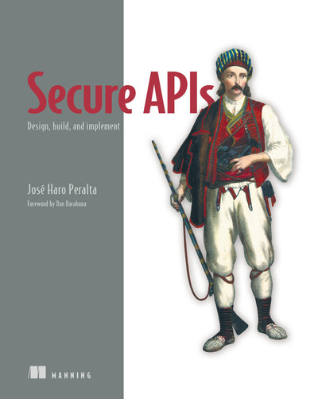
<div style="font-size: 0.55em; color: #999; margin-top: 5px;">Secure APIs</div>
</div>
</div>

<div style="margin-top: 16px; padding: 12px; background-color: #e0e0e0; border-radius: 8px; text-align: center;">
<span style="color: #e65100; font-weight: bold;">曖昧な設計は、AIで速くなるほど検知ではなく拡散される。</span>
</div>

</div>

---

## 本日の目的

<div style="font-size: 0.72em;">

<div style="display: flex; gap: 15px; align-items: center;">
<div style="flex: 1; background-color: #f5f5f5; padding: 13px; border-radius: 8px;">

<strong>生成AIエージェントに質問できる</strong>

認可、入力、出力、ログ、依存関係を、エージェントに確認させられる問いへ分解する。

</div>
<div style="flex: 1; background-color: #f5f5f5; padding: 13px; border-radius: 8px;">

<strong>セキュリティ要件が暗黙知になっている</strong>

「ちゃんと認可する」「安全に作る」を、認可表・入力契約・出力契約・ログ・デプロイポリシーに分解する。

</div>
<div style="flex: 1; background-color: #f5f5f5; padding: 13px; border-radius: 8px;">

<strong>脆弱性名が多すぎる</strong>

XSS、CSRF、SSRF、IDOR、BOLA、BFLA。名前を覚えるより、どの境界が壊れた話なのかで整理する。

</div>
</div>

<div style="margin-top: 16px; padding: 12px; background-color: #e0e0e0; border-radius: 8px; text-align: center;">
<strong>持ち帰りは「生成AIエージェントに渡せる境界の問い」です。</strong>
</div>

</div>

---

## 今日の前提を揃える

<div style="font-size: 0.75em;">

<div style="background-color: #f5f5f5; padding: 15px; border-radius: 8px; margin-bottom: 14px;">

Webセキュリティで守りたいものは、抽象的な「安全」ではありません。AIコーディング時代でも、守りたいのは変わりません。<strong>データ</strong>、<strong>操作</strong>、<strong>信頼</strong>です。

</div>

<div style="display: flex; gap: 15px; align-items: center;">
<div style="flex: 1; background-color: #f5f5f5; padding: 13px; border-radius: 8px;">

<strong>データ</strong>

個人情報、注文、請求、社内情報、トークン。読まれてはいけないもの。

</div>
<div style="flex: 1; background-color: #f5f5f5; padding: 13px; border-radius: 8px;">

<strong>操作</strong>

購入、返金、招待、権限変更、設定変更。勝手に実行されてはいけないもの。

</div>
<div style="flex: 1; background-color: #f5f5f5; padding: 13px; border-radius: 8px;">

<strong>信頼</strong>

ユーザー、ブラウザ、サーバー、外部サービス、依存ライブラリ。信じすぎてはいけないもの。

</div>
</div>

</div>

---

## 本日の流れ

<div style="font-size: 0.75em;">

<div style="display: flex; gap: 20px; align-items: center;">
<div style="flex: 1; background-color: #f5f5f5; padding: 15px; border-radius: 8px;">

1. <strong>AIコーディング時代の前提</strong><br>
   実装が速くなるほど不変条件と証跡が重要になる

2. <strong>Webセキュリティの全体像</strong><br>
   データ・操作・信頼を境界として見る

</div>
<div style="flex: 1; background-color: #f5f5f5; padding: 15px; border-radius: 8px;">

3. <strong>よく壊れる境界</strong><br>
   OWASP Top 10を暗記ではなく構造で読む

4. <strong>HTTPの公開面で確認する</strong><br>
   APIを特別扱いせず、Web全体の境界が露出する場所として見る

5. <strong>現場で使うレビューの問い</strong><br>
   設計、実装、テスト、運用へ落とす

</div>
</div>

<div style="margin-top: 16px; padding: 12px; background-color: #e0e0e0; border-radius: 8px; text-align: center;">
<strong>実装が速くなる → 曖昧な判断が増幅する → 境界を不変条件として運用する</strong>
</div>

</div>

---

<!--
_backgroundColor: #0a1929
_color: white
_class: transition
-->

<div style="display: flex; flex-direction: column; justify-content: center; align-items: center; height: 80%; text-align: center;">

<div style="font-size: 1.5em; font-weight: bold;">

# AIコーディング時代の前提

</div>

<strong>実装が速くなるほど、不変条件と証跡が重くなる</strong>

</div>

---

## 2026年はAIコーディングが前提

<div style="font-size: 0.75em;">

<div style="background-color: #f5f5f5; padding: 15px; border-radius: 8px; margin-bottom: 14px;">

AIコーディング支援は、設計、実装、テスト、レビュー、ドキュメント更新の各工程に入り込んでいます。速くなるのはコード生成だけではなく、曖昧な前提が複製される速度も同じです。

</div>

<div style="display: flex; gap: 15px; align-items: center;">
<div style="flex: 1; background-color: #f5f5f5; padding: 13px; border-radius: 8px;">

<strong>変わること</strong>

コードを書く速度、変更量、レビュー対象、試行回数、依存追加が増える。

</div>
<div style="flex: 1; background-color: #f5f5f5; padding: 13px; border-radius: 8px;">

<strong>変わらないこと</strong>

守る資産、認可境界、業務ルール、事故時の責任、説明責任は消えない。

</div>
</div>

<div style="margin-top: 16px; padding: 12px; background-color: #e0e0e0; border-radius: 8px; text-align: center;">
<strong>AIで増える変更量を、設計判断の明文化なしに受け止めない。</strong>
</div>

</div>

---

## コードは時間の中で変わる

<div style="font-size: 0.7em;">

<div style="display: flex; gap: 15px; align-items: center; margin-bottom: 10px;">
<div style="width: 42%;">
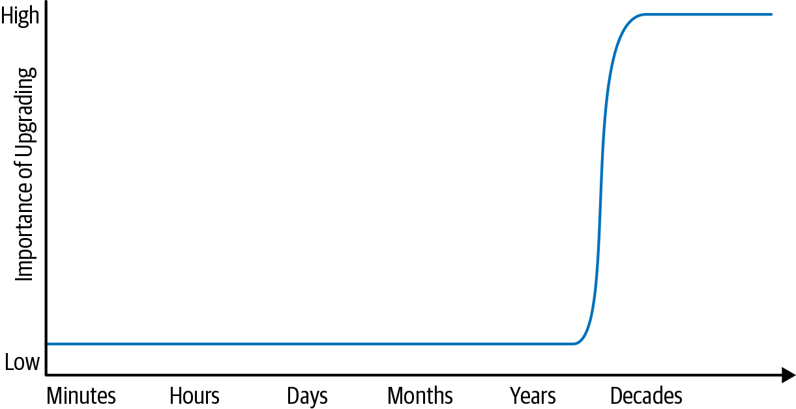
<div style="font-size: 0.55em; color: #999; text-align: center; margin-top: 5px;">Figure 1-1. Life span and the importance of upgrades より引用</div>
</div>
<div style="flex: 1;">

<div style="display: flex; gap: 12px; align-items: center; background-color: #f5f5f5; padding: 12px; border-radius: 8px; margin-bottom: 10px;">
<div style="width: 22%;">

</div>
<div style="flex: 1;">

『Software Engineering at Google』は、ソフトウェアエンジニアリングを時間、スケール、トレードオフの問題として扱います。AIでコードを書く速度が上がっても、プロダクトコードは依存関係、利用者、運用、脆弱性情報の変化を受け続けます。

</div>
</div>

<div style="background-color: #f5f5f5; padding: 12px; border-radius: 8px;">

短命なスクリプトなら「いま動く」で十分なことがあります。しかしWebアプリケーションは、権限、データ、ログ、外部API、ブラウザ仕様と一緒に変わり続ける。だからセキュリティ要件は、変更時に差分レビューできる形で残します。

</div>
</div>
</div>

<div style="margin-top: 12px; padding: 10px; background-color: #e0e0e0; border-radius: 8px; text-align: center;">
<strong>速く書くほど、あとで変えられる形にする。</strong>
</div>

<div style="font-size: 0.5em; color: #999; text-align: right; margin-top: 4px;">
参照: Software Engineering at Google, Chapter 1
</div>

</div>

---

## AIは暗黙知を読み切れない

<div style="font-size: 0.75em;">

<div style="background-color: #f5f5f5; padding: 15px; border-radius: 8px; margin-bottom: 14px;">

AIは、既存コードのノリや周辺の雰囲気から、ある程度は意図を推測してくれます。ただし、何を安全とみなすか、誰に何を許すか、どの入力を拒否するか、どのログを残すかまで、暗黙知がすべて正しく読み込まれるわけではありません。既存のコードの延長が常に正しいわけではない。

</div>

<div style="display: flex; gap: 15px; align-items: center;">
<div style="flex: 1; background-color: #f5f5f5; padding: 13px; border-radius: 8px;">

<strong>暗黙のまま</strong>

実装者の経験、口頭の合意、既存コードの雰囲気、レビュー担当者の勘。AIの出力に反映されることもあるが、保証はない。

</div>
<div style="flex: 1; background-color: #f5f5f5; padding: 13px; border-radius: 8px;">

<strong>検証できる形にする</strong>

認可表、入力契約、出力契約、例外時の挙動、監査ログ、デプロイ条件。

</div>
</div>

<div style="margin-top: 16px; padding: 12px; background-color: #e0e0e0; border-radius: 8px; text-align: center;">
<strong>書かれていないルールは自動化できない。検証されないルールは効かない。</strong>
</div>

</div>

---

## 自動化できるものは増える

<div style="font-size: 0.72em;">

<div style="background-color: #f5f5f5; padding: 12px; border-radius: 8px; margin-bottom: 12px;">

NIST SSDFは、セキュア開発の活動をリスクベースで計画し、実装し、継続改善する考え方を示しています。AI時代には、このうち判断条件が安定しているものを積極的に自動化します。

『Software Engineering at Google』のスタイルガイド章の観点で言えば、ルールは組織の共通語彙です。共通語彙になっているから、レビューでもAIでもCIでも同じ判断を繰り返せます。

</div>

| 自動化しやすいもの              | 例                                           |
| ------------------------------- | -------------------------------------------- |
| <strong>形式的なルール</strong> | lint、format、型、禁止API、依存バージョン    |
| <strong>既知の脆弱性</strong>   | SAST、dependency scan、secret scan、IaC scan |
| <strong>契約の検証</strong>     | OpenAPI、schema、追加フィールド拒否、最大値  |
| <strong>レビュー補助</strong>   | AIによる差分要約、テスト候補、観点漏れの指摘 |

<div style="margin-top: 12px; padding: 10px; background-color: #e0e0e0; border-radius: 8px; text-align: center;">
<strong>自動化は判断の外注ではなく、明文化された判断の反復実行。</strong>
</div>

<div style="font-size: 0.5em; color: #999; text-align: right; margin-top: 4px;">
参照: Software Engineering at Google, Chapter 8 / NIST SSDF
</div>

</div>

---

## 自動化できないものも残る

<div style="font-size: 0.75em;">

<div style="background-color: #f5f5f5; padding: 15px; border-radius: 8px; margin-bottom: 14px;">

OpenSSFのAIコードアシスタント向けガイドは、AIを開発者の代替ではなくアシスタントとして扱い、生成コードもレビュー、テスト、静的解析、ドキュメント化の工程を通すべきだと整理しています。

</div>

<div style="display: flex; gap: 15px; align-items: center;">
<div style="flex: 1; background-color: #f5f5f5; padding: 13px; border-radius: 8px;">

<strong>自動化しやすい</strong>

既存ルールの適用、テスト案、実装パターン、差分説明。

</div>
<div style="flex: 1; background-color: #f5f5f5; padding: 13px; border-radius: 8px;">

<strong>人間が決める</strong>

守る資産、許容リスク、認可境界、失敗時の業務影響。

</div>
</div>

<div style="margin-top: 16px; padding: 12px; background-color: #e0e0e0; border-radius: 8px; text-align: center;">
<strong>責任が残る判断ほど、不変条件に落とす。</strong>
</div>

</div>

---

## 後付けできない性質を設計する

<div style="font-size: 0.75em;">

<div style="display: flex; gap: 15px; align-items: center; background-color: #f5f5f5; padding: 14px; border-radius: 8px; margin-bottom: 14px;">
<div style="width: 14%;">
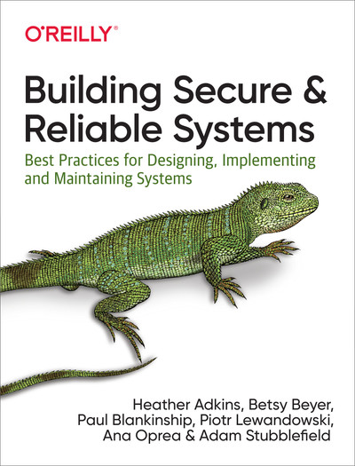
</div>
<div style="flex: 1;">

『Building Secure & Reliable Systems』は、セキュリティと信頼性を「システム全体の設計から生まれる性質」として扱います。どちらも、あとから部品を足せば完成するものではありません。認可、入力、ログ、復旧手順の判断は、実装前に境界として決め、変更時に破られていないか確認します。

</div>
</div>

<div style="display: flex; gap: 15px; align-items: center;">
<div style="flex: 1; background-color: #f5f5f5; padding: 13px; border-radius: 8px;">

<strong>セキュリティ</strong>

攻撃者がいる前提で、どこを信頼せず、どこで止め、どこまで被害を閉じ込めるかを決める。

</div>
<div style="flex: 1; background-color: #f5f5f5; padding: 13px; border-radius: 8px;">

<strong>信頼性</strong>

壊れる前提で、どこを縮退させ、どこを隔離し、どう復旧できる状態にしておくかを決める。

</div>
</div>

<div style="margin-top: 16px; padding: 12px; background-color: #e0e0e0; border-radius: 8px; text-align: center;">
<strong>後から足す防御は、設計時に作らなかった境界を復元できない。</strong>
</div>

<div style="font-size: 0.5em; color: #999; text-align: right; margin-top: 4px;">
参照: Building Secure & Reliable Systems, Chapter 1
</div>

</div>

---

## 設計が雑だと高速に壊れる

<div style="font-size: 0.75em;">

<div style="background-color: #f5f5f5; padding: 18px; border-radius: 8px;">

AI時代に本当に怖いのは、脆弱なコードが1行混ざることだけではありません。

もっと怖いのは、<strong>認可境界が曖昧な設計</strong>、<strong>入力契約がないAPI</strong>、<strong>エラー時の振る舞いが決まっていない業務フロー</strong>が、AI生成コードとして高速に実装されることです。

設計が曖昧なら、既存コード周辺から不明な仮定が補われます。その仮定がプロダクトのセキュリティ要件と合っている保証はありません。

</div>

<div style="margin-top: 16px; padding: 12px; background-color: #e0e0e0; border-radius: 8px; text-align: center;">
<span style="color: #e65100; font-weight: bold;">雑な設計は、AIで速くなるほど一貫した失敗になる。</span>
</div>

</div>

---

## ここで見えた問題

<div style="font-size: 0.75em;">

<div style="background-color: #f5f5f5; padding: 18px; border-radius: 8px;">

自動化できるものは増えます。形式的なルール、既知の脆弱性、契約の検証、レビュー補助は自動化できます。

しかし、自動化に必要なルールがなければ実行できません。ルールが古ければ、誤った判断が継続的に再利用されます。

</div>

<div style="margin-top: 16px; padding: 12px; background-color: #e0e0e0; border-radius: 8px; text-align: center;">
<strong>次に必要なのは、境界を見つけ、不変条件として更新し続けること。</strong>
</div>

</div>

---

<!--
_backgroundColor: #0a1929
_color: white
_class: transition
-->

<div style="display: flex; flex-direction: column; justify-content: center; align-items: center; height: 80%; text-align: center;">

<div style="font-size: 1.5em; font-weight: bold;">

# Webセキュリティの全体像

</div>

<strong>自動化の前に、人間が境界を決める</strong>

</div>

---

## Webアプリは境界の集合

<div style="font-size: 0.75em;">

<div style="background-color: #f5f5f5; padding: 15px; border-radius: 8px; margin-bottom: 14px;">

AI生成コードは、関数やコンポーネント単位ではもっともらしく見えます。しかしWebアプリケーションは、ブラウザ、HTTP、認証基盤、API、DB、外部サービス、CI/CD、依存ライブラリがつながったシステムです。

</div>

<div style="display: flex; gap: 12px; align-items: center;">
<div style="flex: 1; background-color: #f5f5f5; padding: 12px; border-radius: 8px;">

<strong>信頼境界</strong>

ユーザー入力、Cookie、ヘッダー、トークン、Webhook、外部API。境界を越える値は信頼しない。

</div>
<div style="flex: 1; background-color: #f5f5f5; padding: 12px; border-radius: 8px;">

<strong>認可境界</strong>

ユーザー、組織、ロール、所有者、管理者機能。ログイン済みかどうかとは別に考える。

</div>
<div style="flex: 1; background-color: #f5f5f5; padding: 12px; border-radius: 8px;">

<strong>運用境界</strong>

環境差分、秘密情報、ログ、監視、依存更新。作った後も境界は変わり続ける。

</div>
</div>

</div>

---

## 境界は3つの問いで見つける

<div style="font-size: 0.75em;">

<div style="background-color: #f5f5f5; padding: 15px; border-radius: 8px; margin-bottom: 14px;">

「境界」と言われると抽象的ですが、レビューでは次の3つを聞けば十分に始められます。

</div>

<div style="display: flex; gap: 15px; align-items: center;">
<div style="flex: 1; background-color: #f5f5f5; padding: 13px; border-radius: 8px;">

<strong>どこから来た値か</strong>

ユーザー入力、Cookie、Header、DB、外部API、ジョブキュー。

</div>
<div style="flex: 1; background-color: #f5f5f5; padding: 13px; border-radius: 8px;">

<strong>誰の権限で動くか</strong>

本人、管理者、システム、別テナント、外部サービス。

</div>
<div style="flex: 1; background-color: #f5f5f5; padding: 13px; border-radius: 8px;">

<strong>失敗したらどう閉じるか</strong>

拒否する、隠す、記録する、再試行する、隔離する。

</div>
</div>

<div style="margin-top: 16px; padding: 12px; background-color: #e0e0e0; border-radius: 8px; text-align: center;">
<strong>図に描けない境界ほど、問いと不変条件で残す。</strong>
</div>

</div>

---

## 境界を不変条件として書く

<div style="font-size: 0.75em;">

<div style="background-color: #f5f5f5; padding: 15px; border-radius: 8px; margin-bottom: 14px;">

『Building Secure & Reliable Systems』の理解可能性の章では、複雑なシステムを人間が推論できる単位に分け、システム全体で守るべき性質を不変条件として扱う考え方が出てきます。

</div>

<div style="display: flex; gap: 15px; align-items: center;">
<div style="flex: 1; background-color: #f5f5f5; padding: 13px; border-radius: 8px;">

<strong>不変条件の例</strong>

別テナントのデータは返さない。状態変更は監査ログを残す。契約にない入力フィールドは捨てる。

</div>
<div style="flex: 1; background-color: #f5f5f5; padding: 13px; border-radius: 8px;">

<strong>AI時代の意味</strong>

不変条件が明示されていれば、AIの生成、レビュー、テスト、CIのすべてで同じ条件を参照できる。

</div>
</div>

<div style="margin-top: 16px; padding: 12px; background-color: #e0e0e0; border-radius: 8px; text-align: center;">
<strong>境界は「気をつけること」ではなく「破ってはいけない条件」にする。</strong>
</div>

<div style="font-size: 0.5em; color: #999; text-align: right; margin-top: 4px;">
参照: Building Secure & Reliable Systems, Chapter 6
</div>

</div>

---

## 観測できる振る舞いは契約になる

<div style="font-size: 0.75em;">

<div style="background-color: #f5f5f5; padding: 15px; border-radius: 8px; margin-bottom: 14px;">

『Software Engineering at Google』で紹介されるHyrumの法則は、明示した契約だけでなく、観測可能な振る舞いに利用者が依存していくことを指摘します。Webではこれは特に起きやすい。

</div>

<div style="display: flex; gap: 15px; align-items: center;">
<div style="flex: 1; background-color: #f5f5f5; padding: 13px; border-radius: 8px;">

<strong>依存されるもの</strong>

HTTPステータス、エラー形式、JSONフィールド、並び順、Cookie属性、権限エラーの出方。

</div>
<div style="flex: 1; background-color: #f5f5f5; padding: 13px; border-radius: 8px;">

<strong>セキュリティ上の意味</strong>

曖昧な振る舞いを放置すると、後方互換性とセキュリティ境界が衝突する。

</div>
</div>

<div style="margin-top: 16px; padding: 12px; background-color: #e0e0e0; border-radius: 8px; text-align: center;">
<strong>約束しない振る舞いほど、先に閉じるか、明示して管理する。</strong>
</div>

<div style="font-size: 0.5em; color: #999; text-align: right; margin-top: 4px;">
参照: Software Engineering at Google, Chapter 1
</div>

</div>

---

## 現代のWebは攻撃面が広い

<div style="font-size: 0.72em;">

<div style="display: flex; gap: 20px; align-items: center;">
<div style="flex: 1;">

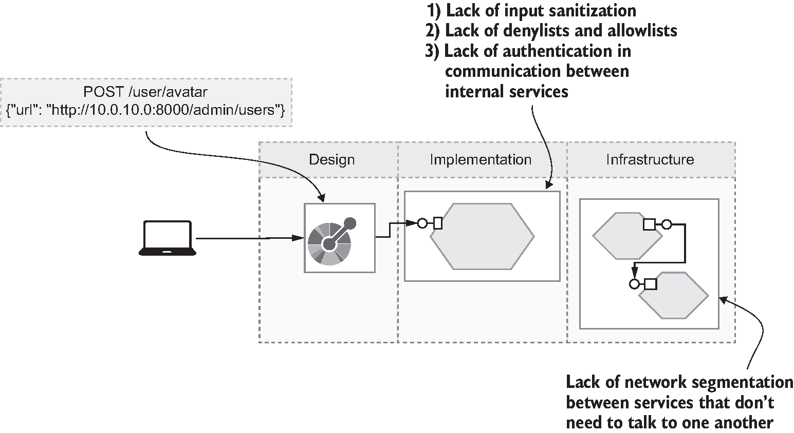
<div style="font-size: 0.55em; color: #999; text-align: center; margin-top: 5px;">図1.3 API攻撃ベクトル より引用</div>

</div>
<div style="flex: 1; background-color: #f5f5f5; padding: 14px; border-radius: 8px;">

攻撃者は「フォーム」だけを見ているわけではありません。API仕様、ブラウザのDevTools、サブドメイン、依存ライブラリ、公開リポジトリ、クラウドメタデータ、エラーメッセージをつないで、入口を探します。

<br><br>

防御側も、画面、API、依存、クラウド、ログを別々に扱わず、<strong>同じ認証・認可・入力契約で確認する</strong>形にします。

</div>
</div>

</div>

---

## 1つのリクエストにも境界が詰まっている

<div style="font-size: 0.72em;">

<div style="background-color: #f5f5f5; padding: 12px; border-radius: 8px; margin-bottom: 12px;">

たとえば、普通の更新リクエストでも、見るべき境界は複数あります。

</div>

```http
PUT /workspaces/acme/invoices/123
Cookie: session=...
Content-Type: application/json

{ "amount": 10000, "status": "paid" }
```

<div style="display: flex; gap: 12px; align-items: center; margin-top: 12px;">
<div style="flex: 1; background-color: #f5f5f5; padding: 10px; border-radius: 8px;">

<strong>認証</strong><br>
このCookieは誰のものか

</div>
<div style="flex: 1; background-color: #f5f5f5; padding: 10px; border-radius: 8px;">

<strong>認可</strong><br>
この請求書を更新してよいか

</div>
<div style="flex: 1; background-color: #f5f5f5; padding: 10px; border-radius: 8px;">

<strong>入力</strong><br>
`status` を受け取ってよいか

</div>
<div style="flex: 1; background-color: #f5f5f5; padding: 10px; border-radius: 8px;">

<strong>監査</strong><br>
誰がいつ変更したか

</div>
</div>

</div>

---

## Web Application Securityの視点

<div style="font-size: 0.72em;">

<div style="display: flex; gap: 22px; align-items: center;">
<div style="width: 22%; text-align: center;">
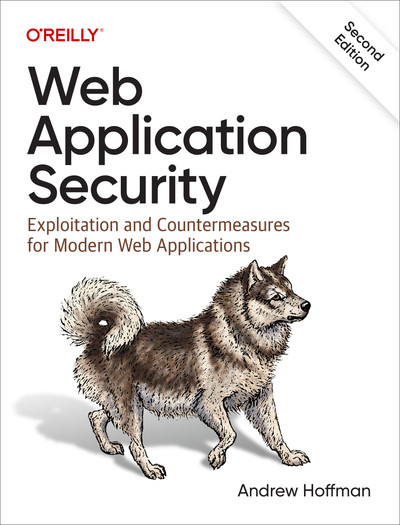
<div style="font-size: 0.55em; color: #999; margin-top: 5px;">Andrew Hoffman, Web Application Security, 2nd Edition</div>
</div>
<div style="flex: 1;">

<div style="background-color: #f5f5f5; padding: 16px; border-radius: 8px; margin-bottom: 14px;">

Web Application Securityの重要な視点は、Webアプリを「サーバーが返す画面」ではなく、<strong>ブラウザが権限を持って実行する分散システム</strong>として見ることです。

</div>

<div style="display: grid; grid-template-columns: 1fr 1fr; gap: 10px; margin-bottom: 12px;">
<div style="background-color: #f5f5f5; padding: 10px; border-radius: 8px;">

<strong>権限が自動で送られる</strong><br>
Cookie、認証ヘッダー、保存済み状態。

</div>
<div style="background-color: #f5f5f5; padding: 10px; border-radius: 8px;">

<strong>文字列がコードになる</strong><br>
HTML、DOM、JavaScript、テンプレート。

</div>
<div style="background-color: #f5f5f5; padding: 10px; border-radius: 8px;">

<strong>境界がヘッダーで変わる</strong><br>
CORS、CSP、SameSite、Cache-Control。

</div>
<div style="background-color: #f5f5f5; padding: 10px; border-radius: 8px;">

<strong>実装外から観測できる</strong><br>
DevTools、API仕様、レスポンス、エラー。

</div>
</div>

<div style="background-color: #e0e0e0; padding: 12px; border-radius: 8px; text-align: center;">
<strong>Webの脆弱性は、サーバーの意図とブラウザの実行モデルがずれた場所に出る。</strong>
</div>

</div>
</div>

</div>

---

## ブラウザは境界を実行する

<div style="font-size: 0.72em;">

<div style="background-color: #f5f5f5; padding: 12px; border-radius: 8px; margin-bottom: 12px;">

サーバーは「この画面なら安全」と考えがちです。しかしブラウザは、画面の意図ではなく、HTTP、HTML、ヘッダー、Cookie、DOM仕様に従って動きます。ここに設計と実行のずれが生まれます。

</div>

| ブラウザの性質           | 壊れると起きること           | レビューで見る境界                     |
| ------------------------ | ---------------------------- | -------------------------------------- |
| Cookieを自動送信する     | CSRF、意図しない状態変更     | SameSite、CSRF token、Origin検証       |
| HTMLをDOMとして解釈する  | XSS、攻撃者コードの実行      | 出力文脈、エンコード、CSP              |
| 別オリジンを制御する     | CORS誤設定、データ読み取り   | 許可Origin、認証情報、プリフライト     |
| 状態をブラウザに保持する | トークン漏洩、古い権限の継続 | 保存場所、有効期限、ログアウト時の破棄 |

<div style="margin-top: 12px; padding: 10px; background-color: #e0e0e0; border-radius: 8px; text-align: center;">
<strong>「画面でできること」ではなく、「ブラウザが実行できること」をレビューする。</strong>
</div>

</div>

---

## 攻撃者は導線外の入口を使う

<div style="font-size: 0.7em;">

<div style="display: flex; gap: 15px; align-items: center;">
<div style="width: 42%;">
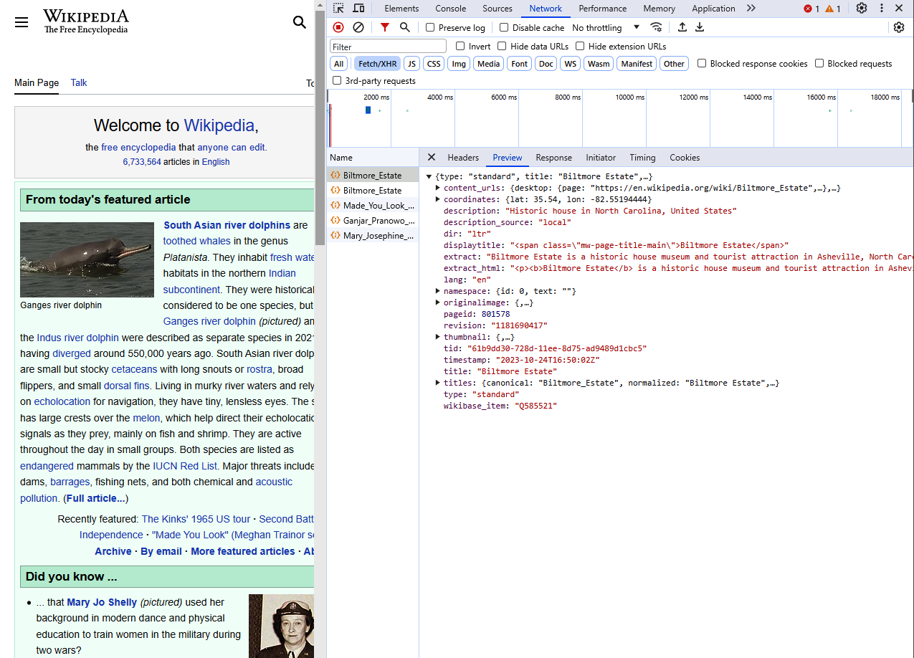
<div style="font-size: 0.55em; color: #999; text-align: center; margin-top: 5px;">Figure 4-2. Browser DevTools Network より引用</div>
</div>
<div style="flex: 1;">

<div style="background-color: #f5f5f5; padding: 12px; border-radius: 8px; margin-bottom: 10px;">

ユーザーは画面の導線に従います。攻撃者は導線ではなく、<strong>HTTPリクエストそのもの</strong>を見ます。

</div>

```http
GET /users/me
GET /users/123
GET /users/124

POST /orders
POST /admin/orders
PUT /orders/123/status
```

</div>
</div>

<div style="margin-top: 14px; padding: 12px; background-color: #e0e0e0; border-radius: 8px; text-align: center;">
<strong>画面で隠したものは、防御ではない。</strong>
</div>

</div>

---

## ブラウザは実行環境でもある

<div style="font-size: 0.7em;">

<div style="background-color: #f5f5f5; padding: 15px; border-radius: 8px; margin-bottom: 14px;">

ブラウザはHTMLを表示するだけの箱ではなく、JavaScriptを実行し、Cookieを送信し、ストレージを持ち、別オリジンへのリクエストを制御する実行環境です。

</div>

<div style="display: flex; gap: 18px; align-items: center;">
<div style="width: 34%;">

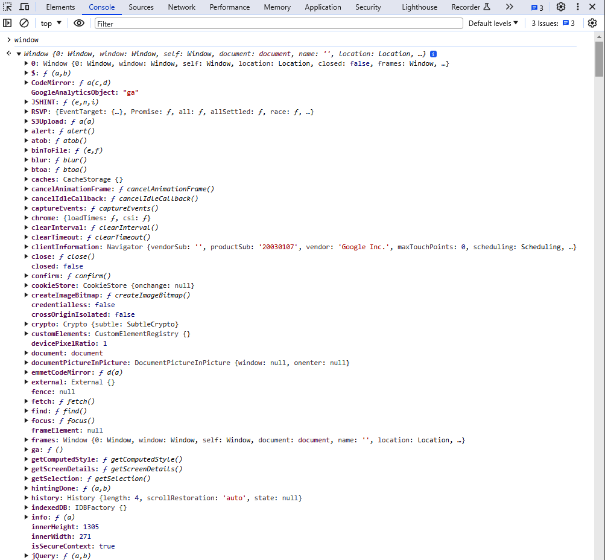
<div style="font-size: 0.55em; color: #999; text-align: center; margin-top: 5px;">Figure 3-3. The DOM `window` object より引用</div>

</div>
<div style="flex: 1;">

<div style="background-color: #f5f5f5; padding: 10px; border-radius: 8px; margin-bottom: 8px;">

<strong>同一オリジンポリシー</strong>

別オリジンの読み取りを制限する。CORSはこの制限を緩めるための仕組み。

</div>
<div style="background-color: #f5f5f5; padding: 10px; border-radius: 8px; margin-bottom: 8px;">

<strong>Cookie</strong>

自動送信される。SameSite、Secure、HttpOnlyの設定を誤ると攻撃面になる。

</div>
<div style="background-color: #f5f5f5; padding: 10px; border-radius: 8px;">

<strong>CSP</strong>

実行できるスクリプトや読み込めるリソースを制限する。XSSの被害範囲を狭める制御。

</div>
</div>
</div>

</div>

---

## HTTPは状態を持たない

<div style="font-size: 0.75em;">

<div style="background-color: #f5f5f5; padding: 15px; border-radius: 8px; margin-bottom: 14px;">

HTTP自体はステートレスです。だからアプリケーションは、Cookie、セッション、JWT、CSRFトークン、リフレッシュトークンのような仕組みで状態を再構成します。

</div>

HTTPが状態を持たない分、アプリケーションが「誰として扱うか」をCookieやトークンで再構成します。ここで期限、スコープ、ログアウト、別端末、別オリジンの扱いが曖昧だと、本人性と権限の境界がずれます。

<div style="margin-top: 16px; padding: 12px; background-color: #e0e0e0; border-radius: 8px; text-align: center;">
<span style="color: #e65100; font-weight: bold;">HTTPにない状態を補う設計が、認証後の攻撃面を決める。</span>
</div>

</div>

---

## 脆弱性名は壊れた約束の名前

<div style="font-size: 0.75em;">

<div style="background-color: #f5f5f5; padding: 15px; border-radius: 8px; margin-bottom: 14px;">

XSSやCSRFのような名前は、最初は専門用語に見えます。ただ、実務では「どの約束が壊れたのか」に言い換えると扱いやすくなります。

</div>

<div style="display: flex; gap: 15px; align-items: center;">
<div style="flex: 1; background-color: #f5f5f5; padding: 13px; border-radius: 8px;">

<strong>この値はデータとして扱う</strong>

壊れるとXSSやInjectionになる。

</div>
<div style="flex: 1; background-color: #f5f5f5; padding: 13px; border-radius: 8px;">

<strong>この操作は本人だけができる</strong>

壊れるとIDOR、BOLA、BFLAになる。

</div>
<div style="flex: 1; background-color: #f5f5f5; padding: 13px; border-radius: 8px;">

<strong>この入口は把握している</strong>

壊れると設定ミス、シャドウAPI、監視漏れになる。

</div>
</div>

</div>

---

## 最初の結論

<div style="font-size: 0.75em;">

<div style="background-color: #f5f5f5; padding: 18px; border-radius: 8px;">

Webセキュリティを「脆弱性名の一覧」として見ると、覚えることが多すぎます。

しかし「境界が壊れるパターン」として見ると、かなり整理できます。入力を信頼した。出力をエスケープしなかった。認証と認可を混同した。ブラウザの自動送信を忘れた。外部サービスを信頼しすぎた。運用で見えなくなった。

</div>

<div style="margin-top: 16px; padding: 12px; background-color: #e0e0e0; border-radius: 8px; text-align: center;">
<strong>境界は見えた。次は、どの境界がどう壊れるのか。</strong>
</div>

</div>

---

<!--
_backgroundColor: #0a1929
_color: white
_class: transition
-->

<div style="display: flex; flex-direction: column; justify-content: center; align-items: center; height: 80%; text-align: center;">

<div style="font-size: 1.5em; font-weight: bold;">

# よく壊れる境界

</div>

<strong>脆弱性名ではなく、壊れた約束として読む</strong>

</div>

---

## 境界で読むと優先順位が見える

<div style="font-size: 0.72em;">

<div style="background-color: #f5f5f5; padding: 12px; border-radius: 8px; margin-bottom: 12px;">

ここまでで、Webアプリは境界の集合だと見ました。では、どの境界から見るべきか。脆弱性名を1つずつ覚えるより、「どの境界がどれだけ壊れやすいか」で見ると、レビューの優先順位を決めやすくなります。

</div>

| 境界                              | 代表例                               | 先に見る理由                                       |
| --------------------------------- | ------------------------------------ | -------------------------------------------------- |
| <strong>認可境界</strong>         | IDOR、BOLA、BFLA                     | 仕様通りのリクエストで破れるため、自動検出しづらい |
| <strong>入力と出力の境界</strong> | XSS、Injection、Mass Assignment      | 入口が多く、修正漏れが起きやすい                   |
| <strong>運用境界</strong>         | Misconfiguration、Logging、Inventory | 本番環境で変化し続ける                             |

<div style="margin-top: 12px; padding: 10px; background-color: #e0e0e0; border-radius: 8px; text-align: center;">
<strong>重大度だけでなく、見落としやすさも優先順位に入れる。</strong>
</div>

</div>

---

## OWASP Top 10は分類である

<div style="font-size: 0.7em;">

<div style="background-color: #f5f5f5; padding: 10px; border-radius: 8px; margin-bottom: 10px;">

OWASP Top 10は、Webアプリケーションの重大リスクを整理した標準的な啓発文書です。2026年7月時点で、Webアプリケーション版の現行リリースは <strong>OWASP Top 10:2025</strong> です。

</div>

| 分類                                                | 何が壊れるか | レビューで見るもの                             |
| --------------------------------------------------- | ------------ | ---------------------------------------------- |
| <strong>A01 Broken Access Control</strong>          | 認可境界     | 所有者、ロール、管理者機能、SSRFになり得る通信 |
| <strong>A02 Security Misconfiguration</strong>      | 設定境界     | CORS、CSP、Cookie、クラウド、エラー出力        |
| <strong>A03 Software Supply Chain Failures</strong> | 依存境界     | パッケージ、ビルド、署名、CI/CD、SBOM          |
| <strong>A04 Cryptographic Failures</strong>         | 保護境界     | TLS、鍵管理、保存データ、トークン              |
| <strong>A05 Injection</strong>                      | 入力境界     | SQL、OSコマンド、テンプレート、LDAP            |
| <strong>A06 Insecure Design</strong>                | 設計境界     | 脅威モデリング、失敗時の挙動、濫用シナリオ     |

<div style="font-size: 0.5em; color: #999; text-align: right; margin-top: 4px;">
参照: https://owasp.org/www-project-top-ten/ / https://owasp.org/Top10/2025/en/
</div>

</div>

---

## Top 10を暗記しない

<div style="font-size: 0.75em;">

<div style="background-color: #f5f5f5; padding: 15px; border-radius: 8px; margin-bottom: 14px;">

Top 10は「この10個だけ潰せば安全」というリストではありません。レビュー観点として使うなら、<strong>どの境界が壊れた結果なのか</strong>へ変換します。

</div>

<div style="display: flex; gap: 15px; align-items: center;">
<div style="flex: 1; background-color: #f5f5f5; padding: 13px; border-radius: 8px;">

<strong>入力境界</strong>

Injection、XSS、XXE、SSRF、巨大ペイロード。

</div>
<div style="flex: 1; background-color: #f5f5f5; padding: 13px; border-radius: 8px;">

<strong>権限境界</strong>

Broken Access Control、IDOR、BOLA、BFLA、管理者API。

</div>
<div style="flex: 1; background-color: #f5f5f5; padding: 13px; border-radius: 8px;">

<strong>運用境界</strong>

Misconfiguration、Supply Chain、Logging、例外処理。

</div>
</div>

</div>

---

## 入力検証と出力制御は別物

<div style="font-size: 0.75em;">

<div style="background-color: #f5f5f5; padding: 15px; border-radius: 8px; margin-bottom: 14px;">

「入力をチェックしているからXSSは大丈夫」と言いたくなります。ただ、入力検証と出力制御は役割が違います。

</div>

<div style="display: flex; gap: 15px; align-items: center;">
<div style="flex: 1; background-color: #f5f5f5; padding: 13px; border-radius: 8px;">

<strong>入力検証</strong>

型、長さ、形式、範囲を見る。アプリが扱えるデータだけを受け取るための防御。

</div>
<div style="flex: 1; background-color: #f5f5f5; padding: 13px; border-radius: 8px;">

<strong>出力制御</strong>

HTML、属性、URL、JavaScriptなど、出力先の文脈に合わせてエンコードする防御。

</div>
</div>

<div style="margin-top: 16px; padding: 12px; background-color: #e0e0e0; border-radius: 8px; text-align: center;">
<strong>入力で絞り、出力で文脈に閉じ込める。</strong>
</div>

</div>

---

## XSSは出力境界の失敗

<div style="font-size: 0.7em;">

<div style="background-color: #f5f5f5; padding: 12px; border-radius: 8px; margin-bottom: 10px;">

<strong>XSS (Cross-Site Scripting)</strong> は、攻撃者が混ぜた文字列を、ブラウザがHTMLやJavaScriptとして実行してしまう攻撃です。入力の入口は、コメント、プロフィール、URLパラメータ、DOM操作など複数あります。

</div>

<div style="display: flex; gap: 16px; align-items: center;">
<div style="width: 34%;">

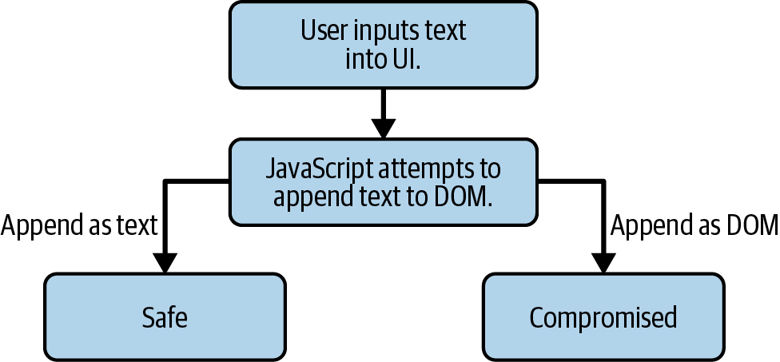
<div style="font-size: 0.55em; color: #999; text-align: center; margin-top: 5px;">Figure 28-1. Most XSS occurs as user-supplied text is injected into the DOM より引用</div>

</div>
<div style="flex: 1;">

### 攻撃の段階

| 段階 | 何が起きるか                                 |
| ---- | -------------------------------------------- |
| 混入 | 攻撃者が `<script>` やイベント属性を入力する |
| 出力 | アプリが文字列をHTMLとして埋め込む           |
| 実行 | 被害者のブラウザで攻撃者のコードが動く       |

</div>
</div>

<div style="margin-top: 10px; padding: 10px; background-color: #e0e0e0; border-radius: 8px; text-align: center;">
<strong>サニタイズだけで考えない。出力文脈に合わせてエンコードする。</strong>
</div>

<div style="font-size: 0.5em; color: #999; text-align: right; margin-top: 4px;">
参照: https://cheatsheetseries.owasp.org/cheatsheets/Cross_Site_Scripting_Prevention_Cheat_Sheet.html
</div>

</div>

---

## Cookieが便利だからCSRFが起きる

<div style="font-size: 0.75em;">

<div style="background-color: #f5f5f5; padding: 15px; border-radius: 8px; margin-bottom: 14px;">

CSRFは「古い脆弱性」ではありません。Cookieベースのセッションを使う限り、ブラウザが自動で認証情報を送る性質を、設計とレビューの前提に入れます。

</div>

<div style="display: flex; gap: 15px; align-items: center;">
<div style="flex: 1; background-color: #f5f5f5; padding: 13px; border-radius: 8px;">

<strong>便利な性質</strong>

ユーザーは毎回トークンを意識しない。ブラウザがCookieを自動で付ける。

</div>
<div style="flex: 1; background-color: #f5f5f5; padding: 13px; border-radius: 8px;">

<strong>危険な性質</strong>

別サイトからのリクエストにも、条件次第でCookieが付く。

</div>
</div>

<div style="margin-top: 16px; padding: 12px; background-color: #e0e0e0; border-radius: 8px; text-align: center;">
<strong>自動送信されるものには、意図の確認が必要。</strong>
</div>

</div>

---

## CSRFはブラウザの自動送信を悪用する

<div style="font-size: 0.7em;">

<div style="background-color: #f5f5f5; padding: 15px; border-radius: 8px; margin-bottom: 14px;">

<strong>CSRF (Cross-Site Request Forgery)</strong> は、ログイン済みユーザーのブラウザに、本人が意図していない状態変更リクエストを送らせる攻撃です。攻撃者はCookieを盗まなくても、ブラウザの自動送信を利用します。

</div>

<div style="display: flex; gap: 18px; align-items: center;">
<div style="width: 36%;">

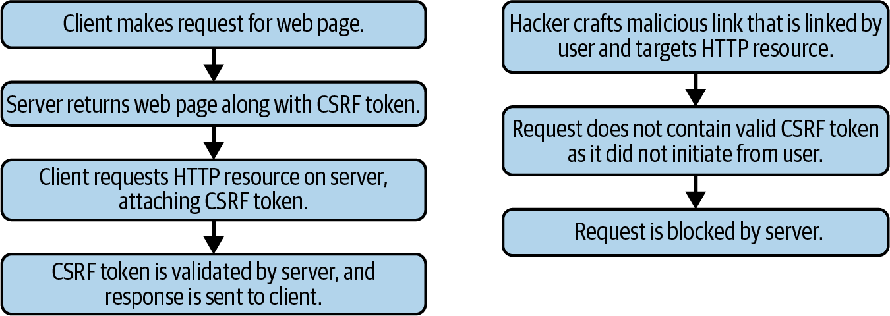
<div style="font-size: 0.55em; color: #999; text-align: center; margin-top: 5px;">Figure 29-1. CSRF tokens より引用</div>

</div>
<div style="flex: 1;">

<div style="background-color: #f5f5f5; padding: 11px; border-radius: 8px; margin-bottom: 8px;">

<strong>攻撃の段階</strong>

罠ページを開く → ブラウザがCookie付きで送信 → サーバーが本人の操作として処理する。

</div>
<div style="background-color: #f5f5f5; padding: 11px; border-radius: 8px;">

<strong>成立条件</strong>

Cookie認証、状態変更API、CSRFトークンなし、Origin/Referer未確認。

</div>
</div>
</div>

<div style="margin-top: 16px; padding: 12px; background-color: #e0e0e0; border-radius: 8px; text-align: center;">
<strong>ユーザーが押していないボタンを、ブラウザに押させない。</strong>
</div>

</div>

---

## Injectionは入力境界の失敗

<div style="font-size: 0.72em;">

<div style="background-color: #f5f5f5; padding: 12px; border-radius: 8px; margin-bottom: 10px;">

<strong>Injection</strong> は、攻撃者が入力に命令文を混ぜ、アプリがそれをSQL、OSコマンド、テンプレート、クエリ言語などの一部として実行してしまう攻撃です。

</div>

```javascript
// 危険: 文字列連結でSQLを組み立てる
db.query("SELECT * FROM users WHERE id = " + req.query.id);

// 安全: パラメータ化されたクエリを使う
db.query("SELECT * FROM users WHERE id = ?", [req.query.id]);
```

| 攻撃の段階 | 何が起きるか                                  |
| ---------- | --------------------------------------------- |
| 混入       | `1 OR 1=1` など命令として意味を持つ入力を送る |
| 解釈       | アプリが入力をSQL文字列へ連結する             |
| 実行       | DBが入力をデータではなく命令として処理する    |

<div style="margin-top: 14px; padding: 12px; background-color: #e0e0e0; border-radius: 8px; text-align: center;">
<strong>入力検証は必要。ただし、命令との分離はパラメータ化で行う。</strong>
</div>

</div>

---

## 認証済みの攻撃者を想定する

<div style="font-size: 0.75em;">

<div style="background-color: #f5f5f5; padding: 15px; border-radius: 8px; margin-bottom: 14px;">

認可のレビューでは「未ログインの攻撃者」だけを想定しても足りません。多くのアクセス制御の失敗は、<strong>ログイン済みの普通のユーザー</strong>が、自分の範囲を越えることで起きます。

</div>

<div style="display: flex; gap: 15px; align-items: center;">
<div style="flex: 1; background-color: #f5f5f5; padding: 13px; border-radius: 8px;">

<strong>横方向の越境</strong>

他ユーザー、他組織、他プロジェクトのデータを見る。

</div>
<div style="flex: 1; background-color: #f5f5f5; padding: 13px; border-radius: 8px;">

<strong>縦方向の越境</strong>

一般ユーザーが管理者機能や内部機能を実行する。

</div>
</div>

<div style="margin-top: 16px; padding: 12px; background-color: #e0e0e0; border-radius: 8px; text-align: center;">
<strong>ログインできる人ほど、壊せるものが多い。</strong>
</div>

</div>

---

## BOLAはオブジェクト境界の失敗

<div style="font-size: 0.72em;">

<div style="background-color: #f5f5f5; padding: 12px; border-radius: 8px; margin-bottom: 12px;">

<strong>BOLA (Broken Object Level Authorization)</strong> は、攻撃者が自分の正規セッションで、URLやJSON内のリソースIDだけを他人のIDに差し替える攻撃です。

</div>

<div style="display: flex; gap: 16px; align-items: center;">
<div style="width: 46%;">
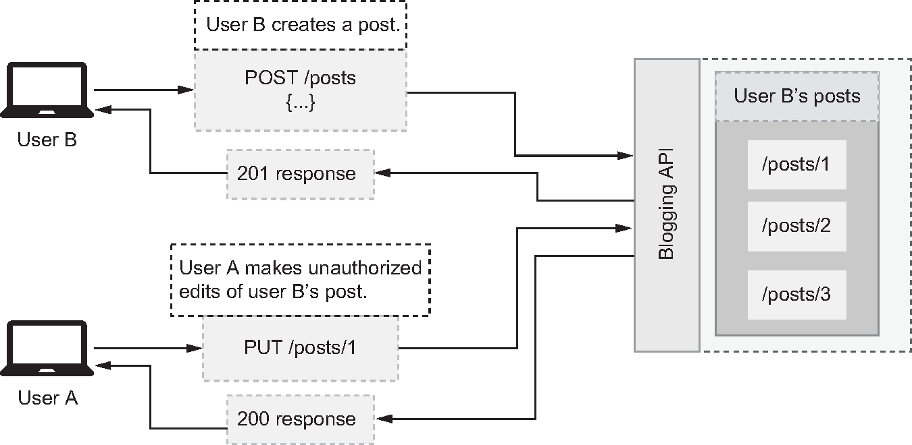
<div style="font-size: 0.55em; color: #999; text-align: center; margin-top: 5px;">図4.1 BOLA より引用</div>
</div>
<div style="flex: 1;">

<div style="background-color: #f5f5f5; padding: 12px; border-radius: 8px; margin-bottom: 10px;">

図の例では、User A が User B の投稿 `/posts/1` に `PUT /posts/1` を送ると 200 が返っています。ログイン済みかは見ていますが、<strong>その投稿の所有者か</strong>を見ていません。

</div>

| 攻撃の段階   | 何が起きるか                           |
| ------------ | -------------------------------------- |
| 正規ログイン | 攻撃者は自分のアカウントでログインする |
| ID差し替え   | `/posts/1` など他人のIDを指定する      |
| 成功条件     | 所有者・テナント確認がなく、200 が返る |

</div>
</div>

<div style="margin-top: 12px; padding: 10px; background-color: #e0e0e0; border-radius: 8px; text-align: center;">
<strong>「IDを知っている」と「操作してよい」は別。</strong>
</div>

</div>

---

## BFLAは機能境界の失敗

<div style="font-size: 0.72em;">

<div style="background-color: #f5f5f5; padding: 12px; border-radius: 8px; margin-bottom: 12px;">

<strong>BFLA (Broken Function Level Authorization)</strong> は、攻撃者が一般ユーザーの権限で、UIに出ていない管理者APIや内部APIを直接呼ぶ攻撃です。

</div>

<div style="display: flex; gap: 16px; align-items: center;">
<div style="width: 46%;">
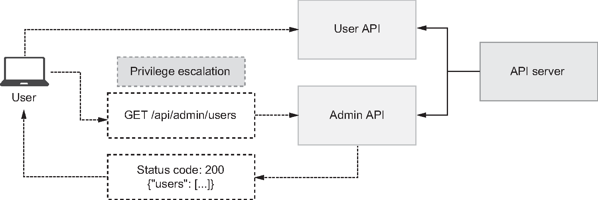
<div style="font-size: 0.55em; color: #999; text-align: center; margin-top: 5px;">図4.14 BFLA より引用</div>
</div>
<div style="flex: 1;">

<div style="background-color: #f5f5f5; padding: 12px; border-radius: 8px; margin-bottom: 10px;">

図の例では、一般ユーザーが `GET /api/admin/users` を直接呼ぶと、Admin API が 200 とユーザー一覧を返しています。URLは隠れていても、<strong>サーバー側のロール確認</strong>がなければ実行されます。

</div>

| 攻撃の段階   | 何が起きるか                               |
| ------------ | ------------------------------------------ |
| URL発見      | DevTools、OpenAPI、推測で管理APIを見つける |
| 直接呼び出し | 一般ユーザーのトークンで管理APIを叩く      |
| 成功条件     | 機能ごとのロール確認がなく、200 が返る     |

</div>
</div>

<div style="margin-top: 12px; padding: 10px; background-color: #e0e0e0; border-radius: 8px; text-align: center;">
<strong>「URLを知っている」と「機能を使ってよい」は別。</strong>
</div>

</div>

---

## IDORは認可境界の失敗

<div style="font-size: 0.7em;">

<div style="display: flex; gap: 15px; align-items: center; margin-bottom: 10px;">
<div style="width: 38%;">
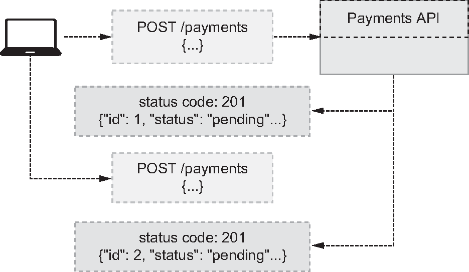
<div style="font-size: 0.55em; color: #999; text-align: center; margin-top: 5px;">図6.4 予測可能なID より引用</div>
</div>
<div style="flex: 1;">

<div style="background-color: #f5f5f5; padding: 12px; border-radius: 8px; margin-bottom: 10px;">

IDORは、他人のオブジェクトIDを指定するとアクセスできてしまう問題です。APIの文脈ではBOLAとして扱われます。

</div>

### 防ぐためのレビュー観点

| 観点           | 問い                                                 |
| -------------- | ---------------------------------------------------- |
| 所有者検証     | このリソースは現在のユーザーのものか                 |
| テナント境界   | 組織ID、プロジェクトID、ワークスペースIDを跨げないか |
| 操作ごとの認可 | 一覧、詳細、更新、削除で同じ強さの検証があるか       |

</div>
</div>

<div style="margin-top: 10px; padding: 10px; background-color: #e0e0e0; border-radius: 8px; text-align: center;">
<strong>UUIDにしても認可は不要にならない。</strong>
</div>

</div>

---

## マスアサインメントはモデル境界の失敗

<div style="font-size: 0.72em;">

<div style="background-color: #f5f5f5; padding: 12px; border-radius: 8px; margin-bottom: 10px;">

<strong>マスアサインメント</strong> は、攻撃者が画面にないフィールドをJSONへ追加し、アプリがそれをそのまま永続化モデルへ反映してしまう攻撃です。

</div>

```javascript
// 攻撃者が { "is_admin": true } を混ぜると反映される可能性がある
await User.update(req.body);

// 安全: 入力DTOを明示し、許可フィールドだけを使う
await User.update({
  name: req.body.name,
  email: req.body.email,
});
```

<div style="margin-top: 14px; padding: 12px; background-color: #e0e0e0; border-radius: 8px; text-align: center;">
<strong>入力モデル、出力モデル、永続化モデルを同一視しない。</strong>
</div>

</div>

---

## SSRFは通信境界の失敗

<div style="font-size: 0.7em;">

<div style="display: flex; gap: 15px; align-items: center; margin-bottom: 10px;">
<div style="width: 38%;">
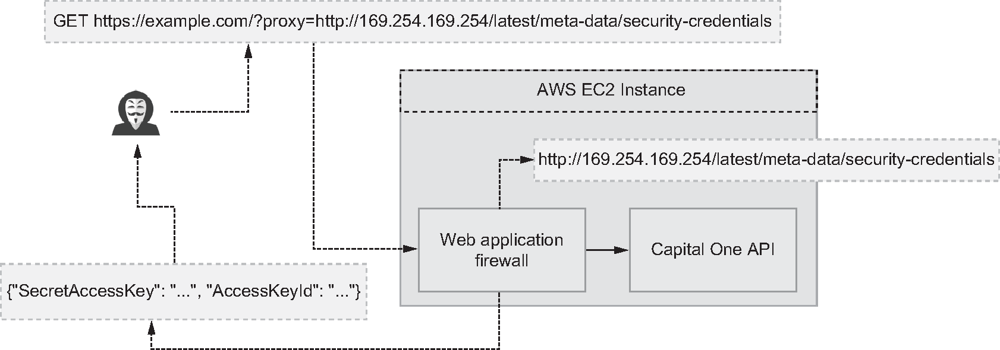
<div style="font-size: 0.55em; color: #999; text-align: center; margin-top: 5px;">図5.5 Capital OneへのSSRF攻撃 より引用</div>
</div>
<div style="flex: 1; background-color: #f5f5f5; padding: 10px; border-radius: 8px;">

SSRFは、サーバーに外部URLへアクセスさせる機能を悪用して、本来外から届かない内部ネットワークやメタデータサービスへ到達する攻撃です。

</div>
</div>

### 攻撃の段階

| 段階         | 何が起きるか                             |
| ------------ | ---------------------------------------- |
| URL指定      | 攻撃者が内部向けURLやメタデータURLを送る |
| サーバー取得 | アプリのサーバーが代わりにアクセスする   |
| 越境         | 外部から届かない内部情報へ到達する       |

</div>

---

## 設定ミスは防御境界を無効化する

<div style="font-size: 0.72em;">

<div style="background-color: #f5f5f5; padding: 12px; border-radius: 8px; margin-bottom: 10px;">

コードが正しくても、設定で防御は崩れます。CORS、Cookie、CSP、エラー出力、クラウド権限、デバッグモード、デフォルトアカウントは、実装レビューだけでは見逃しやすい領域です。

</div>

| 領域     | 典型的な失敗                                                  |
| -------- | ------------------------------------------------------------- |
| CORS     | `Access-Control-Allow-Origin: *` と認証情報を雑に組み合わせる |
| Cookie   | `Secure`、`HttpOnly`、`SameSite` を環境ごとに崩す             |
| エラー   | スタックトレース、内部URL、SQL、環境変数を返す                |
| クラウド | ストレージ公開、広すぎるIAM、デバッグ用ポート                 |

<div style="margin-top: 10px; padding: 10px; background-color: #e0e0e0; border-radius: 8px; text-align: center;">
<strong>設定はコードと同じくレビュー対象である。</strong>
</div>

</div>

---

## 依存関係は信頼の継承である

<div style="font-size: 0.75em;">

<div style="background-color: #f5f5f5; padding: 15px; border-radius: 8px; margin-bottom: 14px;">

ライブラリを使うことは、そのメンテナ、配布経路、ビルドプロセス、推移的依存関係を信頼することです。OWASP Top 10:2025でSoftware Supply Chain Failuresが上位に入ったのは、この境界が現代のWeb開発で太くなったからです。

</div>

<div style="display: flex; gap: 15px; align-items: center;">
<div style="flex: 1; background-color: #f5f5f5; padding: 12px; border-radius: 8px;">

<strong>見るもの</strong>

lockfile、署名、依存更新、SBOM、CI/CD権限、公開パッケージ名。

</div>
<div style="flex: 1; background-color: #f5f5f5; padding: 12px; border-radius: 8px;">

<strong>避けるもの</strong>

未固定バージョン、放置された依存、検証されない生成物、広すぎるCI権限。

</div>
</div>

</div>

---

## サプライチェーンで確認すること

<div style="font-size: 0.72em;">

<div style="background-color: #f5f5f5; padding: 12px; border-radius: 8px; margin-bottom: 12px;">

サプライチェーン対応は「脆弱性スキャンを入れる」だけでは足りません。<strong>何を取り込み、誰がビルドし、どの成果物を本番へ出したか</strong>を追跡できる状態にします。

</div>

| 境界                    | 確認すること                                   | 残すもの                 |
| ----------------------- | ---------------------------------------------- | ------------------------ |
| <strong>依存</strong>   | lockfile固定、不要依存の削除、更新PRのレビュー | lockfile、更新履歴       |
| <strong>取得</strong>   | typo-squatting、公開パッケージ名、署名の確認   | package設定、例外承認    |
| <strong>ビルド</strong> | 公式CI、secret最小化、生成物の改ざん防止       | CIログ、スキャン結果     |
| <strong>配布</strong>   | SBOM、成果物の署名、本番投入条件               | SBOM、署名、リリース記録 |

<div style="margin-top: 12px; padding: 10px; background-color: #e0e0e0; border-radius: 8px; text-align: center;">
<strong>依存を入れる判断と、本番へ出す成果物を同じ証跡でつなぐ。</strong>
</div>

</div>

---

## ツールが苦手なのは意味の検証

<div style="font-size: 0.75em;">

<div style="background-color: #f5f5f5; padding: 15px; border-radius: 8px; margin-bottom: 14px;">

SASTやDASTは強力ですが、見ているのは主に構文、既知パターン、通信上の反応です。「この主体が、この状態のリソースに、この操作をしてよいか」はアプリケーション固有の意味なので、別の判断軸が必要です。

</div>

<div style="display: flex; gap: 15px; align-items: center;">
<div style="flex: 1; background-color: #f5f5f5; padding: 13px; border-radius: 8px;">

<strong>ツールが得意</strong>

危険な関数、既知CVE、ヘッダー不足、単純な入力パターン。

</div>
<div style="flex: 1; background-color: #f5f5f5; padding: 13px; border-radius: 8px;">

<strong>人間が見る</strong>

所有者、ロール、テナント、承認フロー、金額、回数、状態遷移。

</div>
</div>

<div style="margin-top: 16px; padding: 12px; background-color: #e0e0e0; border-radius: 8px; text-align: center;">
<strong>ツールは「怪しい形」を拾う。人間は「許されない意味」を決める。</strong>
</div>

</div>

---

## ビジネスロジックはツールが苦手

<div style="font-size: 0.75em;">

<div style="background-color: #f5f5f5; padding: 15px; border-radius: 8px; margin-bottom: 14px;">

割引率、ポイント、在庫、返金、招待、承認ワークフロー。こうしたビジネスルールの欠陥は、SASTやDASTだけでは見つけにくい。

</div>

攻撃者は「不正な文字列」だけを送るわけではありません。正しい形式のリクエストを、正しくない順序、正しくない回数、正しくない組み合わせで送ります。

<div style="margin-top: 16px; padding: 12px; background-color: #e0e0e0; border-radius: 8px; text-align: center;">
<span style="color: #e65100; font-weight: bold;">仕様通りに動く脆弱性が、いちばんレビューしづらい。</span>
</div>

</div>

---

## 壊れ方から設計へ戻る

<div style="font-size: 0.75em;">

<div style="background-color: #f5f5f5; padding: 18px; border-radius: 8px;">

ここまで見たXSS、CSRF、Injection、IDOR、SSRF、設定ミス、依存関係、ビジネスロジックは、別々のチェックリスト項目ではありません。

どれも「どこを信頼しないか」「誰に何を許すか」「どの入力を命令として解釈しないか」「失敗時にどう閉じるか」が曖昧だった結果です。

つまり、脆弱性名は入口でしかありません。設計へ戻り、主体、対象、操作、入力、出力、証跡のどれが破れたのかを不変条件として残します。

</div>

<div style="margin-top: 16px; padding: 12px; background-color: #e0e0e0; border-radius: 8px; text-align: center;">
<strong>次は、HTTPの公開面を使って、Web全体の境界を確認する。</strong>
</div>

</div>

---

## HTTPの公開面で全体を確認する

<div style="font-size: 0.75em;">

<div style="background-color: #f5f5f5; padding: 15px; border-radius: 8px; margin-bottom: 14px;">

ここまで見た脆弱性は、入力、出力、認可、状態、通信、設定、依存、運用のどこかの境界が壊れた結果として現れます。

APIを別枠にする必要はありません。ここではAPIを、Webアプリケーションの境界が露出するHTTPの入口として使います。SPA、管理画面、モバイル、外部連携、Webhook、バッチ起動は、最後にリクエスト、イベント、ジョブとしてサーバーへ届きます。

</div>

<div style="display: flex; gap: 15px; align-items: stretch;">
<div style="flex: 1; background-color: #f5f5f5; padding: 13px; border-radius: 8px;">

<strong>UIの導線</strong>

ユーザー体験としては重要。ただし表示されないボタンや無効化されたフォームは、防御境界にはならない。

</div>
<div style="flex: 1; background-color: #f5f5f5; padding: 13px; border-radius: 8px;">

<strong>HTTP・イベントの入口</strong>

攻撃者もAIも直接触れる場所。認証、認可、入力、監査、レート制限が集まる。

</div>
</div>

<div style="margin-top: 16px; padding: 12px; background-color: #e0e0e0; border-radius: 8px; text-align: center;">
<strong>APIを特別扱いしない。HTTPの入口で、Web全体の境界を見直す。</strong>
</div>

</div>

---

<!--
_backgroundColor: #0a1929
_color: white
_class: transition
-->

<div style="display: flex; flex-direction: column; justify-content: center; align-items: center; height: 80%; text-align: center;">

<div style="font-size: 1.5em; font-weight: bold;">

# HTTPの公開面で確認する

</div>

<strong>APIを中心にせず、境界が露出する場所として使う</strong>

</div>

---

## 設計・実装・インフラをそろえる

<div style="font-size: 0.7em;">

<div style="display: flex; gap: 15px; align-items: center; margin-bottom: 10px;">
<div style="width: 38%;">
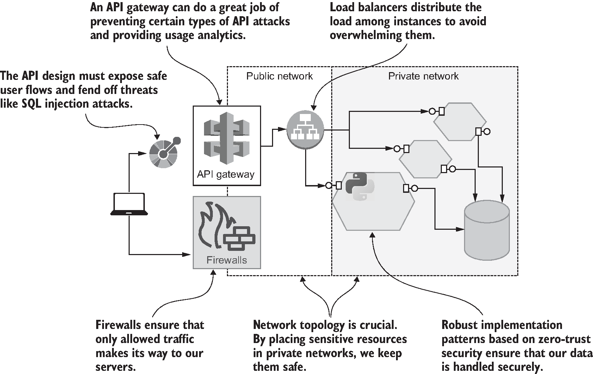
<div style="font-size: 0.55em; color: #999; text-align: center; margin-top: 5px;">図1.1 APIセキュリティの構成要素 より引用</div>
</div>
<div style="flex: 1; background-color: #f5f5f5; padding: 12px; border-radius: 8px;">

『Secure APIs』で強調されるのは、入口の認証だけでは足りないという点です。これはAPI専用の話ではありません。Webの公開面は、<strong>設計、実装、インフラ</strong>の3軸がそろってはじめて守れます。

</div>
</div>

| 軸       | Web全体で見るもの                                             |
| -------- | ------------------------------------------------------------- |
| 設計     | URL、リソース、画面遷移、認可境界、業務フロー、失敗時の閉じ方 |
| 実装     | 認証検証、入力検証、出力制御、エラー処理、ライブラリ設定      |
| インフラ | WAF、ゲートウェイ、CDN、レート制限、ネットワーク、監視        |

</div>

---

## 認証・認可・入力は分けて見る

<div style="font-size: 0.72em;">

<div style="background-color: #f5f5f5; padding: 15px; border-radius: 8px; margin-bottom: 14px;">

レビューで「認証はある」「バリデーションしている」と言えても、それだけでは境界を守ったことになりません。ログインできること、形式が正しいこと、対象を操作してよいことは別の判断です。

</div>

<div style="display: flex; gap: 15px; align-items: stretch;">
<div style="flex: 1; background-color: #f5f5f5; padding: 12px; border-radius: 8px;">

<strong>認証</strong>

誰か。セッション、トークン、発行者、期限、MFA、失効。

</div>
<div style="flex: 1; background-color: #f5f5f5; padding: 12px; border-radius: 8px;">

<strong>認可</strong>

誰が、どのテナントの、どのリソースに、何をしてよいか。

</div>
<div style="flex: 1; background-color: #f5f5f5; padding: 12px; border-radius: 8px;">

<strong>入力・出力</strong>

型、長さ、禁止フィールド、追加プロパティ、返してよい情報。

</div>
</div>

<div style="margin-top: 16px; padding: 12px; background-color: #e0e0e0; border-radius: 8px; text-align: center;">
<strong>ログイン済み・形式OK・表示されない、は防御の代わりにならない。</strong>
</div>

</div>

---

## 認可は文脈まで書く

<div style="font-size: 0.72em;">

<div style="background-color: #f5f5f5; padding: 12px; border-radius: 8px; margin-bottom: 12px;">

「認可を確認する」と書くだけでは、AI利用時にも人間レビューにも粗すぎます。少なくとも主体、対象、操作、文脈に分けると、BOLA、BFLA、IDOR、管理者機能の越境を同じ構造で見られます。

</div>

| 観点                  | 問い               | 壊れ方                             |
| --------------------- | ------------------ | ---------------------------------- |
| <strong>主体</strong> | 誰が操作しているか | 別ユーザーとして扱われる           |
| <strong>対象</strong> | どのリソースか     | 他人のデータを読む                 |
| <strong>操作</strong> | 何をしてよいか     | 管理者機能を実行する               |
| <strong>文脈</strong> | どの組織・状態か   | 別テナントや完了済み注文を変更する |

<div style="margin-top: 12px; padding: 10px; background-color: #e0e0e0; border-radius: 8px; text-align: center;">
<strong>認可は「誰が何を」だけでなく、「どの文脈で」まで不変条件にする。</strong>
</div>

</div>

---

## 契約にするものはOpenAPIだけではない

<div style="font-size: 0.7em;">

<div style="display: flex; gap: 15px; align-items: center; margin-bottom: 10px;">
<div style="width: 38%;">
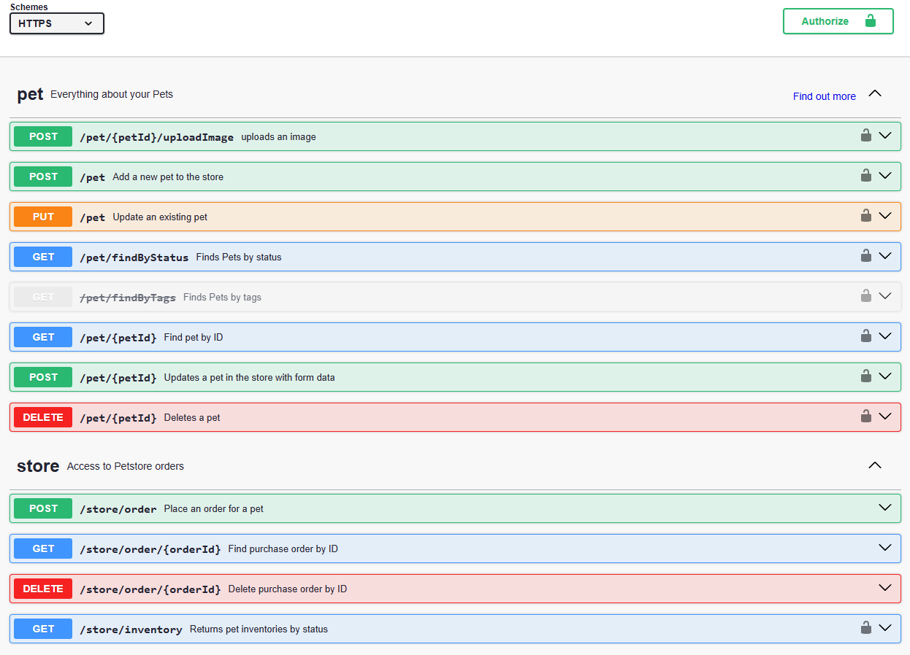
<div style="font-size: 0.55em; color: #999; text-align: center; margin-top: 5px;">Figure 3-1. Swagger UI より引用</div>
</div>
<div style="flex: 1;">

<div style="background-color: #f5f5f5; padding: 12px; border-radius: 8px; margin-bottom: 10px;">

OpenAPIは分かりやすい契約の例です。ただし契約にするべきものはAPI仕様だけではありません。画面、権限、イベント、ログ、リリース条件も、変更時に破ってはいけない境界です。

</div>

| 契約                              | 何を固定するか                   |
| --------------------------------- | -------------------------------- |
| <strong>UIルート</strong>         | 表示してよい画面、遷移、操作     |
| <strong>OpenAPI / schema</strong> | 入力、出力、認証要件、エラー形式 |
| <strong>権限表</strong>           | ロール、所有者、テナント、状態   |
| <strong>ログ・イベント名</strong> | 観測できる振る舞い、監査証跡     |

</div>
</div>

<div style="margin-top: 12px; padding: 10px; background-color: #e0e0e0; border-radius: 8px; text-align: center;">
<strong>仕様は説明書ではなく、検証と変更の境界になる。</strong>
</div>

</div>

---

## 境界ごとに置く防御は違う

<div style="font-size: 0.68em;">

<div style="background-color: #f5f5f5; padding: 12px; border-radius: 8px; margin-bottom: 12px;">

「WAFを入れる」「ゲートウェイで守る」「アプリでチェックする」は競合ではありません。ブラウザ、HTTP入口、アプリ、DB、運用のどこで判断するかを設計します。

</div>

<div style="display: flex; gap: 15px; align-items: center;">
<div style="width: 34%;">
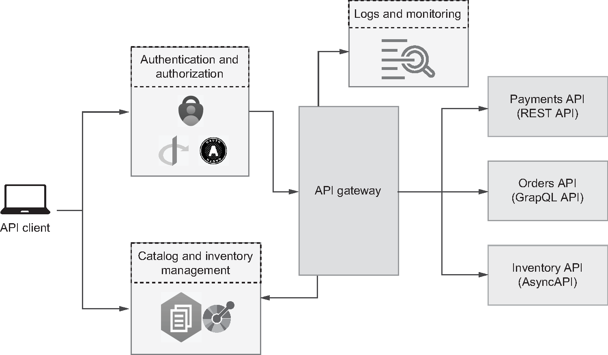
<div style="font-size: 0.55em; color: #999; text-align: center; margin-top: 5px;">図9.1 API Gateway より引用</div>
</div>
<div style="flex: 1;">

| 防御の場所                | 得意なこと                           | 苦手なこと               |
| ------------------------- | ------------------------------------ | ------------------------ |
| <strong>ブラウザ</strong> | SameSite、CSP、CORS、入力補助        | サーバー側の認可判断     |
| <strong>入口</strong>     | 認証前の遮断、レート制限、粗い制御   | 業務ルールの判断         |
| <strong>アプリ</strong>   | 所有者、状態、ロール、テナントの判断 | 横断的な入口統制         |
| <strong>運用</strong>     | 異常検知、棚卸し、追跡               | リクエスト単位の即時拒否 |

</div>
</div>

<div style="margin-top: 12px; padding: 10px; background-color: #e0e0e0; border-radius: 8px; text-align: center;">
<strong>どこで防ぐかを決めることも設計である。</strong>
</div>

</div>

---

## 入口は棚卸しして観測する

<div style="font-size: 0.75em;">

<div style="display: flex; gap: 15px; align-items: center; margin-bottom: 10px;">
<div style="width: 38%;">
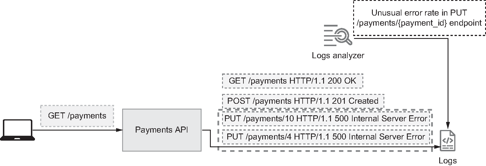
<div style="font-size: 0.55em; color: #999; text-align: center; margin-top: 5px;">図11.1 APIセキュリティのためのオブザーバビリティ より引用</div>
</div>
<div style="flex: 1;">

公開面は増えます。Webルート、管理画面、古いフォーム、Webhook、外部連携、移行中のAPI、検証用エンドポイント。存在を知らない入口には、認証も認可も監視も届きません。

</div>
</div>

<div style="display: flex; gap: 15px; align-items: stretch;">
<div style="flex: 1; background-color: #f5f5f5; padding: 12px; border-radius: 8px;">
把握されていない入口を見つける。
</div>
<div style="flex: 1; background-color: #f5f5f5; padding: 12px; border-radius: 8px;">
異常な失敗率、認可エラー、未知のパスを観測する。
</div>
<div style="flex: 1; background-color: #f5f5f5; padding: 12px; border-radius: 8px;">
廃止、例外承認、責任者、期限を残す。
</div>
</div>

<div style="margin-top: 12px; padding: 10px; background-color: #e0e0e0; border-radius: 8px; text-align: center;">
<strong>存在を知らない入口は、認証も認可も監視もできない。</strong>
</div>

</div>

---

## 攻撃者の操作条件でテストする

<div style="font-size: 0.72em;">

<div style="display: flex; gap: 15px; align-items: center; margin-bottom: 10px;">
<div style="width: 38%;">
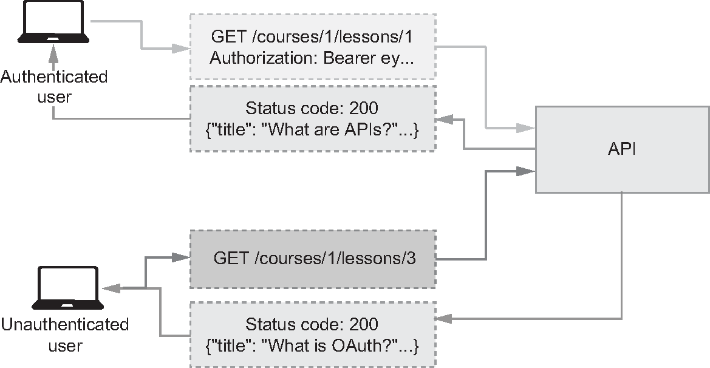
<div style="font-size: 0.55em; color: #999; text-align: center; margin-top: 5px;">図12.1 APIセキュリティテスト戦略 より引用</div>
</div>
<div style="flex: 1; background-color: #f5f5f5; padding: 12px; border-radius: 8px;">

セキュリティテストは、ユニットテスト、契約テスト、SAST、DAST、ファズ、手動レビューを組み合わせます。特に認可は、複数ユーザー、複数ロール、複数テナントで、同じ操作が通る条件と落ちる条件を対にして確認します。

</div>
</div>

<div style="margin-top: 10px; padding: 10px; background-color: #e0e0e0; border-radius: 8px; text-align: center;">
<strong>正常系だけのテストは、攻撃者の入力を代表しない。</strong>
</div>

</div>

---

## 全体感に戻す

<div style="font-size: 0.75em;">

<div style="background-color: #f5f5f5; padding: 18px; border-radius: 8px;">

ここではHTTPの入口を使って確認しました。私が『Secure APIs』の翻訳者なので、API由来の語彙や図も使っています。ただし持ち帰りはAPI専用の話ではありません。

HTTPの入口は、ブラウザ、API、Webhook、バッチ、外部連携が最後にサーバーへ届く収束点です。ここで境界を確認できると、Web全体の設計判断をコード、CI、ログ、運用へ同じ条件として流せます。

</div>

<div style="margin-top: 16px; padding: 12px; background-color: #e0e0e0; border-radius: 8px; text-align: center;">
<strong>HTTPで見るのは入口ではなく、入口に集約された設計判断である。</strong>
</div>

</div>

---

## 検証できる形で残すもの

<div style="font-size: 0.72em;">

<div style="background-color: #f5f5f5; padding: 12px; border-radius: 8px; margin-bottom: 12px;">

AI利用時にも人間レビューにも伝わる形にするなら、セキュリティ要件は「気をつける」では足りません。レビューで読めて、CIで落とせて、運用で例外を追える粒度で書きます。

</div>

| 残すもの                            | 書き方                                           |
| ----------------------------------- | ------------------------------------------------ |
| <strong>認可表</strong>             | ロール、所有者、テナント、操作を表にする         |
| <strong>入力契約</strong>           | schema、最大値、禁止フィールド、追加プロパティ   |
| <strong>出力契約</strong>           | 返してよいPII、内部フィールド、エラー形式        |
| <strong>運用・リリース条件</strong> | ログ、監査、スキャン結果、例外承認、ロールバック |

<div style="margin-top: 12px; padding: 10px; background-color: #e0e0e0; border-radius: 8px; text-align: center;">
<strong>「ちゃんとやる」を、試せて、落とせて、例外が残る文に変える。</strong>
</div>

</div>

---

## 運用するとは更新し続けること

<div style="font-size: 0.72em;">

<div style="background-color: #f5f5f5; padding: 12px; border-radius: 8px; margin-bottom: 12px;">

OWASP SAMMは、ソフトウェアセキュリティをGovernance、Design、Implementation、Verification、Operationsの5つで扱います。つまり、ルールを書くことは始まりで、運用して更新し続けるところまでがセキュリティです。

</div>

<div style="display: flex; gap: 15px; align-items: center;">
<div style="flex: 1; background-color: #f5f5f5; padding: 13px; border-radius: 8px;">

<strong>置き場所</strong>

設計書、ADR、OpenAPI、PRテンプレート、AI向けルール、CI設定。

</div>
<div style="flex: 1; background-color: #f5f5f5; padding: 13px; border-radius: 8px;">

<strong>更新タイミング</strong>

新機能、権限追加、外部連携、インシデント、レビューでの発見。

</div>
</div>

<div style="margin-top: 16px; padding: 12px; background-color: #e0e0e0; border-radius: 8px; text-align: center;">
<strong>ルールは差分で腐る。更新される場所に置く。</strong>
</div>

<div style="font-size: 0.5em; color: #999; text-align: right; margin-top: 4px;">
参照: OWASP SAMM / NCSC Guidelines for secure AI system development
</div>

</div>

---

## デプロイも信頼境界である

<div style="font-size: 0.7em;">

<div style="display: flex; gap: 15px; align-items: center; margin-bottom: 10px;">
<div style="width: 42%;">
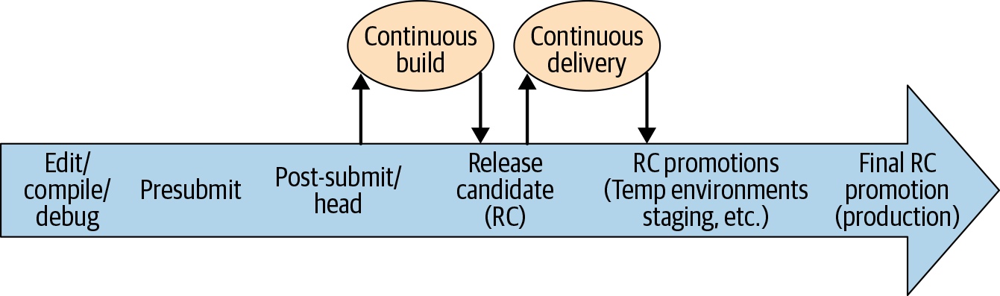
<div style="font-size: 0.55em; color: #999; text-align: center; margin-top: 5px;">Figure 23-2. Life of a code change with CB and CD より引用</div>
</div>
<div style="flex: 1;">

<div style="background-color: #f5f5f5; padding: 10px; border-radius: 8px; margin-bottom: 8px;">

AI生成コードの量が増えるほど、「何が、どこから、どの検証を通って、本番へ出たか」を追跡できない変更がリスクになります。デプロイパイプラインもWebセキュリティの境界です。

</div>

| 境界                    | 確認すること                                         |
| ----------------------- | ---------------------------------------------------- |
| <strong>変更</strong>   | レビュー済みか、権限変更や設定変更を含むか           |
| <strong>成果物</strong> | 公式CIでビルドされ、依存とスキャン結果を追跡できるか |
| <strong>環境</strong>   | 本番へ出してよいポリシーを満たすか                   |

</div>
</div>

<div style="margin-top: 12px; padding: 10px; background-color: #e0e0e0; border-radius: 8px; text-align: center;">
<strong>AI生成コードでも、本番へ出す判断はポリシーで縛る。</strong>
</div>

<div style="font-size: 0.5em; color: #999; text-align: right; margin-top: 4px;">
参照: Software Engineering at Google, Chapter 23 / Building Secure & Reliable Systems, Chapter 14
</div>

</div>

---

<!--
_backgroundColor: #0a1929
_color: white
_class: transition
-->

<div style="display: flex; flex-direction: column; justify-content: center; align-items: center; height: 80%; text-align: center;">

<div style="font-size: 1.5em; font-weight: bold;">

# 現場で使うレビューの問い

</div>

<strong>境界を不変条件にし、AIとCIで検証する</strong>

</div>

---

## レビューは入口から順に見る

<div style="font-size: 0.75em;">

<div style="background-color: #f5f5f5; padding: 15px; border-radius: 8px; margin-bottom: 14px;">

最後に、今日の話をレビューの順番へ落とします。全部を同時に見るのではなく、入口から順に追うと確認漏れを減らせます。

</div>

<div style="display: flex; gap: 12px; align-items: center;">
<div style="flex: 1; background-color: #f5f5f5; padding: 11px; border-radius: 8px;">

<strong>1. 入口</strong><br>
どこから届くか

</div>
<div style="flex: 1; background-color: #f5f5f5; padding: 11px; border-radius: 8px;">

<strong>2. 身元</strong><br>
誰として扱うか

</div>
<div style="flex: 1; background-color: #f5f5f5; padding: 11px; border-radius: 8px;">

<strong>3. 権限</strong><br>
何を許すか

</div>
<div style="flex: 1; background-color: #f5f5f5; padding: 11px; border-radius: 8px;">

<strong>4. 結果</strong><br>
何を返し記録するか

</div>
</div>

<div style="margin-top: 16px; padding: 12px; background-color: #e0e0e0; border-radius: 8px; text-align: center;">
<strong>入口から結果まで、境界をまたぐたびに確認する。</strong>
</div>

</div>

---

## 設計レビューで聞くこと

<div style="font-size: 0.72em;">

<div style="background-color: #f5f5f5; padding: 12px; border-radius: 8px; margin-bottom: 10px;">

設計段階では、実装の細部よりも「境界」と「失敗時の挙動」を確認します。ここで決めないと、後でコードがばらばらに判断を持ち始めます。

</div>

| 問い                             | 見るもの                                       |
| -------------------------------- | ---------------------------------------------- |
| 何を信頼しない前提にするか       | ユーザー入力、外部API、Webhook、トークン       |
| 誰が何にアクセスできるか         | ロール、所有者、テナント、管理者操作           |
| 失敗時にどう閉じるか             | デフォルト拒否、エラー、再試行、タイムアウト   |
| 自動化するセキュリティ条件は何か | コーディングルール、禁止事項、契約、テスト条件 |

<div style="margin-top: 10px; padding: 10px; background-color: #e0e0e0; border-radius: 8px; text-align: center;">
<strong>残す先: Design Docsに境界、ADRに判断理由、Playbooksに失敗時対応。</strong>
</div>

</div>

---

## 実装レビューで聞くこと

<div style="font-size: 0.7em;">

<div style="background-color: #f5f5f5; padding: 12px; border-radius: 8px; margin-bottom: 10px;">

実装レビューでは、境界がコード上のどこで実際に検証されているかを見ます。方針が正しくても、各ハンドラに散ると抜けます。

</div>

<div style="display: flex; gap: 16px; align-items: center;">
<div style="width: 34%;">

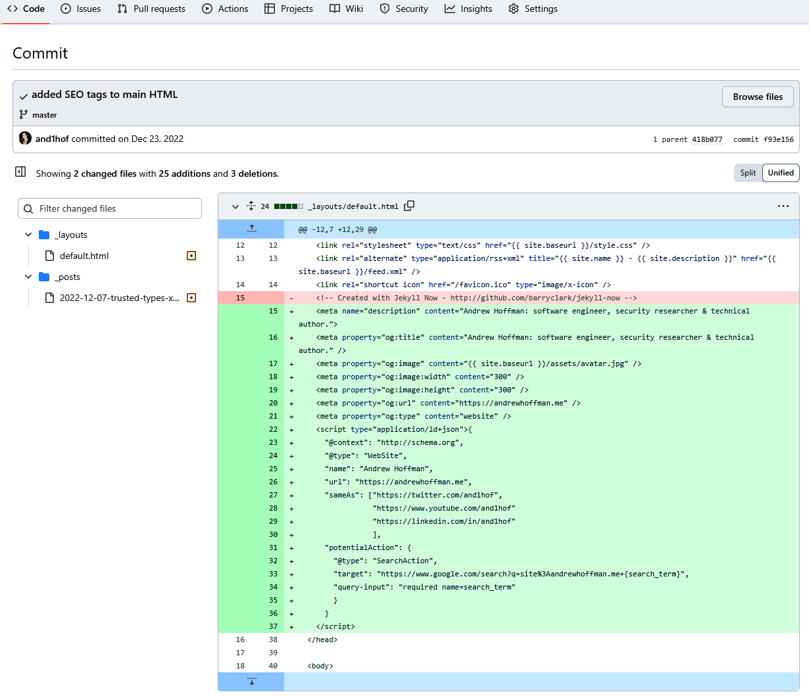
<div style="font-size: 0.55em; color: #999; text-align: center; margin-top: 5px;">Figure 25-1. Web-based collaboration tools for code reviews より引用</div>

</div>
<div style="flex: 1;">

| 問い                             | 見るもの                                       |
| -------------------------------- | ---------------------------------------------- |
| 入力は契約に沿っているか         | DTO、schema、OpenAPI、追加フィールド拒否       |
| 出力は必要最小限か               | レスポンスモデル、PII、内部フィールド          |
| 認可は一元化されているか         | middleware、policy、decorator、deny by default |
| AI生成コードを素通ししていないか | 差分、依存追加、エラー処理、セキュリティ例外   |

</div>
</div>

<div style="margin-top: 10px; padding: 10px; background-color: #e0e0e0; border-radius: 8px; text-align: center;">
<strong>残す先: OpenAPI/schema、ADR、PRテンプレート、Playbooks。</strong>
</div>

</div>

---

## テストで聞くこと

<div style="font-size: 0.72em;">

<div style="background-color: #f5f5f5; padding: 12px; border-radius: 8px; margin-bottom: 10px;">

セキュリティテストは「悪い文字列を送る」だけではありません。別ユーザー、別ロール、別テナント、異常な順序、異常な回数を試します。

</div>

| 問い                           | テスト例                                  |
| ------------------------------ | ----------------------------------------- |
| 他人のIDで読めないか           | user Aのトークンでuser Bのリソースを読む  |
| 管理者APIを叩けないか          | 一般ロールで管理者エンドポイントへ送る    |
| 想定外フィールドを拒否するか   | `is_admin`、`price`、`tenant_id` を混ぜる |
| AI生成の正常系に偏っていないか | 権限違い、境界値、失敗時、並行実行を足す  |

<div style="margin-top: 10px; padding: 10px; background-color: #e0e0e0; border-radius: 8px; text-align: center;">
<strong>残す先: テストコード、CI条件、レビュー観点、Playbooks。</strong>
</div>

</div>

---

## 運用で聞くこと

<div style="font-size: 0.72em;">

<div style="background-color: #f5f5f5; padding: 12px; border-radius: 8px; margin-bottom: 10px;">

本番運用では、守る対象が変わります。APIが増える。依存が古くなる。権限が増える。検知ルールが古くなる。だから継続的に見る仕組みが必要です。

</div>

| 問い                           | 見るもの                                          |
| ------------------------------ | ------------------------------------------------- |
| APIの棚卸しはできているか      | OpenAPI、Gatewayログ、アクセスログ、Sunset        |
| 重要イベントは検知できるか     | 認可失敗、トークン失敗、rate limit、異常な4xx/5xx |
| AI向けルールは更新されているか | 設計変更、インシデント、レビュー指摘の反映        |
| インシデント時に追えるか       | request id、user id、tenant id、監査ログ          |

<div style="margin-top: 10px; padding: 10px; background-color: #e0e0e0; border-radius: 8px; text-align: center;">
<strong>残す先: Playbooks、検知ルール、棚卸し台帳、例外承認記録。</strong>
</div>

</div>

---

## 明日から変えるならここ

<div style="font-size: 0.75em;">

<div style="background-color: #f5f5f5; padding: 15px; border-radius: 8px; margin-bottom: 14px;">

全部を一度に変える必要はありません。費用対効果が高いのは、失敗したときの被害が大きく、しかも自動検出しづらい境界から固定することです。まず認可と入力契約を不変条件にし、テストとログで継続的に確認できるようにします。

</div>

<div style="display: flex; gap: 15px; align-items: center;">
<div style="flex: 1; background-color: #f5f5f5; padding: 13px; border-radius: 8px;">

<strong>認可表を書く</strong>

「誰が何をできるか」をレビュー可能な表にする。

</div>
<div style="flex: 1; background-color: #f5f5f5; padding: 13px; border-radius: 8px;">

<strong>OpenAPIを検証に使う</strong>

許可フィールド、最大件数、認証要件をCIで落とす。

</div>
<div style="flex: 1; background-color: #f5f5f5; padding: 13px; border-radius: 8px;">

<strong>権限違いをテストする</strong>

正常系の隣に別ユーザー・別ロール・別テナントを置く。

</div>
</div>

</div>

---

## まとめ

<div style="font-size: 0.75em;">

<div style="background-color: #f5f5f5; padding: 18px; border-radius: 8px;">

Webセキュリティは、脆弱性名の暗記ではなく、境界を設計し、検証し、運用で見続ける仕事です。

XSS、CSRF、Injection、IDOR、SSRF、設定ミス、依存関係、ビジネスロジックは、壊れた境界の現れとして整理できます。

後半でAPIを厚めに扱ったのは、私がSecure APIsの翻訳者だからです。そこで見た認可、スキーマ、インベントリ、観測の話は、Webアプリケーション全体で設計、実装、インフラをつないで守るための見方です。

AI時代には、実装ルールやレビュー観点はかなり自動化できます。だからこそ、設計判断とセキュリティ要件を不変条件に落とし、コード、CI、ログ、デプロイに同じ判断条件を適用する。設計が雑なら、自動化は雑な設計を一貫した失敗として再利用します。

</div>

<div style="margin-top: 16px; padding: 12px; background-color: #e0e0e0; border-radius: 8px; text-align: center;">
<span style="color: #e65100; font-weight: bold;">AI時代のセキュリティは、境界を不変条件に変え、検証と証跡で運用すること。</span>
</div>

</div>

---

## 参考資料として見たOWASP

<div style="font-size: 0.75em; margin-top: 0 !important;">

<div style="background-color: #f5f5f5; padding: 16px; border-radius: 8px; margin-top: 0;">

WebアプリケーションとAPIの脆弱性分類、個別対策の確認に使った資料です。

<div style="display: flex; flex-direction: column; gap: 8px; margin-top: 14px; overflow-wrap: anywhere;">
<div><strong>OWASP Top Ten Web Application Security Risks</strong><br><span style="font-size: 0.82em;">https://owasp.org/www-project-top-ten/</span></div>
<div><strong>OWASP Top 10:2025</strong><br><span style="font-size: 0.82em;">https://owasp.org/Top10/2025/en/</span></div>
<div><strong>OWASP API Security Top 10 2023</strong><br><span style="font-size: 0.82em;">https://owasp.org/API-Security/editions/2023/en/0x11-t10/</span></div>
<div><strong>OWASP XSS Prevention Cheat Sheet</strong><br><span style="font-size: 0.82em;">https://cheatsheetseries.owasp.org/cheatsheets/Cross_Site_Scripting_Prevention_Cheat_Sheet.html</span></div>
</div>

</div>

</div>

---

## 参考資料として見た開発プロセス

<div style="font-size: 0.75em; margin-top: 0 !important;">

<div style="background-color: #f5f5f5; padding: 16px; border-radius: 8px; margin-top: 0;">

セキュア開発、成熟度モデル、AI利用時のレビュー観点を確認するために使った資料です。

<div style="display: flex; flex-direction: column; gap: 8px; margin-top: 14px; overflow-wrap: anywhere;">
<div><strong>NIST Secure Software Development Framework</strong><br><span style="font-size: 0.82em;">https://csrc.nist.gov/projects/ssdf</span></div>
<div><strong>OWASP Software Assurance Maturity Model</strong><br><span style="font-size: 0.82em;">https://owaspsamm.org/model/</span></div>
<div><strong>OpenSSF Guide for AI Code Assistant Instructions</strong><br><span style="font-size: 0.82em;">https://best.openssf.org/Security-Focused-Guide-for-AI-Code-Assistant-Instructions.html</span></div>
<div><strong>NCSC Guidelines for secure AI system development</strong><br><span style="font-size: 0.82em;">https://www.ncsc.gov.uk/collection/guidelines-secure-ai-system-development</span></div>
</div>

</div>

</div>

---

## 参考資料として読んだ書籍

<div style="font-size: 0.75em; margin-top: 0 !important;">

<div style="background-color: #f5f5f5; padding: 16px; border-radius: 8px; margin-top: 0;">

<div style="display: flex; flex-direction: column; gap: 8px; margin-top: 0; overflow-wrap: anywhere;">
<div><strong>Building Secure & Reliable Systems</strong><br><span style="font-size: 0.82em;">Google<br>https://google.github.io/building-secure-and-reliable-systems/raw/toc.html</span></div>
<div><strong>Software Engineering at Google</strong><br><span style="font-size: 0.82em;">Titus Winters, Tom Manshreck, Hyrum Wright, O'Reilly Media</span></div>
<div><strong>Web Application Security, 2nd Edition</strong><br><span style="font-size: 0.82em;">Andrew Hoffman, O'Reilly Media, 2024</span></div>
<div><strong>Secure APIs</strong><br><span style="font-size: 0.82em;">Jose Haro Peralta, Manning Publications</span></div>
</div>

</div>

</div>

---

<!--
_backgroundColor: #0a1929
_color: white
_class: title dark
-->


<div class="title" style="text-align: left; margin-top: 100px; margin-left: 80px; padding-left: 0; max-width: 70%;">

# ありがとうございました

### Questions?

</div>

<div class="author-info" style="text-align: left; padding-left: 0; text-indent: 0;">
@nwiizo
</div>
