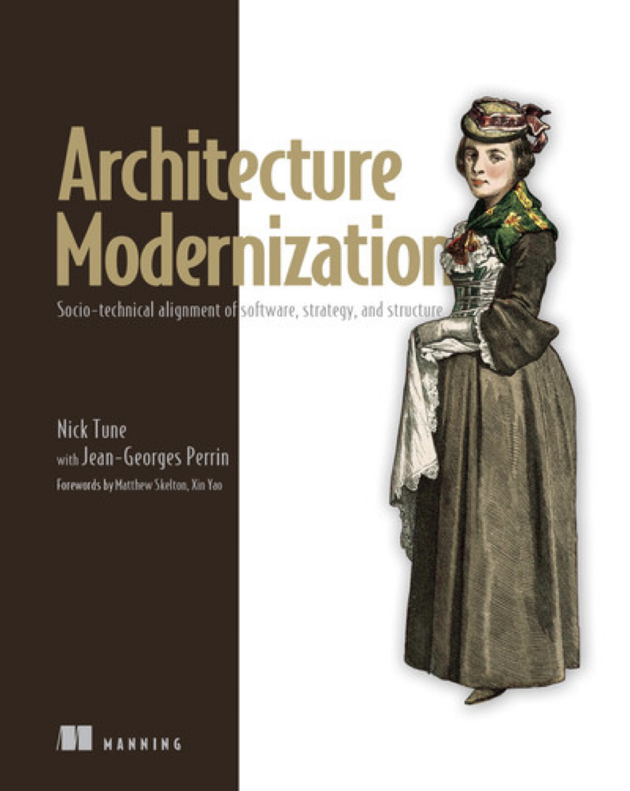
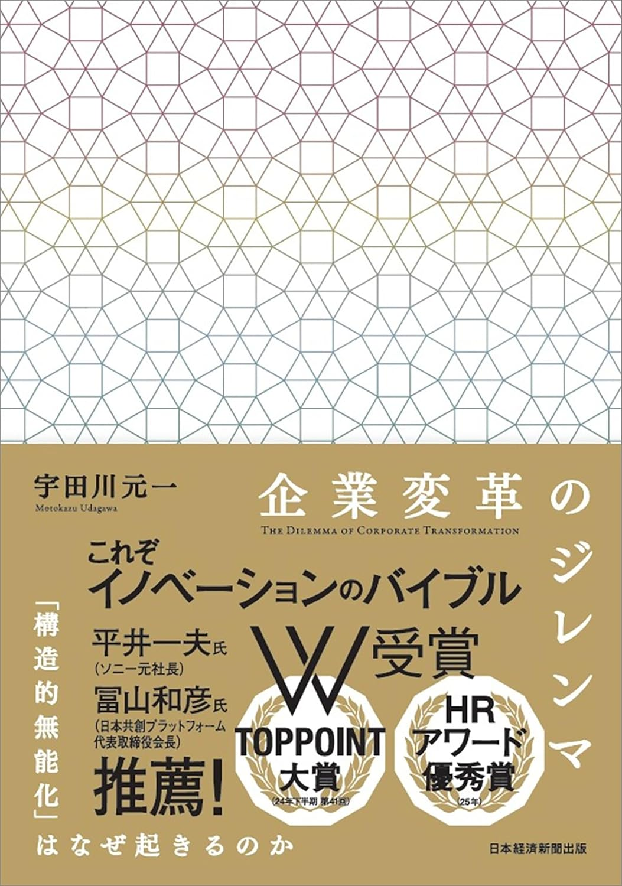
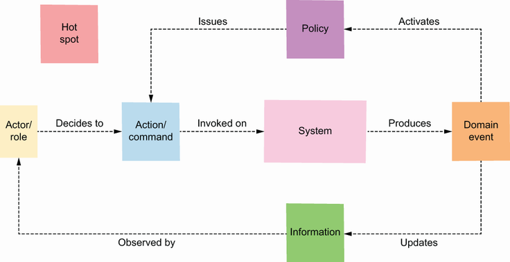
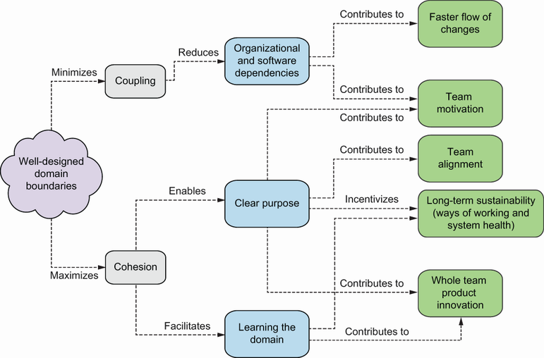
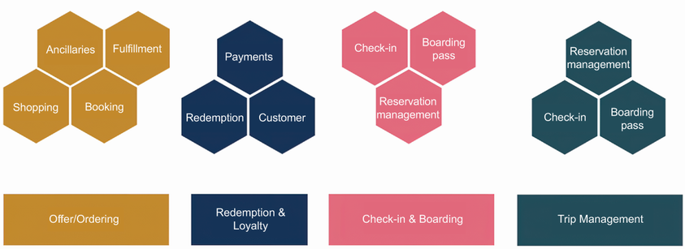
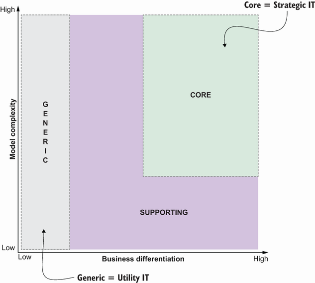
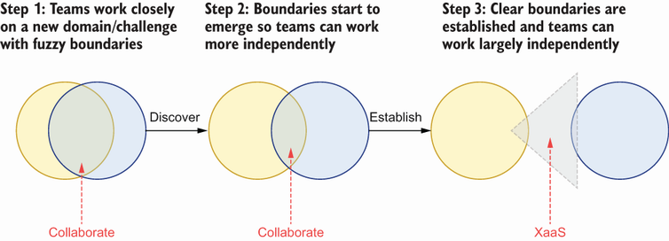
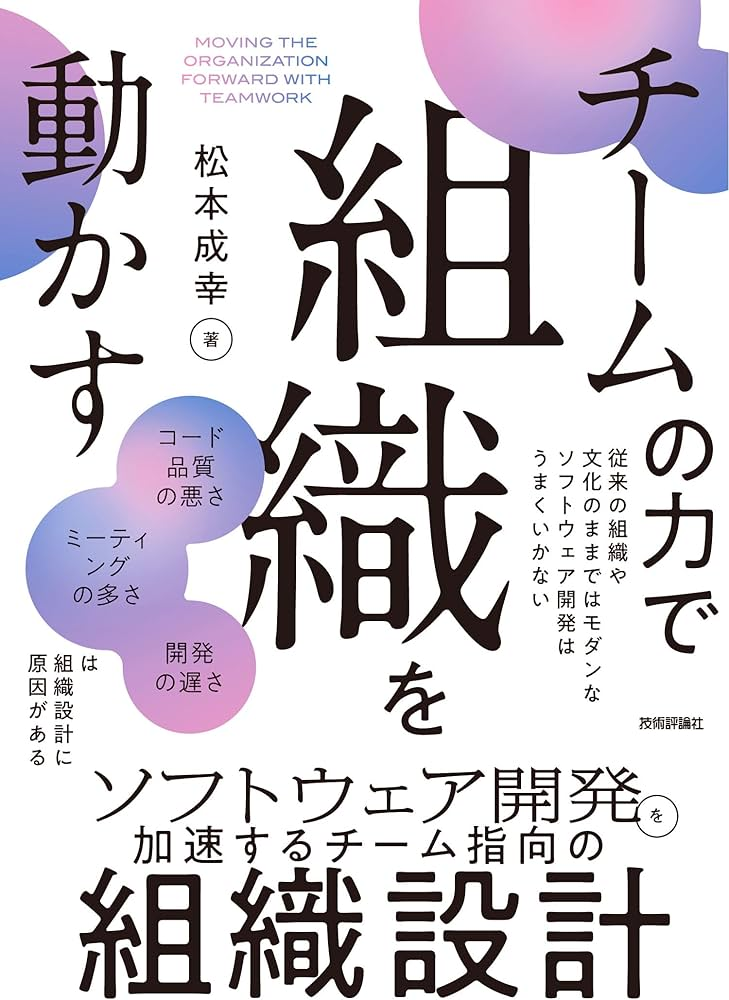

<!--
_backgroundColor: #0a1929
_color: white
_class: title dark
-->


<div class="title" style="text-align: left; margin-top: 100px; margin-left: 20px; padding-left: 0; max-width: 70%;">

# <span style="font-size: 0.9em;">意志を実装する</br><span class="highlight-yellow">アーキテクチャ</span></br><span class="highlight-yellow">モダナイゼーション</span></span>

### レガシーを競争優位性へ転換する</br>ソシオテクニカルなアプローチ

</div>

<div class="author-info" style="text-align: left; padding-left: 0; text-indent: 0;">
2026/02/19 Developers Summit 2026</br>
@nwiizo 40min（12:40〜13:20）
</div>

---

<!-- _backgroundColor: white -->


## nwiizo

<div class="info-box">
株式会社スリーシェイクで</br>プロのソフトウェアエンジニアをやっているものです</br>
格闘技、読書、グラビアが趣味でよく本を紹介してます</br>
</div>

<p style="margin-top: 30px !important;">人生を通して"<strong>運動、睡眠、読書</strong>"をちゃんとやりたい</p>

---

## about 3-shake

<div style="text-align: center; margin-top: 30px;">
  
</div>

---

## We are Hiring!!

<div style="text-align: center; margin-top: 30px;">

3-shakeは一緒にSRE界隈を盛り上げてくれる**仲間を大募集中**です！
Mobility、FinTech、通信など大規模SREを存分に経験できます
是非、カジュアル面談しましょう！

  
</div>

---

## 本日のアジェンダ

1. AI時代に私たちの仕事はどう変わるのか
2. ソフトウェアと組織を同時に設計する
3. ビジネスを可視化する協働的手法
4. ドメイン駆動設計とチーム設計の統合
5. レガシーを競争優位性へ転換する
6. 意志を実装するということ

---

## この発表で解決できること

<div style="font-size: 0.75em;">

<div style="display: flex; gap: 20px; margin-top: 15px;">
<div style="flex: 1; background-color: #f5f5f5; padding: 15px; border-radius: 8px;">

**こんな悩みを持っていませんか？**

レガシーシステムの改善が進まない。技術的な改善と組織の問題が絡み合っている。AIでコードは書けるが、**設計の判断ができない**。

</div>
<div style="flex: 1; background-color: #f5f5f5; padding: 15px; border-radius: 8px;">

**この発表で持ち帰れるもの**

アーキテクチャモダナイゼーションの全体像、ソシオテクニカルな視点での設計アプローチ、そして**協働的な設計手法**（イベントストーミング等）。

</div>
</div>

<div style="margin-top: 15px; padding: 12px; background-color: #e0e0e0; border-radius: 5px; text-align: center;">
<span style="color: #e65100; font-weight: bold;">目標：「どんな未来を描くか」を考えるための武器を持ち帰る</span>
</div>

</div>

---

## この発表の限界

<div style="font-size: 0.75em;">

<div style="background-color: #f5f5f5; padding: 15px; border-radius: 8px; margin-bottom: 15px;">

本日紹介する考え方は、**すべての現場に当てはまるわけではありません。**

</div>

<div style="display: flex; gap: 20px;">
<div style="flex: 1; background-color: #f5f5f5; padding: 12px; border-radius: 8px;">

**文脈によって最適解は変わる**

スタートアップかエンタープライズか、B2CかB2Bか、規制産業かどうか、組織の成熟度——これらによって正解は異なる。

</div>
<div style="flex: 1; background-color: #f5f5f5; padding: 12px; border-radius: 8px;">

**この発表でやらないこと**

「これが正解」と断言すること、特定の技術スタックを推奨すること、すべてのケースをカバーすること。

</div>
</div>

<div style="margin-top: 15px; padding: 12px; background-color: #e0e0e0; border-radius: 5px; text-align: center;">
<span style="color: #e65100; font-weight: bold;">正解は存在しない。あなたの現場で「意志を持って決める」道具を持ち帰ってほしい</span>
</div>

</div>

---

## 始める前に

<div style="font-size: 0.8em;">

<div style="background-color: #f5f5f5; padding: 25px; border-radius: 8px; margin-top: 30px;">

<div style="text-align: center; font-size: 1.1em; line-height: 1.8;">

**事情でレガシーシステムと呼ばれ**
**敵にされる全てのシステムに敬意を表します。**

</div>

<div style="margin-top: 20px; font-size: 0.9em; color: #666;">

それらのシステムは、かつて誰かが全力で作り、ビジネスを支え、価値を生み出してきた。

**敬意の次に必要なのは責任。** 今日書くコードも、いつかレガシーになる。その時に「あの時代の制約の中で、よくここまで作った」と言われるか、「なぜこんな設計にしたのか」と言われるか。それを決めるのは今日の選択。

</div>

</div>

</div>

---

<!--
_backgroundColor: #0a1929
_color: white
_class: transition
-->

<div style="display: flex; flex-direction: column; justify-content: center; align-items: center; height: 80%; text-align: center;">

<div style="font-size: 1.5em; font-weight: bold;">

# 1. AI時代に私たちの仕事は</br>どう変わるのか

</div>

</div>

---

## AIがコードを生成する時代

<div style="font-size: 0.75em;">

<div style="display: flex; gap: 20px;">
<div style="flex: 1; background-color: #f5f5f5; padding: 15px; border-radius: 8px;">

**AIにできること**

ボイラープレートの生成、パターンに従った実装、既知の問題の解決。**再現可能な作業**はAIが得意とする領域。

</div>
<div style="flex: 1; background-color: #f5f5f5; padding: 15px; border-radius: 8px;">

**AIにできないこと（まだ）**

「何を作るべきか」の判断、ビジネス固有の文脈理解、組織や人の問題への対処。**正解のない問い**には人間が必要。

</div>
</div>

<div style="margin-top: 20px; padding: 12px; background-color: #e0e0e0; border-radius: 5px; text-align: center;">
<span style="color: #e65100; font-weight: bold;">「なぜそれを作るのか」「どんな価値を生むのか」を決めるのは人間の仕事</span>
</div>

</div>

---

## なぜ「決める」ことが難しいのか

<div style="font-size: 0.7em;">

<div style="background-color: #f5f5f5; padding: 12px; border-radius: 8px; margin-bottom: 12px;">

**「人間が決めるべき」は正論。だが現場では決められていない。**

</div>

<div style="display: flex; gap: 15px;">
<div style="flex: 1; background-color: #f5f5f5; padding: 12px; border-radius: 8px;">

**組織構造の問題**

プロダクトオーナーは「要件をまとめる人」、エンジニアは「言われたことを作る人」。**「なぜ作るか」を問う役割が不在**。

</div>
<div style="flex: 1; background-color: #f5f5f5; padding: 12px; border-radius: 8px;">

**心理的な問題**

決めると責任が発生する。「正解がわからない」から決められない。**上位者の承認を待つ癖**がついている。

</div>
<div style="flex: 1; background-color: #f5f5f5; padding: 12px; border-radius: 8px;">

**情報の問題**

ビジネス側と技術側で情報が分断。「何が可能か」と「何が必要か」が噛み合わない。**判断材料が揃う頃には手遅れ**。

</div>
</div>

<div style="margin-top: 12px; padding: 10px; background-color: #e0e0e0; border-radius: 5px; text-align: center;">
<span style="color: #e65100; font-weight: bold;">AIがコードを書いても、この構造的問題は解決しない。むしろ露わになる。</span>
</div>

</div>

---

## AIは責任を取ることができない

<div style="font-size: 0.75em;">

<div style="background-color: #f5f5f5; padding: 15px; border-radius: 8px; margin-bottom: 15px;">

**AIは問いを立てることもできる。答えを出すこともできる。**

でも、その結果に**責任を取ることはできない**。

</div>

<div style="display: flex; gap: 20px;">
<div style="flex: 1; background-color: #f5f5f5; padding: 12px; border-radius: 8px;">

**AIができること**

選択肢を提示し、トレードオフを分析し、過去の事例を参照する。**判断材料を揃えること**はできる。

</div>
<div style="flex: 1; background-color: #f5f5f5; padding: 12px; border-radius: 8px;">

**人間にしかできないこと**

「これでいく」と決め、結果を引き受け、ステークホルダーに説明する。**最終的な責任を負うこと**は人間だけの仕事。

</div>
</div>

<div style="margin-top: 15px; padding: 12px; background-color: #e0e0e0; border-radius: 5px; text-align: center;">
<span style="color: #e65100; font-weight: bold;">意思決定の「責任」を負えるのは人間だけ</span>
</div>

</div>

---

## エンジニアの仕事の質的シフト

<div style="font-size: 0.8em;">

<div style="display: flex; gap: 30px; margin-top: 20px;">
<div style="flex: 1; background-color: #f5f5f5; padding: 20px; border-radius: 8px;">

**以前**

コードを書き、技術を選び、機能を実装し、バグを直す。**実装そのものが仕事**だった。

</div>
<div style="flex: 1; background-color: #e0e0e0; padding: 20px; border-radius: 8px;">

**これから**

設計を決め、価値を定義し、未来を描き、システムを進化させる。**意思決定と方向性の定義**が仕事になる。

</div>
</div>

</div>

---

## 意志を実装するとは

<div style="font-size: 0.72em;">

<div style="background-color: #f5f5f5; padding: 15px; border-radius: 8px; margin-bottom: 15px;">

技術の選択、アーキテクチャの設計、プロダクトがもたらす価値への責任を負うこと。

</div>

### 具体的に何を「意志」と呼ぶのか

<div style="display: flex; gap: 15px;">
<div style="flex: 1; background-color: #f5f5f5; padding: 12px; border-radius: 8px;">

**ビジネスへの意志**

どんな価値を届けるか、誰の問題を解決するか、どの市場で勝つか。**プロダクトの方向性**を決める。

</div>
<div style="flex: 1; background-color: #f5f5f5; padding: 12px; border-radius: 8px;">

**アーキテクチャへの意志**

どこに境界を引くか、何を内製し何を調達するか、どこで技術的負債を許容するか。**システムの形**を決める。

</div>
<div style="flex: 1; background-color: #f5f5f5; padding: 12px; border-radius: 8px;">

**組織への意志**

チームをどう分けるか、責任をどう分配するか、どんな文化を醸成するか。**人の配置**を決める。

</div>
</div>

<div style="margin-top: 12px; padding: 10px; background-color: #e0e0e0; border-radius: 5px; text-align: center;">
<span style="color: #e65100; font-weight: bold;">これらを「誰かに決めてもらう」のではなく「自ら決める」こと。それが意志の実装。</span>
</div>

</div>

---

## 技術が楽になると、人間が見える

<div style="font-size: 0.75em;">

<div style="background-color: #f5f5f5; padding: 15px; border-radius: 8px; margin-bottom: 15px;">

**開発コストの低下がもたらす逆説**

コーディングが楽になる → 開発のボトルネックが移動する → 「人間の問題」が前面に出てくる

</div>

<div style="display: flex; gap: 20px;">
<div style="flex: 1; background-color: #f5f5f5; padding: 12px; border-radius: 8px;">

**以前は隠れていた**

「技術的負債のせいで遅い」「レガシーが複雑すぎる」「リソースが足りない」——**技術的な言い訳**ができた。

</div>
<div style="flex: 1; background-color: #f5f5f5; padding: 12px; border-radius: 8px;">

**今は露わになる**

「何を作るか合意できない」「チーム間の調整が進まない」「誰も決められない」——**人間の問題**が見える。

</div>
</div>

<div style="margin-top: 15px; padding: 12px; background-color: #e0e0e0; border-radius: 5px; text-align: center;">
<span style="color: #e65100; font-weight: bold;">技術的な言い訳がなくなると、本当のボトルネックと向き合わざるを得ない</span>
</div>

</div>

---

## これは「面倒」ではなく「本題」

<div style="font-size: 0.75em;">

<div style="background-color: #f5f5f5; padding: 15px; border-radius: 8px; margin-bottom: 15px;">

**制約理論の考え方**

ボトルネックを1つ解消すると、次のボトルネックが見えてくる。コーディングがボトルネックでなくなった今、次は「人間の調整」がボトルネックになる。

</div>

### 向き合うべき「人間の問題」

<div style="display: flex; gap: 20px;">
<div style="flex: 1; background-color: #f5f5f5; padding: 12px; border-radius: 8px;">

- 何を作るべきかの合意形成
- チーム間の責任境界の設計
- 組織文化の変革

</div>
<div style="flex: 1; background-color: #f5f5f5; padding: 12px; border-radius: 8px;">

- ステークホルダーとの期待値調整
- 知識の共有と継承
- 変化への抵抗の克服

</div>
</div>

<div style="margin-top: 15px;">

これらは「面倒な雑務」ではない。**ソフトウェア開発の本質的な難しさ**であり、AIが発達してもなくならない。むしろ、これこそが人間のエンジニアが取り組むべき本題。

</div>

</div>

---

## では、どう向き合えばいいのか？

<div style="font-size: 0.75em;">

<div style="background-color: #f5f5f5; padding: 15px; border-radius: 8px; margin-bottom: 15px;">

**「人間の問題に向き合う」とは、具体的に何をすることか？**

抽象的な理解だけでは動けない。私たちには実践的なフレームワークと手法が必要。

</div>

<div style="display: flex; gap: 20px;">
<div style="flex: 1; background-color: #f5f5f5; padding: 12px; border-radius: 8px;">

**必要なもの**

- ソフトウェアと組織を同時に設計する方法
- ビジネスを協働で可視化する手法
- チームの自律性を確保するパターン

</div>
<div style="flex: 1; background-color: #f5f5f5; padding: 12px; border-radius: 8px;">

**これから紹介する内容**

- ソシオテクニカルアーキテクチャ
- イベントストーミング
- DDD × Team Topologies

</div>
</div>

<div style="margin-top: 15px; padding: 12px; background-color: #e0e0e0; border-radius: 5px; text-align: center;">
<span style="color: #e65100; font-weight: bold;">これらの手法をまとめた書籍を紹介する。本日の発表の核心はここにある。</span>
</div>

</div>

---

## 「Architecture Modernization」という書籍

<div style="display: flex; gap: 40px;">
<div style="width: 35%;">

</div>

<div style="flex: 1; font-size: 0.75em;">

### 書籍の概要

- **著者**: Nick Tune, Jean-Georges Perrin
- レガシーシステムを競争優位性に転換する包括的ガイド
- ソシオテクニカルな視点を中心に据えた実践書

### 本書のアプローチ

1. モダナイゼーションの「Why」を理解する
2. モダンアーキテクチャを「Design」する
3. 変革を「Execute」する

</div>
</div>

---

## 日本語版が出ました

<div style="display: flex; gap: 40px;">
<div style="width: 30%;">

</div>

<div style="flex: 1; font-size: 0.75em;">

### アーキテクチャモダナイゼーション

*「何度書き直しても、また遅くなる。」* — 本書冒頭より

- **翻訳**: 株式会社スリーシェイク（5名で翻訳しました）

翻訳作業は、扱う用語の範囲が広く、適切な日本語がまだ定まっていない用語も多くて大変でしたが、やりがいのある仕事でした。

<div style="margin-top: 10px; padding: 10px; background-color: #f5f5f5; border-radius: 8px;">

**Developer Summit 2026でサイン会があります！**

</div>


</div>
</div>

---

## 本日、夕方からイベントがあります

<div style="display: flex; gap: 40px;">
<div style="width: 40%;">

</div>

<div style="flex: 1; font-size: 0.7em;">

### 3-shake SRE Tech Talk 特別回

**アーキテクチャモダナイゼーション**

レガシーシステムを競争優位性に転換するための包括的ガイド。ソシオテクニカルな視点、イベントストーミング、DDD、Team Topologiesなど、本セッションで紹介した内容をより深く学べます。

https://3-shake.connpass.com/event/382086/

</div>
</div>

---

## 書籍の構成（17章）

<div style="font-size: 0.7em;">

<div style="display: flex; gap: 20px;">
<div style="flex: 1; background-color: #f5f5f5; padding: 12px; border-radius: 8px;">

**Part 1: Why（理解）**
- Ch.1 アーキテクチャモダナイゼーションとは
- Ch.2 旅への準備
- Ch.3 ビジネス目標

**Part 2: Discovery（発見）**
- Ch.4 リスニング＆マッピングツアー
- Ch.5 Wardley Mapping
- Ch.6 プロダクトタクソノミー

</div>
<div style="flex: 1; background-color: #f5f5f5; padding: 12px; border-radius: 8px;">

**Part 3: Design（設計）**
- Ch.7 イベントストーミング
- Ch.8-9 ドメイン境界の特定

**Part 4: Organization（組織）**
- Ch.10 戦略的ITポートフォリオ
- Ch.11 Team Topologies

**Part 5: Technical（技術）**
- Ch.12-14 疎結合アーキテクチャ、IDP、Data Mesh

</div>
</div>

**Part 6: Execute（実行）** — Ch.15-17 AMET、戦略とロードマップ、学習

</div>

---

## 現代システムの「三体問題」

<div style="font-size: 0.75em;">

<div style="background-color: #f5f5f5; padding: 15px; border-radius: 8px; margin-bottom: 15px;">

**「技術」「組織」「戦略」の3つが相互に影響し合う**

3つの要素が互いに引力を及ぼし合い、予測不可能な振る舞いをする。どれか1つだけを変えても、残り2つが引き戻す。

</div>

<div style="display: flex; gap: 20px;">
<div style="flex: 1; background-color: #f5f5f5; padding: 12px; border-radius: 8px; text-align: center;">

**技術**

アーキテクチャ、コード
インフラ、ツール

</div>
<div style="flex: 1; background-color: #f5f5f5; padding: 12px; border-radius: 8px; text-align: center;">

**組織**

チーム構造、文化
スキル、コミュニケーション

</div>
<div style="flex: 1; background-color: #f5f5f5; padding: 12px; border-radius: 8px; text-align: center;">

**戦略**

ビジネス目標、優先度
投資判断、ロードマップ

</div>
</div>

<div style="margin-top: 15px; padding: 12px; background-color: #e0e0e0; border-radius: 5px; text-align: center;">
<span style="color: #e65100; font-weight: bold;">「ゆっくり考え、すばやく動く」——複雑さを理解することが第一歩</span>
</div>

</div>

---

## なぜモダナイゼーションが必要なのか

<div style="font-size: 0.8em;">

<div style="background-color: #e0e0e0; padding: 20px; border-radius: 8px; margin-bottom: 20px;">

**問い：今のシステムを維持し続けて、5年後も競争できるか？**

</div>

<div style="background-color: #f5f5f5; padding: 20px; border-radius: 8px; margin-bottom: 20px;">

**"Do we have time to improve before a faster competitor overtakes us?"**

私たちに改善の時間はあるのか？より速い競合に追い越される前に。

</div>

<div style="margin-top: 20px; padding: 15px; background-color: #e0e0e0; border-radius: 5px; text-align: center;">
<span style="font-size: 0.9em;">"Quality engineers are losing 42% of their time to technical debt"</span></br>
<span style="color: #e65100; font-weight: bold; font-size: 1.1em;">優秀なエンジニアは時間の42%を技術的負債に奪われている</span>
</div>

</div>

---

## モダナイゼーションの4つの動機

<div style="font-size: 0.75em;">

<div style="display: flex; gap: 15px; flex-wrap: wrap;">
<div style="flex: 1; min-width: 45%; background-color: #f5f5f5; padding: 15px; border-radius: 8px;">

**競争力の維持**

市場の変化に追従できない = 淘汰される。競合が3日で出す機能を、3ヶ月かけていては勝てない。

</div>
<div style="flex: 1; min-width: 45%; background-color: #f5f5f5; padding: 15px; border-radius: 8px;">

**技術的負債の返済**

負債は複利で増える。今日の「後で直す」は、来年の「直せない」になる。

</div>
</div>

<div style="display: flex; gap: 15px; flex-wrap: wrap; margin-top: 15px;">
<div style="flex: 1; min-width: 45%; background-color: #f5f5f5; padding: 15px; border-radius: 8px;">

**開発者体験の向上**

優秀なエンジニアは「成長できない環境」から離れる。レガシーと戦うだけの日々は、誰も望まない。

</div>
<div style="flex: 1; min-width: 45%; background-color: #f5f5f5; padding: 15px; border-radius: 8px;">

**ビジネスアジリティ**

新機能のリードタイムが長すぎると、市場機会を逃す。「技術的に難しい」が口癖になっていないか。

</div>
</div>

<div style="margin-top: 15px; padding: 12px; background-color: #e0e0e0; border-radius: 5px; text-align: center;">
<span style="color: #e65100; font-weight: bold;">入り口はどこでもいい。重要なのは「全体像を見失わない」こと</span>
</div>

</div>

---

## 技術的負債とは何か

<div style="font-size: 0.75em;">

<div style="background-color: #f5f5f5; padding: 15px; border-radius: 8px; margin-bottom: 15px;">

**Ward Cunninghamが提唱した概念**

将来の変更を困難にする、過去の技術的決定の蓄積。金融の負債と同様に「利子」がつく。

</div>

### 技術的負債の種類

| 種類 | 説明 | 例 |
|-----|------|-----|
| 意図的 | 短期目標のため意識的に受け入れる | MVP優先、後でリファクタ |
| 無意識 | 知識不足から生じる | 設計ミス、ベストプラクティス無視 |
| 環境的 | 外部要因から生じる | フレームワークの陳腐化 |

</div>

---

## 技術的負債の複利効果

<div style="font-size: 0.75em;">

<div style="display: flex; gap: 20px;">
<div style="flex: 1; background-color: #f5f5f5; padding: 15px; border-radius: 8px;">

**負債が増える理由**

「後で直す」が永遠に来ず、負債の上に負債を重ねる。ドキュメントは陳腐化し、知識を持つ人は離職する。**負債は複利で増える。**

</div>
<div style="flex: 1; background-color: #f5f5f5; padding: 15px; border-radius: 8px;">

**負債の影響**

新機能開発が遅延し、バグ修正が困難になり、オンボーディングコストが増加し、モチベーションが低下する。**全てが悪循環に入る。**

</div>
</div>

<div style="margin-top: 15px; padding: 12px; background-color: #e0e0e0; border-radius: 5px; text-align: center;">
<span style="font-size: 0.85em;">"The system will be legacy from the moment it's built if technical practices aren't invested in"</span></br>
<span style="color: #e65100; font-weight: bold;">技術的プラクティスに投資しなければ、システムは作られた瞬間からレガシーになる</span>
</div>

</div>

---

## モダナイゼーションの銀の弾丸はない

<div style="font-size: 0.75em;">

<div style="background-color: #f5f5f5; padding: 15px; border-radius: 8px; margin-bottom: 15px;">

**なぜ「銀の弾丸」を求めてしまうのか？**

モダナイゼーションは成果が見えにくく、説明が難しい。「マイクロサービス」と言えば経営層にも伝わる。しかしそれは「ダイエットしたい→サプリを買う」と同じ構造。本当に必要なのは生活習慣の変革であり、それには時間がかかる。

</div>

<div style="display: flex; gap: 20px;">
<div style="flex: 1; background-color: #f5f5f5; padding: 15px; border-radius: 8px;">

**失敗パターン**

「マイクロサービスにすれば解決」「クラウドに移行すれば解決」「新技術を導入すれば解決」——**手段が目的化**している。

</div>
<div style="flex: 1; background-color: #f5f5f5; padding: 15px; border-radius: 8px;">

**成功のアプローチ**

ビジネス目標との整合、段階的な改善、組織と技術の同時変革。**目的から逆算する**姿勢が必要。

</div>
</div>

<div style="margin-top: 10px; padding: 10px; background-color: #e0e0e0; border-radius: 5px; text-align: center;">
<span style="color: #e65100; font-weight: bold;">説明しやすい嘘より、説明しにくい真実を選べるか。それがリーダーシップ。</span>
</div>

</div>

---

## 「説明しにくい真実」とは何か

<div style="font-size: 0.7em;">

<div style="background-color: #f5f5f5; padding: 12px; border-radius: 8px; margin-bottom: 12px;">

**経営層に通りにくいが、正しい判断**

</div>

<div style="font-size: 0.85em;">

| 説明しやすい嘘 | 説明しにくい真実 |
|--------------|----------------|
| 「マイクロサービス化に2年かかります」 | 「まず半年かけて現状を理解します」 |
| 「新しいフレームワークで生産性2倍」 | 「今のコードを理解できる人を増やします」 |
| 「クラウド移行でコスト30%削減」 | 「運用を見直さないと移行しても変わりません」 |

</div>

<div style="margin-top: 12px; background-color: #f5f5f5; padding: 12px; border-radius: 8px;">

**なぜ「説明しにくい真実」を通すのが難しいか**

成果が出るまでに時間がかかり、その間「何をしているか」が外から見えにくい。さらに「やらなかった場合の損失」は証明できず、競合が「銀の弾丸」で成功したように見えてしまう。

</div>

<div style="margin-top: 12px; padding: 10px; background-color: #e0e0e0; border-radius: 5px; text-align: center;">
<span style="color: #e65100; font-weight: bold;">「半年後に失敗するプロジェクト」より「半年かけて基盤を作る」を選べるか</span>
</div>

</div>

---

<!--
_backgroundColor: #0a1929
_color: white
_class: transition
-->

<div style="display: flex; flex-direction: column; justify-content: center; align-items: center; height: 80%; text-align: center;">

<div style="font-size: 1.2em; font-weight: bold; color: #fff; font-style: italic;">

"Success breeds inertia, and the greater the past success, the greater the inertia"

— Simon Wardley

</div>

<div style="font-size: 0.9em; margin-top: 30px; color: #aaa;">

成功は惰性を生む。過去の成功が大きいほど、惰性も大きくなる

</div>

</div>

---

## ここまでの問いと、次への問い

<div style="font-size: 0.75em;">

<div style="background-color: #f5f5f5; padding: 15px; border-radius: 8px; margin-bottom: 15px;">

**ここまでの話**

AI時代には「何を作るか」「なぜ作るか」を決める力が重要になる。技術が楽になると人間の問題がボトルネックとして露わになり、技術的負債は複利で増えるが銀の弾丸はない。

</div>

<div style="background-color: #e0e0e0; padding: 15px; border-radius: 8px;">

**では、問いが生まれる**

「技術を改善すれば、人間の問題も解決するのか？」

答えは No。技術と組織は表裏一体だから。別々に扱っても解決しない。

→ 次のセクションで「ソシオテクニカル」という視点を紹介する

</div>

</div>

---

<!--
_backgroundColor: #0a1929
_color: white
_class: transition
-->

<div style="display: flex; flex-direction: column; justify-content: center; align-items: center; height: 80%; text-align: center;">

<div style="font-size: 1.5em; font-weight: bold;">

# 2. ソフトウェアと組織を</br>同時に設計する

</div>

</div>

---

## ソシオテクニカルとは何か

<div style="font-size: 0.75em;">

<div style="background-color: #f5f5f5; padding: 15px; border-radius: 8px; margin-bottom: 20px;">

**Socio（社会的・組織的）+ Technical（技術的）= ソシオテクニカル**

ソフトウェアアーキテクチャと組織構造は切り離せない。どちらか片方だけを変えても、真のモダナイゼーションは実現できない。

</div>

<div style="display: flex; gap: 20px;">
<div style="flex: 1; background-color: #f5f5f5; padding: 12px; border-radius: 8px;">

**技術だけ変えても**

組織の壁でデプロイが止まる

</div>
<div style="flex: 1; background-color: #f5f5f5; padding: 12px; border-radius: 8px;">

**組織だけ変えても**

システムの依存関係でチームが自律できない

</div>
</div>

</div>

---

## なぜ同時設計ができないのか

<div style="font-size: 0.7em;">

<div style="background-color: #f5f5f5; padding: 12px; border-radius: 8px; margin-bottom: 12px;">

**「技術と組織を同時に設計すべき」は正しい。だが現実にはできていない。**

</div>

<div style="display: flex; gap: 15px;">
<div style="flex: 1; background-color: #f5f5f5; padding: 12px; border-radius: 8px;">

**縦割りの壁**

技術はエンジニア、組織は人事・経営の領域。「アーキテクチャの議論に人事を呼ぶ」という**発想自体がない**。

</div>
<div style="flex: 1; background-color: #f5f5f5; padding: 12px; border-radius: 8px;">

**時間軸の違い**

技術変更は数週間〜数ヶ月、組織変更は数ヶ月〜数年。**同期が取れない**ため、どちらかが置いていかれる。

</div>
<div style="flex: 1; background-color: #f5f5f5; padding: 12px; border-radius: 8px;">

**政治的コスト**

組織変更は人の感情が絡み、「あなたのチームを解体します」は言いにくい。**技術だけ変える方が楽に見える**。

</div>
</div>

<div style="margin-top: 12px; padding: 10px; background-color: #e0e0e0; border-radius: 5px; text-align: center;">
<span style="color: #e65100; font-weight: bold;">この壁を越える権限がないなら、その権限を獲りに行け</span>
</div>

</div>

---

## なぜソシオテクニカルが重要なのか

<div style="font-size: 0.75em;">

<div style="background-color: #f5f5f5; padding: 15px; border-radius: 8px; margin-bottom: 15px;">

レガシーの問題は、技術だけでなく**組織・文化・プロセス**に根ざしている。

</div>

### 関連する概念

| 概念 | 説明 |
|-----|------|
| **コンウェイの法則** | 組織構造がシステム設計に反映される |
| **逆コンウェイ戦略** | 望ましいアーキテクチャに合わせて組織を設計する |

<div style="margin-top: 15px; padding: 12px; background-color: #e0e0e0; border-radius: 5px; text-align: center;">
<span style="color: #e65100; font-weight: bold;">技術だけ変えても組織が追いつかない。組織だけ変えても技術が足を引っ張る</span>
</div>

</div>

---

## コンウェイの法則

<div style="display: flex; gap: 20px;">
<div style="width: 45%;">

</div>

<div style="flex: 1; font-size: 0.68em;">

<div style="background-color: #f5f5f5; padding: 12px; border-radius: 8px; margin-bottom: 12px; font-style: italic;">

"システムを設計する組織は、その組織のコミュニケーション構造をコピーした設計を生み出す" — Melvin Conway (1967)

</div>

**疎結合なドメイン境界が、疎結合なアーキテクチャを可能にする**

- チーム構造を変えずにアーキテクチャだけ変えても失敗する
- 「逆コンウェイ戦略」: 望むアーキテクチャに合わせてチームを編成する

<div style="margin-top: 10px; padding: 10px; background-color: #e0e0e0; border-radius: 5px; text-align: center;">
<span style="color: #e65100; font-weight: bold;">コンウェイの法則は避けられない——味方につけるか、敵に回すか</span>
</div>

</div>
</div>

---

## コンウェイの法則が働く理由

<div style="font-size: 0.7em;">

<div style="background-color: #f5f5f5; padding: 12px; border-radius: 8px; margin-bottom: 12px;">

**なぜ組織構造がシステム構造に反映されるのか**

</div>

<div style="display: flex; gap: 15px;">
<div style="flex: 1; background-color: #f5f5f5; padding: 12px; border-radius: 8px;">

**コミュニケーションコスト**

チーム内の会話は低コストだが、チーム間は調整・承認・ドキュメントが必要で高コスト。結果として、**高コストな境界でモジュールが切れる**。

</div>
<div style="flex: 1; background-color: #f5f5f5; padding: 12px; border-radius: 8px;">

**責任の分界点**

「ここから先は別チームの責任」という境界が**インターフェース境界**になる。責任が曖昧だと**密結合の温床**になる。

</div>
<div style="flex: 1; background-color: #f5f5f5; padding: 12px; border-radius: 8px;">

**暗黙知の共有範囲**

チーム内では文脈が共有されるが、チーム外には明示的なAPIが必要。**共有文脈の境界がモジュール境界**になる。

</div>
</div>

<div style="margin-top: 12px; padding: 10px; background-color: #e0e0e0; border-radius: 5px; text-align: center;">
<span style="color: #e65100; font-weight: bold;">コンウェイの法則は「選択肢」ではなく「物理法則」。抗うより利用せよ</span>
</div>

</div>

---

## BVSSH: モダナイゼーションの成果指標

<div style="display: flex; gap: 20px;">
<div style="width: 40%;">

</div>

<div style="flex: 1; font-size: 0.7em;">

**Jon Smartが提唱したBVSSHフレームワーク**

<div style="display: flex; gap: 10px; margin-top: 10px;">
<div style="flex: 1; background-color: #f5f5f5; padding: 10px; border-radius: 8px;">

**Better** — 品質向上、手戻り削減

</div>
<div style="flex: 1; background-color: #f5f5f5; padding: 10px; border-radius: 8px;">

**Value** — ビジネス成果

</div>
</div>

<div style="display: flex; gap: 10px; margin-top: 8px;">
<div style="flex: 1; background-color: #f5f5f5; padding: 10px; border-radius: 8px;">

**Sooner** — 時間短縮

</div>
<div style="flex: 1; background-color: #f5f5f5; padding: 10px; border-radius: 8px;">

**Safer** — セキュリティ

</div>
</div>

<div style="background-color: #f5f5f5; padding: 10px; border-radius: 8px; margin-top: 8px; text-align: center;">

**Happier** — 従業員とステークホルダーの満足度

</div>

</div>
</div>

---

## BVSSHを指標として使う

<div style="font-size: 0.68em;">

<div style="background-color: #f5f5f5; padding: 12px; border-radius: 8px; margin-bottom: 12px;">

**「速くなった」だけでは不十分。** 「デプロイ頻度が上がった」だけで測ると本質を見失う。

</div>

### 各指標の測定例と危険な兆候

| 指標 | 測定方法 | 危険な兆候 |
|-----|---------|----------|
| **Better** | 欠陥率、手戻り率、MTTR | 速くなったが品質が下がった |
| **Value** | 顧客NPS、機能利用率、収益貢献 | 機能は増えたが使われない |
| **Sooner** | リードタイム、デプロイ頻度、PR滞留時間 | 頻度は上がったがバグも増えた |
| **Safer** | インシデント数、脆弱性対応時間、コンプライアンス | 速度優先でセキュリティ軽視 |
| **Happier** | eNPS、離職率、残業時間 | 速くなったが燃え尽きた |

<div style="margin-top: 10px; padding: 10px; background-color: #e0e0e0; border-radius: 5px; text-align: center;">
<span style="color: #e65100; font-weight: bold;">5つの指標のバランスを取る。1つだけ伸ばしても持続しない。</span>
</div>

</div>

---

## BVSSHの落とし穴

<div style="font-size: 0.7em;">

<div style="background-color: #f5f5f5; padding: 12px; border-radius: 8px; margin-bottom: 12px;">

**指標を追うと、指標をゲームする**

Goodhartの法則：「測定指標が目標になると、良い測定指標でなくなる」

</div>

<div style="display: flex; gap: 15px;">
<div style="flex: 1; background-color: #f5f5f5; padding: 12px; border-radius: 8px;">

**ゲームされやすい指標**

デプロイ頻度は空デプロイで、欠陥数は報告しないことで、リードタイムは小さく切り刻むことで**数字だけ改善できてしまう**。

</div>
<div style="flex: 1; background-color: #f5f5f5; padding: 12px; border-radius: 8px;">

**ゲームされにくい指標**

顧客のビジネス成果、チームの自己評価、定性的なフィードバック。**数字の裏にある文脈**を見る指標。

</div>
</div>

<div style="margin-top: 12px; padding: 10px; background-color: #e0e0e0; border-radius: 5px; text-align: center;">
<span style="color: #e65100; font-weight: bold;">数値は嘘をつかないが、文脈は教えてくれない。「なぜ」を問い続けよ</span>
</div>

</div>

---

## BVSSHの失敗事例

<div style="font-size: 0.7em;">

<div style="background-color: #f5f5f5; padding: 12px; border-radius: 8px; margin-bottom: 12px;">

**「Soonerだけ伸ばした」結果**

</div>

<div style="display: flex; gap: 15px;">
<div style="flex: 1; background-color: #f5f5f5; padding: 12px; border-radius: 8px;">

**何が起きたか**

デプロイ頻度を週1→日10回、リードタイムを2週間→2日に改善。経営層への報告は**「成功」**だった。

</div>
<div style="flex: 1; background-color: #f5f5f5; padding: 12px; border-radius: 8px;">

**見えなかった問題**

顧客満足度は横ばい（Value）、インシデント数が3倍（Safer）、エンジニアの離職率が上昇（Happier）。**他の指標は悪化**。

</div>
<div style="flex: 1; background-color: #f5f5f5; padding: 12px; border-radius: 8px;">

**根本原因**

速度優先で品質検証を省略し、「動くこと」自体が目的化。**社内KPIが顧客価値より優先**された。

</div>
</div>

<div style="margin-top: 12px; padding: 10px; background-color: #e0e0e0; border-radius: 5px; text-align: center;">
<span style="color: #e65100; font-weight: bold;">「速くなった」≠成功。「正しいものを速く」=成功</span>
</div>

</div>

---

## 独立した価値ストリーム (IVS)

<div style="display: flex; gap: 20px;">
<div style="width: 40%;">

</div>

<div style="flex: 1; font-size: 0.7em;">

モダンアーキテクチャの基本単位「Independent Value Stream」

**4つの特性**

1. **ドメイン整合**: 特定のビジネス領域に焦点
2. **チーム自律**: 製品・技術・デリバリーの決定権
3. **成果志向**: 機能数ではなくビジネス成果で測定
4. **疎結合**: 独立してデプロイ可能

<div style="margin-top: 10px; padding: 10px; background-color: #e0e0e0; border-radius: 5px; text-align: center;">
<span style="font-size: 0.85em;">"Teams aligned to domains become owners of their product's destiny"</span></br>
<span style="color: #e65100; font-weight: bold;">ドメインに整合したチームは、プロダクトの運命の所有者になる</span>
</div>

</div>
</div>

---

## IVSの4つの特性を深堀り

<div style="font-size: 0.75em;">

<div style="display: flex; gap: 15px;">
<div style="flex: 1; background-color: #f5f5f5; padding: 12px; border-radius: 8px;">

**ドメイン整合**

チームが担当する範囲がビジネスドメインと一致している。「決済チーム」は決済のすべてを知っている。

→ 認知負荷の軽減、専門性の深化

</div>
<div style="flex: 1; background-color: #f5f5f5; padding: 12px; border-radius: 8px;">

**チーム自律**

技術選定、リリース判断、優先順位付けをチームが決められる。上位承認を待たない。

→ 意思決定速度の向上、オーナーシップ

</div>
</div>

<div style="display: flex; gap: 15px; margin-top: 15px;">
<div style="flex: 1; background-color: #f5f5f5; padding: 12px; border-radius: 8px;">

**成果志向**

「機能を何個作ったか」ではなく「顧客にどんな価値を届けたか」で測る。

→ 正しいものを作る動機づけ

</div>
<div style="flex: 1; background-color: #f5f5f5; padding: 12px; border-radius: 8px;">

**疎結合**

他チームに依頼しなくてもデプロイできる。共有データベースや共有ライブラリへの依存が少ない。

→ デリバリー速度の向上

</div>
</div>

</div>

---

## IVSを実現するための条件

<div style="font-size: 0.75em;">

<div style="background-color: #f5f5f5; padding: 15px; border-radius: 8px; margin-bottom: 15px;">

**IVSは「宣言するだけ」では実現しない**

4つの特性を満たすには、技術的・組織的な前提条件がある。

</div>

### 前提条件のチェックリスト

| 特性 | 前提条件 | よくある障害 |
|-----|---------|------------|
| ドメイン整合 | ドメイン境界が明確 | 曖昧な責任分担 |
| チーム自律 | 権限委譲の文化 | マイクロマネジメント |
| 成果志向 | ビジネス指標の可視化 | 技術指標だけで評価 |
| 疎結合 | APIファースト、CI/CD | 共有DB、モノリス |

<div style="margin-top: 10px; padding: 10px; background-color: #e0e0e0; border-radius: 5px; text-align: center;">
<span style="color: #e65100; font-weight: bold;">「IVSにしたい」の前に「IVSにできる状態か」を確認する</span>
</div>

</div>

---

## リスニングツアー

<div style="display: flex; gap: 20px;">
<div style="width: 40%;">

</div>

<div style="flex: 1; font-size: 0.68em;">

**組織全体からインサイトを収集する構造化されたアプローチ**

モダナイゼーションを始める前に、現状を深く理解することが重要。

### 実施内容

- **対象者**: 開発者、PM、ビジネスステークホルダー、運用チーム
- **質問例**: 最も痛みを感じている部分は？なぜ変更が難しいのか？

### 効果

- 問題の全体像を把握
- 組織全体の買い入れを獲得
- 優先順位付けの材料を収集

</div>
</div>

---

## リスニングツアーで役割別に質問する

<div style="font-size: 0.7em;">

<div style="display: flex; gap: 15px;">
<div style="flex: 1; background-color: #f5f5f5; padding: 12px; border-radius: 8px;">

**開発者への質問**

- デプロイ頻度は？ブロッカーは何？
- 最も触りたくないコードは？
- チーム間の依存で困ることは？

</div>
<div style="flex: 1; background-color: #f5f5f5; padding: 12px; border-radius: 8px;">

**PMへの質問**

- 機能リリースのリードタイムは？
- 優先順位の変更にどう対応している？
- ステークホルダーからの不満は？

</div>
</div>

<div style="display: flex; gap: 15px; margin-top: 10px;">
<div style="flex: 1; background-color: #f5f5f5; padding: 12px; border-radius: 8px;">

**ビジネス側への質問**

- 競合に勝てないと感じる領域は？
- 「もっと早くできないの？」と思うのは？
- 技術チームへの期待と現実のギャップは？

</div>
<div style="flex: 1; background-color: #f5f5f5; padding: 12px; border-radius: 8px;">

**運用チームへの質問**

- 最も障害が多いシステムは？
- 夜間対応が必要になる原因は？
- 「直したい」と思っても直せないものは？

</div>
</div>

</div>

---

## リスニングツアーで収集した情報を分析する

<div style="font-size: 0.75em;">

<div style="background-color: #f5f5f5; padding: 15px; border-radius: 8px; margin-bottom: 15px;">

**「聞くこと」自体が変化の始まり**

リスニングツアーは情報収集だけでなく、「経営層が現場の声を聞いている」というメッセージになる。これがモダナイゼーションへの買い入れを生む。

</div>

### 収集した情報の整理

| 分類 | 内容 | 次のアクション |
|-----|------|--------------|
| **痛み** | 現場が困っていること | 優先度の判断材料 |
| **願望** | 「こうなったらいい」 | ビジョンの素材 |
| **政治** | 誰が何を守りたいか | 障害の予測 |
| **知恵** | 現場ならではの知識 | 設計への反映 |

<div style="margin-top: 10px;">

聞いた内容は必ず**匿名化して共有**する。「誰が言ったか」ではなく「何が問題か」に焦点を当てる。

</div>

</div>

---

## マッピングツアー

<div style="font-size: 0.75em;">

<div style="background-color: #f5f5f5; padding: 15px; border-radius: 8px; margin-bottom: 15px;">

**システムとビジネスの関係を可視化**

リスニングツアーで得た情報を整理し、マップとして表現する。

</div>

### マッピングの対象

<div style="display: flex; gap: 20px;">
<div style="flex: 1; background-color: #f5f5f5; padding: 12px; border-radius: 8px;">

**技術的マッピング**

- システム間の依存関係
- データフロー
- 技術スタック

</div>
<div style="flex: 1; background-color: #f5f5f5; padding: 12px; border-radius: 8px;">

**組織的マッピング**

- チーム構造
- 責任範囲
- コミュニケーションパス

</div>
</div>

<div style="margin-top: 10px;">

これらのマップが、コンウェイの法則を可視化し、逆コンウェイ戦略の立案に使える。

</div>

</div>

---

## マッピングツアーで依存関係を可視化する

<div style="font-size: 0.75em;">

<div style="background-color: #f5f5f5; padding: 15px; border-radius: 8px; margin-bottom: 15px;">

**「誰が誰に依存しているか」を明らかにする**

依存関係を可視化すると、ボトルネックと変更の影響範囲が見えてくる。

</div>

### 描くべきマップ

| マップ | 内容 | 発見できること |
|-------|------|--------------|
| **システム依存図** | どのシステムがどのAPIを呼んでいるか | 変更の影響範囲 |
| **データフロー図** | データがどこからどこへ流れるか | ボトルネック、単一障害点 |
| **チーム責任マップ** | どのチームがどのシステムを担当するか | オーナーシップの曖昧さ |

### ポイント

- 完璧を目指さない。80%正しければ十分
- 「これは誰に聞けばいいの？」という質問自体が価値ある発見

</div>

---

## マッピングツアーでギャップを発見する

<div style="font-size: 0.75em;">

<div style="background-color: #f5f5f5; padding: 15px; border-radius: 8px; margin-bottom: 15px;">

**技術マップと組織マップを重ねると、ギャップが見える**

</div>

<div style="display: flex; gap: 20px;">
<div style="flex: 1; background-color: #f5f5f5; padding: 12px; border-radius: 8px;">

**よくあるギャップ**

- 1つのシステムを複数チームが触る
- 1つのチームが関連のない複数システムを担当
- 依存先チームとのコミュニケーションパスがない
- 「誰がオーナーかわからない」システム

</div>
<div style="flex: 1; background-color: #f5f5f5; padding: 12px; border-radius: 8px;">

**ギャップが示すこと**

- コンウェイの法則が働いていない箇所
- 逆コンウェイ戦略で改善できる箇所
- モダナイゼーションの優先度が高い領域

</div>
</div>

<div style="margin-top: 10px; padding: 10px; background-color: #e0e0e0; border-radius: 5px; text-align: center;">

マップは「正解を見つける」ためではなく「会話を始める」ために作る

</div>

</div>

---

## プロダクトタクソノミー

<div style="display: flex; gap: 20px;">
<div style="width: 40%;">

</div>

<div style="flex: 1; font-size: 0.68em;">

**製品とサービスを体系的に分類・整理する手法**

モダナイゼーションの対象を明確にするために、組織が持つ製品・サービスを整理。

### 分類の軸

<div style="display: flex; gap: 10px;">
<div style="flex: 1; background-color: #f5f5f5; padding: 10px; border-radius: 8px;">

**ビジネス軸**

顧客セグメント、収益モデル、市場での位置づけ

</div>
<div style="flex: 1; background-color: #f5f5f5; padding: 10px; border-radius: 8px;">

**技術軸**

技術スタック、アーキテクチャパターン、依存関係

</div>
</div>

</div>
</div>

---

## なぜプロダクトタクソノミーが必要か

<div style="font-size: 0.75em;">

<div style="background-color: #f5f5f5; padding: 15px; border-radius: 8px; margin-bottom: 15px;">

**「うちの製品は何個あるのか」に即答できるか？**

多くの組織で、製品・サービスの全体像は誰の頭の中にもない。属人的な知識が散在し、重複や抜け漏れが発生する。

</div>

### よくある問題

| 問題 | 症状 | 結果 |
|-----|------|------|
| 製品の重複 | 似た機能を複数チームが別々に開発 | リソースの無駄 |
| 境界の曖昧さ | 「これは誰の製品？」 | 責任の押し付け合い |
| 全体像の欠如 | 経営判断の材料がない | 投資の偏り |

<div style="margin-top: 10px;">

プロダクトタクソノミーは「新しいことをする」のではなく、**暗黙的にやっていることを明示化**する作業。

</div>

</div>

---

## プロダクトタクソノミーの実践的なアプローチ

<div style="font-size: 0.7em;">

<div style="background-color: #f5f5f5; padding: 12px; border-radius: 8px; margin-bottom: 15px;">

**完璧な分類より、「使える分類」を目指す**

</div>

### ステップ

1. **棚卸し**: 現在提供している製品・サービスをリストアップ
2. **グルーピング**: 顧客・ドメイン・技術などの軸で分類
3. **関係性の整理**: 製品間の依存関係を可視化
4. **オーナーの明確化**: 各製品の責任者を決める

### 分類の粒度

| 粒度 | 例 | 用途 |
|-----|-----|------|
| **大分類** | 「決済」「物流」「顧客管理」 | 経営層向け、投資判断 |
| **中分類** | 「クレジット決済」「銀行振込」 | チーム設計の単位 |
| **小分類** | 「与信チェックAPI」 | 技術的な境界 |

<div style="margin-top: 10px;">

分類は「正解」を求めるものではない。**「議論の土台」を作るもの**と割り切る。

</div>

</div>

---

## キャッチーじゃないけど大事なこと

<div style="font-size: 0.68em;">

<div style="background-color: #f5f5f5; padding: 12px; border-radius: 8px; margin-bottom: 12px;">

**リスニングツアー、マッピングツアー、プロダクトタクソノミー**

これらはSNSでバズらない。カンファレンスのトレンドにもならない。「うちもやってます」とは言いにくい地味な作業。**そして四半期の評価に書きにくい。**

</div>

### でも、現場の人は知っている

<div style="display: flex; gap: 15px;">
<div style="flex: 1; background-color: #f5f5f5; padding: 10px; border-radius: 8px;">

**派手な施策**

「マイクロサービス導入」「Kubernetes移行」「新フレームワーク採用」——**発表しやすい、評価されやすい**。

</div>
<div style="flex: 1; background-color: #f5f5f5; padding: 10px; border-radius: 8px;">

**地味だけど重要な作業**

現場の声を丁寧に聞く、依存関係を可視化する、製品を整理・分類する——**発表しにくいが、土台になる**。

</div>
</div>

<div style="margin-top: 12px; padding: 10px; background-color: #e0e0e0; border-radius: 5px; text-align: center;">
<span style="color: #e65100; font-weight: bold;">派手な技術選定より、地味な現状把握。それがモダナイゼーションの第一歩。</span>
</div>

</div>

---

## 縁の下の力持ちを評価できるか

<div style="font-size: 0.75em;">

<div style="background-color: #f5f5f5; padding: 15px; border-radius: 8px; margin-bottom: 15px;">

**「四半期の成果」に書きにくい仕事をどう評価するか**

「リスニングツアーを実施しました」は、「マイクロサービス化を完了しました」より弱く見える。でも、前者がなければ後者は失敗する。

</div>

<div style="display: flex; gap: 20px;">
<div style="flex: 1; background-color: #f5f5f5; padding: 12px; border-radius: 8px;">

**評価されにくい理由**

成果物が「ドキュメント」や「合意」で、効果が出るのは数四半期後。「やらなかった場合の損失」は**見えない**。

</div>
<div style="flex: 1; background-color: #f5f5f5; padding: 12px; border-radius: 8px;">

**組織に必要なこと**

成熟した評価文化、長期的な視点を持つリーダー、「土台づくり」の価値を理解する人。**短期成果だけで評価しない**姿勢。

</div>
</div>

<div style="margin-top: 15px; padding: 12px; background-color: #e0e0e0; border-radius: 5px; text-align: center;">
<span style="color: #e65100; font-weight: bold;">地味な仕事を評価できる組織だけが、モダナイゼーションを成功させられる</span>
</div>

</div>

---

## 逆コンウェイ戦略の実践

<div style="font-size: 0.75em;">

<div style="background-color: #f5f5f5; padding: 15px; border-radius: 8px; margin-bottom: 15px;">

**望ましいアーキテクチャに合わせて組織を設計する**

コンウェイの法則を逆手に取る戦略。

</div>

### ステップ

1. **目標アーキテクチャの定義**: 疎結合で独立デプロイ可能な構造
2. **必要なチーム構造の設計**: 目標に合わせたチーム境界
3. **段階的な移行**: 一度にすべてを変えない
4. **継続的な調整**: フィードバックに基づく改善

<div style="margin-top: 10px; padding: 10px; background-color: #e0e0e0; border-radius: 5px; text-align: center;">
<span style="font-size: 0.85em;">"Modernization requires leadership to hand over power to teams"</span></br>
<span style="color: #e65100; font-weight: bold;">権限なき責任は拷問。チームに責任を求めるなら、権限もセットで渡せ</span>
</div>

</div>

---

## 構造とプロセスの誤謬

<div style="display: flex; gap: 20px;">
<div style="width: 22%;">

<span style="font-size: 0.5em; color: #666;">出典: 日経BP 日本経済新聞出版</span>
</div>

<div style="flex: 1; font-size: 0.68em;">

<div style="background-color: #f5f5f5; padding: 10px; border-radius: 8px; margin-bottom: 10px;">

**逆コンウェイ戦略は強力だが、落とし穴がある**

<span style="font-size: 0.85em; color: #666;">"Beware the 'structure and process fallacy'—changing org structure alone fixes nothing"</span>

</div>

<div style="display: flex; gap: 15px;">
<div style="flex: 1; background-color: #f5f5f5; padding: 10px; border-radius: 8px;">

**よくある失敗**

組織図を変えただけ、新しいプロセスを導入しただけ、ツールを変えただけ——**形だけ変えて満足**する。

</div>
<div style="flex: 1; background-color: #f5f5f5; padding: 10px; border-radius: 8px;">

**本当に必要なこと**

文化の変革、スキルの向上、技術的な改善、継続的な実践。**構造と中身の両方**を変える必要がある。

</div>
</div>

<div style="margin-top: 10px; padding: 8px; background-color: #e0e0e0; border-radius: 5px; text-align: center;">
<span style="color: #e65100; font-weight: bold;">構造を変えても、プロセスと意識が変わらなければ元に戻る</span>
</div>

</div>
</div>

---

## なぜ「構造を変えるだけ」では失敗するのか

<div style="display: flex; gap: 20px;">
<div style="width: 22%;">

<span style="font-size: 0.5em; color: #666;">宇田川元一著（2024）</span>
</div>

<div style="flex: 1; font-size: 0.68em;">

<div style="background-color: #f5f5f5; padding: 10px; border-radius: 8px; margin-bottom: 10px;">

**「構造的無能化」** — 組織の断片化が進み、思考の幅と質が制約され、目先の問題解決を繰り返して疲弊していく現象。

</div>

### 3つの症状とモダナイゼーションへの影響

| 症状 | 説明 | モダナイゼーションへの影響 |
|-----|------|------------------------|
| **断片化** | 分業化しすぎて縦割りに | チーム間の壁、サイロ化 |
| **不全化** | 変化を察知して自ら動けない | 「誰かが決めてくれる」待ち |
| **表層化** | 場当たり的な対応しか取れない | 銀の弾丸への期待 |

<div style="margin-top: 10px; padding: 8px; background-color: #e0e0e0; border-radius: 5px; text-align: center;">
<span style="color: #e65100; font-weight: bold;">構造的無能化は成熟した組織が避け難い宿命。だからこそ意識的に対抗する</span>
</div>

</div>
</div>

---

<!--
_backgroundColor: #0a1929
_color: white
_class: transition
-->

<div style="display: flex; flex-direction: column; justify-content: center; align-items: center; height: 80%; text-align: center;">

<div style="font-size: 1.2em; font-weight: bold; color: #fff; font-style: italic;">

"Well-designed domain boundaries reduce dependencies and maximize team autonomy"

</div>

<div style="font-size: 0.9em; margin-top: 30px; color: #aaa;">

適切に設計されたドメイン境界は</br>依存関係を減らし、チームの自律性を最大化する

</div>

</div>

---

## ソシオテクニカルはわかった。では…

<div style="font-size: 0.75em;">

<div style="background-color: #f5f5f5; padding: 15px; border-radius: 8px; margin-bottom: 15px;">

**ここまでの話**

- 組織とアーキテクチャは同時に設計すべき
- コンウェイの法則を逆手に取る
- 独立した価値ストリーム（IVS）が理想形

</div>

<div style="background-color: #e0e0e0; padding: 15px; border-radius: 8px;">

**次の問い**

「では、どうやってドメイン境界を発見するのか？」

アーキテクトが一人で考えるのでは不十分。

→ **協働的な発見手法**が必要。それがイベントストーミング。

</div>

</div>

---

<!--
_backgroundColor: #0a1929
_color: white
_class: transition
-->

<div style="display: flex; flex-direction: column; justify-content: center; align-items: center; height: 80%; text-align: center;">

<div style="font-size: 1.5em; font-weight: bold;">

# 3. ビジネスを可視化する</br>協働的手法

</div>

</div>

---

## イベントストーミングとは

<div style="display: flex; gap: 20px;">
<div style="width: 45%;">

</div>

<div style="flex: 1; font-size: 0.7em;">

Alberto Brandoliniが考案した、ビジネスドメインを探索するためのワークショップ手法。**「正確さより発見を優先する」** という哲学が特徴。

### 基本的な要素

| 付箋の色 | 意味 |
|---------|------|
| オレンジ | ドメインイベント（過去形） |
| 青 | コマンド（アクション） |
| 黄色 | アクター/ユーザー |
| ピンク | 外部システム |
| 濃いピンク | ホットスポット（問題） |

</div>
</div>

---

## イベントストーミングの記法

<div style="display: flex; gap: 20px;">
<div style="width: 50%;">

</div>

<div style="flex: 1; font-size: 0.7em;">

### 記法の意味

- **オレンジの付箋**: 過去形で書く「〜された」
- **青の付箋**: 命令形で書く「〜する」
- **矢印**: イベントの流れ、因果関係
- **ピンクのホットスポット**: 曖昧さや問題点をマーク

### ポイント

最初は「正しさ」を気にせず、とにかく貼り出す。**発見は混乱の中から生まれる**。

</div>
</div>

---

## イベントストーミングの進め方

<div style="font-size: 0.75em;">

<div style="display: flex; gap: 20px;">
<div style="flex: 1; background-color: #f5f5f5; padding: 15px; border-radius: 8px;">

**Phase 1: カオス**

参加者全員がドメインイベントを時系列で貼り出す。この段階では議論せず、とにかく可視化。

</div>
<div style="flex: 1; background-color: #f5f5f5; padding: 15px; border-radius: 8px;">

**Phase 2: タイムライン**

イベントを時間軸で整理。矛盾や抜けを発見していく。

</div>
</div>

<div style="display: flex; gap: 20px; margin-top: 15px;">
<div style="flex: 1; background-color: #f5f5f5; padding: 15px; border-radius: 8px;">

**Phase 3: 問題の発見**

ホットスポット（問題点、曖昧な箇所）をマーク。ここが改善のチャンス。

</div>
<div style="flex: 1; background-color: #f5f5f5; padding: 15px; border-radius: 8px;">

**Phase 4: 境界の特定**

自然なドメイン境界を見つけ、サブドメインを定義する。

</div>
</div>

</div>

---

## イベントストーミングの価値

<div style="font-size: 0.75em;">

### なぜトップダウンの設計より効果的なのか

<div style="background-color: #f5f5f5; padding: 15px; border-radius: 8px; margin-top: 15px;">

- **多様な視点の統合**: 開発者、ドメインエキスパート、UXデザイナーが同じ場に
- **暗黙知の可視化**: ドキュメントには書かれていない知識が浮かび上がる
- **共通理解の形成**: 認識のズレがその場で解消される
- **設計の民主化**: 「アーキテクトだけが知っている」状態を脱却

</div>

<div style="margin-top: 15px;">

従来の「アーキテクトが設計して渡す」モデルでは、現場の知識が設計に反映されにくい。イベントストーミングは、**設計プロセス自体を協働的にする**という発想の転換。

</div>

</div>

---

## イベントストーミングでよくある失敗と対策

<div style="font-size: 0.7em;">

<div style="display: flex; gap: 15px;">
<div style="flex: 1; background-color: #f5f5f5; padding: 12px; border-radius: 8px;">

**失敗パターン**

「正しい」イベントを探そうとして議論が止まる、技術者だけで実施してビジネスが抜ける、ファシリテーター不在で発散しすぎる、1回やって満足し継続しない。

</div>
<div style="flex: 1; background-color: #f5f5f5; padding: 12px; border-radius: 8px;">

**対策**

**「発見優先」**の姿勢を冒頭で共有し、必ずドメインエキスパートを招く。事前にファシリテーターを決めてタイムボックスを設定し、**定期的に再実施**して理解を更新する。

</div>
</div>

<div style="margin-top: 12px; padding: 10px; background-color: #e0e0e0; border-radius: 5px; text-align: center;">
<span style="color: #e65100; font-weight: bold;">イベントストーミングは「1回のイベント」ではなく「継続的な実践」</span>

</div>

</div>

---

## 翻訳作業で学んだこと

<div style="font-size: 0.7em;">

<div style="background-color: #f5f5f5; padding: 12px; border-radius: 8px; margin-bottom: 12px;">

**5人で翻訳したら、5人の「解釈」があった**

</div>

<div style="display: flex; gap: 15px;">
<div style="flex: 1; background-color: #f5f5f5; padding: 12px; border-radius: 8px;">

**起きた問題**

同じ用語を違う日本語に訳していた、「これはこういう意味だと思っていた」のズレ、章をまたぐと整合性が崩れる。**暗黙の前提**が違った。

</div>
<div style="flex: 1; background-color: #f5f5f5; padding: 12px; border-radius: 8px;">

**やったこと**

用語集を作って定義を揃え、各章担当者が集まって認識合わせ、「この章でのこの用語の意味」を明示。**明示的な境界**を作った。

</div>
<div style="flex: 1; background-color: #f5f5f5; padding: 12px; border-radius: 8px;">

**これって…**

まさにBounded Context(境界づけられたコンテキスト)の実践。「全体で統一」より「境界内で一貫」、イベントストーミング的な協働。

</div>
</div>

<div style="margin-top: 12px; padding: 10px; background-color: #e0e0e0; border-radius: 5px; text-align: center;">
<span style="color: #e65100; font-weight: bold;">翻訳で最も難しかったのは言語ではなく、文化的文脈の違いだった</span>
</div>

</div>

---

## 翻訳で気づいた「暗黙知」

<div style="font-size: 0.7em;">

<div style="background-color: #f5f5f5; padding: 12px; border-radius: 8px; margin-bottom: 12px;">

**ドキュメントに書いてあることと、著者が言いたいことは違う**

</div>

### 翻訳者として感じたこと

- 原著の「行間」を読む必要があった
- 文脈を知らないと誤訳する
- **「なぜこの章がこの順番なのか」** を理解して初めて訳せる

### これはソフトウェア開発でも同じ

- 仕様書に書いてあることと、顧客が欲しいものは違う
- 既存コードを読むだけでは意図がわからない
- **設計の「なぜ」を共有できているか** が品質を決める

<div style="margin-top: 12px; padding: 10px; background-color: #e0e0e0; border-radius: 5px; text-align: center;">
<span style="color: #e65100; font-weight: bold;">暗黙知の可視化——それがイベントストーミングの本質的価値</span>
</div>

</div>

---

## イベントストーミングの成果を設計に活かす

<div style="font-size: 0.75em;">

<div style="background-color: #f5f5f5; padding: 15px; border-radius: 8px; margin-bottom: 15px;">

**イベントストーミングで得られたもの**

- ビジネスフローが可視化された
- ホットスポット（問題箇所）が特定された
- チーム間の暗黙知が共有された

</div>

<div style="background-color: #e0e0e0; padding: 15px; border-radius: 8px;">

**次の問い**

「この可視化されたビジネスフローを、どうシステム設計に落とし込むか？」

イベントストーミングで発見した「自然な境界」を、**ドメイン駆動設計（DDD）の概念**で整理する。

→ Bounded Context、コンテキストマッピング、そして型による境界の強制へ

</div>

</div>

---

## ドメイン境界を発見する

<div style="display: flex; gap: 20px;">
<div style="width: 40%;">

</div>

<div style="flex: 1; font-size: 0.7em;">

### 境界を定義する原則

**「正しい」唯一の境界は存在しない。** 境界は組織の目標に奉仕するために存在する。

### 依存関係のコスト評価

**Pain = Strength × Volatility × Distance**

- **Strength**: 依存の強さ
- **Volatility**: 変更頻度
- **Distance**: チーム間の距離

強く依存し、よく変わり、遠いチームとの関係が最もコストが高い。

</div>
</div>

---

## Bounded Contextとは何か

<div style="font-size: 0.75em;">

<div style="background-color: #e0e0e0; padding: 12px; border-radius: 8px; margin-bottom: 15px;">

**問い：システム全体で「顧客」の定義を統一すべきか？**

</div>

<div style="background-color: #f5f5f5; padding: 15px; border-radius: 8px;">

**Bounded Context = 同じ言葉が同じ意味を持つ範囲**

Eric Evansが「Domain-Driven Design」で提唱したDDDの中核概念。

「境界づけられたコンテキスト」と訳されるが、要するに**この範囲内では、この言葉はこの意味**という明確な境界線のこと。

なぜ重要か？ → 同じ言葉でも、文脈によって意味が異なるから。

</div>

</div>

---

## なぜ「統一」ではなく「境界」なのか

<div style="font-size: 0.7em;">

### 例：「顧客」という言葉

| コンテキスト | 「顧客」の意味 |
|------------|--------------|
| 営業 | 商談中の見込み客（連絡先、商談ステージ）|
| サポート | 問い合わせをしてきた人（チケット履歴）|
| 請求 | 支払い義務のある法人/個人（請求先住所）|
| マーケティング | セグメント、ペルソナ（行動履歴）|

<div style="margin-top: 15px; background-color: #f5f5f5; padding: 12px; border-radius: 8px;">

これを無視して「統一顧客マスタ」を作ると → **あらゆる属性を持つ巨大テーブル**になり、変更のたびに全部門に影響。

</div>

</div>

---

## Bounded Contextが解決する問題

<div style="font-size: 0.75em;">

<div style="display: flex; gap: 20px;">
<div style="flex: 1; background-color: #f5f5f5; padding: 15px; border-radius: 8px;">

**統一モデルの問題**

全員の要求を満たそうとして肥大化し、1箇所の変更が全体に波及。「誰のためのモデルか」が曖昧になり、**チーム間の調整コストが爆発**する。

</div>
<div style="flex: 1; background-color: #f5f5f5; padding: 15px; border-radius: 8px;">

**Bounded Contextのアプローチ**

各コンテキストは必要なモデルだけ持ち、変更が局所化される。「このコンテキストの責任者」が明確で、**チームが自律的に動ける**。

</div>
</div>

<div style="margin-top: 15px; padding: 12px; background-color: #e0e0e0; border-radius: 5px; text-align: center;">
<span style="color: #e65100; font-weight: bold;">Bounded Contextは「分断」ではなく「明確化」。境界を認めることで、かえって連携しやすくなる。</span>
</div>

</div>

---

## コンテキストマッピング

<div style="display: flex; gap: 20px;">
<div style="width: 40%;">

</div>

<div style="flex: 1; font-size: 0.7em;">

**Bounded Context同士の連携パターン**を可視化する手法（Eric Evans, DDD）

Bounded Contextは独立して存在するわけではない。他のコンテキストと**どう連携するか**を明示的に設計する必要がある。

Team Topologiesのインタラクションモードと対応する概念であり、チーム間の関係性を技術的に表現したもの。

</div>
</div>

---

## コンテキストマッピングの代表的なパターン

<div style="font-size: 0.58em;">

<div style="display: flex; gap: 10px;">
<div style="flex: 1; background-color: #f5f5f5; padding: 8px; border-radius: 8px;">

**パートナーシップ（Partnership）**

両チームが対等な立場で協力し、互いの成功が相手の成功に依存する関係。共同で開発計画を立て、API変更は両者で合意する。

<span style="color: #666;">**特徴**: 調整コストは高いが柔軟性も高い。片方だけが恩恵を受ける関係では機能しない。</span>

<span style="color: #666;">**例**: 決済チームと注文チームが共同で新機能を開発</span>

</div>
<div style="flex: 1; background-color: #f5f5f5; padding: 8px; border-radius: 8px;">

**カスタマー・サプライヤー（Customer-Supplier）**

上流チーム（サプライヤー）が下流チーム（カスタマー）のニーズに対応する。下流の要望が上流の優先度に影響を与える。

<span style="color: #666;">**特徴**: 上下関係が明確だが、下流の声が届く仕組みがある。上流が下流を無視し始めると崩壊する。</span>

<span style="color: #666;">**例**: 基盤チーム（上流）と機能チーム（下流）</span>

</div>
</div>

<div style="display: flex; gap: 10px; margin-top: 8px;">
<div style="flex: 1; background-color: #f5f5f5; padding: 8px; border-radius: 8px;">

**順応者（Conformist）**

下流が上流のモデルをそのまま受け入れ、上流に影響を与える力がない場合に採用。翻訳コストをかける余裕がない、または上流のモデルが十分に良い場合。

<span style="color: #666;">**特徴**: 実装は簡単だが、上流の変更に振り回される。戦略的に選択すべき。</span>

<span style="color: #666;">**例**: 外部決済API（Stripe等）をそのまま使う</span>

</div>
<div style="flex: 1; background-color: #f5f5f5; padding: 8px; border-radius: 8px;">

**腐敗防止層（Anti-Corruption Layer）**

外部システムの影響から自チームを守る翻訳層。自分たちのドメインモデルを汚染させないための防御壁。

<span style="color: #666;">**特徴**: 実装コストはかかるが、自律性を確保できる。レガシーシステムとの統合に有効。</span>

<span style="color: #666;">**例**: 古い基幹システムのデータを変換するアダプター</span>

</div>
</div>

</div>

---

## コンテキストマッピングで関係性を設計する

<div style="font-size: 0.75em;">

<div style="background-color: #f5f5f5; padding: 15px; border-radius: 8px; margin-bottom: 15px;">

**「繋がり方」を設計しないと、最悪の形で繋がる**

Bounded Contextを発見しただけでは不十分。コンテキスト間の**関係性**を意図的に設計しなければ、暗黙の依存関係が蔓延する。

</div>

### パターンの選択基準

| パターン | 採用する状況 | 避けるべき状況 |
|---------|------------|--------------|
| **パートナーシップ** | 両チームの成功が相互依存 | 片方だけが恩恵を受ける |
| **カスタマー・サプライヤー** | 明確な上流/下流がある | 双方向の影響がある |
| **腐敗防止層（ACL）** | 外部システムから保護したい | 自チームの負担が大きすぎる |

<div style="margin-top: 10px; padding: 10px; background-color: #e0e0e0; border-radius: 5px; text-align: center;">
<span style="color: #e65100; font-weight: bold;">境界は自然発生しない。アーキテクトが意志を持って「引く」ものだ</span>
</div>

</div>

---

## コンテキストマッピングでよくある失敗

<div style="font-size: 0.75em;">

<div style="display: flex; gap: 20px;">
<div style="flex: 1; background-color: #f5f5f5; padding: 15px; border-radius: 8px;">

**失敗パターン1: 順応者パターンの濫用**

「上流に合わせる」が楽だからと、すべて順応者にする。結果として、上流の変更に振り回され続ける。

→ **自チームの自律性を守るべき場所には腐敗防止層を**

</div>
<div style="flex: 1; background-color: #f5f5f5; padding: 15px; border-radius: 8px;">

**失敗パターン2: 暗黙のパートナーシップ**

明示的な合意なく「なんとなく協力」。責任の押し付け合いが発生。

→ **関係性は文書化し、定期的に見直す**

</div>
</div>

<div style="margin-top: 15px; padding: 12px; background-color: #e0e0e0; border-radius: 5px; text-align: center;">
<span style="color: #e65100; font-weight: bold;">コンテキストマップは「描いて終わり」ではなく、チーム間の「契約書」として運用する</span>
</div>

</div>

---

## 関数型ドメインモデリング

<div style="display: flex; gap: 30px;">
<div style="width: 25%;">

</div>

<div style="flex: 1; font-size: 0.7em;">

### DDDを「型」で実装する

**著者**: Scott Wlaschin（日本語版 2025年発売）

DDDの概念（Aggregate、Entity、Value Object）を**型システム**で表現する実践書。「経験則」を「型による保証」に昇華させる。

### 核心的なアイデア

<div style="display: flex; gap: 15px;">
<div style="flex: 1; background-color: #f5f5f5; padding: 10px; border-radius: 8px;">

**Make Illegal States Unrepresentable**

不正な状態を型レベルで表現不可能にする

</div>
<div style="flex: 1; background-color: #f5f5f5; padding: 10px; border-radius: 8px;">

**変えるな。作れ。**

状態を変更せず、新しい値を生成する

</div>
</div>

</div>
</div>

---

## 型で境界を守る

<div style="font-size: 0.75em;">

<div style="background-color: #f5f5f5; padding: 15px; border-radius: 8px; margin-bottom: 15px;">

**「状態は例外的な存在であり、ほとんどの処理は状態を使うことなく記述できる」**

ビジネスロジックの大半は「入力を受け取り、変換し、出力を返す」純粋な関数として設計できる。

</div>

<div style="display: flex; gap: 20px;">
<div style="flex: 1; background-color: #f5f5f5; padding: 12px; border-radius: 8px;">

**型による制約の例**

- `NonEmptyList<OrderLine>` → 空の注文を表現不可能に
- `VerifiedEmailAddress` → 未検証メールの操作を不可能に
- `ValidatedOrder` → 検証前の注文を処理に渡せない

</div>
<div style="flex: 1; background-color: #f5f5f5; padding: 12px; border-radius: 8px;">

**AI時代における意味**

型で定義された制約は「AIが破れない壁」として機能する。コメントより信頼性が高く、ドキュメントより正確。

</div>
</div>

<div style="margin-top: 15px; padding: 12px; background-color: #e0e0e0; border-radius: 5px; text-align: center;">
<span style="color: #e65100; font-weight: bold;">Bounded Contextの境界を、型システムで物理的に強制する</span>
</div>

</div>

---

<!--
_backgroundColor: #0a1929
_color: white
_class: transition
-->

<div style="display: flex; flex-direction: column; justify-content: center; align-items: center; height: 80%; text-align: center;">

<div style="font-size: 1.2em; font-weight: bold; color: #fff; font-style: italic;">

"Loosely coupled domain boundaries are not optional—they are essential"

</div>

<div style="font-size: 0.9em; margin-top: 30px; color: #aaa;">

疎結合なドメイン境界はオプションではない。それは必須である

</div>

</div>

---

## 境界は見えた。次は何を？

<div style="font-size: 0.75em;">

<div style="background-color: #f5f5f5; padding: 15px; border-radius: 8px; margin-bottom: 15px;">

**イベントストーミングで得られたもの**

- ビジネスの全体像が可視化された
- ドメイン境界の候補が見えた（Bounded Context）
- チーム間の暗黙知が共有された
- 型で境界を守る方法も見えた（関数型ドメインモデリング）

</div>

<div style="background-color: #e0e0e0; padding: 15px; border-radius: 8px;">

**次の問い**

「境界に合わせてチームをどう設計するのか？」

- Bounded ContextとTeam Topologiesを対応させる
- コンテキストマッピングとインタラクションモードを揃える

→ DDDとTeam Topologiesを**統合的に活用**する

</div>

</div>

---

<!--
_backgroundColor: #0a1929
_color: white
_class: transition
-->

<div style="display: flex; flex-direction: column; justify-content: center; align-items: center; height: 80%; text-align: center;">

<div style="font-size: 1.5em; font-weight: bold;">

# 4. ドメイン駆動設計と</br>チーム設計の統合

</div>

</div>

---

## DDDとTeam Topologiesの対応関係

<div style="font-size: 0.75em;">

<div style="background-color: #f5f5f5; padding: 15px; border-radius: 8px; margin-bottom: 15px;">

**なぜ2つを統合的に使うのか？**

DDDはソフトウェアの境界を定義し、Team Topologiesはチームの境界を定義する。両者を一致させることで、コンウェイの法則が味方になる。

</div>

| DDD概念 | Team Topologies対応 |
|---------|---------------------|
| **Bounded Context** | Stream-aligned Team の責任範囲 |
| **Core Domain** | 最も重要なStream-aligned Team |
| **Supporting Subdomain** | Enabling Team / Complicated Subsystem Team |
| **Generic Subdomain** | Platform Team / 外部調達 |
| **Context Mapping** | Team Interaction Modes |

<div style="margin-top: 10px; padding: 10px; background-color: #e0e0e0; border-radius: 5px; text-align: center;">
<span style="color: #e65100; font-weight: bold;">ドメイン境界＝チーム境界にすることで、自律性と疎結合を実現</span>
</div>

</div>

---

## Core Domain Chart

<div style="display: flex; gap: 20px;">
<div style="width: 35%;">

</div>

<div style="flex: 1; font-size: 0.7em;">

**問い：すべてのドメインに同じリソースを投入すべきか？**

**答え：No。戦略的に投資先を選ぶ必要がある。**

| 分類 | 差別化 | 複雑度 | 投資戦略 |
|-----|-------|-------|---------|
| **Core** | 高 | 高 | 重点投資、内製 |
| **Supporting** | 低 | 高 | 効率重視、外部委託も |
| **Generic** | 低 | 低 | 購入/SaaS |

X軸: ビジネス差別化、Y軸: モデル複雑度

</div>
</div>

---

## Team Topologies とは

<div style="display: flex; gap: 20px;">
<div style="width: 35%;">

</div>

<div style="flex: 1; font-size: 0.7em;">

Matthew SkeltonとManuel Paisが提唱。「高速なフローを持続可能に実現する」ためのチーム設計フレームワーク。

### 4つのチームタイプ

<div style="display: flex; gap: 10px; margin-top: 10px;">
<div style="flex: 1; background-color: #f5f5f5; padding: 10px; border-radius: 8px;">

**Stream-aligned** — 価値ストリームをEnd-to-Endで担当

</div>
<div style="flex: 1; background-color: #f5f5f5; padding: 10px; border-radius: 8px;">

**Platform** — 共通基盤を提供

</div>
</div>

<div style="display: flex; gap: 10px; margin-top: 10px;">
<div style="flex: 1; background-color: #f5f5f5; padding: 10px; border-radius: 8px;">

**Complicated Subsystem**
高度な専門知識が必要な領域を担当

</div>
<div style="flex: 1; background-color: #f5f5f5; padding: 12px; border-radius: 8px;">

**Enabling** — 他チームのスキル向上を支援

</div>
</div>

</div>
</div>

---

## Stream-alignedチームの設計原則

<div style="font-size: 0.75em;">

<div style="background-color: #f5f5f5; padding: 15px; border-radius: 8px; margin-bottom: 15px;">

**Stream-alignedチームが「主役」**

Team Topologiesの核心は、Stream-alignedチームが価値を届けることに集中できるよう、他の3タイプがサポートする構造。

</div>

### Stream-alignedチームに必要な条件

| 条件 | 説明 | なぜ重要か |
|-----|------|----------|
| **End-to-End責任** | 設計からデプロイまで | 他チームへの依存を減らす |
| **ビジネス成果へのオーナーシップ** | 機能数ではなく価値 | 正しいものを作る動機 |
| **認知負荷の限界内** | 担当範囲が大きすぎない | 持続可能なペース |

<div style="margin-top: 10px; padding: 10px; background-color: #e0e0e0; border-radius: 5px; text-align: center;">
<span style="color: #e65100; font-weight: bold;">「この機能を届けるのに何チームの調整が必要か」——少ないほど良い</span>
</div>

</div>

---

## 3つのインタラクションモード

<div style="display: flex; gap: 20px;">
<div style="width: 40%;">

</div>

<div style="flex: 1; font-size: 0.68em;">

チーム間の関わり方を明確に定義する

<div style="display: flex; gap: 10px; margin-top: 10px;">
<div style="flex: 1; background-color: #f5f5f5; padding: 10px; border-radius: 8px;">

**Collaboration**

高帯域幅での協働。コスト高だが発見多い。

</div>
<div style="flex: 1; background-color: #f5f5f5; padding: 10px; border-radius: 8px;">

**X-as-a-Service**

セルフサービスAPI経由での利用。

</div>
</div>

<div style="background-color: #f5f5f5; padding: 10px; border-radius: 8px; margin-top: 10px;">

**Facilitating** — Enablingチームが他チームの能力向上を支援

</div>

</div>
</div>

</div>

---

## インタラクションモードの選択

<div style="font-size: 0.75em;">

<div style="background-color: #f5f5f5; padding: 15px; border-radius: 8px; margin-bottom: 15px;">

**「どのモードで関わるか」は状況によって変わる**

同じチーム同士でも、プロジェクトフェーズや課題によって最適なモードは変化する。

</div>

### 状況別の選択指針

| 状況 | 推奨モード | 理由 |
|-----|----------|------|
| **新しい境界の発見期** | Collaboration | 曖昧さを解消するには密な対話が必要 |
| **成熟したサービス利用** | X-as-a-Service | 低オーバーヘッドで利用可能 |
| **新技術の導入期** | Facilitating | スキル移転が目的 |

<div style="margin-top: 10px; padding: 10px; background-color: #e0e0e0; border-radius: 5px; text-align: center;">
<span style="color: #e65100; font-weight: bold;">Collaborationは「高コスト・高リターン」。常態化させず、必要な期間に限定する</span>
</div>

</div>

---

## インタラクションモードの進化

<div style="font-size: 0.75em;">

<div style="background-color: #f5f5f5; padding: 15px; border-radius: 8px; margin-bottom: 15px;">

**典型的な進化パターン**

</div>

```
[発見期]           [移行期]           [成熟期]
Collaboration  →  Facilitating   →  X-as-a-Service
  密な協働          スキル移転         セルフサービス
  高コスト          中コスト           低コスト
```

### なぜ進化が重要か

**Collaborationは持続不可能**——2チームが常に密に連携すると両方の速度が落ちる。**X-as-a-Serviceは最初から無理**——境界が不明確な段階でAPIを固定すると後で苦しむ。**Facilitatingは橋渡し**——知識を移転し、自律性を高める。

<div style="margin-top: 10px; padding: 10px; background-color: #e0e0e0; border-radius: 5px; text-align: center;">
<span style="color: #e65100; font-weight: bold;">今の状態は「通過点」なのか「目的地」なのか。答えられなければ漂流している</span>
</div>

</div>

---

## DDDとTeam Topologiesの統合

<div style="font-size: 0.75em;">

<div style="background-color: #f5f5f5; padding: 15px; border-radius: 8px; margin-bottom: 15px;">

**ドメイン境界 = チーム境界**

DDDで発見したサブドメインの境界と、Team Topologiesで設計するチーム境界を一致させる。これが「逆コンウェイ戦略」の実践。

</div>

### 統合の効果

認知負荷を最小化し、チームは自分のドメインに集中できる。コンテキストマップでチーム間関係が明確になり、ドメイン内の変更は同じチーム内で完結する。ビジネスの成長に合わせて**スケーラブルにチームを増やせる**。

</div>

---

## 概念の関係性マップ

<div style="font-size: 0.7em;">

<div style="background-color: #f5f5f5; padding: 15px; border-radius: 8px; margin-bottom: 15px;">

**本日紹介した概念はすべて繋がっている**

</div>

```
イベントストーミング ──→ Bounded Context の発見
                              ↓
               ┌──────────────┴──────────────┐
               ↓                              ↓
    Core Domain Chart              Team Topologies
   (どこに投資すべきか)            (チーム境界の設計)
               ↓                              ↓
       Wardley Mapping                  IVS設計
   (進化段階で投資判断)        (独立した価値ストリーム)
               ↓                              ↓
               └───────────→ 逆コンウェイ戦略 ←───┘
                            (アーキテクチャ×組織の整合)
```

<div style="margin-top: 10px; padding: 10px; background-color: #e0e0e0; border-radius: 5px; text-align: center;">
<span style="color: #e65100; font-weight: bold;">イベントストーミングで発見し、DDDで分析し、Team Topologiesで組織化する</span>
</div>

</div>

---

## なぜチーム境界を「小さく」保つのか？

<div style="font-size: 0.75em;">

<div style="background-color: #f5f5f5; padding: 15px; border-radius: 8px; margin-bottom: 15px;">

**ここまでの話の核心**

- ドメイン境界＝チーム境界にすることで、自律性と疎結合を実現する
- でも、チームが担当する範囲が広すぎたら？

</div>

<div style="background-color: #e0e0e0; padding: 15px; border-radius: 8px;">

**問い：1チームでどこまでの範囲を担当できるか？**

答えは「認知負荷の限界内」まで。これを超えると、チームは機能しなくなる。

→ Team Topologiesが「認知負荷」を重視する理由を理解する

</div>

</div>

---

## 認知負荷（Cognitive Load）とは

<div style="font-size: 0.75em;">

<div style="background-color: #f5f5f5; padding: 15px; border-radius: 8px; margin-bottom: 15px;">

**人間の脳が同時に処理できる情報量には限界がある**

John Swellerの認知負荷理論に基づく概念。Team Topologiesでは、チームが担当する範囲を「認知負荷の限界内」に収めることを重視する。

</div>

### 認知負荷の3種類

| 種類 | 説明 | 対策 |
|-----|------|------|
| **Intrinsic（内在性）** | 問題固有の複雑さ | 削減困難。受け入れる |
| **Extraneous（外因性）** | 環境・ツールの複雑さ | **削減すべき** |
| **Germane（関連性）** | 学習のための負荷 | 適度に維持 |

</div>

---

## 認知負荷を管理する

<div style="font-size: 0.75em;">

<div style="display: flex; gap: 20px;">
<div style="flex: 1; background-color: #f5f5f5; padding: 15px; border-radius: 8px;">

**プラットフォームチームの役割**

開発者体験を向上させ、「舗装された道」を提供することで、Stream-alignedチームの認知負荷を軽減する。

</div>
<div style="flex: 1; background-color: #f5f5f5; padding: 15px; border-radius: 8px;">

**チーム設計の原則**

1チームが担当する範囲を限定し、依存関係を最小化。**自律的に動ける単位**にする。

</div>
</div>

<div style="margin-top: 15px; padding: 12px; background-color: #e0e0e0; border-radius: 5px; text-align: center;">
<span style="color: #e65100; font-weight: bold;">チームが「本質的でない複雑さ」に殺されている。それを設計で解消する</span>
</div>

</div>

---

## 持続可能な高速フロー

<div style="font-size: 0.75em;">

<div style="background-color: #f5f5f5; padding: 15px; border-radius: 8px; margin-bottom: 15px;">

**Team Topologiesの核心目標**

速度だけでなく、品質を維持しながら何年も続けられる持続可能なフロー。

</div>

### 高速フローを阻害するもの

<div style="display: flex; gap: 20px;">
<div style="flex: 1; background-color: #f5f5f5; padding: 12px; border-radius: 8px;">

**組織的な障壁**

過剰な承認プロセス、チーム間の依存関係、不明確な責任範囲、サイロ化された知識。**人の問題**。

</div>
<div style="flex: 1; background-color: #f5f5f5; padding: 12px; border-radius: 8px;">

**技術的な障壁**

モノリシックなコードベース、共有データベース、手動デプロイプロセス、テスト不足。**技術の問題**。

</div>
</div>

<div style="margin-top: 10px; padding: 10px; background-color: #e0e0e0; border-radius: 5px; text-align: center;">
<span style="font-size: 0.85em;">"Reduce blocking, reduce coordination, enable high velocity"</span></br>
<span style="color: #e65100; font-weight: bold;">「会議」と「調整」と「待ち時間」を殺す——それがフロー効率の改善</span>
</div>

</div>

---

## 小さく長寿命のチーム

<div style="font-size: 0.75em;">

<div style="background-color: #f5f5f5; padding: 15px; border-radius: 8px; margin-bottom: 15px;">

**5-9人のチームサイズが最適**

ダンバー数に基づく認知限界を考慮。

</div>

### なぜ小さく長寿命か

<div style="display: flex; gap: 20px;">
<div style="flex: 1; background-color: #f5f5f5; padding: 12px; border-radius: 8px;">

**小さいチームの利点**

コミュニケーションコストを最小化し、意思決定が迅速。全員が全体を把握可能で、**信頼関係が構築**できる。

</div>
<div style="flex: 1; background-color: #f5f5f5; padding: 12px; border-radius: 8px;">

**長寿命チームの利点**

ドメイン知識が蓄積し、コードベースに習熟。チームとして成熟し、**予測可能なベロシティ**が得られる。

</div>
</div>

チームをプロジェクトごとに解散・再編成するのではなく、製品に長期的に紐づける。

</div>

---

## なぜチームか

<div style="font-size: 0.72em;">

<div style="background-color: #f5f5f5; padding: 15px; border-radius: 8px; margin-bottom: 15px;">

**問い：優秀な個人を集めれば、優秀なチームになるか？**

答えは No。個人のスキルの総和がチームの能力ではない。チームには独自のダイナミクスがあり、それが成果を左右する。

</div>

### 従来のアプローチの問題

<div style="display: flex; gap: 15px;">
<div style="flex: 1; background-color: #f5f5f5; padding: 12px; border-radius: 8px;">

**リソース思考**

「この人をあのプロジェクトに」——スキルセットだけで編成し、個人の専門性に依存する。**人を部品として扱う**発想。

</div>
<div style="flex: 1; background-color: #f5f5f5; padding: 12px; border-radius: 8px;">

**なぜ問題か**

チームの文脈が失われ、暗黙知が継承されず、信頼関係を毎回再構築。**毎回ゼロからスタート**になる。

</div>
</div>

<div style="margin-top: 12px; padding: 10px; background-color: #e0e0e0; border-radius: 5px; text-align: center;">
<span style="color: #e65100; font-weight: bold;">エンジニアを「交換可能なリソース」として扱うと、チームは育たない</span>
</div>

</div>

---

## チームファーストの実践

<div style="font-size: 0.72em;">

<div style="background-color: #f5f5f5; padding: 12px; border-radius: 8px; margin-bottom: 15px;">

**チームを設計の基本単位として扱う**

システムを設計するとき、「どのチームが担当するか」を最初に考える。個人ではなく、チームの認知負荷・スキル・成長を考慮する。

</div>

### 具体的なアプローチ

<div style="display: flex; gap: 15px;">
<div style="flex: 1; background-color: #f5f5f5; padding: 12px; border-radius: 8px;">

**設計時の考慮**

チームの認知負荷を超えない範囲に留め、依存関係を最小化し、**自律的に意思決定できる単位**にする。

</div>
<div style="flex: 1; background-color: #f5f5f5; padding: 12px; border-radius: 8px;">

**運用時の考慮**

チームの学習と成長を支援し、長寿命チームを維持。**チーム間コラボレーション**も意図的に設計する。

</div>
</div>

### 「意志を実装する」との関係

チームが自律的に動けなければ、意志は実装できない。**チームの自律性を確保することが、意志を実装する前提条件**。

</div>

---

## 「チームの力で組織を動かす」

<div style="display: flex; gap: 30px;">
<div style="width: 22%;">

</div>

<div style="flex: 1; font-size: 0.68em;">

**著者**: 松本成幸（技術評論社, 2025）

Team Topologiesを日本の現場に落とし込んだ実践書。**16のアンチパターン**、**6つの原則**、**7つのガイドライン**を収録。

### なぜアンチパターンを学ぶのか

<div style="background-color: #f5f5f5; padding: 10px; border-radius: 8px;">

アンチパターンは「絶対に避けるべきもの」ではない。**一時的に取らざるを得ないこともある**。

重要なのは「これがアンチパターンである」と認識すること。言語化できれば、**将来どんな問題を引き起こすか想像でき、戦略的な意思決定ができる**。

</div>

<div style="margin-top: 10px; padding: 8px; background-color: #e0e0e0; border-radius: 5px; text-align: center;">
<span style="color: #e65100; font-weight: bold;">10人のスターを集めても機能しないチームがある。5人の凡人でも機能するチームがある</span>
</div>

</div>
</div>

---

## チームの自律性を支える基盤

<div style="font-size: 0.75em;">

<div style="background-color: #f5f5f5; padding: 15px; border-radius: 8px; margin-bottom: 15px;">

**ここまでの話**

Stream-alignedチームが価値を届けることに集中するには、認知負荷を軽減する必要がある。では、誰がその負荷を引き受けるのか？

</div>

<div style="background-color: #e0e0e0; padding: 15px; border-radius: 8px;">

**答え：プラットフォームチームとIDP（Internal Developer Platform）**

各チームがインフラ、CI/CD、監視をゼロから作る必要はない。共通基盤として「舗装された道」を提供すれば、チームはビジネスロジックに集中できる。

→ これがTeam Topologiesにおける**Platform Team**の役割

</div>

</div>

---

## Internal Developer Platform (IDP)

<div style="display: flex; gap: 20px;">
<div style="width: 45%;">

</div>

<div style="flex: 1; font-size: 0.65em;">

**問い：各チームがインフラ、CI/CD、監視を個別に作るべきか？**

**答え：No。共通基盤として「舗装された道」を提供する。**

<div style="display: flex; gap: 10px; margin-top: 10px;">
<div style="flex: 1; background-color: #f5f5f5; padding: 10px; border-radius: 8px;">

**セルフサービス機能**

環境プロビジョニング、CI/CDパイプライン、モニタリング・ログ。**必要なものを自分で取得**できる。

</div>
<div style="flex: 1; background-color: #f5f5f5; padding: 10px; border-radius: 8px;">

**ゴールデンパス**

推奨されるやり方、テンプレート提供、ガードレール。**迷わず正解にたどり着ける**道。

</div>
</div>

開発者は「どうやるか」を考えずに「何を作るか」に集中できる。

</div>
</div>

---

<!--
_backgroundColor: #0a1929
_color: white
_class: transition
-->

<div style="display: flex; flex-direction: column; justify-content: center; align-items: center; height: 80%; text-align: center;">

<div style="font-size: 1.2em; font-weight: bold; color: #fff; font-style: italic;">

"Stream-aligned teams can deliver independently when domains are properly decoupled"

</div>

<div style="font-size: 0.9em; margin-top: 30px; color: #aaa;">

ドメインが適切に分離されていれば</br>Stream-alignedチームは独立してデリバリーできる

</div>

</div>

---

## 設計手法はわかった。実行はどうする？

<div style="font-size: 0.72em;">

<div style="background-color: #f5f5f5; padding: 12px; border-radius: 8px; margin-bottom: 15px;">

**ここまでの道具箱 — 「意志を設計に落とす」ための手法**

| フェーズ | 手法 | 得られるもの |
|---------|------|-------------|
| 現状理解 | リスニング/マッピングツアー | 痛み・願望・政治 |
| 可視化 | イベントストーミング | ビジネスフロー、ホットスポット |
| 境界定義 | DDD（Bounded Context） | 責任範囲、連携パターン |
| チーム設計 | Team Topologies | 自律的なチーム構造 |
| 境界の強制 | 型システム（関数型DDD） | AIが破れない壁 |

</div>

<div style="background-color: #e0e0e0; padding: 12px; border-radius: 8px;">

**残る問い**

「現実のレガシーシステムをどうやって移行するのか？」

→ **段階的・継続的な進化**のアプローチへ

</div>

</div>

---

<!--
_backgroundColor: #0a1929
_color: white
_class: transition
-->

<div style="display: flex; flex-direction: column; justify-content: center; align-items: center; height: 80%; text-align: center;">

<div style="font-size: 1.5em; font-weight: bold;">

# 5. レガシーを</br>競争優位性へ転換する

</div>

</div>

---

## レガシーの本当の問題は現場で起きている

<div style="font-size: 0.72em;">

<div style="background-color: #f5f5f5; padding: 12px; border-radius: 8px; margin-bottom: 15px;">

**「古いから問題」ではない。「変化に対応できないから問題」**

レガシーシステム自体は悪ではない。問題は、ビジネスが求める速度で変化できないこと。

</div>

### あなたの現場で、こんなことが起きていないか？

<div style="display: flex; gap: 15px;">
<div style="flex: 1; background-color: #f5f5f5; padding: 12px; border-radius: 8px;">

**開発者が感じる痛み**

- 小さな変更に数週間かかる
- 「ここを触ると何が壊れるかわからない」
- テストがないので怖くて触れない
- 新しい技術を試す余裕がない

</div>
<div style="flex: 1; background-color: #f5f5f5; padding: 12px; border-radius: 8px;">

**ビジネスが感じる痛み**

- 競合は3日で出す機能が、うちは3ヶ月
- 「技術的に難しい」と言われ続ける
- 見積もりが常に大きく外れる
- 優秀なエンジニアが辞めていく

</div>
</div>

<div style="margin-top: 12px; padding: 10px; background-color: #e0e0e0; border-radius: 5px; text-align: center;">
<span style="color: #e65100; font-weight: bold;">個別の問題を潰しても、また別の場所で湧き出る。構造を変えないと終わらない</span>
</div>

</div>

---

## レガシーの本当の問題は負のサイクルにある

<div style="display: flex; gap: 20px;">
<div style="width: 40%;">

</div>

<div style="flex: 1; font-size: 0.68em;">

**なぜ問題は悪化し続けるのか？**

<div style="background-color: #f5f5f5; padding: 12px; border-radius: 8px; margin-bottom: 10px;">

1. **変更が困難** → デリバリーが遅れる
2. **デリバリーが遅い** → ビジネスからの信頼低下
3. **信頼低下** → 投資が減少（「どうせ遅いから」）
4. **投資減少** → 技術的負債がさらに蓄積
5. **負債の蓄積** → さらに変更が困難に（最初に戻る）

</div>

このサイクルは**自己強化**する。放置すればするほど、抜け出すのが難しくなる。

<div style="margin-top: 10px; padding: 10px; background-color: #e0e0e0; border-radius: 5px; text-align: center;">
<span style="color: #e65100; font-weight: bold;">サイクルを断ち切るには、どこかに「くさび」を打つ必要がある</span>
</div>

</div>
</div>

---

## 負のサイクルを断ち切る「くさび」

<div style="font-size: 0.75em;">

<div style="background-color: #f5f5f5; padding: 15px; border-radius: 8px; margin-bottom: 15px;">

**5つのポイントのどこかに介入する**

サイクル全体を一度に変えることはできない。1箇所に集中して「くさび」を打つ。

</div>

<div style="font-size: 0.85em;">

### 介入ポイントと戦略

| 介入点 | 具体的な戦略 | 難易度 |
|-------|------------|-------|
| **変更の困難さ** | モジュール化、テスト追加 | 高（時間がかかる） |
| **デリバリー速度** | CI/CD、小さなリリース | 中（ツールで支援可能） |
| **信頼低下** | 可視化、小さな成功の積み重ね | 中（コミュニケーション） |
| **投資減少** | ビジネス価値の可視化 | 高（経営層の理解が必要） |
| **負債の蓄積** | 技術負債の定量化、優先順位付け | 中 |

</div>

<div style="margin-top: 10px; padding: 10px; background-color: #e0e0e0; border-radius: 5px; text-align: center;">
<span style="color: #e65100; font-weight: bold;">「全部やる」より「1つを確実に」——最初の成功が次の投資を呼ぶ</span>
</div>

</div>

---

## 小さな成功が次を呼ぶ

<div style="font-size: 0.75em;">

<div style="background-color: #f5f5f5; padding: 15px; border-radius: 8px; margin-bottom: 15px;">

**負のサイクルを「正のサイクル」に転換する**

</div>

```
[負のサイクル]                    [正のサイクル]
変更困難 → 遅延 → 不信          小さな成功 → 信頼回復 → 投資増加
    ↑          ↓                      ↑              ↓
  負債蓄積 ← 投資減少            能力向上 ←───── 改善加速
```

### 最初の「小さな成功」を選ぶ基準

1. **ビジネスに見える成果**: 技術者だけが喜ぶ改善は避ける
2. **3ヶ月以内に達成可能**: 長すぎると信頼を失う
3. **再現可能な方法**: 一度きりの英雄的行為ではなく、プロセスとして

<div style="margin-top: 10px; padding: 10px; background-color: #e0e0e0; border-radius: 5px; text-align: center;">
<span style="color: #e65100; font-weight: bold;">最初の成功は「証明」のため。2回目以降は「拡大」のため。</span>
</div>

</div>

---

## 段階的な進化のアプローチ

<div style="display: flex; gap: 20px;">
<div style="width: 45%;">

</div>

<div style="flex: 1; font-size: 0.7em;">

<span style="font-size: 0.85em; color: #666;">"Modernization is not a project, it is parallel streams of work"</span>

**モダナイゼーションはプロジェクトではない。並行するワークストリームである**

### Portfolio-Driven Evolution

- 発見 → 設計 → デリバリー → 学習
- これらが**並行して継続的に**進む
- ビッグバンリプレースは失敗する

### 早期の価値提供

- 小さな改善を積み重ね、継続的に価値を届ける
- 学習をフィードバックして計画を調整

</div>
</div>

---

## 並行ストリームの実践

<div style="font-size: 0.75em;">

<div style="background-color: #f5f5f5; padding: 15px; border-radius: 8px; margin-bottom: 15px;">

**4つのストリームを同時に回す**

発見・設計・デリバリー・学習——これらは順番にやるものではなく、常に並行して走らせる。

</div>

### 各ストリームの活動

| ストリーム | 活動 | 成果物 |
|----------|------|-------|
| **Discovery** | リスニングツアー、マッピング | 現状の可視化、問題の特定 |
| **Design** | イベントストーミング、境界設計 | 目標アーキテクチャ |
| **Delivery** | 段階的な移行、機能開発 | 動くソフトウェア |
| **Learning** | 振り返り、メトリクス分析 | 次のイテレーションへの入力 |

<div style="margin-top: 10px; padding: 10px; background-color: #e0e0e0; border-radius: 5px; text-align: center;">
<span style="color: #e65100; font-weight: bold;">「設計が終わってから実装」ではない。学びながら設計し、設計しながら実装する。</span>
</div>

</div>

---

## なぜ「意志」が必要なのか

<div style="font-size: 0.75em;">

<div style="background-color: #f5f5f5; padding: 15px; border-radius: 8px; margin-bottom: 15px;">

**モダナイゼーションは「正解を実行する」作業ではない**

最適なアーキテクチャ、最適なチーム構造、最適な技術選定——そんなものは存在しない。あるのは「トレードオフ」と「制約」と「不確実性」だけ。

</div>

<div style="display: flex; gap: 20px;">
<div style="flex: 1; background-color: #f5f5f5; padding: 12px; border-radius: 8px;">

**誰かに決めてもらうことの危険**

ベンダーの「ベストプラクティス」、コンサルタントの「業界標準」、本に書いてある「推奨アプローチ」——**自社の文脈を無視した解は機能しない**。

</div>
<div style="flex: 1; background-color: #f5f5f5; padding: 12px; border-radius: 8px;">

**意志を持つとは**

自社の強み・弱みを理解した上で選び、トレードオフを引き受ける覚悟を持ち、選択の結果に責任を持つ。**文脈を理解した者だけが正しく選べる**。

</div>
</div>

<div style="margin-top: 12px; padding: 10px; background-color: #e0e0e0; border-radius: 5px; text-align: center;">
<span style="color: #e65100; font-weight: bold;">「何を作るか」は、AIには代替できない。それがエンジニアの本質的な仕事。</span>
</div>

</div>

---

## 失敗パターンと成功パターン

<div style="font-size: 0.7em;">

<div style="display: flex; gap: 20px;">
<div style="flex: 1; background-color: #f5f5f5; padding: 12px; border-radius: 8px;">

**失敗パターン**

技術だけに注力し組織を無視、ビッグバンリプレース、現場を巻き込まないトップダウン、銀の弾丸への期待、短期的な成果を求めすぎる、学習投資の軽視。

</div>
<div style="flex: 1; background-color: #f5f5f5; padding: 12px; border-radius: 8px;">

**成功パターン**

ソシオテクニカルなアプローチ、段階的・継続的な改善、協働的な設計プロセス、ビジネス成果との明確な紐づけ、長期的なコミットメント、学習文化の醸成。

</div>
</div>

<div style="margin-top: 15px; padding: 10px; background-color: #e0e0e0; border-radius: 5px; text-align: center;">
<span style="font-size: 0.85em;">"If leaders are still looking for quick fixes, they don't understand the problem"</span></br>
<span style="color: #e65100; font-weight: bold;">リーダーがまだ銀の弾丸を探しているなら、問題を理解していない</span>
</div>

</div>

---

<!--
_backgroundColor: #0a1929
_color: white
_class: transition
-->

<div style="display: flex; flex-direction: column; justify-content: center; align-items: center; height: 80%; text-align: center;">

<div style="font-size: 1.2em; font-weight: bold; color: #fff; font-style: italic;">

"Modularization is not just about code—it's about enabling business agility"

</div>

<div style="font-size: 0.9em; margin-top: 30px; color: #aaa;">

モジュール化は単なるコードの話ではない</br>ビジネスのアジリティを実現することだ

</div>

</div>

---

## 旅を振り返る

<div style="font-size: 0.72em;">

<div style="background-color: #f5f5f5; padding: 15px; border-radius: 8px;">

**たどってきた道 — 「意志を実装する」ための5つのステップ**

| ステップ | 内容 | 意志との関係 |
|---------|------|-------------|
| 1. AI時代 | 「何を作るか」を決める力が価値 | **意志の必要性**を理解 |
| 2. ソシオテクニカル | 技術と組織を同時に設計 | **意志の対象**を理解 |
| 3. イベントストーミング | 協働でドメインを発見 | **意志を言語化**する |
| 4. DDD × TT | 境界を揃えて自律的チームへ | **意志を構造化**する |
| 5. レガシー脱却 | 段階的・継続的に進化 | **意志を実行**する |

</div>

<div style="margin-top: 10px; padding: 10px; background-color: #e0e0e0; border-radius: 5px; text-align: center;">
<span style="color: #e65100; font-weight: bold;">道具は揃った。あとは「使う意志」があるかどうか</span>
</div>

</div>

---

<!--
_backgroundColor: #0a1929
_color: white
_class: transition
-->

<div style="display: flex; flex-direction: column; justify-content: center; align-items: center; height: 80%; text-align: center;">

<div style="font-size: 1.5em; font-weight: bold;">

# 6. 意志を実装するということ

</div>

</div>

---

## 本日のまとめ

<div style="font-size: 0.75em;">

<div style="display: flex; gap: 20px;">
<div style="flex: 1; background-color: #f5f5f5; padding: 15px; border-radius: 8px;">

**学んだこと**

技術が楽になると人間の問題がボトルネックになる。ソフトウェアと組織を同時に設計し、イベントストーミングで協働的にドメインを発見。DDDとTeam Topologiesで境界を一致させる。

</div>
<div style="flex: 1; background-color: #f5f5f5; padding: 15px; border-radius: 8px;">

**持ち帰ってほしいこと**

人間の問題は「面倒な雑務」ではなく「本題」。組織・チーム・文化の変革も必要で、一人でやらず協働的に、ビッグバンではなく継続的に進化させる。

</div>
</div>

<div style="margin-top: 15px; padding: 15px; background-color: #e0e0e0; border-radius: 8px; text-align: center; font-size: 1.1em;">
<span style="color: #e65100; font-weight: bold;">AIがコードを書く時代だからこそ、</br>人間と組織の問題に正面から向き合う価値がある。</span>
</div>

</div>

---

## 「意志を実装する」とは

<div style="font-size: 0.75em;">

<div style="background-color: #f5f5f5; padding: 20px; border-radius: 8px;">

### 単にコードを書くことではない

**どんな未来を描くか**を決め、その実現に向けて**技術と組織の両面**から設計し、**チームと協働**して継続的に進化させること。

### AIにはできないこと、私たちの仕事

ビジネスの文脈を理解し価値を定義する、ステークホルダーと合意形成を図る、組織の文化を変え人を動かす、長期的なビジョンを描きそこへ導く。**これらは人間にしかできない**。

</div>

<div style="text-align: center; margin-top: 15px; font-size: 1.1em;">

**モダナイゼーションの旅は、技術の旅であると同時に、人と組織の旅でもある。**

</div>

</div>

---

## 今日から始められること

<div style="font-size: 0.7em;">

<div style="background-color: #f5f5f5; padding: 15px; border-radius: 8px; margin-bottom: 12px;">

**「意志を実装する」ための最初の一歩**

</div>

<div style="display: flex; gap: 15px;">
<div style="flex: 1; background-color: #f5f5f5; padding: 12px; border-radius: 8px;">

**来週やること**

チームで「最も変更が怖いコード」を1つ挙げる。そのコードが怖い理由を言語化する。それが技術の問題か、組織の問題か、両方かを議論する。

→ 三体問題の入口が見える

</div>
<div style="flex: 1; background-color: #f5f5f5; padding: 12px; border-radius: 8px;">

**来月やること**

「誰かが決めてくれるのを待っている」案件を1つ特定する。なぜ決まらないのかを書き出す。決める権限を持つ人を巻き込む。

→ 構造的無能化への抵抗

</div>
</div>

<div style="margin-top: 12px; padding: 10px; background-color: #e0e0e0; border-radius: 5px; text-align: center;">
<span style="color: #e65100; font-weight: bold;">「正解を探す」より「決めて動く」。それが意志の実装。</span>
</div>

</div>

---

## 参考資料

<div style="font-size: 0.7em;">

- [Architecture Modernization](https://www.manning.com/books/architecture-modernization) - Nick Tune, Jean-Georges Perrin
- [Team Topologies](https://teamtopologies.com/) - Matthew Skelton, Manuel Pais
- [チームの力で組織を動かす](https://gihyo.jp/book/2025/978-4-297-15064-8) - 松本成幸
- [企業変革のジレンマ](https://bookplus.nikkei.com/atcl/catalog/24/06/14/01289/) - 宇田川元一
- [Domain-Driven Design](https://www.domainlanguage.com/ddd/) - Eric Evans
- [関数型ドメインモデリング](https://asciidwango.jp/post/769073029498839040/) - Scott Wlaschin
- [EventStorming](https://www.eventstorming.com/) - Alberto Brandolini

### 関連記事

- [現代システムの三体問題](https://syu-m-5151.hatenablog.com/entry/2025/01/21/124130) - Architecture Modernization 読書感想文
- [関数型ドメインモデリング 読書感想文](https://syu-m-5151.hatenablog.com/entry/2026/01/22/094654)

</div>

---

<!--
_backgroundColor: #0a1929
_color: white
_class: title dark
-->


<!-- タイトルページ左上に大きなロゴを表示 -->
<div style="position: absolute !important; top: 5px !important; left: 5px !important; z-index: 9999 !important; margin: 0 !important; padding: 0 !important;">
  
</div>

<div style="text-align: center; margin-top: 200px;">

# ありがとう<span class="highlight-yellow">ございました</span>

### ご質問・ご相談はお気軽にお問い合わせください

@nwiizo | https://3-shake.com
</div>
