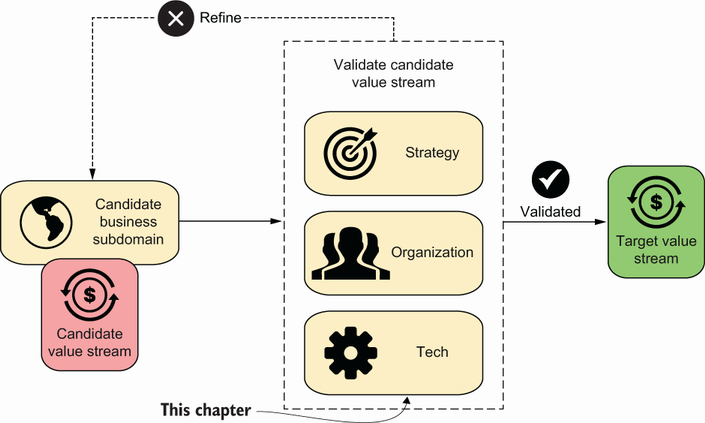

<!--
_backgroundColor: #0a1929
_color: white
_class: title dark
-->

# アーキテクチャ モダナイゼーション とは何か

### 技術・事業・組織で大事なこと

2026/04/10 設計ナイト 2026 武蔵野公会堂ホール 
@nwiizo 20min（19:10〜19:30）

---

<!-- _backgroundColor: white -->

## nwiizo

株式会社スリーシェイクでプロのソフトウェアエンジニアをやっているものです。「アーキテクチャモダナイゼーション」（Manning, 2024）と Susanne Kaiser「Architecture for Flow」（Addison-Wesley, 2025）の翻訳をしています。

インターネット上では <strong>nwiizo</strong> を名乗り、ブログ「<strong>じゃあ、おうちで学べる</strong>」を運営しています。X / GitHub もこのIDでやっています。

---

## この発表の軸になる書籍

現在翻訳している2冊が軸になっている。Nick Tune「<strong>Architecture Modernization</strong>」（Manning, 2024）が<strong>技術・事業・組織の3軸で同時に動かす</strong>全体像を示し、Susanne Kaiser「<strong>Architecture for Flow</strong>」（Addison-Wesley, 2025）が<strong>Wardley Mapping × DDD × Team Topologiesを統合する</strong>実装論を展開する。

翻訳者として原著と向き合ってきた立場から、書籍の紹介ではなく自分の言葉で語る。技術・事業・組織それぞれで「よくある語られ方」がどう構造的に間違っているのか、そしてモダナイゼーションとは何かを伝える。

---

## 今日話すこと

<strong>技術</strong>

何を変えるか

<strong>事業</strong>

なぜ変えるか

<strong>組織</strong>

誰が変えるか

↓

3つを同時に動かすということ

1つだけ動かせば、残り2つが設計図を上書きする

---

## この発表で持ち帰れること

「モダナイゼーション」の実体を掴み、 雰囲気に流されない設計判断の軸を持ち帰る。

技術・事業・組織の3軸で同時に考えなければ、どんな施策も局所最適に終わる。しかし多くの組織では、流暢で明快な語り口に「なるほど」と頷いた瞬間に、診断が省略されている。雰囲気ではなく構造で判断する視点を持ち帰ってほしい。

---

## 技術の「よくある語られ方」

「マイクロサービスにすれば速くなる」「疎結合にしよう」「コンテナ化すれば運用が楽になる」。手段の名前を出した瞬間に、なぜそうすべきかの診断が消える。聴衆が頷いた時点で、思考停止が完成する。「マイクロサービス」という言葉自体が目的化し、なぜその構造が必要かという問いが蒸発した。これは技術の問題ではなく、<strong>思考の構造の問題</strong>。

なぜこうなるのか。技術の名前には「正解感」がある。「マイクロサービス」と言えば先進的に聞こえ、「モノリス」と言えば遅れている印象を与える。しかし実際には、モノリスが正解な文脈は多い。問題は技術そのものではなく、<strong>名前が持つ印象で判断を代替してしまう</strong>こと。名前は思考の入口であって、結論ではない。

---

## ベストプラクティスは文脈を剥がした処方箋

カンファレンスで語られる成功事例にも構造的な偏りがある。移行に成功した企業は登壇するが、失敗した企業は沈黙する。生存者バイアスの上に成り立つ「ベストプラクティス」は、文脈を剥がした時点で処方箋ではなくなる。この偏りはベンダーの言説にも再生産される。「導入事例」として語られるのは常に成功した顧客であり、解約した顧客がマーケティング資料に載ることはない。<strong>「〇〇社もやっている」は技術判断の根拠にならない。</strong>

文脈とは何か。チームの規模、既存システムの複雑さ、エンジニアの習熟度、事業の成長フェーズ、顧客の要求特性。これらが異なれば、同じ技術が毒にもなる。100人のチームで成功した分散アーキテクチャが、10人のチームで同じ効果を出す保証はどこにもない。<strong>処方箋を借りるなら、まず自分の症状を診断すべき。</strong>

技術の名前が出た瞬間に「なぜ」が消えるなら、それは選定ではなく信仰。

---

## 事業の「よくある語られ方」

「DXを推進する」「モダンなアーキテクチャへ移行する」「売上20%増」「リリース速度2倍」。これらは目標であって戦略ではない。現状の正直な分析を省略し、数字の裏づけがない標語を掲げる。「悪い戦略」の本質はまさにこの構造にある。診断を省略して目標だけを並べた瞬間に、<strong>戦略ごっこが始まる。</strong>

「売上を上げたい」は誰でも言える。戦略とは「なぜ今の売上がこの水準なのか」を分析し、そこから「何を変えれば動くのか」を特定すること。目標だけを掲げるリーダーは、組織に方向性ではなく<strong>雰囲気</strong>を提供している。そして雰囲気は、最初の困難で蒸発する。

---

## 判断基準なき選定は同調圧力にすぎない

技術選定の会議で「好き嫌い」の議論が延々と続くのは、判断基準がないから。「うちもAIを入れないと取り残される」「クラウドネイティブにしないと」。市場の進化段階も自社の立ち位置も分析せず、<strong>隣の会社がやっているからという理由で投資判断する組織に、戦略はない。</strong> あるのは同調圧力だけ。

「隣がやっているから」は判断ではなく反射。自社の顧客が何に困っているのか、自社のシステムのどこがボトルネックなのか。この問いに答えずに技術を選ぶのは、<strong>処方箋なしに薬を飲むのと同じ構造</strong>。しかも組織はこの反射を「迅速な意思決定」と呼び替え、省略を合理化してしまう。

診断を省略した目標設定は、速いのではない。雑なだけ。

---

## 組織の「よくある語られ方」

「Spotifyモデルを導入した」「Team Topologiesに基づいて再編した」。他社の組織構造をコピーする行為は、他社のアーキテクチャをコピーするのと同じ問題を持つ。その構造が機能した文脈——事業フェーズ、人材構成、技術的成熟度——が異なれば、同じ構造は同じ結果を生まない。コンウェイの法則を引用しながら、自社の設計コンテキストを無視して他社の組織図を持ち込むのは矛盾している。<strong>組織設計もまた、診断なきコピーは機能しない。</strong>

組織図に描かれているのは報告ラインと責任範囲だけ。実際に仕事を動かしているのは、組織図には描かれない非公式なネットワーク——昼食時の雑談で生まれる信頼、Slackの横のチャンネルで起きる調整、「あの人に聞けばわかる」という暗黙知の分布。<strong>他社の組織図をコピーしても、この非公式な層はついてこない。</strong>

---

## 仕組みの導入で人は変わらない

「チームを再編しよう」「アジャイルを導入しよう」「心理的安全性を高めよう」。組織変革が語られるとき、ほぼ確実に仕組みの導入として提示される。しかし組織図を書き替えた翌日から変わるのは報告ラインだけで、人と人の間の信頼関係や暗黙の意思決定経路はそのまま残る。スクラムを入れてもレトロスペクティブで本音が出なければ改善は起きない。1on1を制度化しても上司が評価者である限り、部下は防御的になる。

「心理的安全性が大事」と掲げながら失敗を評価で罰する組織は、変革の最も困難な部分——<strong>人間の行動様式が実際に変わること</strong>——を省略している。仕組みは行動を変えない。行動を変えるのは、仕組みの運用に込められた意図と一貫性。制度の文言ではなく、制度をどう使うかの日常が組織文化を作る。

組織変革を語るとき、変えようとしているのは箱と線か、人間の行動か。

---

## アーキテクチャモダナイゼーションとは何か

Figure 1.1 Why modernize より引用

マイクロサービス化でもクラウド移行でもない。リプレースでもリライトでもない。ここまで見てきた「よくある語られ方」には共通の構造がある。技術は手段を目的化し、事業は診断を省略し、組織は仕組みに変化を外注する。いずれも<strong>3つの軸のうち1つだけを語り、残りを無視している</strong>。

では何か。技術・事業・組織の現状をそれぞれ正直に診断し、3つを同時に動かすこと。どの境界でシステムを切るか、どの領域に投資すべきか、どのチームが何を担うか。これらは別々の問いに見えて、実は1つの設計判断の3つの側面。

技術・事業・組織を同時に進化させ、 変化し続ける能力を組織に埋め込むこと。

---

## なぜ「同時に」でなければならないのか

3つの軸は相互に依存している。境界設計（技術）はチーム設計（組織）を規定し、チーム設計はどの領域に投資するか（事業）に制約され、投資判断は境界の引き方に影響する。円環的な関係にあるから、1つだけ動かしても残り2つが元に引き戻す。

「同時に」とは「すべてを一度に完璧に変える」という意味ではない。診断の段階で3つの軸を視野に入れ、変更の影響が他の軸にどう波及するかを意識しながら、小さく動かすということ。技術だけの改善計画、事業だけの戦略資料、組織だけの再編提案——これらが別々に作られている組織は、すでに局所最適の構造に嵌まっている。

ここからは、3つの軸それぞれで何が大事かを掘り下げ、最後に「3つを同時に動かすとはどういうことか」で締めくくる。

---

<!--
_backgroundColor: #0a1929
_color: white
_class: transition
-->

技術で大事なこと

---

## 独立デプロイ可能性こそが本質

Figure 12.1 Loosely coupled architecture より引用

<strong>マイクロサービスは目標ではなく手段。独立デプロイ可能性を達成する手段の一つに過ぎない。</strong> 「マイクロサービス」という言葉が「これを入れれば解決する」という印象を生んでしまった。しかし本質は、各部分を他の部分に影響なく変更・デプロイできること。答えがモノリスでも、それが正しいなら正しい。

問うべきは「マイクロサービスにすべきか？」ではなく<strong>「独立してデプロイ・進化できる単位はどこか？」</strong>。この問いに答えるには、まずシステムのどこに結合があるかを理解する必要がある。

---

## 結合は3つの次元で考える

<strong>「疎結合にすれば良い」も思考停止。</strong> 結合には<strong>強度・距離・変動性</strong>の3つの次元がある。強度はコンポーネント間の依存の深さ、距離は物理的・論理的な遠さ、変動性は変更頻度の差。安易にマイクロサービス化すると距離が広がるだけで、強度も変動性もそのまま。結果、ネットワーク越しの密結合という最悪のパターンが生まれる。

たとえばAPIで分割しても、片方を変更するたびに相手も変更が必要なら、それは距離が遠い密結合。モノリス内のモジュール分割の方が、同じ強度でも距離が近いぶん変更コストが低い場合がある。<strong>結合の3次元を見ずに分割すると、大域的な複雑性が増すだけ。</strong>

---

## 同じ言葉が違う意味を持つ場所に境界がある

Figure 9.2 Bounded Context and its relationships より引用

「ユーザー」という単語は、認証チームにとってはクレデンシャルの集合であり、課金チームにとっては請求先であり、サポートチームにとっては問い合わせ元。同じ単語が異なる意味を持つ場所に、システムの自然な切れ目がある。これがBounded Contextの出発点。

この「言葉の境界」を無視してシステムを統合すると何が起きるか。全チームが「ユーザー」テーブルを共有し、あるチームの変更が別チームを壊す。データモデルの変更に全員の合意が必要になり、リリースが遅くなる。<strong>共有データベースは、境界を引かなかった代償。</strong>

---

## 境界は4つの次元で定義する

Bounded Contextは<strong>言語的・意味的・所有権的・物理的</strong>の4つの境界を同時に定義する設計単位。言語の境界だけ引いてもコードの所有権が曖昧なら、変更のたびに調整コストが発生する。物理的に分離してもチーム境界と一致していなければ、コンウェイの法則が境界を上書きする。4つが揃って初めて、独立してデプロイ・進化できる単位になる。

境界の妥当性を検証するヒューリスティックは複数ある——言語の境界、ビジネスプロセスの境界、データオーナーシップの境界など。ただし、境界を引いただけでは何も変わらない。次に問うべきは「どの境界から手をつけるか」。すべてを同時に再構築する誘惑に抗い、最もボトルネックになっている境界から着手する。

4つの境界が揃わない分割は、複雑さを分散させただけで消していない。

---

## ボトルネック以外の改善は幻想である

境界を引いたら、次に問うべきは「どこから手をつけるか」。ここで制約理論（TOC）の考え方が効く。工場の生産ラインを思い浮かべてほしい。最も遅い工程がライン全体の速度を決める。他の工程をどれだけ高速化しても、ボトルネックが変わらなければ全体のスループットは変わらない。

ソフトウェア開発でも同じ。「マイクロサービスに分割して各チームの速度を上げた」としても、デプロイパイプラインが詰まっていれば意味がない。コードレビューの待ち行列が3日なら、いくら開発速度を上げても3日は消えない。<strong>ボトルネックを特定せずに始めた改善は、組織の自己満足にしかならない。</strong>

---

## ボトルネックはどこにあるか

ではボトルネックをどうやって見つけるか。Value Stream Mappingは、価値の流れを可視化する手法。アイデアが顧客に届くまでの全工程を並べ、<strong>価値を生む活動（VA）と待ち時間（NVA）を分離</strong>する。やってみると、リードタイムの大半が「待ち」であることに驚く。ハンドオフ、承認待ち、環境構築待ち。

技術的な複雑さより、<strong>人と人の間の待ち時間</strong>こそが最大の敵であることが多い。この発見は、モダナイゼーションが技術だけの問題ではないことを裏づける。待ち時間の構造はチーム設計と組織構造に由来する。技術の改善で消せる待ちと、組織を変えないと消せない待ちがある。

ボトルネック以外の改善が「成果」に見えるのは、測っていないから。

---

<!--
_backgroundColor: #0a1929
_color: white
_class: transition
-->

事業で大事なこと

---

## すべてのドメインに等しく投資してはならない

Core Domain Chart

ドメインは3つに分類できる。<strong>Core</strong>（差別化の源泉）、<strong>Supporting</strong>（専門的だが差別化にはならない）、<strong>Generic</strong>（認証、メール配信など汎用的なもの）。<strong>最も美しい設計が必要なのはCore Domainだけ。</strong> Genericに凝った設計を施すのは、差別化に使えるエネルギーの浪費。

ただしポートフォリオの見直しは一度きりではない。重要なのは<strong>一過性（Transience）の原則</strong>。市場が変われば昨日のCoreが今日のCommodityになり、規制変更でGenericが突然Core化することもある。「うちの製品は何個あるのか」「各ドメインは今どの進化段階にあるのか」。この問いに即答できない組織は、投資判断の根拠を持っていない。

---

## 価値の流れで組織を切る

Figure 6.1 Value stream activities より引用

ドメインを分類したら、次は価値の流れ（バリューストリーム）を設計する。バリューストリームとは、アイデアが顧客に届くまでの一連の活動。独立したバリューストリームが持つべき特性は4つ——<strong>ドメインとの整合、成果への責任、チームへの権限付与、ソフトウェアの分離</strong>。

この4つが揃っていないと何が起きるか。ドメインを跨いだバリューストリームは調整コストが爆発する。成果ではなくアウトプット（コード行数、デプロイ回数）で測るチームは、ビジネス価値と切り離される。権限のないチームは承認待ちで止まる。<strong>高速なフローは、バリューストリームの独立性から生まれる。</strong>

---

## 進化段階を可視化する

Figure 5.7 Wardley map より引用

どの領域に投資すべきかがわかっても、「どう投資すべきか」は進化段階で変わる。Wardley Mapは縦軸にバリューチェーン（顧客に近い→遠い）、横軸に進化段階（発明→汎用化）をとり、ビジネスコンポーネントの現在地を可視化する。

技術選定の会議で「好き嫌い」の議論が延々と続くのは、この地図がないから。コンポーネントの進化段階がわかれば、<strong>「この段階でこの方法論は適切か」</strong>という判断基準が生まれる。直感ではなく、景観の理解に基づいた意思決定ができるようになる。

---

## 進化段階が変われば方法論も変わる

重要なのは、<strong>進化段階ごとに適切な方法論が異なる</strong>という点。発明段階のコンポーネントに標準化を求めれば創造性が死に、汎用化した領域に実験を続ければ無駄なコストが膨らむ。同じ組織の中でも、領域によって異なるマインドセットが必要になる。

<strong>発明〜カスタム構築 — 探索者のマインドセット</strong>

不確実性が高い。<strong>アジャイル</strong>で素早く学ぶ段階。何が正解かわからないから、失敗のコストが小さい実験を繰り返す。フィードバックループを短くする。ここでSix Sigmaを適用すれば、学ぶ前に創造性が死ぬ。

<strong>製品化〜汎用化 — 都市計画者のマインドセット</strong>

安定している。<strong>リーン / Six Sigma</strong>で標準化と効率性を追求する段階。給与計算や決済処理のように正確性が絶対の領域は決定論的なコードに任せる。ここでアジャイルを適用すれば無駄な実験が増える。

---

## 作れるからといって作るな

正しい問いは「内製できるか」ではない。<strong>「この進化段階で内製する経済合理性があるか」</strong>。エンジニア人件費、機会コスト、継続改善コストの3点を見れば、Commodity領域では外部に任せた方が合理的になる構造がある。マネージドサービスの価値は「今の機能」ではなく<strong>「継続的な改善が含まれている」</strong>こと。自社で運用すれば改善コストはすべて自分たちが負うが、外部に任せればそのコストは利用者全体で分担される。パッケージソフトとの本質的な違いはここにある。

業務の性質とリソースの有無で選択は分かれる。共通領域（Generic/Supporting）はマネージドサービスやプラットフォームに任せ、競争領域（Core Domain）に自社のエンジニアリングを集中させる。すべてを推論に任せるのもナンセンスなら、すべてを内製するのもナンセンス。<strong>推論と決定論的コード、内製と外部調達の適切な切り分けが設計そのもの。</strong>

内製の誘惑は「作れる」という自信から来る。しかし作れることと、作り続ける経済合理性は別の問い。

---

<!--
_backgroundColor: #0a1929
_color: white
_class: transition
-->

組織で大事なこと

---

## コンウェイの法則は設計図を上書きする

Figure 2.1 Sociotechnical systems より引用

<strong>「組織はそのコミュニケーション構造を反映したシステムを設計する」</strong>（Melvin Conway, 1968）。どれだけ美しい設計を描いても、組織のコミュニケーション構造に反していれば実装されない。3つのチームが1つのシステムを担当すれば、そのシステムは3つのモジュールに分裂する。意図したかどうかに関係なく。

この法則は「避けるべき制約」ではなく「利用すべき力学」。<strong>逆コンウェイ戦略</strong>とは、望ましいアーキテクチャに合わせて組織を設計し、アーキテクチャを自然とそこに収束させること。技術セクションで見たBounded Contextの境界と、チームの境界を一致させる。この整合があって初めて、独立してデプロイ・進化できる単位が成立する。

---

## 境界とチームが一致しないとき何が起きるか

Bounded Contextの境界をきれいに引いても、チーム構造がそれと一致していなければ、変更のたびにチーム間の調整が発生する。ある機能を変えるのに3チームの合意が必要になる状態——これが<strong>組織的な結合</strong>。コードの結合度は低いのに、リリースは遅い。原因はコードではなく、コードを書いている人の間にある。

技術システムだけを最適化しても、組織が変わらなければ効果は一時的。組織だけを変えても、技術が追いつかなければ絵に描いた餅。<strong>両方を同時に、整合性を持って動かす</strong>のがソシオテクニカルアプローチ。境界設計とチーム設計を分離した瞬間に、コンウェイの法則が設計図を上書きする。

コードの結合度が低くても、組織の結合度が高ければ、速度は出ない。

---

## 認知負荷がチーム設計の唯一の制約

「このシステムをいくつに分割するか」の答えは「チームがいくつあるか」に依存する。<strong>認知負荷</strong>こそが唯一の制約。チームが担当範囲を頭の中に保持できなくなったとき、それは分割のサインであり、人を増やすサインではない。人を増やせばコミュニケーションコストが増え、コンウェイの法則がさらに複雑な構造を生む。

認知負荷には3種類ある。<strong>内在的負荷</strong>（ドメイン自体の複雑さ）、<strong>外在的負荷</strong>（ツールやプロセスの複雑さ）、<strong>本質的負荷</strong>（ビジネスロジックの複雑さ）。チーム設計で減らせるのは外在的負荷。プラットフォームチームがインフラの複雑さを引き受けることで、価値の流れに沿うチームはビジネスロジックに集中できる。認知負荷の範囲内にいるとき、速度を上げることが品質向上に直結する。<strong>トレードオフに見えるものは、設計の問題。</strong>

---

## チーム構造は固定ではなく進化する

Figure 11.10 Team interaction modes より引用

4つのチームタイプ（価値の流れに沿うチーム、プラットフォームチーム、支援チーム、複雑なサブシステムチーム）と3つのインタラクションモード（協働、サービス提供、ファシリテーション）は、認知負荷を管理するための処方箋。新しい領域を立ち上げるときは2チームが密に協働し、境界が明確になったらサービス提供モードに移行する。

重要なのは、<strong>チーム構造は静的ではなく、システムの進化に合わせて動的にリチーミングする</strong>ということ。支援チームは他チームの能力を底上げし、役割を果たしたら離れる。<strong>安定しているが固定ではない。</strong> 事業の進化段階が変われば方法論が変わるように、チーム構造もまた進化段階に応じて変わるべきもの。

---

## 仕組みの変更では組織は変わらない

組織図を変えれば組織が変わると信じるのは「構造の誤謬」。新しいプロセスを導入すれば行動が変わると信じるのは「プロセスの誤謬」。どちらも、<strong>変化を「仕組み」に外注しようとする</strong>点で同じ間違いを犯している。なぜこの誤謬に嵌まるのか。構造やプロセスの変更は<strong>可視的で、意思決定者に「何かをやった」という実感を与える</strong>から。見えやすいものを変えて、見えにくいものを放置する——これが構造の誤謬の構造。

では何が組織を変えるのか。モダナイゼーションの前提条件は<strong>組織文化</strong>にある。組織文化には段階がある——権力で動く組織、規則で動く組織、そして成果で動く組織。失敗を報告した人が評価されるのか、罰せられるのか。新しい技術を試す提案が歓迎されるのか、「余計なことをするな」と言われるのか。<strong>技術的モダナイゼーションは、この成果志向の文化の上でしか持続しない。</strong>

仕組みの変更は可視的だが、文化の変化は不可視。見えないものを変えない限り、見えるものは元に戻る。

---

<!--
_backgroundColor: #0a1929
_color: white
_class: transition
-->

3つを同時に動かすということ

---

## 3つの軸が交差する場所

Figure 1.10 Architecture modernization overview より引用

ここまで技術・事業・組織を個別に掘り下げてきた。しかし実際の現場では、この3つは常に同時に起きている。Bounded Contextの境界を引く行為は、同時にチームの責任範囲を決め（組織）、どの領域に投資するかを決める（事業）行為でもある。

逆に言えば、境界設計の失敗は3つの軸すべてに波及する。言語の境界を無視すれば共有データベースの罠に嵌まり（技術）、Core Domainに集中できず（事業）、チーム間の調整コストが膨らむ（組織）。<strong>3つの軸は交差している。切り離して考えた瞬間に、局所最適が始まる。</strong>

---

## 1つだけ動かすと何が起きるか

<strong>技術だけ動かすと</strong>

マイクロサービスに分割しても、チーム構造がモノリスのまま。コードの結合度は下がったのにリリースが遅い。コンウェイの法則がアーキテクチャを元の形に引き戻す。

<strong>事業だけ動かすと</strong>

Core Domainを特定しても、技術的な境界がそれを反映していなければ共有データベースで密結合のまま。進化段階に応じた方法論の切り替えも、コードが分離されていなければ実行できない。

<strong>組織だけ動かすと</strong>

チームを再編しても、どの領域が差別化の源泉かが定まっていなければ、チームは何に集中すべきかわからない。認知負荷を最適化する対象が見えない。

1つだけ動かせば、残り2つが設計図を上書きする。

---

## 組織的な慣性が変化を阻む

では、なぜこれほど多くの組織が1つの軸だけを動かしてしまうのか。既存の設計には政治的資本、チームの慣れ、属人化した知識が蓄積されている。ある技術を選定した人がまだ社内にいれば、その技術を否定することは人を否定することになる。ある組織構造で昇進した人がいれば、その構造を変えることは自分の正当性を否定することになる。

変更の技術的コストよりも、この<strong>組織的な慣性</strong>の方がはるかに大きい。「これを入れれば解決する」という言葉が心地よいのは、この慣性に向き合う苦痛を回避できるから。マイクロサービス、クラウドネイティブ、AI——手段の名前が変わっても、<strong>「銀の弾丸を求める」構造は同じ</strong>。

慣性に向き合う苦痛を省略した瞬間に、雰囲気が戦略の代わりを務め始める。

---

## 診断を省略しない意思決定の順序

モダナイゼーションには順序がある。まず現状を診断し、次にドメインと進化段階を可視化し、それからチーム設計と技術選定に進む。だが多くの組織はこの順序を飛ばし、いきなり技術やツールの選定から始める。「Kubernetesを導入しよう」「マイクロサービスに分割しよう」——これらは診断の結果として出てくるべき結論であって、出発点ではない。

<strong>診断を省略した意思決定は「速い」のではなく、雑なだけ</strong>。技術を選ぶ前にドメインを診断し、チームを設計する前にバリューストリームを可視化する。この順序を守るだけで、「なぜこの技術か」「なぜこのチーム構造か」に答えられるようになる。答えられない選択は、振り返ったとき修正もできない。

---

## 診断から始めるモダナイゼーション

Figure 16.8 Modernization core domain chart より引用

診断とは具体的に何をすることか。「技術的負債がある」では診断にならない。「受注管理システムのこの部分が、新規プラン追加のリードタイムを3ヶ月にしており、事業の成長を阻害している」——ここまで掘り下げて初めて、どの境界から手をつけるか、どのチームを再設計するか、どの領域の投資を見直すかが見えてくる。

「一気に変える」衝動は、診断の省略と同じ構造を持つ。小さく変え、各ステップで学び、次の判断を修正する。技術用語ではなくビジネス成果の言葉で語り、3〜6ヶ月で価値を証明する。<strong>継続的に学び適応する組織だけが、モダナイゼーションを持続できる。</strong>

---

## モダナイゼーションの成果物は何か

モダナイゼーションの目的地は「完成したアーキテクチャ」ではない。<strong>変化し続ける能力そのもの</strong>。境界設計を学べばチーム設計が必要になり、チーム設計を学べば進化段階の理解が必要になり、進化段階を学べばビジネス戦略の知識が必要になる。すべてが繋がっている。だからこそ、同時に動かす必要がある。

目指すべきは障害から元に戻る「レジリエンス」ではなく、障害を経るたびに強くなる組織。小さく壊れ、そこから学び、前より強い設計を手に入れる。学習する組織であることが、モダナイゼーションの前提条件であり、同時にその成果でもある。

モダナイゼーションの成果物はアーキテクチャではない。診断する習慣そのもの。

---

## 参考資料

- [アーキテクチャモダナイゼーション](https://www.shoeisha.co.jp/book/detail/9784798195063) - Nick Tune, Jean-Georges Perrin 著 / 株式会社スリーシェイク 訳（翔泳社, 2025）
- [Architecture for Flow](https://www.informit.com/store/architecture-for-flow-9780137899937) - Susanne Kaiser（Addison-Wesley, 2025）
- [Team Topologies](https://teamtopologies.com/) - Matthew Skelton, Manuel Pais（IT Revolution, 2019）
- [Building Microservices, 2nd Edition](https://www.oreilly.com/library/view/building-microservices-2nd/9781492034018/) - Sam Newman（O'Reilly, 2021）
- [Domain-Driven Design](https://www.domainlanguage.com/ddd/) - Eric Evans（Addison-Wesley, 2003）
- [Wardley Maps](https://learnwardleymapping.com/) - Simon Wardley
- [Good Strategy Bad Strategy](https://www.richardrumelt.com/) - Richard Rumelt（Crown Business, 2011）

---

<!--
_backgroundColor: #0a1929
_color: white
_class: title dark
-->

# ありがとうございました

### @nwiizo

設計ナイト 2026 / 2026-04-10 
アーキテクチャモダナイゼーションとは何か

