<!--
_backgroundColor: #0a1929
_color: white
_class: title dark
-->

# アーキテクチャ モダナイゼーション とは何か

### 技術・事業・組織で大事なこと

2026/04/10 設計ナイト 2026 武蔵野公会堂ホール 
@nwiizo 20min（19:10〜19:30）

---

<!-- _backgroundColor: white -->

## nwiizo

株式会社スリーシェイクでプロのソフトウェアエンジニアをやっているものです。Nick Tune「アーキテクチャモダナイゼーション」（翔泳社, 2026）の翻訳に携わりました。

インターネット上では <strong>nwiizo</strong> を名乗り、ブログ「<strong>じゃあ、おうちで学べる</strong>」を運営しています。X / GitHub もこのIDでやっています。

---

## この発表の軸になる書籍

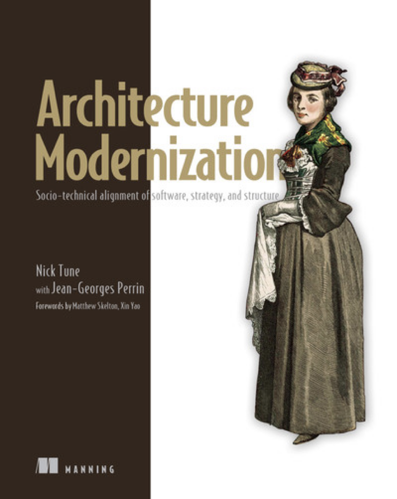

本発表の軸になる2冊。翻訳に携わった Nick Tune「<strong>アーキテクチャモダナイゼーション</strong>」（翔泳社, 2026）が<strong>技術・事業・組織の3軸で同時に動かす</strong>全体像を示し、Susanne Kaiser「<strong>Architecture for Flow</strong>」（Addison-Wesley, 2025）が<strong>Wardley Mapping × DDD × Team Topologiesを統合する</strong>実装論を展開する。

書籍の紹介ではなく、翻訳者として原著と向き合ってきた経験をもとに、自分の言葉で語る。技術・事業・組織それぞれで「よくある語られ方」の何が間違っているのか、そしてモダナイゼーションとは何かを伝える。

---

## 今日話すこと

<strong>技術</strong>

何を変えるか — 境界・結合・疎結合の本質

<strong>事業</strong>

なぜ変えるか — ドメイン・進化段階・投資判断

<strong>組織</strong>

誰が変えるか — チーム設計・認知負荷・文化

↓

3つを同時に動かすということ

1つだけ動かせば、残り2つが設計図を上書きする

---

## この発表で持ち帰れること

「モダナイゼーション」の実体を掴み、 なんとなくではなく構造で判断する軸を持ち帰る。

技術・事業・組織の3つを同時に考えなければ、どんな施策も一部分の改善にしかならない。しかし多くの組織では、わかりやすい説明に「なるほど」と頷いた瞬間に、自分たちの現状を見ることをやめてしまう。なんとなくではなく、構造で判断する視点を持ち帰ってほしい。

---

## この発表の限界

本日紹介する「技術・事業・組織を同時に動かす」という考え方は、<strong>すべての組織にそのまま当てはまるわけではありません。</strong>

<strong>文脈によって3軸のバランスは変わる</strong>

スタートアップで技術から始めるか、大企業で組織から始めるか、規制産業で事業制約から始めるか——出発点は組織ごとに違う。「3軸を完璧に同時に」という読み方は誤読。

<strong>想定される反論に先に答えておく</strong>

「3つ同時に動かす余裕がない」→ 余裕がないからこそ、動かした1軸を残り2軸が上書きする構造を知っておく価値がある。「理想論だ」→ 理想型ではなく、自組織の盲点を可視化する装置として使ってほしい。

<strong>「3軸同時」は完璧解ではない。自組織の盲点を可視化する装置として持ち帰ってほしい</strong>

---

## 始める前に

<strong>事情でレガシーシステムと呼ばれ</strong> 
<strong>敵にされる全てのシステムに敬意を表します。</strong>

それらのシステムは、かつて誰かがその時代の制約の中で全力で設計した。意図した通りに残るものもあれば、設計者が想像しなかった形で生き残るものもある。どちらも、使われ続けたという事実に変わりはない。

今夜はこの会場で、設計という行為を様々な角度から掘り下げる。あなたが今日設計するものも、いつかレガシーと呼ばれる日が来る。それを光栄に思いましょう。そう呼ばれるまで生き延びた設計は、それだけで仕事を果たしている。自分が書いたコードにも、いつかそう言ってもらえることを願っている。

---

## では、設計判断はどこで間違うのか

レガシーへの敬意を述べた上で、次に問うべきは「なぜ設計判断は間違うのか」。技術・事業・組織の3つの軸で、それぞれに「よくある語られ方」がある。一見正しそうに聞こえるが、構造的に間違っている語られ方。それを順番に見ていく。

---

## 技術の「よくある語られ方」

「マイクロサービスにすれば速くなる」「疎結合にしよう」「コンテナ化すれば運用が楽になる」。手段の名前を出した瞬間に、「なぜそうすべきか」を考えなくなる。名前が出てきて皆が頷いた時点で思考が止まる。

成功事例にも偏りがある。移行に成功した企業は登壇するが、失敗した企業は黙っている。聞こえてくるのは生き残った側の声だけ。同じ技術でも、チームの規模やエンジニアの経験が違えば毒になる。

💡 これらの語られ方は、なぜ繰り返されるのか？

---

## 技術で間違う構造

<strong>間違う理由は単純で、技術の名前には「正解感」がある。</strong>「マイクロサービス」と言えば先進的に聞こえ、「モノリス」と言えば遅れている印象を与える。名前が持つ印象が、判断の代わりを務めてしまう。モノリスが正解な文脈は多いのに、印象で選んでしまう。

<strong>間違う構造は、文脈を無視して手段だけを借りること。</strong> 他社の成功パターンには、その組織の事業フェーズ・人材・技術の成熟度がセットでついてくる。パターンだけ抜き出して自社に持ち込めば、手段と文脈がずれる。この構造は翻訳者である自分にも見えていなかった。原著と向き合って初めて「自分もやっていた」と気づいた。

技術の名前が出た瞬間に「なぜ」が消えるなら、それは選定ではなく信仰。

---

## ただし、信仰が常に間違うわけではない

技術への情熱がなければ、そもそも設計は前に進まない。新しい技術に心が躍ること、「これを使えばもっと良くなる」と信じること。その熱量こそが、困難なモダナイゼーションを支える力になる。

アーキテクチャモダナイゼーションには<strong>BVSSH</strong>というフレームワークがある。Better（品質）、Value（価値）、Sooner（速度）、Safer（安全性）、そして<strong>Happier（幸福）</strong>。技術への情熱——つまり幸福——はモダナイゼーションの5軸のひとつ。問題は<strong>信仰そのものではなく、信仰が「なぜ」を省略する口実になること</strong>。

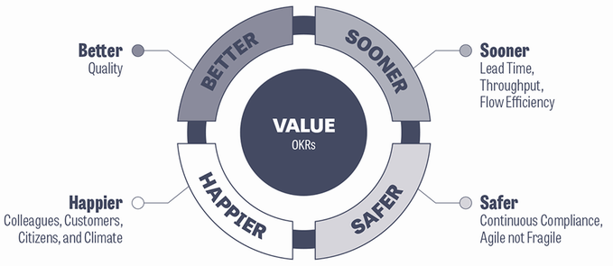

Figure 1.2 BVSSH（Architecture Modernization）より引用

技術への情熱は大事。では、その情熱をどこに向けるか？ → 次は事業の軸で考える。

---

## 事業の「よくある語られ方」

「DXを推進する」「売上20%増」「リリース速度2倍」。これらは目標であって戦略ではない。「売上を上げたい」は誰でも言える。戦略とは「なぜ今この水準なのか」を分析し、「何を変えれば動くのか」を特定すること。

「うちもAIを入れないと取り残される」「クラウドネイティブにしないと」。自社の顧客が何に困っているか、システムのどこが詰まっているか。この問いに答えずに技術を選ぶのは、<strong>周りが走り出したから自分も走るのと同じ</strong>。どこに向かっているか誰も知らない。

---

## 事業で間違う構造

<strong>間違う理由は、分析を省略するほうが簡単だから。</strong> 現状を正直に見ることには痛みが伴う。「なぜこのシステムはこんなに遅いのか」を掘り下げると、過去の意思決定を否定することになりかねない。だから標語で済ませる。組織はこの省略を「迅速な意思決定」と呼び替えてしまう。

<strong>間違う構造は、判断基準がないまま選定すること。</strong> 判断基準がなければ、残るのは同調圧力だけ。市場の進化段階も自社の立ち位置も分析せず、隣の会社がやっているからという理由で投資判断が下される。

診断を省略した目標設定は、速いのではない。雑なだけ。

事業の問題も技術と同じ構造だった。では、組織はどうか？

---

## 組織の「よくある語られ方」

「Spotifyモデルを導入した」「Team Topologiesに基づいて再編した」。他社の組織構造をコピーするのは、他社のアーキテクチャをコピーするのと同じ問題がある。その構造が機能した背景——事業フェーズ、人材、技術の成熟度——が違えば同じ結果にはならない。

「チームを再編しよう」「アジャイルを導入しよう」「心理的安全性を高めよう」。組織変革はほぼ確実に仕組みの導入として語られる。しかし組織図を書き替えた翌日から変わるのは報告ラインだけ。組織図に載らない非公式なつながりはコピーできない。

---

## 組織で間違う構造

<strong>間違う理由は、組織が掲げた言葉ではなく実際に起きたことを信じるのに、言葉だけ変えて行動を変えないこと。</strong>「失敗してもいい」と言った翌週に、失敗した人の評価を下げる。スクラムを入れても、ふりかえりで本音が出なければ改善は起きない。1on1を制度化しても、上司が評価者である限り部下は本音を出さない。

<strong>間違う構造は、仕組みに変化を任せること。</strong> 組織図やプロセスの変更は目に見える。だから意思決定者に「何かをやった」実感を与える。しかし見えやすいものを変えて見えにくいものを放置するのは、変革ではなく自己満足。

組織図を変えるのは簡単。難しいのは、人の行動が本当に変わること。

---

## アーキテクチャモダナイゼーションとは何か

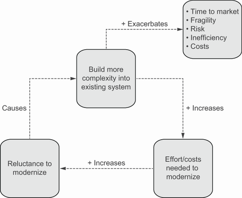

Figure 1.1 Why modernize より引用

マイクロサービス化でもクラウド移行でもない。ここまで見てきた「よくある語られ方」には共通の構造がある。技術は名前で判断を代替し、事業は周りに合わせて走り出し、組織は仕組みに変化を任せる。いずれも<strong>3つの軸のうち1つだけを語り、残りを無視している</strong>。

では何か。技術・事業・組織の現状をそれぞれ正直に見直し、3つを同時に動かすこと。どの境界でシステムを切るか、どの領域に投資すべきか、どのチームが何を担うか。これらは別々の問いに見えて、実は1つの設計判断の3つの側面。3軸すべてで負債が積み重なれば、影響は掛け算になる。

リプレースでもリライトでもない。 3つの軸を同時に見直す、終わらない営み。

---

## なぜ「同時に」でなければならないのか

3つの軸はつながっている。どこでシステムを切るか（技術）はチームの分け方（組織）を決め、チームの分け方はどこに投資するか（事業）に縛られ、投資の判断はシステムの切り方に戻ってくる。<strong>ぐるっと一周する関係だから、1つだけ動かしても残り2つが元に引き戻す。</strong>

「同時に」とは「全部を一度に変える」という意味ではない。<strong>何かを変えるとき、それが他の2つにどう影響するかを考えながら、小さく動かす</strong>ということ。技術だけの改善計画、事業だけの戦略資料、組織だけの再編提案——これらがバラバラに作られている組織は、すでに部分最適の罠にはまっている。

---

## なぜ3つが同時に語られることがないのか

同時に動かすべきだとわかっていても、実際にそう語られることはほとんどない。理由は2つある。1つは<strong>専門の壁</strong>。技術の話は技術者が、事業の話は経営者が、組織の話はマネージャーが語る。それぞれの専門が深くなるほど、他の軸が見えなくなる。

もう1つは<strong>具体性の罠</strong>。3つを同時に動かしている組織も実は存在するが、それは1人のエンジニアや事業責任者が語ることではない。現場では複数の人が複数の軸を少しずつ動かしている。だが個々の具体例は抽象化しにくく、カンファレンスで語れる形にならない。物理学の三体問題と同じで、<strong>3つが互いに影響し合う現実を、ひとつの枠組みで語ることは本質的に難しい</strong>。

3つを同時に語れる言葉は、まだ誰も持っていない。だから組織は、3つを別々に語る分業を生む。

---

<!--
_backgroundColor: #0a1929
_color: white
_class: transition
-->

よくある語られ方の問題はわかった

<strong>では、技術で本当に大事なことは何か？</strong>

---

## 技術で大事なのは「結合の構造を見ること」

「マイクロサービスにすべきか」「モノリスのままでいいのか」。この問いは、実は問い方が間違っている。問うべきは<strong>「システムのどこに、どんな種類の結合があるか」</strong>。結合の構造が見えなければ、分割しても複雑さが増すだけ。

技術セクションでは、結合を3つの次元で見る方法（Balanced Coupling モデル）を紹介し、境界の引き方、そしてボトルネックの見つけ方を順に追っていく。

---

## 疎結合の本質

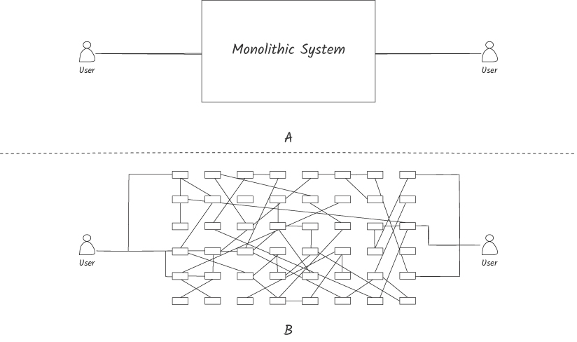

Figure 3.4 Monolith vs. distributed monolith（Balancing Coupling）より引用

<strong>マイクロサービスは目標ではなく手段。</strong> 本質は、各部分を他の部分に影響なく変更・デプロイできること。図のAはモノリスだが1つの箱として扱える。図のBは分割したのに依存関係が爆発し、<strong>分散モノリス</strong>になっている。分割すれば良くなるとは限らない。

<strong>「疎結合にすれば良い」も思考停止。</strong> 「結合が強い/弱い」という一次元の見方では判断を間違える。結合には<strong>3つの次元</strong>がある。次のスライドで掘り下げる。

---

## 結合の3次元で設計を判断する

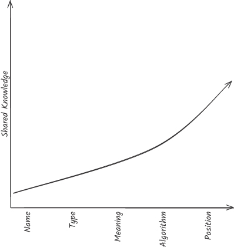

Figure 6.1 Integration strength（Balancing Coupling）より引用

<strong>統合の強度</strong>

モジュール同士が<strong>どれだけの知識を共有しているか</strong>。相手の名前だけ知っているのか、データの型まで知っているのか、内部のロジックまで共有しているのか。共有する知識が多いほど結合は強い。

<strong>距離</strong>

変更するときの<strong>調整コスト</strong>。同じチーム内か、別チームか、別会社か。距離が遠いほど、一緒に変えるのが大変になる。

<strong>変動性</strong>

その部分が<strong>どれくらい変わりやすいか</strong>。変わらない部分の結合は問題にならない。よく変わる部分の結合こそが設計リスク。

結合の痛み = 強度 × 変動性 × 距離。3つの掛け算で考える。どれか1つがゼロなら痛みもゼロ。

---

## 距離が変われば同じ結合でも痛みが変わる

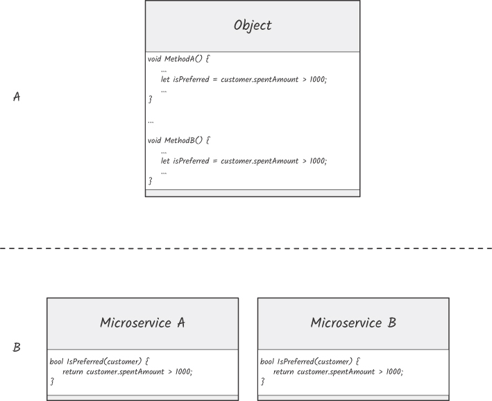

Figure 8.1 Duplication and distance（Balancing Coupling）より引用

図のAはモノリス内で同じロジックが2箇所にある。距離が近いから、片方を直せばもう片方もすぐ見つかる。図のBは同じ重複がマイクロサービスに分かれている。コードベースが違い、チームも違う。<strong>同じ重複でも、距離が遠くなると発見も修正もコストが跳ね上がる。</strong>

だからモノリスを分割するとき、「同じ統合の強度でも距離が変わる」ことを意識する必要がある。モノリス内では許容できた結合が、サービス境界を越えた瞬間に致命的になることがある。<strong>分割は結合を減らすのではなく、距離を変える行為</strong>。

---

## 共有データベースが最悪の結合になる理由

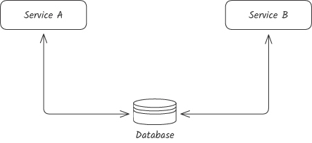

Figure 6.4 Shared database（Balancing Coupling）より引用

Service AとService Bが同じデータベースを直接読み書きしている。3次元で見ると、<strong>統合の強度は最大</strong>（テーブル構造、カラム名、データ型すべてを共有）、<strong>距離は遠い</strong>（別サービス、場合によっては別チーム）。変動性が高ければ、片方の変更がもう片方を壊す。

これが「マイクロサービスにしたのに遅くなった」の正体。サービスを分けても、データベースを共有していれば本質的にモノリスと同じ。<strong>境界を引くとは、データの所有権を分けること</strong>。APIやイベントを通じて統合の強度を下げ、痛みをゼロに近づける。

共有データベースをやめられないのは、データの所有権を決めることが組織の権限を決めることだから。

---

## 境界はどうやって見つけるのか

結合の構造を見る方法はわかった。では<strong>境界をどこに引くべきか</strong>をどう見つけるか。Nick Tuneが紹介する手法の1つが<strong>イベントストーミング</strong>。技術者とビジネスの人が一緒にオレンジの付箋を貼り、「〜が発生した」というドメインイベントを時系列に並べる。<strong>複雑さをきれいに整理するのではなく、ありのまま可視化する</strong>のが目的。

やってみると、ビジネスの人と技術者が<strong>同じ言葉を違う意味で使っている場所</strong>が見えてくる。「注文」は営業にとっては商談、倉庫にとっては出荷指示、経理にとっては売上計上。この「言葉の意味が変わる場所」こそが、<strong>システムの自然な境界</strong>。イベントストーミングはその境界を参加者全員で発見する行為。

---

## 同じ言葉が違う意味を持つ場所に境界がある

Figure 9.2 Bounded Context and its relationships より引用

「ユーザー」という同じ言葉でも、認証チームにとってはログイン情報、課金チームにとっては請求先、サポートチームにとっては問い合わせ元。同じ言葉が違う意味で使われている場所に、システムの自然な切れ目がある。この「意味が通じる範囲」を区切る設計単位を、Bounded Context（境界づけられたコンテキスト）と呼ぶ。

この「言葉の境界」を無視してシステムを統合すると何が起きるか。全チームが「ユーザー」テーブルを共有し、あるチームの変更が別チームを壊す。3次元で見れば、<strong>統合の強度が最大（DB共有）、距離が遠い（別チーム）、変動性が高い（各チームが頻繁に変える）</strong>。最悪の組み合わせ。

---

## 境界は4つ揃って初めて機能する

Figure 6.11 Architecture vs. boundaries より引用

Bounded Contextには4つの側面がある。<strong>言葉の境界</strong>（同じ単語が違う意味を持つ場所）、<strong>意味の境界</strong>（ビジネスルールが異なる場所）、<strong>所有権の境界</strong>（誰がコードを変更できるか）、<strong>物理的な境界</strong>（デプロイの単位）。4つが揃っていなければ、図のように1つの変更が複数のコードベースに波及する。

サービスを分離しても、チーム構造と合っていなければ境界は形だけ。全部を一度に直したくなるが、<strong>今いちばん足を引っ張っている境界から着手する</strong>。

言葉・意味・所有権・物理の4つを揃えないと、境界は組織図の線と同じで誰も守らなくなる。

---

## ボトルネック以外の改善は幻想である

Figure 6.1 Value stream activities より引用

境界を引いたら、次に問うべきは「どこから手をつけるか」。制約理論（TOC）の考え方が効く。最も遅い工程がライン全体の速度を決める。デプロイパイプラインが詰まっていれば、各チームの開発速度をいくら上げても意味がない。

ボトルネックを見つけるにはValue Stream Mappingが効く。アイデアから顧客に届くまでの全工程を並べ、<strong>「手を動かしている時間」と「待っている時間」を分ける</strong>。やってみると驚く。リードタイムの大半はコードを書く時間ではなく、承認待ち・ハンドオフ・環境構築待ちなど、<strong>人と人の間で止まっている時間</strong>。

ボトルネック以外を改善しても全体の速度は変わらない。それでも「成果」に見えるのは、全体を測っていないから。

---

## 技術の軸で見えたこと

<strong>「疎結合にすべき」は一次元の見方。</strong> 結合は<strong>強度 × 変動性 × 距離</strong>の3次元で判断する。分割は結合を減らすのではなく<strong>距離を変える行為</strong>。

<strong>境界を引くには言葉・意味・所有権・物理の4つを揃える。</strong> そしてどこから手をつけるかは<strong>ボトルネックが教えてくれる</strong>。

技術だけでは<strong>「なぜその境界を引くのか」</strong>が決められない。次は事業の軸で、この問いに答える。

---

<!--
_backgroundColor: #0a1929
_color: white
_class: transition
-->

結合の構造を見る方法はわかった

<strong>では、事業の視点で大事なことは何か？</strong>

---

## 事業で大事なのは「どこに投資するか」を決めること

技術セクションでは「何を変えるか」を見てきた。しかし「何を変えるか」がわかっても、「なぜそれを変えるのか」が定まっていなければ、変更の優先順位がつけられない。事業セクションでは、<strong>どの領域に投資すべきか</strong>、<strong>その領域は今どの進化段階にあるか</strong>を見る方法を紹介する。

すべてのドメインに等しくエネルギーを注ぐのは、すべての戦場に兵力を均等に配置するのと同じ。勝つべき場所に集中し、それ以外は最小限で済ませる。これが事業の軸で設計判断を支える考え方。

---

## すべてのドメインに等しく投資してはならない

Core Domain Chart

ドメインは3つに分類できる。<strong>Core</strong>（差別化の源泉）、<strong>Supporting</strong>（専門的だが差別化にはならない）、<strong>Generic</strong>（認証、メール配信など汎用的なもの）。<strong>最も美しい設計が必要なのはCore Domainだけ。</strong> Genericに凝った設計を施すのは、差別化に使えるエネルギーの浪費。

ただし、この分類は固定ではない。市場が変われば昨日のCoreが今日のCommodityになり、規制変更でGenericが突然Core化することもある。<strong>「うちの製品は何個あるのか」「各ドメインは今どの段階にあるのか」。この問いに即答できない組織は、投資判断の根拠を持っていない。</strong>

---

## ドメイン間の結合をどう判断するか

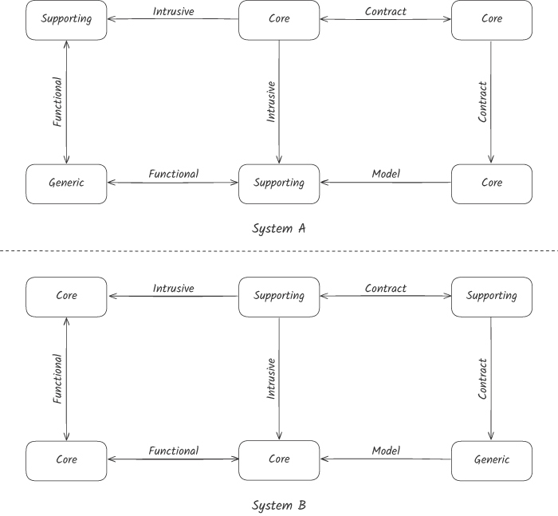

Figure 9.3 Domain coupling types（Balancing Coupling）より引用

ドメインの分類がわかったら、次は「ドメイン間の結合をどう管理するか」を決める。Core同士がIntrusive（侵入的）に結合していれば変更のたびに両方壊れる。GenericとCoreの間はContract（契約）で疎結合にすべき。<strong>ドメインの種類と結合の種類の組み合わせで、投資の優先順位が決まる。</strong>

ドメイン間の結合がもたらす痛みは <strong>Pain = 強度 × 変動性 × 距離</strong> で見積もれる。Painが高いドメイン間の結合から優先的に手をつける。

Genericに最高のエンジニアを割く組織は、Core Domainの競争力を毎月少しずつ他社に譲渡している。

---

## 価値の流れで組織を切る

Figure 6.1 Value stream activities より引用

ドメインを分類したら、次は価値の流れ（バリューストリーム）を設計する。バリューストリームとは、アイデアが顧客に届くまでの流れ全体のこと。独立したバリューストリームに必要なのは4つ——<strong>ドメインとの対応、成果への責任、チームに権限があること、ソフトウェアが分離されていること</strong>。

この4つが揃っていないとどうなるか。ドメインをまたぐと調整コストが膨らむ。成果ではなく作業量（コード行数やデプロイ回数）で測ると、ビジネス価値と切り離される。権限のないチームは承認待ちで止まる。<strong>速いフローは、バリューストリームの独立性から生まれる。</strong>

---

## 独立したバリューストリームの4つの条件

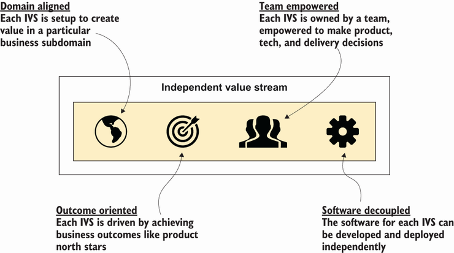

Figure 1.4 Independent value stream（Architecture Modernization）より引用

独立したバリューストリームには4つの条件がある。<strong>ドメインに対応していること</strong>（特定のビジネス領域に集中）、<strong>チームに権限があること</strong>（製品・技術・デリバリーの意思決定ができる）、<strong>成果で評価されること</strong>（作業量ではなくビジネス成果）、<strong>ソフトウェアが分離されていること</strong>（独立してデプロイできる）。

この4つのうちどれかが欠けると、独立性が失われる。ドメインに対応していなければ複数の関心事を抱え込む。権限がなければ承認待ちで止まる。作業量で評価されればビジネス価値と切り離される。ソフトウェアが共有されていれば他チームの変更に巻き込まれる。

---

## 進化段階を可視化する

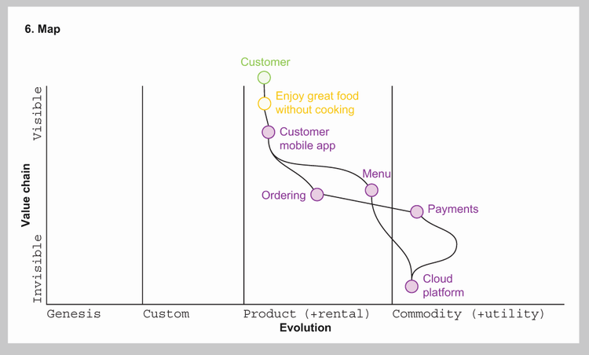

Figure 5.7 Wardley map より引用

どの領域に投資すべきかがわかっても、「どう投資すべきか」は進化段階で変わる。Wardley Mapは縦軸にバリューチェーン（顧客に近い→遠い）、横軸に進化段階（発明→汎用化）をとり、ビジネス上の構成要素の現在地を可視化する。

技術選定の会議で「好き嫌い」の議論が延々と続くのは、この地図がないから。各要素の進化段階がわかれば、<strong>「この段階でこの方法論は適切か」</strong>という判断基準が生まれる。<strong>直感ではなく、景観の理解に基づいた意思決定ができるようになる。</strong>

---

## Wardley Mapを使うと何が見えるのか

Wardley Mapは単なる可視化ツールではない。<strong>3つの問いに同時に答える装置</strong>。「この要素は今どの進化段階にあるか？」（現在地）、「競争によってどこに移動するか？」（方向）、「移動に合わせて何を変えるべきか？」（行動）。地図を描くこと自体が、チームの認識を揃える行為になる。

すべてのものは進化する。<strong>今日のCore Domainは明日のCommodityかもしれない</strong>。クラウドコンピューティングはかつて最先端の差別化要因だったが、今や汎用インフラ。この「すべては過渡的」という認識が、定期的に地図を描き直す理由になる。一度描いて終わりではない。<strong>描き続けることが戦略の本体</strong>。

地図のない組織は、直感で航海している。嵐が来るまではそれでも進める。

---

## 地図の上に「気候」を重ねる

Wardley Mapが描けたら、次に「<strong>Climate（気候）</strong>」を読む。気候とは、自分たちではコントロールできない外部の変化のこと。規制の変更、競合の動き、技術の進化。これらは<strong>地図の上で要素が移動する力</strong>。気候を読まずに戦略を立てるのは、天気予報なしで航海するのと同じ。

気候のパターンのうち最も重要なのは<strong>「成功が慣性を生む」</strong>。過去に成功したモデルが強いほど、変化への抵抗が大きくなる。もうひとつは<strong>「低次の安定が高次のアジリティを生む」</strong>。インフラが安定している（汎用化されている）からこそ、その上でビジネスロジックの実験ができる。

地図は現在地を教えてくれる。気候は、地図がどう変わるかを教えてくれる。

---

## 進化段階が変われば方法論も変わる

重要なのは、<strong>進化段階ごとに適切な方法論が異なる</strong>という点。発明段階の領域に標準化を求めれば創造性が死に、汎用化した領域に実験を続ければ無駄なコストが膨らむ。同じ組織の中でも、領域によって異なるマインドセットが必要になる。

Simon Wardleyはこの違いを3つの人格で表現した。<strong>Explorer（探索者）</strong>は未知を切り開く人、<strong>Villager（村人）</strong>は発見を製品に育てる人、<strong>Town Planner（管理者）</strong>は安定したものを効率化する人。同じ組織の中にこの3つの役割が共存する必要がある。

---

## 探索者と管理者は同じ言葉を話さない

<strong>Explorer（探索者）</strong>

まだ何が正解かわからない。新規事業、新機能、新市場の開拓が該当する。<strong>小さく試して、早く失敗して、そこから学ぶ</strong>。この段階で標準化や効率化を求めると、答えが見つかる前に選択肢を潰す。不確実性が高いほど認知負荷も高い。

<strong>Town Planner（管理者）</strong>

すでに正解がわかっている。給与計算や決済処理のように、正確性と安定性が絶対の領域。<strong>標準化と効率化で品質を上げる</strong>。この段階で「もっと実験しよう」は無駄なコストを生むだけ。変動性が低いので結合の痛みも小さい。

探索者に効率を求め、管理者に実験を求める。これが進化段階を無視した設計判断。

---

## 進化段階が違うものを混ぜるリスク

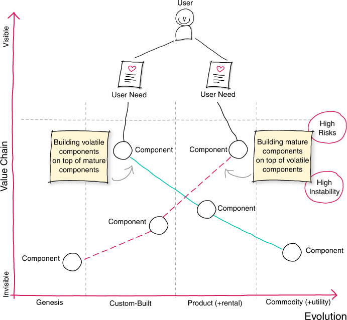

Figure 1.9 Evolution dependencies（Architecture for Flow）より引用

進化段階が違うものを組み合わせるとき、2つのリスクがある。<strong>成熟した要素の上に未成熟な要素を載せる</strong>と、土台は安定しているが上層の不確実性が高く、頻繁な変更が全体に波及する（High Risks）。

逆に、<strong>未成熟な要素の上に成熟した要素を載せる</strong>と、土台が揺れるので上に載せたものも不安定になる（High Instability）。進化段階の違いを無視した依存関係は、どちらの方向でもリスクを生む。

---

## 作れるからといって作るな

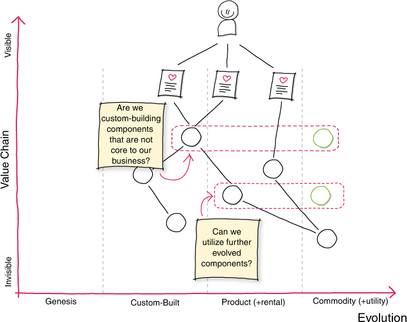

Figure 1.10 Wardley map（Architecture for Flow）より引用

問うべきは「作れるか」ではない。<strong>「この進化段階で内製し続ける経済合理性があるか」</strong>。汎用化した領域では外部に任せた方が合理的な構造がある。Wardley Mapで見れば、右側（汎用化）にあるものを自前で持ち続ける理由はほとんどない。

ただし「Build か Buy か」の二択ではない。<strong>「Build かつ Buy」もありえる</strong>。Core Domainでも既製品の上に自社のロジックを載せることがある。重要なのは進化段階とドメインの種類の組み合わせで判断すること。差別化にならない領域は外に出し、Core Domainにエンジニアを集中させる。

内製の誘惑は「作れる」という自信から来る。しかし作れることと、作り続ける経済合理性は別の問い。

---

## 技術と事業だけでは設計は完成しない

ここまで<strong>技術</strong>で結合の構造を見る方法を学び、<strong>事業</strong>でどの領域にどう投資すべきかを学んだ。しかしこの2つが揃っていても、<strong>それを実行するのは人間</strong>。チームの構造が合っていなければ、どんな設計も実装されない。

技術の<strong>「距離」</strong>はチーム間の距離。事業の<strong>「ドメイン分類」</strong>はチームの責任範囲。 <strong>3つの軸は最初から交差している。</strong>

---

<!--
_backgroundColor: #0a1929
_color: white
_class: transition
-->

何を変えるか、なぜ変えるかはわかった

<strong>では、誰がどう変えるのか？</strong>

---

## 組織で大事なのは「チームと境界を一致させること」

技術で境界を引き、事業で投資先を決めた。しかしこの2つが揃っていても、<strong>それを実行するチームの構造が合っていなければ、設計は紙の上で終わる</strong>。コンウェイの法則が教えてくれるのは、組織のコミュニケーション構造がそのままシステムの形になるということ。

組織セクションでは、コンウェイの法則を「避けるもの」ではなく「利用するもの」として捉え、チーム設計と認知負荷の関係、そしてチーム構造が固定ではなく進化するものであることを見ていく。

---

## コンウェイの法則は設計図を上書きする

Figure 2.1 Sociotechnical systems より引用

<strong>「組織はそのコミュニケーション構造を反映したシステムを設計する」</strong>（Melvin Conway, 1968）。どれだけ美しい設計を描いても、組織のコミュニケーション構造に反していれば実装されない。3つのチームが1つのシステムを担当すれば、そのシステムは3つのモジュールに分裂する。意図したかどうかに関係なく。

この法則は避けるものではなく、利用するもの。<strong>逆コンウェイ戦略</strong>とは、望ましいアーキテクチャに合わせて組織を設計し、アーキテクチャを自然にそこへ収束させること。Bounded Contextの境界とチームの境界を一致させる。この整合があって初めて、高速なフローが成立する。

---

## 境界とチームが一致しないとき何が起きるか

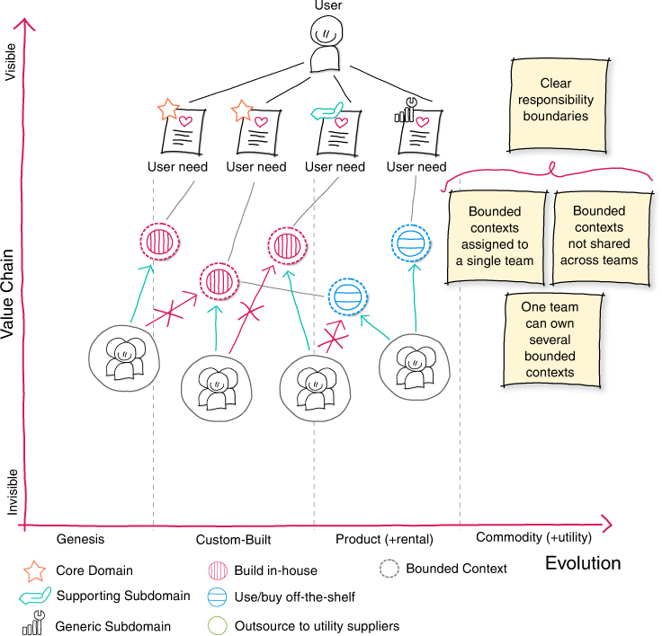

Figure 6.7 Bounded context team alignment（Architecture for Flow）より引用

理想は図の通り——1つのBounded Contextは1つのチームが持ち、チーム間で共有しない。しかし現実には、1つの機能を変えるのに3チームの合意が必要な状況がある。3次元で見れば、統合の強度は低くても<strong>距離が遠すぎる</strong>。コードの結合度は低いのにリリースが遅い。原因はコードではなく、人と人の間の距離にある。

技術だけ直しても、組織が変わらなければ効果は一時的。組織だけ変えても、技術が追いつかなければ絵に描いた餅。<strong>境界設計とチーム設計は同時に動かす</strong>。別々に進めた瞬間に、整合性は崩れ始める。

APIで分離しても、変更のたびに3チームが集まるなら、それはネットワーク越しのモノリス。

---

## 認知負荷がチーム設計の制約

「このシステムをいくつに分割するか」の答えは「チームの頭に入るかどうか」で決まる。<strong>認知負荷</strong>——チームが頭の中に保持しなければならない情報量——こそが唯一の制約。担当範囲が頭に入りきらなくなったとき、それは分割のサインであり、人を増やすサインではない。

<strong>課題内在性負荷</strong>

ドメイン自体の複雑さ。避けられない。<strong>この負荷と向き合うことこそがチームの仕事</strong>。

<strong>課題外在性負荷</strong>

ツール、インフラ、プロセスの複雑さ。<strong>チーム設計で減らせる負荷</strong>。

<strong>学習関連負荷</strong>

新しいことを学ぶための負荷。<strong>他の負荷が高いと余裕がなくなる</strong>。

---

## 認知負荷は測れないが、聞くことはできる

認知負荷には厳密な測定公式がない。しかし<strong>チームに聞くことはできる</strong>。「今の担当範囲は頭に入りきっているか？」「新しいメンバーが来たとき、何ヶ月で独り立ちできるか？」「最近、知らないうちに壊れていたことはあるか？」。答えが「もう限界」「半年かかる」「しょっちゅう」なら、それは認知負荷が高すぎるサイン。

重要なのは<strong>定期的に確認すること</strong>。チームの責任範囲は、機能追加や組織変更のたびに少しずつ広がる。昨日はちょうど良かった負荷が、今日は限界を超えているかもしれない。<strong>認知負荷の管理は一度きりの設計ではなく、継続的な観察</strong>。

「チームの頭に入りきっているか？」——この問いを定期的に聞くことが、認知負荷の管理の第一歩。

---

## 課題外在性負荷を減らすのがチーム設計の仕事

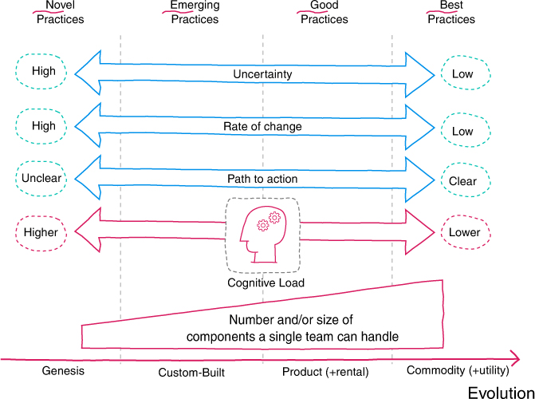

Figure 6.8 Cognitive load（Architecture for Flow）より引用

進化段階が初期に近いほど不確実性が高く、認知負荷も大きい。プラットフォームチームがデプロイやモニタリングの複雑さを引き受ければ、他のチームはドメインの本質に集中できる。この種の負荷は課題外在性負荷であり、チーム設計で取り除ける。

課題外在性負荷が高い組織では、チームの時間がツールとの格闘に消費される。さらに学習関連負荷（新しいことを学ぶ余裕）もなくなり、現状維持で精一杯になる。

「速度と品質のトレードオフ」に見えるとき、まず疑うべきは課題外在性負荷の高さ。

---

## プラットフォームは「製品」として扱う

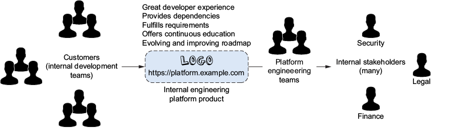

Figure 1.2 Platform as product（Effective Platform Engineering）より引用

課題外在性負荷を減らす主な手段が<strong>プラットフォーム</strong>。ただしプラットフォームは「インフラチームが作るツール」ではなく、<strong>内部の開発チームを「顧客」とする製品</strong>として扱う。顧客の体験を設計し、フィードバックを受け、ロードマップを進化させる。

プラットフォームが製品として機能するには、<strong>セルフサービス</strong>が鍵。開発チームがプラットフォームチームに依頼しなくても、必要なものを自分で手に入れられる。依頼と承認が入るたびに、プラットフォームは課題外在性負荷を<strong>増やす</strong>側に回ってしまう。

---

## ゴールデンパスで「正しい道」を舗装する

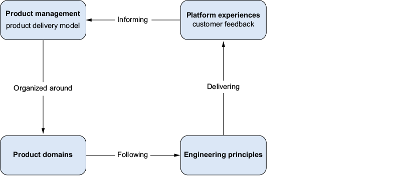

Figure 1.3 Platform cycle（Effective Platform Engineering）より引用

<strong>ゴールデンパス</strong>とは、プラットフォームが推奨する開発・デプロイの標準的な流れのこと。「1日以内にゼロから本番環境へ」を目指す。セキュリティ、ガバナンス、オブザーバビリティが<strong>最初から組み込まれている</strong>から、開発者が意識しなくても正しいことが起きる。

ゴールデンパスから外れることも許容する。ただし外れた場合は、そのチームが自分でセキュリティやガバナンスを担保する責任を持つ。<strong>強制ではなく、正しい道を最も楽な道にする</strong>。これがプラットフォームの設計思想。

---

## チームトポロジーという考え方

Matthew SkeltonとManuel Paisの「チームトポロジー」は、<strong>組織設計とソフトウェア設計を一体として考える</strong>フレームワーク。コンウェイの法則を「利用する」ための具体的な型を提供する。

核心は2つ。<strong>チームの種類を4つに絞ること</strong>（複雑な組織図ではなくシンプルな型）と、<strong>チーム間の関わり方を3つに限定すること</strong>（無限の調整パターンではなく明確なモード）。シンプルだからこそ、組織全体で共通の言葉として機能する。

この本が提供するのは「正解のチーム構造」ではなく、<strong>チーム構造を継続的に見直すための共通言語</strong>。

---

## 4つのチームタイプ

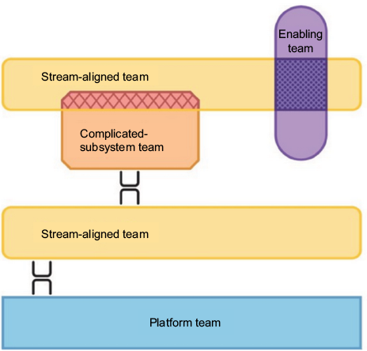

Figure 3.1 Team topologies（Effective Platform Engineering）より引用

認知負荷を管理するために、Team Topologiesは4つのチームタイプを定義している。<strong>ストリームアラインドチーム</strong>（価値の流れに沿い、大多数がこれ）、<strong>プラットフォームチーム</strong>（共通基盤をセルフサービスで提供）、<strong>イネイブリングチーム</strong>（他チームの能力を支援し、役割を果たしたら離れる）、<strong>コンプリケイテッド・サブシステムチーム</strong>（高度な専門知識が必要な領域を担当）。

図のように、<strong>ストリームアラインドチーム</strong>が主軸で、その上下にプラットフォームとイネイブリングが配置される。全チームがストリームアラインドである必要はない。重要なのは<strong>ほとんどのチームが価値の流れに沿っていること</strong>と、それを支えるチームが明確であること。

---

## 3つのインタラクションモード

Figure 11.10 Team interaction modes より引用

チームタイプだけでは足りない。チーム同士が<strong>どう関わるか</strong>も設計する必要がある。Team Topologiesは3つのインタラクションモードを定義している。<strong>コラボレーション</strong>（2チームが密に協働）、<strong>X-as-a-Service</strong>（一方が他方にサービスとして提供）、<strong>ファシリテーション</strong>（一方が他方の能力向上を支援）。

新しい領域を立ち上げるときは<strong>コラボレーション</strong>で始め、境界が明確になったら<strong>X-as-a-Service</strong>に移行する。インタラクションの型を明示することで、<strong>チーム間の調整コストを設計可能にする</strong>。

---

## チーム構造は固定ではなく進化する

チームトポロジーの型を一度適用して終わりではない。<strong>チーム構造は静的ではなく、システムの進化に合わせて動的に変わる</strong>。イネイブリングチームは他チームの能力を底上げし、役割を果たしたら離れる。プラットフォームチームの担当範囲も、事業の成熟とともに広がったり狭まったりする。

事業の進化段階が変われば方法論が変わるように、チーム構造もまた進化段階に応じて変わるべきもの。組織再編は「数年に一度の大事件」ではなく、<strong>小さく継続的に見直す営み</strong>として設計する。

再編が「大事件」になる組織は、本当に再編が必要なときに動けない。

---

## 作ったチームが運用まで責任を持つ

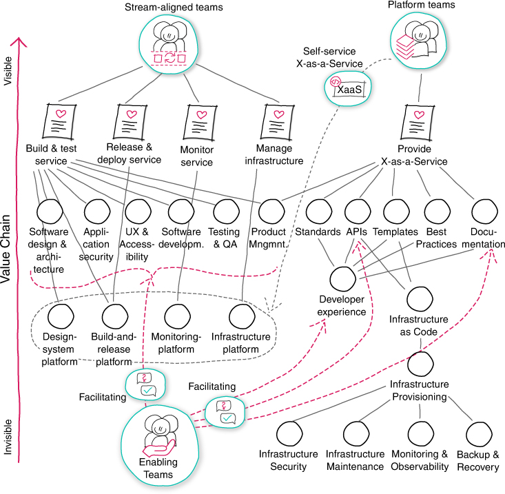

Figure 7.7 Team topology overview（Architecture for Flow）より引用

<strong>「You build it, you run it」</strong>——作ったチームが本番運用まで責任を持つ。開発と運用を別の組織にすると、開発チームは「壊れても直すのは別の人」と考えるようになる。自分が運用するとわかっていれば、<strong>設計の段階から運用のことを考える</strong>。

図はその全体像。ストリームアラインドチームが価値の流れを担い、プラットフォームチームがX-as-a-Serviceでインフラを提供し、イネイブリングチームがファシリテーションで支援する。<strong>チーム間の関係性が明示されているから、調整コストが設計可能になる</strong>。

---

## 仕組みの変更では組織は変わらない

組織図を変えれば組織が変わると信じる。新しいプロセスを入れれば行動が変わると信じる。どちらも、<strong>変化を「仕組み」に任せようとしている</strong>点で同じ間違い。組織図やプロセスの変更は目に見える。だから意思決定者に「何かをやった」という実感を与える。見えやすいものを変えて、見えにくいものを放置する——これが組織変革の罠。

では何が組織を変えるのか。<strong>組織文化</strong>。失敗を報告した人が評価されるのか、罰せられるのか。新しい技術を試す提案が歓迎されるのか、「余計なことをするな」と言われるのか。<strong>モダナイゼーションは、成果を出すことが歓迎される文化の上でしか持続しない。</strong>

仕組みの変更は目に見える。文化の変化は目に見えない。見えないものを変えない限り、見えるものは元に戻る。

---

## 組織の軸で見えたこと

<strong>コンウェイの法則は避けるものではなく利用するもの。</strong> 望ましいアーキテクチャに合わせてチームを設計し、<strong>Bounded Contextの境界とチームの境界を一致させる</strong>。認知負荷を管理し、<strong>課題外在性負荷をプラットフォームチームが引き受ける</strong>。

仕組みを変えるだけでは組織は変わらない。<strong>文化を変えなければ、見えるものは元に戻る。</strong> これで3つの軸が揃った。次は、3つを同時に動かすとはどういうことかを見る。

---

<!--
_backgroundColor: #0a1929
_color: white
_class: transition
-->

技術・事業・組織、それぞれの大事なことはわかった

<strong>では、3つを同時に動かすとはどういうことか？</strong>

---

## 3つの軸が交差する場所

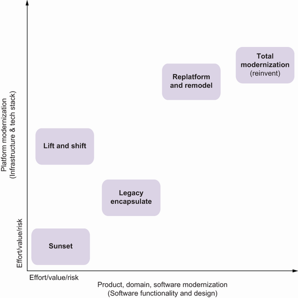

Figure 1.10 Architecture modernization overview より引用

ここまで技術・事業・組織を別々に掘り下げてきた。発表では便宜上3つに分けたが、実際の現場ではこの3つは常に同時に起きている。<strong>Bounded Contextの境界を引くことは、同時にチームの担当範囲を決め（組織）、どこに投資するかを決める（事業）ことでもある。</strong>

裏を返せば、境界設計の失敗は3つすべてに響く。言葉の境界を無視すれば共有データベースの罠にはまり（技術）、Core Domainに集中できず（事業）、チーム間の調整が増える（組織）。<strong>3つの軸は交差している。1つだけ考えた瞬間に、部分最適が始まる。</strong>

---

## 1つだけ動かすと何が起きるか

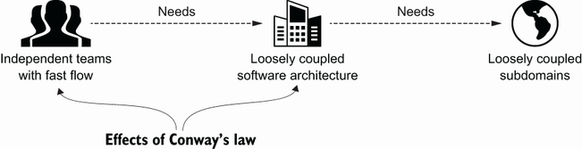

Figure 2.1 Effects of Conway's law（Architecture Modernization）より引用

<strong>技術だけ動かすと</strong>

マイクロサービスに分割しても、チーム構造がモノリスのまま。コンウェイの法則がアーキテクチャを元の形に引き戻す。

<strong>事業だけ動かすと</strong>

Core Domainを特定しても、技術的な境界がそれを反映していなければ密結合のまま。

<strong>組織だけ動かすと</strong>

チームを再編しても、何に集中すべきかが定まっていなければ認知負荷を最適化できない。

1つだけ動かせば、残り2つが設計図を上書きする。

---

## 組織的な慣性と銀の弾丸

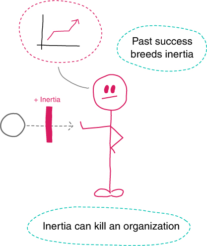

Figure 1.14 Inertia（Architecture for Flow）より引用

なぜ多くの組織が1つの軸だけを動かしてしまうのか。過去の成功体験が慣性を生む。ある技術を選定した人がまだ社内にいれば、その技術を否定することは人を否定することになる。変更の技術的コストよりも、この<strong>組織的な慣性</strong>の方がはるかに大きい。

「これを入れれば解決する」が心地よいのは、慣性に向き合う苦痛を回避できるから。マイクロサービス、クラウドネイティブ、AI——手段の名前は変わるが、<strong>「銀の弾丸を求める」構造は同じ</strong>。導入した瞬間に「何かをやった」実感が得られる。しかし問題の構造は変わっていない。

慣性に向き合う苦痛を省略した瞬間に、雰囲気が戦略の代わりを務め始める。

---

## 診断から始めるモダナイゼーション

Figure 16.8 Modernization core domain chart より引用

モダナイゼーションには順序がある。まず現状を診断し、次にドメインと進化段階を可視化し、それからチーム設計と技術選定に進む。「Kubernetesを導入しよう」「マイクロサービスに分割しよう」——これらは診断の結果として出てくるべき結論であって、出発点ではない。

<strong>診断とは具体的に何か。</strong>「技術的負債がある」では診断にならない。「受注管理システムのこの部分が、新規プラン追加のリードタイムを3ヶ月にしており、事業の成長を阻害している」——ここまで掘り下げて初めて、どの境界から手をつけるか、どのチームを再設計するかが見えてくる。

---

## 小さく変え、小さく証明する

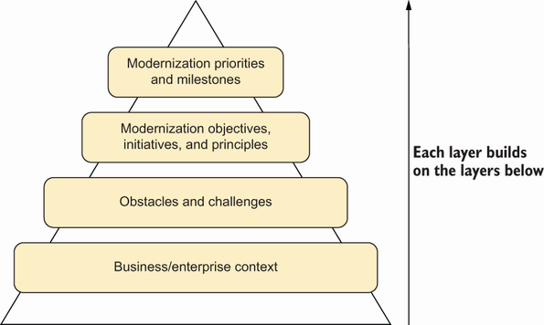

Figure 16.1 Strategy pyramid（Architecture Modernization）より引用

ビッグバン方式——最後に一括でリリースする——は失敗の典型。戦略は4層で組み立てる。まず<strong>ビジネスの文脈</strong>を理解し、次に<strong>障害と課題</strong>を特定し、<strong>モダナイゼーションの目標</strong>を定め、最後に<strong>優先順位とマイルストーン</strong>を決める。各層が下の層の上に成り立つ。

Nick Tuneはこれを<strong>「Nail it then scale it（まず小さく成功させ、それから広げる）」</strong>と呼ぶ。技術用語ではなくビジネス成果の言葉で語り、<strong>3〜6ヶ月で価値を証明する</strong>。まず1つのバリューストリームで成果を出し、その実績をもとに横展開する。

計画の精度を上げることに時間を使うより、最初の一歩を早く踏み出すほうが、学びの総量は多い。

---

## モダナイゼーションの成果物は何か

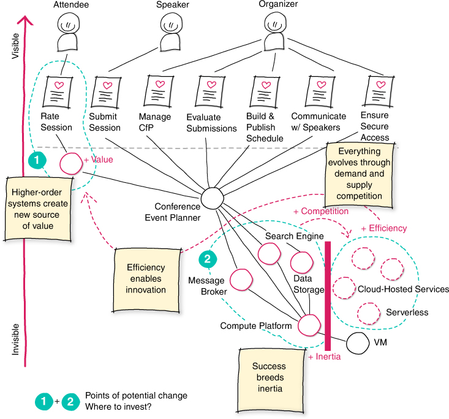

Figure 1.17 Where to invest（Architecture for Flow）より引用

モダナイゼーションのゴールは「完成したアーキテクチャ」ではない。<strong>変化し続ける力そのもの</strong>。境界設計を学べばチーム設計が必要になり、チーム設計を学べば進化段階の理解が必要になる。すべてが繋がっている。だからこそ、同時に動かす必要がある。

目指すべきは元に戻る力（レジリエンス）ではなく、<strong>壊れるたびに強くなる組織</strong>。小さく壊れ、そこから学び、前より強い設計を手に入れる。

---

## まだ途中だからこそ、今日から始められる

ここまで偉そうに話してきたが、自分のチームがこれを全部できているかと聞かれたら、答えは<strong>「まだ途中」</strong>。

モダナイゼーションの成果物はアーキテクチャではない。 診断する習慣そのもの。

3つを同時に語れる言葉はまだない。 でも、3つを同時に見直す習慣なら、今日から始められる。 レガシーを光栄に思える設計を残すには、3軸で診断し続けるしかない。

---

## 参考資料

- [アーキテクチャモダナイゼーション](https://www.shoeisha.co.jp/book/detail/9784798194073) - Nick Tune, Jean-Georges Perrin 著 / 株式会社スリーシェイク 訳（翔泳社, 2026）
- [Architecture for Flow](https://www.informit.com/store/architecture-for-flow-9780137899937) - Susanne Kaiser（Addison-Wesley, 2025）
- [チームトポロジー](https://pub.jmam.co.jp/book/b593881.html) - Matthew Skelton, Manuel Pais 著 / 原田騎郎, 永瀬美穂, 吉羽龍太郎 訳（日本能率協会マネジメントセンター, 2021）
- [Building Microservices, 2nd Edition](https://www.oreilly.com/library/view/building-microservices-2nd/9781492034018/) - Sam Newman（O'Reilly, 2021）
- [Domain-Driven Design](https://www.domainlanguage.com/ddd/) - Eric Evans（Addison-Wesley, 2003）
- [Wardley Maps](https://learnwardleymapping.com/) - Simon Wardley
- [ソフトウェア設計の結合バランス](https://book.impress.co.jp/books/1124101149) - Vlad Khononov 著 / 島田浩二 訳（インプレス, 2025）
- [Effective Platform Engineering](https://www.manning.com/books/effective-platform-engineering) - Ajay Chankramath, Sean Alvarez, Bryan Oliver, Nic Cheneweth（Manning, 2025）
- [良い戦略、悪い戦略](https://www.nikkeibp.co.jp/atclpubmkt/book/12/P50070/) - Richard Rumelt 著 / 村井章子 訳（日本経済新聞出版, 2012）

---

<!--
_backgroundColor: #0a1929
_color: white
_class: title dark
-->

# ありがとうございました

### @nwiizo

設計ナイト 2026 / 2026-04-10 
アーキテクチャモダナイゼーションとは何か

