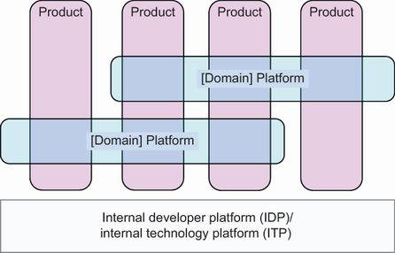
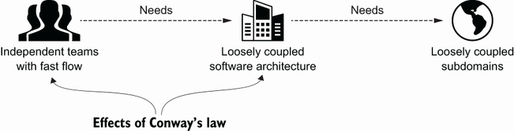

<!--
_backgroundColor: #0a1929
_color: white
_class: title dark
-->

# アーキテクチャ モダナイゼーション とは何か

### 翻訳者が全17章を訳して見えた本質

2026/04/10 設計ナイト 2026 武蔵野公会堂ホール 
@nwiizo 20min（19:10〜19:30）

---

<!-- _backgroundColor: white -->

## nwiizo

株式会社スリーシェイクでプロのソフトウェアエンジニアをやっているものです。「アーキテクチャモダナイゼーション」（Manning, 2024）の翻訳者。

技術書翻訳を手がけるたび、わかることが1つ増えるのと引き換えに、わからないことが3つ増えていく。全17章を訳した体験から見えた本質をお伝えします。

インターネット上では **nwiizo** を名乗り、ブログ「**じゃあ、おうちで学べる**」を運営しています。X / GitHub もこのIDでやっています。

---

## アーキテクチャモダナイゼーションとは何か

技術・事業・組織を同時に進化させ、 変化し続ける能力を組織に埋め込むこと。

マイクロサービス化でもクラウド移行でもない。リプレースでもリライトでもない。

**ソシオテクニカル** — 技術システムと社会システム（組織・チーム・文化）を統合的に設計する思想。Sam Newmanが言うように「**ソフトウェアを変えるだけでは足りない。組織も同時に変えなければ、同じ問題が形を変えて再現される**」。

---

<!--
_backgroundColor: #0a1929
_color: white
_class: transition
-->

技術で大事なこと

---

## 疎結合 — 独立デプロイ可能性が唯一の本質的価値

Figure 12.1 Loosely coupled architecture より引用

**Newman: 「独立デプロイ可能でなければ、マイクロサービスにする意味がない」**

疎結合の本質は技術的な美しさではなく、**チームが他のチームに依存せずに変更をリリースできること**。

**4パターン**: 非同期メッセージング、APIゲートウェイ、イベント駆動、データ所有権分離

**問い**: 「このサービスを独立してデプロイできるか？」

---

## Bounded Context — 境界を正しく引く

Figure 9.2 Bounded Context and its relationships より引用

**翻訳チームでの証明体験**

全17章の翻訳をチームで分担した。章ごとに用語の意味が微妙に異なることに気づいた。「Context」という言葉ひとつとっても、技術文脈・ビジネス文脈・組織文脈で指すものが違う。

**Bounded Contextは「翻訳の境界」**

同じ言葉が異なる意味を持つ境界こそが、システムを分割すべき場所。書籍のCh.9では、ドメイン境界を見つける**9つのヒューリスティック**が紹介されている。

---

## 関数型ドメインモデリング — 型で境界を守る

**ドキュメントに書いても破られる。コードレビューで指摘しても漏れる。**

イベントストーミングでドメインを発見し、Bounded Contextで境界を定義した。だが、その境界をどう守るか？ 答えの一つが**コンパイラに守らせる**こと。

Scott Wlaschin「関数型ドメインモデリング」が提唱する **Make Illegal States Unrepresentable** —— 不正な状態を型レベルで表現不可能にするアプローチ。境界を越えるデータは必ず型変換を通る。型が合わなければコンパイルが通らない。

境界は「約束」で守るな。「型」で守れ。

---

## 段階的移行 — Strangler Figパターン

**ビッグバンは負債の再生産**

「一気に作り直す」は最もリスクの高い選択肢。2年間のフルリライトが完了した頃には、ビジネス要件が変わっている。

**Strangler Figパターン**

既存システムの周囲に新しいシステムを段階的に構築し、徐々に古いシステムを置き換える。Martin Fowlerが命名したこのパターンは、リスクを最小化しながら進化を可能にする。**各ステップでビジネス価値を提供しながら移行する。**

技術選定の前にドメイン戦略。

---

<!--
_backgroundColor: #0a1929
_color: white
_class: transition
-->

事業で大事なこと

---

## Core Domain — 差別化すべき領域の見極め

Core Domain Chart

**すべてのドメインが等しく重要ではない**

Eric Evansが提唱したCore Domainの概念。差別化度と複雑性の2軸で全ドメインを整理し、**どこに投資し、どこを手放すか**を判断する。

設計者が知るべきこと——**最も美しい設計が必要なのはCore Domainだけ**。Generic Subdomainに凝った設計を施すのは、差別化に使えるエネルギーの浪費。

---

## なぜプロダクトタクソノミーが必要か

Figure 6.6 A product taxonomy より引用

**「うちの製品は何個あるのか」——この問いに即答できる組織は少ない**

プロダクトタクソノミーは、組織が持つ製品・サービスを体系的に分類・整理する手法。モダナイゼーションの対象を明確にする前提条件。

**設計者にとっての意味**

システム境界を引く前に、ビジネス上の製品境界を理解する必要がある。技術的なモジュール分割がビジネスの製品境界と一致しなければ、設計は常に摩擦を生む。

---

## Wardley Mapping — 進化段階に応じた戦略

**すべてのコンポーネントは進化する**

Simon WardleyのWardley Mapは、ビジネスコンポーネントの進化段階（Genesis → Custom → Product → Commodity）を可視化する。進化段階に応じて、**設計方針も変わるべき**。

**Genesis/Custom**

不確実性が高い。実験的な設計が求められる。変更しやすさを優先。

**Product/Commodity**

安定している。標準化と効率性を優先。自前で持つ必要があるか疑う。

「作れる」から作るのではない。「作るべきか」を問う。

---

<!--
_backgroundColor: #0a1929
_color: white
_class: transition
-->

組織で大事なこと

---

## ソシオテクニカル — 技術と組織は同時に設計する

Figure 2.1 Sociotechnical systems より引用

**Sam Newman: 「ソフトウェアシステムとそれを構築・運用する組織は、共進化する単一のシステム」**

技術システムだけを最適化しても、組織が変わらなければ効果は一時的。組織だけを変えても、技術が追いつかなければ絵に描いた餅。**両方を同時に、整合性を持って動かす**のがソシオテクニカルアプローチ。

---

## コンウェイの法則 — 組織構造がアーキテクチャを決める

**「組織はそのコミュニケーション構造を反映したシステムを設計する」**（Melvin Conway, 1968）

設計者として知るべきことは2つ。第一に、どれだけ美しい設計を描いても、組織のコミュニケーション構造に反していれば実装されない。第二に、**逆コンウェイ戦略** — 望ましいアーキテクチャに合わせて組織を設計すれば、アーキテクチャは自然とそこに収束する。

---

## Team Topologies — 認知負荷を制約にチームを設計する

**チームの認知負荷を超えない範囲にシステムを分割する**

Matthew Skelton & Manuel Paisが提唱した4つのチームタイプと3つのインタラクションモード。設計者にとって重要なのは、**システムの境界 = チームの境界**という原則。

「このシステムをいくつに分割するか」の答えは「チームがいくつあるか」に依存する。**認知負荷** — あるチームが理解・保守できる範囲 — が唯一の制約。

---

## 「組織図を書き換えるだけ」では失敗する

**構造とプロセスの誤謬（Ch.2）**

組織図を変えれば組織が変わると信じるのは「構造の誤謬」。新しいプロセスを導入すれば行動が変わると信じるのは「プロセスの誤謬」。どちらも、**変化を「仕組み」に外注しようとする**点で同じ間違いを犯している。

実際に必要なのは、チーム間のインタラクションを意図的に設計し、**学習と信頼を積み重ねるプロセス**を組織に埋め込むこと。構造もプロセスも手段であって、目的は「チームが自律的に価値を提供できる状態」。

組織を変えずにアーキテクチャだけ変えたいは幻想。

---

<!--
_backgroundColor: #0a1929
_color: white
_class: transition
-->

3つを同時に動かすということ

---

## 3つの軸は独立していない

**技術の軸**

疎結合、Bounded Context、型による境界の保護、段階的移行

**事業の軸**

Core Domain、プロダクトタクソノミー、Wardley Mapping、ビジネスケース

**組織の軸**

ソシオテクニカル、コンウェイの法則、Team Topologies、学習する組織

技術だけ変えれば？ → 組織のサイロがアーキテクチャに再現される
事業だけ変えれば？ → 技術が追いつかず絵に描いた餅
組織だけ変えれば？ → 何のために変えたのか見失う

3つを同時に動かすのがモダナイゼーション。

---

## 翻訳者として伝えたいこと

**「変化し続ける能力を組織に埋め込む」**

全17章を訳して辿り着いた結論はシンプルだった。モダナイゼーションの目的地は「完成したアーキテクチャ」ではない。**変化し続ける能力そのもの**。

1つ理解するたびに3つの未知が生まれた。DDDを訳せばTeam Topologiesが必要になり、Team Topologiesを訳せばWardley Mappingが必要になり、Wardley Mappingを訳せばビジネス戦略の知識が必要になった。**すべてが繋がっている。だからこそ、同時に動かす必要がある。**

---

## 日本の製造業のカイゼンとソフトウェア設計の親和性

**訳者まえがきで書いたこと**

日本の製造業が世界に示した「カイゼン」の哲学は、小さな改善を継続的に積み重ね、品質を維持し続けるアプローチ。これはソフトウェアにおけるモダナイゼーションの思想と驚くほど親和性が高い。

**革命ではなく進化。** ビッグバンリライトは日本の「一気に変える」文化に合致するように見えて、実はカイゼンの精神に反している。小さく始め、学び、改善する——この繰り返しの中でしか、持続的な変化は生まれない。

技術・事業・組織——3つの軸で、小さくカイゼンし続けよ。

---

## 参考資料

- [Architecture Modernization](https://www.manning.com/books/architecture-modernization) - Nick Tune, Jean-Georges Perrin（Manning, 2024）
- [アーキテクチャモダナイゼーション](https://www.oreilly.co.jp/) - 日本語版、株式会社スリーシェイク訳
- [Team Topologies](https://teamtopologies.com/) - Matthew Skelton, Manuel Pais（IT Revolution, 2019）
- [Building Microservices, 2nd Edition](https://www.oreilly.com/library/view/building-microservices-2nd/9781492034018/) - Sam Newman（O'Reilly, 2021）
- [Domain-Driven Design](https://www.domainlanguage.com/ddd/) - Eric Evans（Addison-Wesley, 2003）
- [関数型ドメインモデリング](https://asciidwango.jp/post/769073029498839040/) - Scott Wlaschin（KADOKAWA, 2025）
- [Wardley Maps](https://learnwardleymapping.com/) - Simon Wardley
- [EventStorming](https://www.eventstorming.com/) - Alberto Brandolini

---

<!--
_backgroundColor: #0a1929
_color: white
_class: title dark
-->

# ありがとうございました

### @nwiizo

設計ナイト 2026 / 2026-04-10 
アーキテクチャモダナイゼーションとは何か

