<!--
_backgroundColor: #0a1929
_color: white
_class: title dark
-->

# 技術的負債の泥沼から 組織を救う 3つの転換点

### アーキテクチャモダナイゼーションの実践知

2026/03/04 EM Conf 2026 ホールB 
@nwiizo 40min（16:00〜16:40）

---

<!-- _backgroundColor: white -->

## nwiizo

株式会社スリーシェイクでプロのソフトウェアエンジニアをやっているものです。Nick Tune & Jean-Georges Perrin著「Architecture Modernization」（Manning, 2024）の日本語版に携わりました。

全17章を通じて見えてきたのは、**技術だけでは組織は変わらない**という事実。書籍で得た知見と、現場での実践を重ね合わせて得た**実践知**を、EMの言語でお伝えします。

インターネット上では **nwiizo** を名乗り、ブログ「**じゃあ、おうちで学べる**」を運営しています。X / GitHub もこのIDでやっています。

---

## about 3-shake

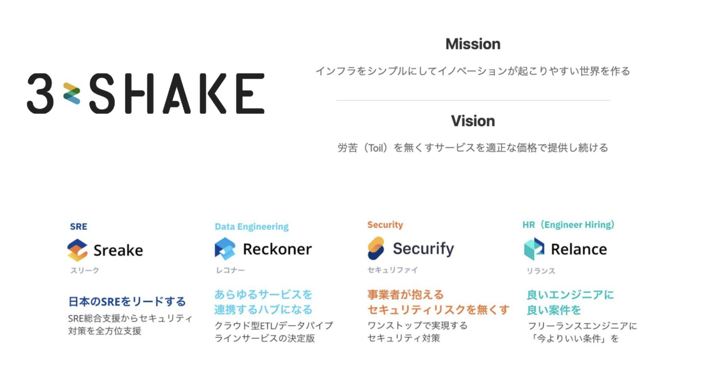

---

## Sreakeのお仕事

<strong>SRE/DevOps支援</strong>

- Kubernetes構築・運用
- クラウドネイティブ化推進
- Observability導入

<strong>アーキテクチャモダナイゼーション</strong>

- 現状分析・戦略策定
- 段階的な移行支援
- 内製化・伴走支援

<strong>こんなこともやっています: ML/LLMOps支援</strong> — ML基盤構築・運用、LLMアプリケーション開発、データ基盤最適化

ご依頼・ご相談お待ちしております 
https://sreake.com/

---

## この発表で解決できること

**こんな悩みを持っていませんか？**

- 技術的負債の投資を経営層にどう説明すれば？
- 「マイクロサービス化したい」という現場の声にどう応える？
- 優秀なエンジニアが負のサイクルで辞めていく
- 地味だが重要な仕事をどう評価すればいい？

**この発表で持ち帰れるもの**

- 技術的負債を**ビジネスリスク**として可視化する手法
- AMETによる**組織能力の育成**アプローチ
- **3-6ヶ月で成果を示す**学習サイクルの設計
- チーム構造をどう設計すべきかの判断軸

<strong>技術だけでは組織は変わらない。学ぶ力・語る力・始める力——3つの転換点で「技術の問題」を「組織の問題」に捉え直す</strong>

---

<!--
_backgroundColor: #0a1929
_color: white
_class: transition
-->

なぜ「技術的問題」では解けないのか

問題提起 — 技術・組織・人間、3つの壁を順に見ていく

---

## よくある話：技術的には成功したモダナイゼーション

**完了したとき、設計はすでに陳腐化していた**

こんな話を聞いたことはないだろうか。1〜2年かけてマイクロサービスに移行した。技術的には「成功」だった。しかし完了した頃にはビジネス要件が変わり、サービス境界が実態と合わなくなっていた。あるチームが管轄するサービスに別チームのビジネスロジックが入り込み、デプロイのたびに複数チーム合同の調整会議が必要になった。

**何が間違っていたか**

技術的な正しさだけを追求した。ビジネスの変化速度を考慮しなかった。組織構造を変えずに技術だけ変えた。

**なぜ繰り返されるのか**

技術・事業・組織を同時に動かす方法論が共有されていない。結果、技術だけが先行し、同じ構造の失敗が組織を越えて再生産される。

この話に心当たりがある方は、少なくないのではないでしょうか。技術的には正しいことをやった。それでも組織は変わらなかった。本発表では、この構造を3つの転換点から解きほぐしていく。

革命は負債の再生産。進化だけが持続する。

---

## なぜ今モダナイゼーションが急務なのか

**時代遅れのアーキテクチャはビジネスリスクであり、競争上の不利益をもたらす**

十分に管理されているアーキテクチャであっても、時間とともに劣化する。ビジネス戦略の変更、使われなくなった古い機能、後片付けされなかった応急処置、時代遅れの技術——要因はさまざまだが、<strong>企業が成長するにつれ機敏なスタートアップから硬直化した老舗企業へ退化するのは避けられないように思える</strong>。だが実際には、これは宿命ではなく構造の問題。

**モダナイゼーションは短期的な妥協を要求する**

本来ならプロダクト改善に費やされるはずの時間と資金の投資を意味する。この短期的な妥協が、多くのリーダーを躊躇させ、レガシーシステムでの作業を続けさせる。

**その躊躇が負のサイクルを回す**

既存システムにさらなる複雑性を積み上げ、モダナイゼーションのコストが増加し、リーダーがさらに投資を躊躇する。<strong>先送りすればするほど、先送りが合理的に見える構造</strong>ができあがる。

世の中のますます多くのことがソフトウェアで動く以上、この負のサイクルを放置するコストは拡大し続ける。

---

## この負のサイクルをどう断ち切るか

Nick Tune & Jean-Georges Perrin著

**モダナイゼーションは技術の刷新ではなく、ソシオテクニカルな変革**

表面的にはアーキテクチャモダナイゼーションは純粋な技術的取り組みに見える。だがより詳しく見ると、モダンアーキテクチャの可能性を真に活用するには技術やパターンの先を見据える必要がある。組織構造、チームへの権限移譲、ドメイン境界の設計——<strong>技術的側面と社会的・組織的側面の両方を同時に動かす</strong>ことが求められる。

**本発表が依拠する実践知**

Nick TuneとJean-Georges Perrinはこの包括的なアプローチを「Architecture Modernization」として体系化した。日本語版の翻訳に携わる中で見えてきたのは、全17章を貫く一つの原則——<strong>技術だけ変えても負のサイクルは断ち切れない</strong>ということ。本発表では、この書籍の知見と現場での実践を重ね合わせた3つの転換点を提示する。

技術的負債は「技術」だけの問題ではない。では、その正体とは何か。

---

## なぜ技術的負債は技術だけでは返済できないのか

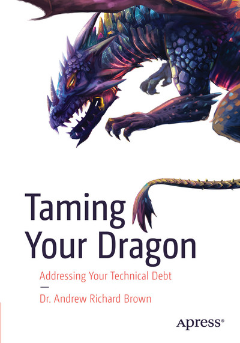
Dr. Andrew Richard Brown著（Apress）

数字で見えるのは表面だけだ。技術的負債の本質は、その多層構造にある。Andrew Richard Brown氏はこれを<strong>ドラゴン</strong>に喩えた。ドラゴンは一つの頭を切り落としても別の頭が襲ってくる——のではなく、<strong>そもそも全貌が見えないほど巨大で、どこから手をつけても絶望的に感じる存在</strong>として組織の前に立ちはだかる。コードを直しても組織が変わらない。組織を変えても文化が追いつかない。その圧倒的な無力感こそが、技術的負債の本当の脅威。

Brown氏はこのドラゴンの正体を<strong>5層の玉ねぎモデル</strong>として解剖した。表面のTechnical層を剥いても、その下にTrade-off、Systems、Economics、Wicked Problemsという4つの層が隠れている。Ward Cunninghamが本来語った「負債」は理解と実装の乖離だったが、現実の組織では<strong>コードの裏に、意思決定の歪み・組織構造・利害対立・社会的複雑性が絡み合っている。</strong>

技術的負債は「技術」の問題ではない。それが本発表の出発点。

---

## 玉ねぎモデルが示す5つの層

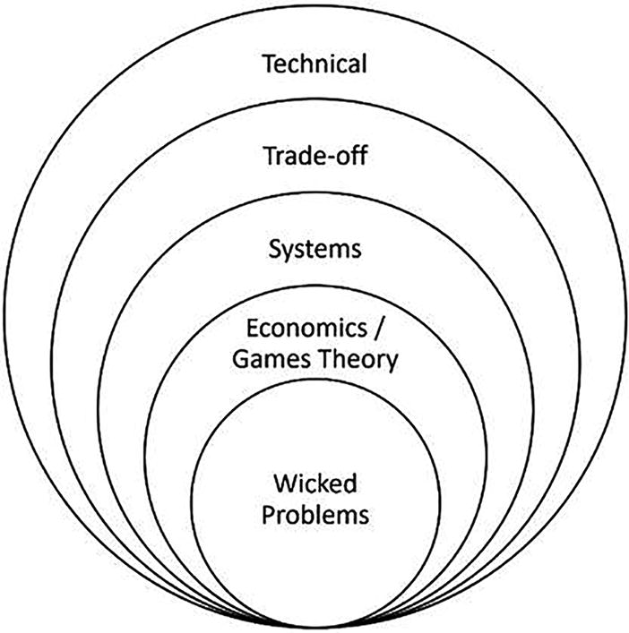

Figure 1-1 The technical debt onion model より引用

表面の<strong>Technical層</strong>はコード品質やアーキテクチャの不整合。その原因は<strong>Trade-off層</strong>——人間は即時的・確実な利益を優先する。さらに深くには<strong>Systems層</strong>の組織構造が負債を再生産し、<strong>Economics層</strong>では利害対立が構造化される。最深部の<strong>Wicked Problems層</strong>ではステークホルダーごとに世界観が異なり、解決策は「正しい/間違い」ではなく「良い/悪い」で判断される。

「技術的負債を返済しよう」と言うとき、自分が今どの層と向き合っているのか意識してほしい。コードを書き直すだけなのか、意思決定の構造を変えるのか、組織の力学に介入するのか。<strong>層を間違えた介入は、表面を磨いて根を放置する行為になる。</strong>

「どの層の負債か」を問え。層を間違えた介入は、負債を再生産する。

---

## 放置された負のサイクルは組織全体を蝕む

Figure 1.3 The negative cycle より引用

レガシーシステム → 開発速度低下 → 優秀な人材の流出 → さらなる品質低下 → より深刻なレガシー化

**この負のサイクルは、技術だけでは断ち切れない。**

この負のサイクルを定量化する枠組みがある。**質・速度・安全・幸福の4軸のバランス**が崩れるとサイクルに陥る——Jon Smart氏がBVSSHモデルとして体系化した視点だ。速度だけ追求しても、安全と幸福が犠牲になれば持続しない。

技術的負債は、返済させない組織の力学が生み出している。誰も意図していないのに、構造が負債を再生産する。

---

## 最もよくある罠は「技術で解決できる」という思い込み

負のサイクルを目の前にしたとき、最初に手が伸びるのは技術的な解決策だ。マイクロサービス、Kubernetes、クラウド移行——どれも強力な道具だが、<strong>道具を入れ替えることと、負のサイクルを断ち切ることは別の行為</strong>である。組織構造もプロセスも変えずに技術だけ変えると、新しい道具の上で同じサイクルが回り始める。

なぜ技術に手が伸びるのか。それは技術が最も「変えやすく見える」層だからだ。玉ねぎモデルの外側ほど変更は容易に見えるが、内側の層が変わらなければ外側の変更は吸収される。では、最も多くの組織が飛びつく「銀の弾丸」とは何か？

技術の問題に見えるものの多くは、組織とプロセスの問題が技術に表出しているだけ。

---

## 「マイクロサービスにすれば解決する」のか？

**最も多い「銀の弾丸」がマイクロサービス**

エンジニアから「マイクロサービスにしたい」という声が上がる。経営層は「それで何が解決するのか」と問う。答えに詰まるのは、問いの立て方が間違っているから。

**問い：マイクロサービスにすべきか？**

これは技術選定の問い。答えは「場合による」で終わる。

**正しい問い：独立してデプロイ・進化できる単位は？**

マイクロサービスを採用する本当の理由は、より高度な組織の自律性を可能にすること。これは技術ではなくビジネスと組織の問い。ドメイン境界、チーム構造、デプロイ戦略を同時に考えることになる。**答えがモノリスでも、それが正しいなら正しい。**

「どう作るか」の前に「何を独立させるか」を問え。

---

## マイクロサービスの著者自身が警告している

Sam Newman氏「Building Microservices」（第2版, 2021）もこう書いている。

**「マイクロサービスは目標ではなく手段。独立デプロイ可能性を達成する手段の一つに過ぎない」**

Newmanは第2版でこう書き直している。第1版が「誤読された」というより、マイクロサービスという言葉が持つ響き自体が「これを入れれば解決する」という印象を生んでしまった。技術コミュニティがそれを求めていたし、成功事例が目立つほど「うちもやるべきだ」という空気が強まった。Newman自身もその空気の中で書いていた。

だからこそ第2版では、マイクロサービスを「いつ使うべきでないか」に多くの紙幅を割いている。問うべきは「マイクロサービスにすべきか？」ではなく「独立してデプロイ・進化できる単位はどこか？」。**技術選定の前にドメイン戦略**。答えがモノリスでも、それが正しいなら正しい。

---

## コンウェイの法則が新システムを再び複雑にする

Figure 2.1 Sociotechnical architecture より引用

**「組織はそのコミュニケーション構造を反映したシステムを設計する」**（Melvin Conway, 1968）

業界でよく見られるのは、コンウェイの法則の力を無視してアーキテクチャを考え出そうとすることだ。ソフトウェア設計で実現したいことと、組織設計がそれを阻害するというミスマッチが生じ、多くの摩擦と問題が生まれる。**技術を変えても組織を変えなければ、同じ問題が形を変えて再現される。**

組織を変えずにアーキテクチャだけ変えたいは幻想。

---

## 理想のアーキテクチャから組織を逆設計する

**コンウェイの法則が避けられないなら、逆に利用する**

前のスライドで見た通り、独立したチーム・疎結合なアーキテクチャ・疎結合なサブドメインは互いを必要とする。「逆コンウェイ戦略」とは、先に理想のアーキテクチャを描き、それに合わせて組織構造を設計するアプローチ。

<strong>従来のアプローチ</strong>

既存の組織構造のまま、技術だけを変える。結果として、新しいアーキテクチャが既存の組織の歪みを引き継ぐ。

<strong>逆コンウェイ戦略</strong>

「どんなアーキテクチャが望ましいか」を先に設計し、それを実現できるチーム構造を作る。<strong>アーキテクチャと組織を同時に設計する。</strong>

組織設計はアーキテクチャ設計。技術だけでなく、組織構造も同時に変えなければならない。

---

## 技術×組織×学習文化の3軸で問題を捉え直す

**ここまでの問題提起を整理する**

純粋にツールやテクニックだけで解決できるモダナイゼーションの問題はほとんどない。技術的負債は技術の問題ではない。組織構造の問題であり、学習文化の問題であり、変化への抵抗の問題。この3つの軸を同時に動かさなければ、モダナイゼーションは成功しない。

**第1の壁：技術だけでは解けない**

ドメイン境界の設計、段階的な移行パターン、適切な粒度の選択

**第2の壁：組織が構造的に変われない**

チーム設計、コンウェイの法則への対処、評価制度の見直し

**第3の壁：人間が変化に抵抗する**

対話の場の設計、実験と振り返り、知識の横展開

3つの壁は独立していない。技術の壁を越えようとすると組織の壁にぶつかり、組織の壁を越えようとすると人間の壁にぶつかる。この入れ子構造こそが、モダナイゼーションの本質的な難しさ。

3つの壁は入れ子になっている。どれか1つを解いても、残り2つが足を引っ張る。

---

<!--
_backgroundColor: #0d1b3e
_color: white
_class: transition
-->

では、この3つの壁をどう越えるか？

学ぶ力（転換点1）→ 語る力（転換点2）→ 始める力（転換点3）。この順番には依存関係がある——学ぶ力がなければ語る言葉を持てず、語る力がなければ始める仲間を集められない。順番を飛ばせば、その先で必ず壊れる。

---

<!--
_backgroundColor: #0a1929
_color: white
_class: transition
-->

転換点1

AMETという触媒で組織能力を引き出す

なぜ最初に「学ぶ力」なのか——優先順位を正しく判断する土壌がなければ、何をやっても砂上の楼閣

---

## 「構造的無能化」はなぜ起きるのか

宇田川元一著（日経BP, 2024）

組織が成功し環境に適応すると、分業化・ルーティン化が進み、思考の幅と質が制約され、目先の問題解決を繰り返して疲弊していく——**「構造的無能化」（宇田川元一氏）** は、成熟した組織にとって宿命だ。**誰かが悪いのではなく、構造が変化を阻む。** Christensen氏の「イノベーションのジレンマ」も同じ構造を指摘している——既存顧客への最適化が、破壊的変化への盲点を生む。

### 3つの症状とモダナイゼーションへの影響

| 症状 | 説明 | モダナイゼーションへの影響 |
|-----|------|------------------------|
| **断片化** | 分業化しすぎて縦割りに | チーム間の壁、サイロ化 |
| **不全化** | 変化を察知して自ら動けない | 「誰かが決めてくれる」待ち |
| **表層化** | 場当たり的な対応しか取れない | 銀の弾丸への期待 |

断片化→不全化→表層化は連鎖する。分業の壁が情報を遮断し、変化を察知できなくなり、やがて場当たり的な対応しか取れなくなる。<strong>3つの症状は独立ではなく、ドミノ倒しのように進行する。だからこそ、組織が自ら学び変わる力を引き出す触媒——AMETが必要になる。</strong>

<strong>成功した組織ほどこの罠にはまる。乗り越える糸口は「対話」</strong>

---

## AMETは答えを教えず自律を促すイネーブリングチーム

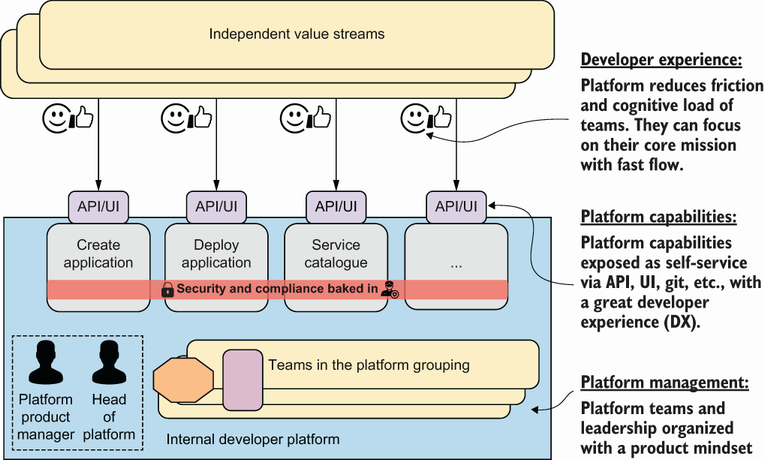

Figure 15.1 AMET より引用

**Architecture Modernization Enabling Team**

外部から「正解」を持ち込むコンサルではない。組織が自ら発見し、自ら変わる力を引き出すイネーブリングチーム。

**AMETの原則**

- ファシリテーションが中心。答えを教えない
- EventStorming、Wardley Mappingなどの手法を組織に根付かせる
- チームの自律性を高め、自分たちで続けられる状態を目指す
- **支援の質は、支援が不要になる速さで測る**

---

## AMETの編成と解散のタイミング

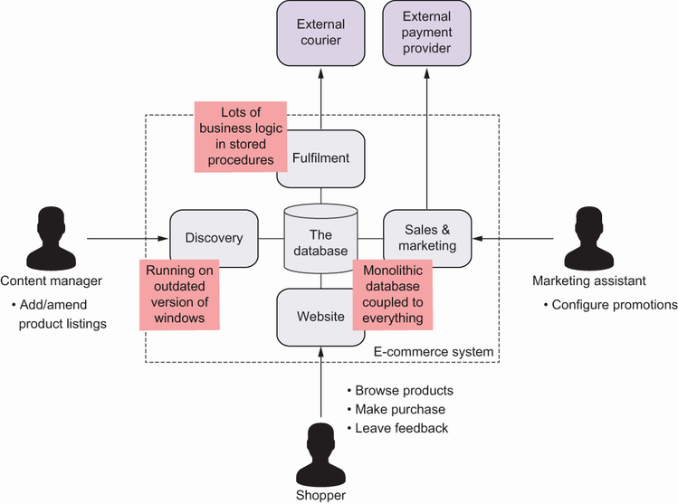

Figure 4.4 Listening tour より引用

**ライフサイクル4フェーズ**

1. **準備**：リスニングツアーで現状を把握。ステークホルダーとの信頼構築
2. **キックスタート**：EventStormingなど初回ワークショップの実施
3. **伴走**：チームが自走するまでペアリングとファシリテーション
4. **撤退**：チームが手法を内製化したら解散。依存関係を残さない

**メンバー構成の指針**

ドメインエキスパート、テクニカルリード、ファシリテーターの3役が最低限必要。全員がフルタイムである必要はないが、**片手間では機能しない**。最低でも50%以上のコミットメントを確保する。

---

## AMETの6つの責務

前半3つは<strong>モダナイゼーションを「動かす」</strong>責務、後半3つは<strong>「根付かせる」</strong>責務。AMETが去った後も組織が自走できる状態を作ることが最終目標。

<strong>1. キックスタート</strong>

最初のEventStormingを企画し、対話の場を設計する。<strong>「最初の一歩」を踏み出すこと</strong>が最優先。

<strong>2. モメンタム維持</strong>

Quick Winsと定期ショーケースで進捗を可視化。<strong>成果が見えないと組織は元に戻る</strong>。

<strong>3. 設計促進</strong>

EventStorming、Wardley Mapping等をファシリテート。<strong>チームが自ら設計できるよう導く</strong>。

<strong>4. 持続的変化</strong>

学習サイクルを組織に埋め込む。<strong>仕組みとして根付かせ、AMETなしで回る状態を目指す</strong>。

<strong>5. ビジョン共有</strong>

技術者とビジネス側の共通言語を作る。<strong>「なぜやるのか」を全員が説明できること</strong>が指標。

<strong>6. 学習共有</strong>

成功も失敗もドキュメント化。<strong>横展開の仕組みがないと各チームがゼロから再発明する</strong>。

AMETの成功基準は「自分たちが不要になること」。依存関係を残さない。

---

## AMETの実践：EventStormingで「見える化」する

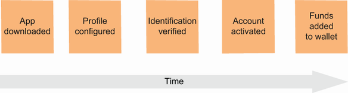

EventStorming Timeline

**「正確さ」ではなく「学び」のために設計された手法**

イベントストーミングは正確なモデルを作ることが目的ではない。ドメインイベント（ビジネス上の出来事）を時系列に並べ、参加者が持っている知識を持ち寄り、対話の土台を作る。あらかじめ既存の組織構造やドメイン境界という枠を与えず、<strong>混沌の中から自然に浮かび上がるパターン——「創発的な境界」に目を向ける</strong>。

**ファシリテーションのコツ**

- 最初の30分は「とにかく付箋を貼る」。批判しない
- ビジネス側には「普段の仕事の流れを教えてください」と問う
- **ホットスポット**（赤い付箋）で問題箇所をマーク
- 2時間以上やらない。集中力が切れたら次回に
- **技術者だけの会議にしない** — ビジネス側も対等に参加

---

## AMETの実践：Wardley Mappingで戦略を可視化する

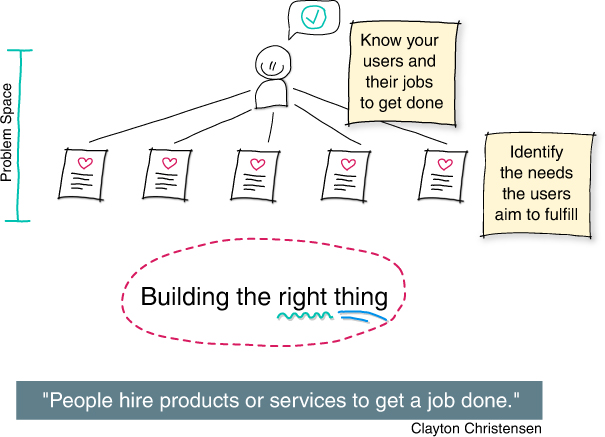

Figure 1.1 Starting from the user perspective to build the right thing より引用

**「何を正しく作るか」の前に「正しいものを作っているか」**

Wardley Mapは、ユーザーのニーズを起点にビジネスコンポーネントの進化段階を可視化するツール。**何を自社で持ち、何を外部に任せるか**をビジネス価値の文脈で判断できる。

**Genesis → Custom → Product → Commodity**

各コンポーネントには進化段階がある。Genesisは不確実性が高く実験的投資が必要。Customは差別化要因。Productは市場に選択肢がある。Commodityは当たり前のもの。ここで重要なのは、**「コア」など固定されたものは存在しない**ということ。すべては過渡的であり、今日のCustomは明日のCommodityになりうる。技術選定を「好み」ではなく**進化段階に基づく合理的な判断基準**で行う。

参考: Architecture for Flow（Susanne Kaiser, 2025）

---

## 戦略サイクルが示す意思決定の構造

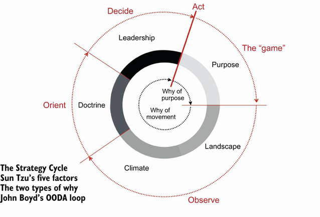

Figure 5.1 The Strategy Cycle (Source: Simon Wardley) より引用

**Purpose → Landscape → Climate → Doctrine → Leadership**

戦略サイクルは「なぜ？」（Purpose）から始まり、状況を把握し（Landscape）、変化を読み（Climate）、原則を適用し（Doctrine）、最後に「何をする？」（Leadership）で終わる。

だが多くの組織はPurposeからいきなりLeadershipに飛ぶ。「マイクロサービスにしよう」「AIを導入しよう」——これらは状況認識なき意思決定。現状を可視化する手間を省き、直感で戦略を決める方が「速い」と感じるから。だがそれは速さではなく、単なる省略。

---

## 多くの組織は状況認識を飛ばして意思決定する

<strong>なぜ飛ばすのか</strong>

状況把握には手間がかかる。関係者を集め、現状を可視化し、前提を問い直す——このプロセスは「遅い」ように見える。だから多くの組織は目的から直接判断に飛び、速さと引き換えに構造的な盲点を抱える。

<strong>だからAMETがWardley Mappingを導入する</strong>

Landscapeを可視化し、Climateを読み、Doctrineを組織に埋め込む。このプロセスを経た意思決定だけが変化に耐える。<strong>ツールを導入して終わりではない。組織が自らこのサイクルを回せるようになることがゴールだ。</strong>

目的から直接意思決定に飛ぶとき、戦略は直感と区別がつかなくなる。

---

## AMETの成功は組織の自立で測る

**モダナイゼーションで最も難しいのは着手すること。2番目に難しいのは勢いを維持すること。** 従来のやり方に逆らって進む以上、強い意志がなければ物事は元に戻る。では、AMETの「成功」を何で測るか？

**成功パターン**

- 社内チームが手法を自分のものにする
- AMETがいなくてもEventStormingを自発的に開催
- 「次は自分たちでやれます」という言葉が出る

**失敗パターン**

- AMETに依存し続ける（永続的な外注化）
- 手法だけ導入してファシリテーションが機能しない
- 「やらされている」感がチームに広がる

**持続可能な変化は、組織の内部から生まれなければならない。** 多くの企業はモダナイゼーションを外部に委託するが、それがうまくいくことは稀だ。AMET解散後も組織が自走できるかが最終指標。

支援の質は、支援が不要になる速さで測る。

---

## なぜAMETは答えを教えず発見を促すのか

AMETがファシリテーションに徹するのは、教育的配慮ではない。<strong>発見のプロセスを省略すると、組織に確信が根付かない</strong>という構造的な理由がある。

<strong>EventStormingが答えを教えない理由</strong>

表面的で限られた理解に基づいて重大なアーキテクチャ上の意思決定をするリスクは大きい。技術者とビジネス側が同じ部屋で、一緒にビジネスフローを発見する過程が、共通理解と当事者意識を同時に生む。効率化ではなく、<strong>発見のプロセスそのものが目的</strong>。

<strong>答えを速く教えることの代償</strong>

答えを教えれば速い。だが、発見のプロセスを経ていない意思決定に、人は当事者意識を持てない。困難に直面したとき、分析レポートは支えにならない。<strong>「自分たちで見つけた」という確信だけが、戦略を折れさせない力になる。</strong>

答えを教えれば速い。だが、発見を経なければ当事者意識は生まれない。

---

<!--
_backgroundColor: #0a1929
_color: white
_class: transition
-->

転換点2

Core Domain Chartでビジネスの痛みを可視化する

転換点1でAMETが組織に「学ぶ力」を埋め込んだ。だが学ぶ力だけでは動けない。Core Domain Chart——自社のドメインを差別化度と複雑性の2軸で整理し、どこに集中投資すべきかを可視化する道具——で、経営層が投資を決断できる言語を作る。

---

## 経営層が理解するのは「ビジネスリスク」だけ

**「技術的負債があるので投資が必要です」——この説明で予算は取れない。**

「技術的負債」「リファクタリング」「クラウドへの移行」——これらの用語は、エンジニアリング部門以外の人々にモダナイゼーションの価値を認めさせるほどの動機付けにはならない。経営層が理解するのは「リスク」「機会損失」「競争優位性」という言語。ビジネス上の利点を伝えられないエンジニアは、「単に楽しみのためにシステムを書き直したいプログラマー」として認識されてしまう。

**技術者の言語**

「コードが複雑で保守が困難」「テストがない」「デプロイに3日かかる」

**経営層の言語**

「新機能のリリースが競合より3ヶ月遅い」「障害で年間X億円の逸失利益」「採用で負けている」

技術の痛みをビジネスリスクに変換せよ。だからこそ、技術の問題をビジネスの言語に翻訳する道具が必要になる。

---

## Core Domain Chartで差別化度と複雑性を整理する

Core Domain Chart

**2つの軸で全ドメインを整理する**

- **縦軸：差別化度** — 自社の競争優位性にどれだけ貢献するか
- **横軸：複雑性** — 技術的・ビジネス的な複雑性の度合い

**各象限の投資判断**

- **Core Domain**（高差別化・高複雑性）→ 最優先で投資。最強のチームを配置。ただし企業のITのうち戦略的となるのは5〜20%にすぎない
- **Supporting**（低差別化・高複雑性）→ 簡素化 or 外注。ビジネスの根幹を支えていても、差別化の余地がなければ戦略的コアではない
- **Generic**（低差別化・低複雑性）→ SaaS/OSSで済ませる。車輪の再発明をせず外部に任せる勇気が要る

---

## 何のために技術投資するのか

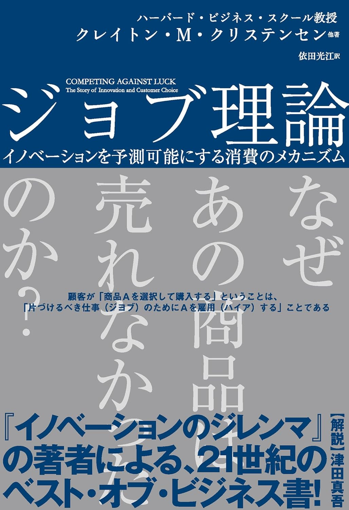
Clayton M. Christensen 他著（Harper Business, 2016）

<strong>「顧客はプロダクトを買うのではない。片付けるべきジョブのためにプロダクトを雇う」</strong> — Christensen氏のジョブ理論は、イノベーションの成否を「顧客の真のジョブを発見できたか」で説明する。プロダクトの機能ではなく、顧客の状況と進歩への欲求を理解することが出発点。

私がこの視点をモダナイゼーションに持ち込む理由は明確で、Core Domainの判定基準がまさにこれだからだ。技術的複雑性ではなく、<strong>顧客のジョブにどれだけ深く応えているかが差別化を決める</strong>。効率化には理論的上限がある——コード生成やテスト自動化で作業を安く速くしても、効率化だけを価値とするプロダクトはより安い代替に置き換えられる。<strong>効率化で浮いたリソースを、まだ解けていないジョブの発見に向けられるかどうかが分水嶺。</strong>

---

## 解決策の構築は加速できても課題の発見は加速できない

ソフトウェア開発の難しさは2層に分かれる。顧客の課題を解く<strong>ソリューションを構築する難しさ</strong>と、そもそも<strong>解くべき課題が何かを発見する難しさ</strong>。AIが劇的に加速するのは前者だけだ。

<strong>AIが加速できるもの——解決策の構築</strong>

コード生成、テスト作成、リファクタリング、ドキュメント整備——ソリューションの構築速度はAIが劇的に上げる。DORA 2025が示す個人の生産性向上やチーム内の開発効率化はここに当たる。

<strong>AIが加速できないもの——解くべき課題の発見</strong>

顧客がどんな状況で、何を成し遂げたいのか。解くべき課題は製品の属性やユーザーの統計データからは見えない。特定の状況下での苦闘を観察し、機能的・感情的・社会的な側面を理解して初めて輪郭が見える。

AIが解決策の構築を速くするほど、解くべき課題の発見だけが残る。

---

## なぜ解くべき課題の発見はAIで解けないのか

顧客属性や製品属性の相関データからは、解くべき課題は見えない。課題を駆動するのは「特定の状況下で何を成し遂げたいか」という因果構造であり、これは観察と対話からしか得られない。

<strong>相関はあっても因果がない</strong>

AIが扱えるのは「何が起きたか」の相関データ。だが課題を駆動するのは「なぜその状況でその選択をしたか」という因果構造。営業が感じている顧客の苦闘、開発が抱く違和感、経営が見ている市場の変化——異なる視点が衝突して初めて課題の輪郭が見える。

<strong>同じ製品でも状況が変われば課題が変わる</strong>

同じ製品でも、顧客の状況が変われば求められる理由は全く違う。同様に、同じシステムでもどのチームがどの文脈で使うかでCore Domainの意味が変わる。<strong>状況を抜きにした課題の定義は存在しない。</strong>

解くべき課題は相関データからは見えない。特定の状況下の苦闘を観察して初めて因果が見える。

---

## なぜ技術の正論は経営層に届かないのか

Core Domainを特定しても、それだけでは投資判断は動かない。技術者と経営層の間には<strong>言語の構造的な断絶</strong>がある。

<strong>技術者が語る言語</strong>

「複雑性」「保守性」「テストカバレッジ」——これらは技術の内部品質を表す言葉であり、意思決定者にとっては<strong>判断材料にならない</strong>。どれほど正確でも、投資の優先順位を決める軸とは違う。

<strong>経営層が判断する言語</strong>

「市場投入の遅延」「機会損失」「人材流出のリスク」——経営層が動くのは<strong>事業の継続性が脅かされている</strong>と認識したとき。技術的正しさではなく、ビジネスリスクの大きさが意思決定を駆動する。

問題は技術の正論が間違っていることではない。正論が届く言語で語られていないことだ。

---

## 翻訳とは構造を変えることである

「技術的負債がある」を「ビジネスリスクがある」に言い換えるだけでは翻訳にならない。<strong>意思決定の構造そのものを変える</strong>必要がある。

<strong>翻訳前の構造</strong>

技術者が内部品質の問題を報告し、経営層が「今期は優先度が低い」と判断する。技術者は正しいことを言っているが、経営層も合理的に判断している。<strong>どちらも正しいのに投資が進まない</strong>——これが構造の問題。

<strong>翻訳後の構造</strong>

技術の状態を<strong>事業の選択肢の制約</strong>として提示する。「この技術的状態が続くと、次の四半期にこの事業判断ができなくなる」——経営層が自分の意思決定の文脈で技術投資を評価できる構造に変える。

翻訳の本質は言い換えではない。経営層が自分の判断軸で技術投資を評価できる構造を作ること。

---

## 見えない仕事をどう評価するか

**人は「何ができるか」に注目し、「何を防いでいるか」を軽視する**

機能的価値（新機能、画面、API）は目に見える。非機能要件（セキュリティ、コンプライアンス、可用性、属人化リスク）は目に見えない。だが、システムの長期的な存続を決めるのは後者のほう。

**リスニングツアーの実践**

現場を歩き、チームメンバーに問う。「今、一番時間を浪費していることは？」「もし1つだけ変えられるなら？」「新メンバーが最も苦労する作業は？」——この質問から、見えない仕事の全体像が浮かび上がる。投資が行われなくても、技術スタックとインフラが時代遅れになるにつれて複雑性は自然に増す。<strong>現在の地位を維持するためにも、ある程度の投資は必要</strong>という事実を可視化する。

**EMが変えられること**

評価制度を変えられるのはEMの特権。「見えない仕事」を評価する仕組みを作れば、組織の行動が変わる。**持続可能性の観点を欠いた評価制度は、短期的成果への偏重を生む。**

<strong>「いくらかかるか」ではなく「何のリスクを誰が引き受けるか」で判断する</strong>

---

## 言語・プロセス・データで境界を引く

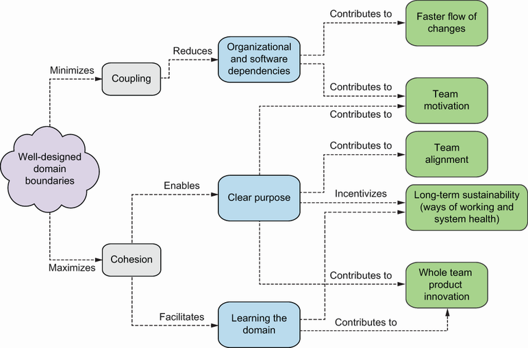

Figure 9.2 Bounded Context and its relationships より引用

<strong>ドメイン境界をどこに引くか？ まず3つのビジネス視点</strong>

1. <strong>言語の境界</strong> — 同じ単語が異なる意味を持つ場所で分ける
2. <strong>ビジネスプロセスの境界</strong> — 異なるライフサイクルを持つ業務で分ける
3. <strong>データの境界</strong> — 異なるデータモデルが必要な場所で分ける

「顧客」という単語が、営業チームでは「リード」、サポートチームでは「契約者」、課金チームでは「請求先」を意味する——これが言語の境界。<strong>同じ単語で違うものを指しているなら、そこに境界がある。</strong> EventStormingで付箋を貼っていくと、この「同じ言葉、違う意味」が自然に浮かび上がる。

---

## チームと変更頻度でEMが境界を引く

<strong>残り2つは、EMが直接コントロールできる境界</strong>

4. <strong>チームの境界</strong> — 1チームが認知負荷内で管理できる範囲で分ける
5. <strong>変更頻度の境界</strong> — 変更の速度が異なる場所で分ける

<strong>チームの境界がなぜ重要か</strong>

Team Topologiesの認知負荷の概念と直結する。1チームが担当するBounded Contextが大きすぎると、メンバーがドメイン全体を把握できなくなる。<strong>チームが「自分たちの領域」と言えない範囲は、境界の引き方が間違っている。</strong>

<strong>変更頻度が示すもの</strong>

週次でリリースする決済機能と、年1回しか変わらない契約管理が同じサービスにあると、高頻度側が低頻度側に引きずられる。<strong>変更のリズムが違うなら、分けるべき。</strong> EMはデプロイ頻度データからこの境界を客観的に判断できる。

5つのヒューリスティックのうち2つはEMの裁量。チーム設計と境界設計は同じ問題。

---

<!--
_backgroundColor: #0a1929
_color: white
_class: transition
-->

転換点3

バリューストリームから小さく始める

転換点2で「どこに集中投資するか」が見えた。だが最重要課題を特定しても、実行方法を間違えれば失敗する。転換点3は4つの問いに答える——「戦略を間違えるな」「バリューストリーム単位で動け」「具体的にどう始め、どう進めるか」「人と組織をどう動かすか」。

---

## 願望を戦略にするな、最重要課題を見極めよ

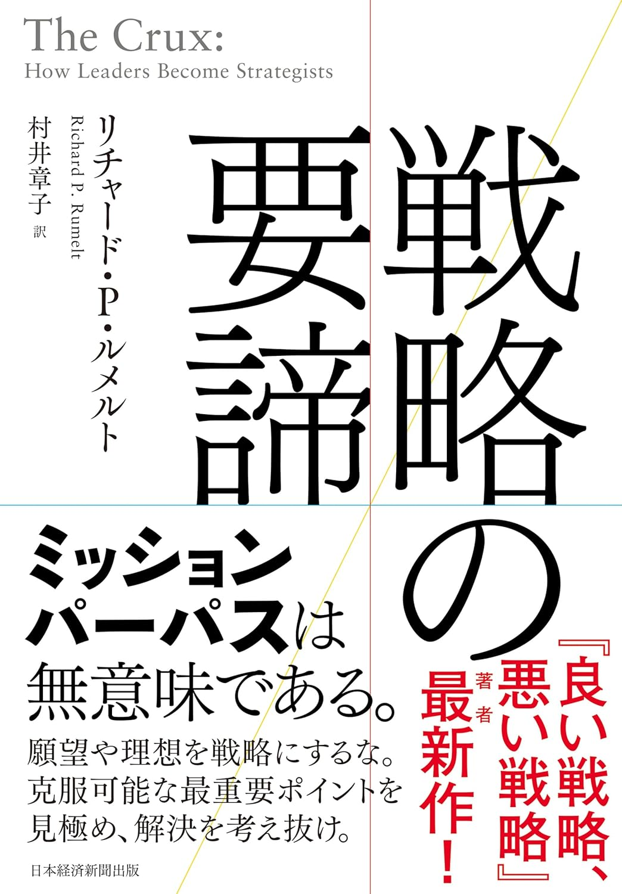
Richard P. Rumelt著（日経BP, 2022）

**「ミッション・パーパスは戦略ではない。克服可能な最重要ポイントを見極め、解決を考え抜け」**

Richard P. Rumelt氏は「良い戦略」の核心（カーネル）を**診断→基本方針→整合的な行動**の3要素で定義した。目標やビジョンを掲げることは戦略ではない。現状を正直に診断し、最も重要で克服可能な課題（最重要課題）を特定し、そこにリソースを集中させることが戦略。

モダナイゼーションにおける「悪い戦略」は、「マイクロサービスにする」「AIで効率化する」「技術的負債を返済する」——いずれも**診断なき願望**。良い戦略は「このシステムが3年後に解くべき課題は何か」「その課題に対して最も障害になっている構造は何か」という問いから始まる。**全ての負債を返す必要はない。最重要課題を1つ見極めろ。**

---

## 悪い戦略はなぜ生まれるのか

ルメルト氏は悪い戦略の根本原因を<strong>診断の欠如</strong>に求めた。多くの組織は「何が起きているのか」を正直に分析する前に、目標を掲げ、行動に走る。

<strong>悪い戦略の4つの特徴</strong>

- **空疎な言葉**: 「DXを推進する」「モダンなアーキテクチャへ」——具体的な診断のない標語
- **課題と向き合わない**: 現状の痛みを正直に言語化せず、理想だけを語る
- **目標と戦略の混同**: 「売上20%増」「リリース速度2倍」は目標であって戦略ではない
- **整合性のない行動**: 各チームがバラバラに動き、力が分散する

<strong>良い診断がもたらすもの</strong>

診断とは、複雑な現実の中から<strong>「何が最も重要な障害か」を特定する</strong>こと。モダナイゼーションでの良い診断は「技術的負債がある」で終わらない。「このシステムのこの部分が、この事業判断を阻害している」まで掘り下げる。診断が鋭ければ、基本方針は自然に絞られ、行動は整合する。

戦略の質は、診断の正直さで決まる。

---

## 診断はできた、では何を単位に実行するか

ルメルト氏の戦略フレームワークで最重要課題を特定した。「このシステムのこの部分が、この事業判断を阻害している」まで診断が掘り下がった。だが<strong>診断の次にくる「基本方針」と「整合的な行動」をどの単位で計画するか</strong>で、実行の成否が分かれる。

<strong>ありがちな失敗</strong>

「基幹システムのリアーキテクチャ」「マイクロサービスへの全面移行」——診断は鋭くても、実行の単位が「システム全体」になると、影響範囲が広がりすぎて制御不能になる。良い診断が悪い実行に食われる。

<strong>必要な問い</strong>

成果がビジネス指標で測定でき、失敗しても影響が限定され、1つのチームが自律的に動ける——そんな実行単位はあるか。その答えが<strong>バリューストリーム</strong>。顧客への価値提供の流れを1つの単位として切り出す考え方。

良い戦略は、正しい単位で実行されなければ意味がない。

---

## バリューストリームとは何か

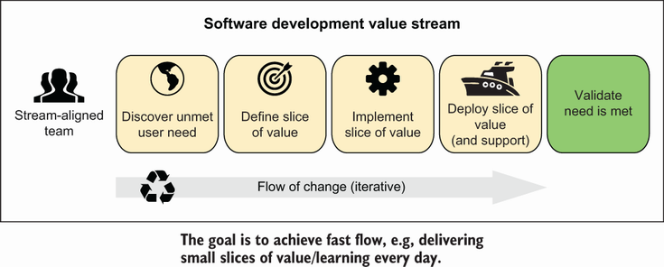

Figure 6.1 The high-level activities in an independent value stream より引用

バリューストリームとは、<strong>実現されていないユーザーの需要の特定から始まり、ソリューションの提供を経て、そのニーズが解決されたことの検証までを含む一連の活動</strong>のこと。「コードを書いてデプロイする」だけではない。その前後にある発見と検証を含む、もっと広い単位。

図が示す5つのステップがバリューストリームの全体像だ。<strong>需要の発見（Discover）</strong>で顧客のまだ満たされていないニーズを特定し、<strong>価値の定義（Define）</strong>でソリューションの形を決め、<strong>実装（Implement）</strong>でコードを書き、<strong>デプロイ（Deploy）</strong>で顧客に届け、<strong>検証（Validate）</strong>で需要が本当に満たされたかを確認する。多くの組織はImplementとDeployだけを「開発」と呼んでいるが、<strong>発見から検証までの全体がバリューストリーム</strong>。

---

## 独立したバリューストリームの4つの特性

バリューストリームの定義はわかった。では「独立した」バリューストリーム（IVS: Independent Value Stream）とは何か。IVSは4つの特性を持ち、この4つが揃うことでバリューストリーム単位での<strong>自律的な意思決定</strong>が可能になる。

<strong>1. ドメインに整合</strong>

ビジネスドメインの境界と一致している。技術的な都合ではなく、ビジネスの意味のある単位で切られている。

<strong>2. チームに権限がある</strong>

発見から検証まで、他チームの承認なしに意思決定できる。権限がなければ自律的に動けない。

<strong>3. 成果で測定される</strong>

技術的指標（カバレッジ、レイテンシ）ではなくビジネス成果（顧客獲得、リードタイム短縮）で測定される。

<strong>4. ソフトウェアが独立デプロイ可能</strong>

他のVSのソフトウェアに影響を与えずにデプロイできる。これがなければ「独立」は名ばかり。

粒度はさまざま——価格計算API、検索サービス、モバイルアプリ。共通するのは、1チームが発見から検証まで責任を持てる単位であること。

---

## システム単位で計画するとなぜ失敗するのか

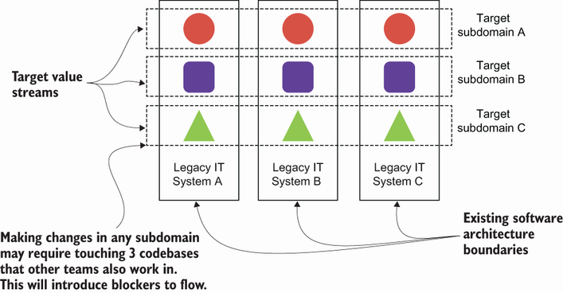

Figure 6.11 Current architecture does not align with target value stream boundaries より引用

「基幹システムを刷新する」——こう宣言した瞬間、モダナイゼーションは数年がかりの賭けになる。成果はAll or Nothing。途中経過では何も測れない。失敗したとき<strong>「やはり無理だった」が組織の記憶として定着</strong>し、次の挑戦を阻む。

図が示すように、現在のアーキテクチャの境界はターゲットとなるバリューストリームの境界と一致しない。任意のサブドメインを変更するのに<strong>複数のコードベースに触れなければならない</strong>。システム単位で計画すると、この不一致がそのまま影響範囲の広がりになる。1つの変更のために3つのチーム、5つのリポジトリ、2つのデプロイパイプラインを巻き込む——これでは速く学ぶことも、小さく失敗することもできない。

---

## バリューストリーム単位なら小さく学び、小さく失敗できる

<strong>ビジネス成果で測定できる</strong>

「この顧客セグメントのリードタイムが半減した」「新機能のリリース頻度が月1から週1になった」——バリューストリーム単位であれば、経営層が理解できるビジネス指標で進捗を示せる。技術的な内部指標ではなく、事業のインパクトで語れる。

<strong>失敗の影響が限定される</strong>

失敗しても影響は1つのVSに限定される。「このアプローチはうまくいかなかった」という学びを得て、次のVSに活かせる。システム単位の失敗は組織全体のトラウマになるが、VS単位の失敗は改善の材料になる。

ここで3つの転換点が繋がる。転換点1のEventStormingで可視化した<strong>ビジネスフローがVS候補</strong>になる。転換点2のCore Domain Chartで<strong>「どこに投資するか」の優先度</strong>が決まる。そして転換点3で、そのVSを1つ選んで小さく始める。3つの転換点は、バラバラの道具ではなかった。

3つの転換点は、バリューストリームという単位で組織を動かすための道具だった。

---

<!--
_backgroundColor: #0d1b3e
_color: white
_class: transition
-->

戦略は見えた。

では、どこから始めるか。

最重要課題を特定し、バリューストリーム単位で動く理由もわかった。次は具体的な一歩——どのVSを選び、どう実行し、どう学ぶか。

---

## 着実に成功させてから拡大する

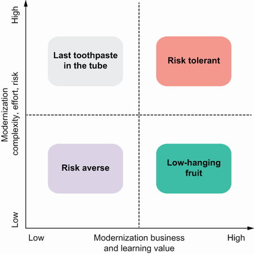

Figure 16.8 Modernization Core Domain Chart より引用

<strong>Nail it then scale it（着実に成功させてから拡大する）。</strong> パイロットとは、組織全体に展開する前に1つのバリューストリームで小さく試す実証プロジェクトのこと。最初のパイロットの成否が、組織全体のモダナイゼーションに対する態度を決定づける。

Modernization Core Domain Chartは、パイロット候補を4象限に整理する道具だ。縦軸に<strong>ビジネス価値+学習価値</strong>、横軸に<strong>複雑さ+リスク</strong>を取る。Low-hanging fruit象限——ビジネス価値が高く、かつ複雑さが低い領域——から始める。ただし「簡単すぎる」ものを選ぶと学習価値が低い。<strong>成功の確率が高く、かつ次のモダナイゼーションに活かせる知見が得られる</strong>バランスを見極める。

最初のパイロットが失敗すると「やはり無理だった」が組織の記憶になる。

---

## パイロット選定の4つの条件

Modernization Core Domain Chartで候補を絞ったら、次の4条件で最終判断する。4つすべてを満たす必要はないが、<strong>条件2「チームの意欲」だけは必須</strong>。

<strong>条件1：ビジネスインパクト</strong>

経営層が関心を持つ領域。成功したときに「やった意味がある」と認められること。ビジネスインパクトが低いパイロットは、成功しても「だから何？」と言われる。

<strong>条件2：チームの意欲</strong>

「やらされる」チームでは成功しない。手を挙げたチームを選ぶ。モダナイゼーションは新しい手法の学習を伴う——その負荷を引き受ける内発的動機が不可欠。

<strong>条件3：技術的に切り出しやすい</strong>

依存関係が少なく独立デプロイ可能な領域。他チームとの調整コストが高い領域を最初に選ぶと、技術以外の問題で止まる。

<strong>条件4：学習価値</strong>

将来のモダナイゼーションを支援する知見が得られるか。パイロットの目的は成功だけではない。<strong>次に活かせる学びを得ること</strong>も同じくらい重要。

---

## 全社一斉ではなく一つのバリューストリームから始める

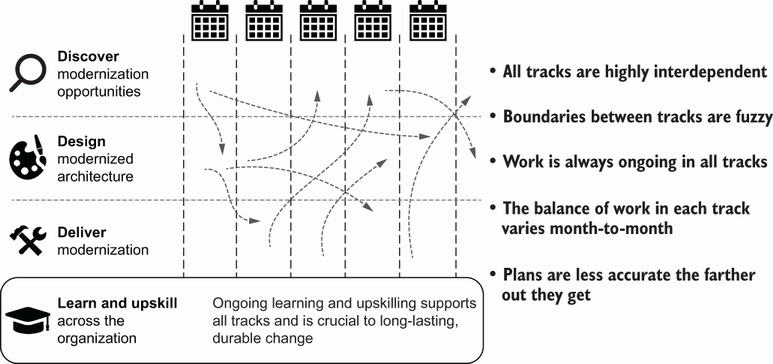

Figure 1.11 Parallel value streams より引用

モダナイゼーションは何年にもわたる大規模プロジェクトであってはならない。最後に全く新しいシステムが一括でリリースされるビッグバン方式は失敗を招く典型的な方法。<strong>3〜6ヶ月以内にモダナイゼーションの第一歩となる成果を出す</strong>ことが、期待感・確信・そして何より重要な信頼を築く。

パイロットで選んだ1つのバリューストリームに集中する。並行して複数のVSを動かしたくなる誘惑があるが、最初の成功体験が出る前に拡大すると、学びが浅くなり失敗のリスクが分散ではなく増幅する。<strong>1つ目のVSで「勝ちパターン」を確立してから次に進む。</strong>

最初の3-6ヶ月で信頼を築けなければ、2回目のチャンスはない。

---

## 3-6ヶ月の学習サイクルで実行する

1つのバリューストリームを<strong>4つのフェーズ</strong>で進める。各フェーズに明確な成果物を設定し、進捗を可視化する。

<strong>Discovery（2-4週間）</strong>

EventStormingでビジネスフローを可視化し、Wardley Mappingで戦略を整理。成果物：ドメインマップ、戦略ポートフォリオ

<strong>Design（2-4週間）</strong>

Bounded Contextで境界を定義し、Team Topologiesでチームを設計。成果物：コンテキストマップ、チーム設計書

<strong>Execute（2-4ヶ月）</strong>

Strangler Figで段階的に移行。成果物：移行済みサービス、DORA指標

<strong>振り返り</strong>

学びを言語化し、次のストリームに適用。成果物：振り返りレポート、改善提案

転換点1のEventStorming、転換点2のCore Domain Chartが、ここでDiscoveryとDesignの道具になる。

---

## 絞め殺し植物パターン（Strangler Fig）で段階的に置き換える

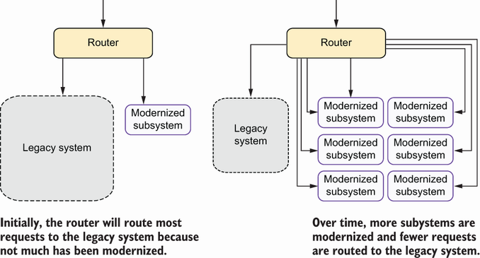

Figure 12.20 Gradual system migration with the strangler fig pattern より引用

<strong>旧システムを一気に捨てるのではなく、新システムで徐々に「絞め殺す」</strong>

Martin Fowler氏が命名したStrangler Figは、熱帯の絞め殺し植物に由来する。宿主の木を徐々に覆い、最終的に宿主が不要になる。レガシーシステムも同じように、機能単位で新システムに移行していく。

図に示す通り、新旧システムの前段に<strong>ルーティング層</strong>を置く。最初はすべてのリクエストがレガシーシステムに向かう。機能を1つずつ新システムに移行するたびに、ルーティング層の設定を切り替える。移行が完了した機能は新システムが処理し、まだ移行されていない機能はレガシーが処理する。<strong>最終的にレガシーへのルーティングがゼロになったとき、移行が完了する。</strong>

---

## Strangler Figの実践とビッグバンとの決定的な違い

<strong>実践の4つのポイント</strong>

ルーティング層を設けて新旧を切り替える。機能単位で移行し、各移行ごとに動作検証する。問題が起きたら<strong>即座にロールバック</strong>できる設計にする。そして新旧の並行運用期間を計画に含める——「いつレガシーを止めるか」は最初から計画に入れておく。

<strong>ビッグバン方式</strong>

「一晩で切り替え」。失敗したら全戻し。移行完了まで何も測れず、何も学べない。切り替え当日が組織の最もリスクが高い日になる。

<strong>Strangler Fig方式</strong>

「1機能ずつ切り替え」。失敗しても影響範囲が限定される。各ステップで成果を測定し、学びを得て、次のステップの精度が上がる。<strong>リスクの粒度が根本的に違う。</strong>

段階的移行の価値は「安全」ではない。「各ステップで学べる」こと。ビッグバンは学習の機会をゼロにする。

---

<!--
_backgroundColor: #0d1b3e
_color: white
_class: transition
-->

方法はわかった。

次は「誰が、どう動くか」。

バリューストリームの選定、パイロット、学習サイクル、段階的移行——実行の方法は見えた。だがシステムを動かすのは人間。次の問いは、チームをどう設計するか。

---

## コンウェイの法則を逆手に取るのがチーム設計

転換点2で「理想のアーキテクチャから組織を逆設計する」と述べた。コンウェイの法則——組織のコミュニケーション構造がシステム設計を決める——を逆手に取り、望ましいアーキテクチャに合わせてチームを設計する。

<strong>転換点2までに決めたこと</strong>

Bounded Contextで境界を定義し、Core Domain Chartで投資優先度を決定し、バリューストリーム単位で実行計画を立てた。これは「何を分けるか」「どこに投資するか」の設計。

<strong>転換点3で決めること</strong>

その境界を誰が担うか。どのチームがどのバリューストリームに責任を持ち、チーム間はどう関わるか。境界設計とチーム設計を分離した瞬間に、コンウェイの法則が設計図を上書きする。

アーキテクチャ設計とチーム設計を分けて考えるな。それは同じ行為。

---

## Team Topologiesの4つのチーム型

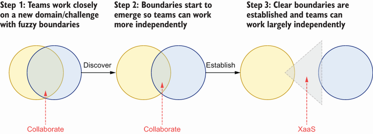

Figure 11.10 Team interactions より引用

**ドメイン境界に合わせてチームを設計する**

- **Stream-aligned Team**：ビジネスのバリューストリームに沿ったチーム
- **Platform Team**：内部サービスを提供するチーム
- **Enabling Team**：他チームの能力向上を支援（AMETもこれ）
- **Complicated-subsystem Team**：専門知識が必要な領域

Stream-aligned Teamがバリューストリームに直接対応する。残り3つはStream-aligned Teamの認知負荷を軽減する支援構造。すべてのチームが同じプロセスに従えば生産性が上がるという考えは幻想だ——チームの種類と責任範囲に応じて、関わり方を設計する。

---

## チーム間の関わり方を3つのインタラクションモードで設計する

**コラボレーション**

2つのチームが密に連携して共同作業する。新しい領域の探索や、未確定な境界での協業に適する。ただし認知負荷コストが高い。**一時的な関係として設計する。**

**XaaS（X-as-a-Service）**

一方のチームがサービスを提供し、もう一方が利用する。明確なAPI境界がある。認知負荷コストが最も低い。**安定した境界に適する。**

**ファシリテーション**

Enabling Teamが他チームの能力向上を支援する。AMETのインタラクションモードはこれ。**期限付きの関係として設計する。**

**認知負荷の観点** — コラボレーションは「お互いの領域を理解する」コストがかかる。長期間続けると両チームが疲弊する。境界が安定したらXaaSに移行し、認知負荷を下げる。ファシリテーションはEnabling TeamやAMETの関わり方——これを時限的に設計することで、チームの自走を促す。

チーム間の関わり方も「設計」の対象。放置すれば混沌になる。

---

## 小さく長寿命のチームが成果を出す理由

松本成幸著（技術評論社）

<strong>信頼の限界が規模を決める</strong>

深い信頼関係を維持できるのは5-9人程度。超えると暗黙知の共有が崩れ、明示的なコミュニケーション——ドキュメント、会議、承認フロー——が必要になる。外来的認知負荷が増える。

<strong>個人の差は10倍、チームの差は2,000倍</strong>

優秀な個人を集めるより、優秀なチームを作る方が組織への影響は桁違いに大きい。個人を「リソース」としてアサインするのではなく、チーム単位で意思決定する。"You Build It, You Run It"——開発から運用まで一貫して責任を持つ。EMの仕事は「誰をどこに配置するか」ではなく「どのチームにどの責任範囲を任せるか」。

チームは「リソースプール」ではない。意思決定の最小単位。

---

## チーム設計の基本単位は認知負荷である

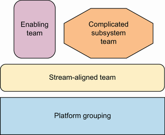

Team Topologiesの4つのチーム型

**問い：1チームでどこまでの範囲を担当できるか？**

答えは「認知負荷の限界内」まで。Stream-aligned Teamがバリューストリームに集中し、Platform TeamとEnabling Teamが外来的負荷を引き受ける。この構造が認知負荷を管理可能にする。

**認知負荷の3種類**: <strong>内在的</strong>（ドメイン自体の複雑さ。避けられない）、<strong>外来的</strong>（ツール・プロセスが持ち込む不必要な複雑さ。減らせる）、<strong>学習関連</strong>（新しいことを学ぶ負荷。一時的）。EMが減らすべきは外来的認知負荷。

---

## 認知負荷の範囲内なら速度と品質は両立する

不要なコードを削減してコードベースの健全性を維持すれば、コードは理解しやすく変更しやすくなり、バグやダウンタイムが減る。これらは変更コストを削減しフローを改善する重要な要素。小さく長寿命のチームが成果を出すのは、認知負荷の範囲内で<strong>品質と速度を両立できる</strong>から。

<strong>認知負荷を超えるとき</strong>

チームの担当範囲が広すぎると、理解が浅くなり、変更のたびに予期しない副作用が生じる。速度を上げようとすれば品質が落ち、品質を守ろうとすれば速度が落ちる——トレードオフが発生するのは、認知負荷の限界を超えているから。

<strong>認知負荷の範囲内にいるとき</strong>

チームが担当範囲を深く理解していれば、変更の影響を予測でき、テストも的確に書ける。速度を上げることが品質向上に直結する。<strong>トレードオフに見えるものは、設計の問題。</strong>

転換点1のEventStormingで明らかになった複雑さ、転換点2のCore Domain Chartで判断した投資配分——これらが認知負荷の適切な配分を設計する材料になる。

チームの認知負荷を超えない範囲に留めよ。それが唯一の基準。

---

## 認知負荷はコードの1行から始まる

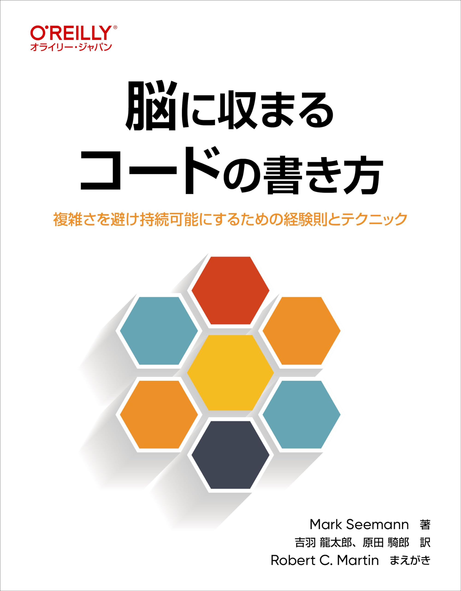
Mark Seemann著（O'Reilly Japan）

人間のワーキングメモリは7±2個の情報しか保持できない。Seemann氏はこの限界を出発点に、1メソッドの複雑度、1クラスの責務、1コミットの変更量を「脳に収まる」範囲に留める経験則を提唱した。

Team Topologiesが語るのはチームレベルの認知負荷だが、その前提にあるのは個人の認知能力の限界。チームの認知負荷を語る前に、コード1行の認知負荷から設計は始まっている。

脳に収まらないコードは、チームの認知負荷も溢れさせる。

---

## 結合のバランスが崩れると認知負荷が跳ね上がる

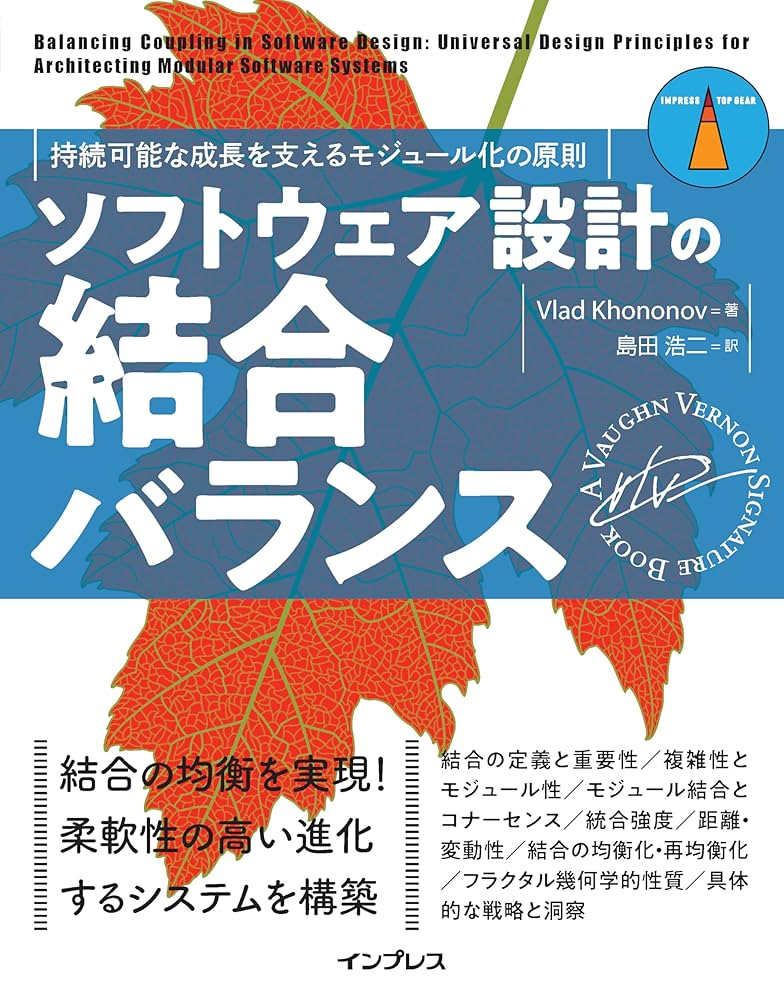
Vlad Khononov著（インプレス）

Khononov氏は結合を<strong>強度・距離・変動性</strong>の3次元で捉え直した。疎結合は常に正しいわけではない——安易なマイクロサービス化は距離を広げるだけで、大域的な複雑性を増す。結合の3次元がバランスを欠いた瞬間に認知負荷が跳ね上がる。

転換点2でBounded Contextの境界を引いた。その境界を跨ぐ結合は距離が大きく、変更コストが高い。境界の内側は強度が高くても距離が近いので管理可能——これがチームの認知負荷を「範囲内」に留める構造の正体。

結合のバランスを設計することが、認知負荷を設計すること。

---

## AMETは役割を終えたら手を引く

転換点1でAMETの設計思想を紹介した——答えを教えず発見を促すイネーブリングチーム。チーム設計の文脈では、AMETはファシリテーションモードで関わる。だがその関わり方にも段階がある。

<strong>Leading</strong>

最初のEventStormingやWardley MappingをAMETがリードする。チームが手法を知らない段階では、AMETが場を設計しファシリテーションを担う。

<strong>Supporting</strong>

チームが自分でファシリテーションを試みる。AMETはオブザーバーとして同席し、必要なときだけ補助する。

<strong>Observing</strong>

チームが完全に自走する。AMETは進捗を見守り、求められたときだけ介入する。

ある実践者は、懐疑的なテックリードに対して専門性を主張する代わりに、数日間かけて信頼関係を築くことから始めた。権威ではなく関係性がチームの変化を生む——これがAMETの行動原則。だがAMETが去った後も、チームは変化し続ける。

AMETの成功は、AMETが不要になること。

---

## チームは固定ではなく意図的に再編する

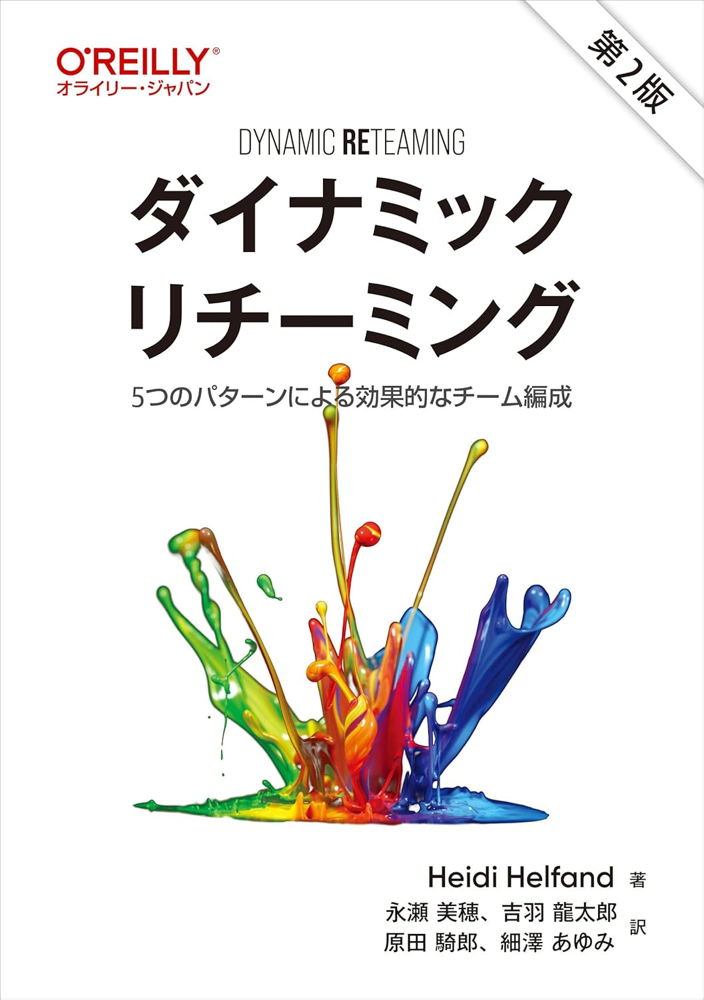
Heidi Helfand著（O'Reilly Japan）

事業の成長、メンバーの異動、新しいドメインの発見——「長寿命のチーム」は「固定されたチーム」ではない。Helfand氏は、チームの変化を避けるのではなく、5つのパターンとして意図的に設計することを提唱した。

<strong>One by One</strong>

メンバーの追加・離脱。ペアリングでコンテキストを共有し、チームの知識を途切れさせない。

<strong>Grow and Split</strong>

チームが大きくなったら認知負荷の限界で分割する。Bounded Contextの境界が分割の指針になる。

<strong>Isolation / Merging / Switching</strong>

集中課題のための一時分離、統合後のコンテキスト同期、停滞打破のための意図的シャッフル。

「長寿命」は「不変」ではない。変化を設計の一部にせよ。

---

<!--
_backgroundColor: #0d1b3e
_color: white
_class: transition
-->

道具は揃った。

だが組織は簡単には動かない。

バリューストリームの選び方、3-6ヶ月の学習サイクル、段階的移行、チーム設計とその再編——実行の道具は揃った。だが道具だけでは組織は動かない。最後の問いは、経営層の支援を引き出し、現場の学びを育てること——トップダウンとボトムアップの両輪をどう設計するか。

---

## 変化の推進力を高めても人は動かない

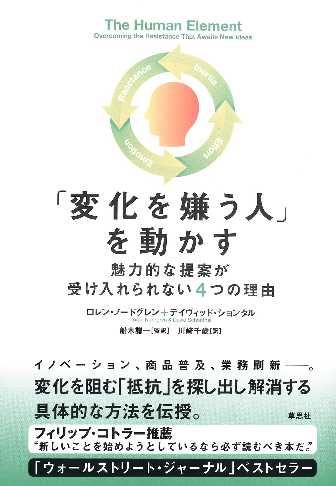
Loran Nordgren & David Schonthal著（草思社）

バリューストリームの選定、3-6ヶ月サイクル、Strangler Fig、チーム設計——道具は揃った。だが<strong>「正しい提案」が受け入れられるとは限らない</strong>。Nordgren氏とSchonthal氏は、多くの人が変化を起こそうとするとき<strong>推進力（Fuel）を高めること</strong>に集中すると指摘する——メリットを強調し、データを見せ、成功事例を紹介することで相手を動かそうとする。

だがそれだけでは人は動かない。アイデアが人に受け入れられるかを決めるのは、推進力だけではない。<strong>変化を阻む摩擦（Friction）</strong>の大きさが決定的に重要だ。推進力がいくら強くても、摩擦が大きければ人は動かない。車のアクセルを踏みながらブレーキも踏んでいる状態——それがモダナイゼーションの提案が通らない構造。

提案の魅力を高めるな。抵抗を取り除け。

---

## 変化を阻む4つの摩擦を理解する

では、モダナイゼーションにおける摩擦とは具体的に何か。Nordgren氏とSchonthal氏は4種類の摩擦を定義した。これらはそれぞれ異なるメカニズムで変化を阻む。

<strong>1. 惰性</strong>

現状維持バイアス。「10年動いているシステムを、なぜ今変えるのか」。慣れた手順・ツール・関係性を手放すコストが、改善の期待値を上回る。人は未知の利益より既知の損失を重く見積もる。

<strong>2. 労力</strong>

変化の実行コスト。EventStorming、DDD、新しいCI/CD——学ぶべきことが多すぎると感じた瞬間、人は動けなくなる。変化そのものには賛成でも、<strong>「やり方がわからない」という不安</strong>が足を止める。

<strong>3. 感情</strong>

否定的感情。「今までの設計は間違いだったのか」。レガシーを作った当事者ほど、モダナイゼーションを<strong>自分の仕事への否定</strong>と感じる。論理ではなく感情が反応する。

<strong>4. 心理的反発</strong>

自律性への脅威。「来期からマイクロサービスに移行する」というトップダウンの宣言は、<strong>内容が正しくても反発を生む</strong>。人は「押し付けられた」と感じた瞬間に抵抗する。

---

## 惰性と労力を取り除く処方箋

4つの摩擦それぞれに、対応する処方箋がある。共通するのは<strong>「力で押し通す」のではなく「安心できる状態を作る」</strong>という姿勢だ。まず惰性と労力——この2つは「変化のコストが高すぎる」という認知に起因する。

<strong>惰性 → 小さな実験で始める</strong>

全社導入を提案しない。1チーム、1サービス、1スプリントの実験から。「試してみて、ダメならやめればいい」という安全網が惰性を溶かす。パイロットの設計思想はまさにこれ——転換点3の「小さく始める」は、惰性への処方箋でもある。

<strong>労力 → ペアリングで負荷を分散する</strong>

新しい手法を1人で学ばせない。AMETがペアリングで伴走し、「一緒にやる」ことで学習コストを下げる。EventStormingの初回ファシリテーションをAMETが担い、2回目からチームが自走する——転換点1のAMETの設計思想と直結する。

変化のコストを下げれば、惰性は溶け、労力は乗り越えられる。

---

## 感情と心理的反発を取り除く処方箋

感情と心理的反発は、コストの問題ではない。<strong>アイデンティティと自律性への脅威</strong>に起因する。論理やデータでは解けない——人間関係の設計が必要。

<strong>感情 → レガシーを尊重する</strong>

「古いシステムがダメだ」ではなく「このシステムが会社を支えてきた。次の10年も支えるために進化させる」。過去の仕事を否定しない言葉を選ぶ。レガシーを作った人々の判断は、当時の制約の中では合理的だった。現在のモダナイゼーションも、未来から見れば同じ立場になる。<strong>それを認めることが、変化への感情的な障壁を下げる第一歩になる。</strong>

<strong>反発 → 選択肢を与える</strong>

「やれ」ではなく「A案とB案がある。どちらがいい？」。自律性を尊重し、当事者が選べる状態を作る。押し付けた瞬間に反発が生まれる。モダナイゼーションの方向性は示しつつ、<strong>「どう実現するか」は現場チームが決める</strong>という構造にする。

抵抗は「反対意見」ではない。「まだ安心できていない」というシグナル。問題を「誰かのせい」にしない場を作れ。

---

## リーダーシップの本気度を5つの問いで確認する

4つの摩擦を理解した上で、経営層との対話に臨む。この5つの問いは、摩擦がどこにあるかを診断し、必要な支援を引き出すための対話の道具だ。

1. **このモダナイゼーションのビジネス上の理由を明確に述べられるか？**
2. **3-6ヶ月間、専任チームを確保する覚悟はあるか？**
3. **組織構造の変更を許容できるか？**
4. **短期的な機能開発の遅延を受け入れられるか？**
5. **成果が見えるまで忍耐強く待てるか？**

Noを聞けたなら、条件を整える仕事が見えたということだ。

---

## Noを受け入れる勇気が次の一手を決める

**問い1「ビジネス上の理由」がNoの場合**

技術的な動機しかない。→ まずCore Domain Chartで「ビジネス上のリスク」を可視化することから始める。技術の言語では経営層は動かない。

**問い2「専任チーム」がNoの場合**

リソースが割けない。→ 片手間のモダナイゼーションは失敗する。規模を縮小してでも専任を確保できる範囲に限定する。

**問い3「組織変更」がNoの場合**

コンウェイの法則を無視することになる。→ 組織変更なしで可能な範囲（チーム間インタラクションの改善）から始める。

**問い4/5「短期遅延・忍耐」がNoの場合**

四半期の数字に追われている。→ Quick Winsで2-4週間以内に小さな成果を見せ、信頼を勝ち取ってから規模を広げる。

Noは「やるな」ではない。「まだ条件が整っていない」。条件を整える仕事もEMの仕事。

---

## 変化は押し付けではなく種まきから始まる

Noへの対応策は見えた。だが仮にYesを得たとしても、現場が一夜で変わるわけではない。トップダウンの承認とボトムアップの実践は別の構造で動く。5つの問いが「経営層から支援を引き出す構造」なら、種まきは「現場に実践知を浸透させる構造」。

<strong>種まきの4段階</strong> — 変化が組織に根付くには構造的な段階がある。<strong>個人の学習</strong>（読書会・勉強会で知識を得る）→ <strong>チーム内の実践</strong>（1チームでEventStormingを試行する）→ <strong>チーム間の共有</strong>（成果と失敗をショーケースで横展開する）→ <strong>組織構造への反映</strong>（サブドメインに沿ったチーム再編が自然に起きる）。各段階を飛ばすと「号令だけの改革」になる。

<strong>EMが設計すべきは「場」の構造</strong> — 個人の学習を止めないスケジュール確保、チーム実践を安全に試行できるパイロット設計、横展開のためのショーケースの場。意志や熱意に依存せず、構造として学びが伝播する仕組みを作る。

変化を「個人の熱意」に頼るな。「学びが伝播する構造」を設計せよ。

---

## 学ぶ文化をコミュニティ・オブ・プラクティスで維持する

種を植えたら、育てる仕組みが必要。コミュニティ・オブ・プラクティス（CoP）は、個人の学びを組織の知恵に変える装置。モダナイゼーションの知見が特定のチームに閉じないよう、横断的な学びの場を設計する。

<strong>CoPが機能する4つの条件</strong>

- 定期的なスケジュール（隔週や月1で固定する）
- 効果的なリーダーシップ（回す人がいる）
- 心理的安全性（失敗を共有できる）
- 組織のサポート（業務時間内の活動として認める）

<strong>EMにできること</strong>

CoPの時間を守る。「忙しいから今月はスキップ」が3回続くとCoPは死ぬ。ADR（Architecture Decision Records）で意思決定を記録し属人化を防ぐ。学びの活動を「成果」として評価する仕組みを作る——評価されない活動は続かない。

学ぶ文化は放置すれば消える。EMが守るべきは、学びの場と時間。

---

## Quick Winsとショーケースでモメンタムを維持する

トップダウンの支援を引き出し（5つの問い）、ボトムアップの学びを育てる（種まきとCoP）。その両輪を回し続けるためのエンジンがQuick Winsとショーケース。

3-6ヶ月の学習サイクルを維持するには、モメンタム（推進力）を意図的にデザインする必要がある。経営層の関心は四半期ごとにリセットされる。

**Quick Wins**

最初の2-4週間で「目に見える成果」を出す。ビルド時間の短縮、デプロイ自動化、AIによるテスト自動生成——小さくても構わない。経営層に「動いている」ことを示す。

**定期ショーケース**

2週間ごとにステークホルダーに進捗を見せる。スライドよりデモ、デモより数字。「デプロイ頻度が週1→日1に」という事実が、100枚の企画書より説得力を持つ。

**学習成熟度の追跡**

チームの自律度を可視化する。「AMETなしでEventStormingを自発的に開催しているか」が1つの指標。

---

<!--
_backgroundColor: #0a1929
_color: white
_class: transition
-->

失敗から学んだ罠

現場で見えたもの

3つの転換点は「こうすればうまくいく」の話だった。だが現場には、転換点を知っていても踏み外す罠がある。

---

## 設計時の境界と運用時の境界はなぜ乖離するのか

**境界設計には2つの力学が同時に働いている**

1つはビジネスドメインの論理的な分割。もう1つは組織のコミュニケーション構造が生む物理的な分割。設計時には前者だけを見がちだが、運用が始まると後者が支配的になる。<strong>技術的に正しい境界が、組織的に維持できない</strong>——これがほとんどの境界失敗の構造。

**コンウェイの法則の逆流**

転換点2で「理想のアーキテクチャから組織を逆設計する」と述べた。だが現実には、組織構造を変えないまま境界だけ引き直すケースが多い。すると境界はコミュニケーションコストに押し戻され、元の組織構造を反映した形に収束する。**構造を変えずに境界を変えても、境界が構造に負ける。**

**境界の正しさを測る唯一の基準**

「分割数」でも「技術的な美しさ」でもない。**各チームが他チームに聞かずに意思決定しデプロイできるか**。これが成立しないなら、境界は設計図上にしか存在しない。Core Domain Chartで「何を分けるか」を決め、Team Topologiesで「誰が担うか」を同時に設計する——この2つを分離した瞬間に乖離が始まる。

境界設計と組織設計を分離した瞬間、コンウェイの法則が設計図を上書きする。

---

## ツール導入が構造改革に化けない理由

**あらゆる「銀の弾丸」に共通する構造がある**

マイクロサービス、クラウド移行、そしてAI。時代ごとに道具は変わるが、組織が繰り返す誤りの構造は同じだ。玉ねぎモデルの最外層（ツール・技術）だけに投資し、内層（プロセス・組織構造・文化）を変えない。<strong>道具を入れ替えることと、構造を変えることは別の行為</strong>である。

**効率化のボトルネックは層をまたいで移動する**

ある層の効率が上がると、ボトルネックは隣接する層に移動する。コード生成が速くなればレビューが詰まり、テスト自動化が進めばデプロイ承認が詰まる。<strong>組織のスループットは最も遅い層で決まる</strong>。単一層への投資が全体を速くするという仮定自体が、構造を無視した思考。

**「何を自動化するか」の判断こそが構造の問題**

解決策の構築（コード生成、テスト作成）は自動化できる。だが解くべき課題の発見（顧客がどんな状況で何を成し遂げたいのか、どこにCore Domainがあるのか）はできない。転換点2で述べた<strong>解くべき課題の見極めなしに自動化を進めれば、間違ったものをより速く作る</strong>だけになる。

道具の性能は上がった。だが、どの層に・何のために投資するかの判断は、構造を見なければ下せない。

---

## 失敗の構造は3つの転換点の裏返しである

すべての失敗パターンは、3つの転換点のいずれかを飛ばした結果として説明できる。境界の乖離は転換点1（学ぶ力）と転換点2（語る力）の欠如。ツール偏重は転換点2（語る力）の欠如。そして以下の3つの根本原因は、それぞれ対応する転換点を持つ。

**学ばずに変えようとした**

組織が自ら問いを立て、発見する構造がないまま変革を始めた。外部の「正解」を導入しても、なぜそうするのかを組織が理解していなければ、元の構造に引き戻される。<strong>構造的無能化の根本は、学習構造の不在</strong>にある。

**語らずに投資しようとした**

技術の痛みをビジネスの言語に翻訳せず、技術者の言語のまま意思決定者に持ち込んだ。投資判断が下りないか、下りても的外れな優先順位になる。<strong>翻訳なき投資提案は、組織内で「コスト」としか認識されない</strong>。

**始めずに計画し続けた**

不確実性を排除しようとして計画に時間をかけ、環境が変わり、計画が陳腐化する。あるいは逆に、計画なしに全社一斉で始めて制御不能になる。<strong>「小さく始める」と「計画する」は対立しない。学習サイクルこそが計画</strong>である。

学ばず・語らず・始めず——3つの不在が、あらゆる失敗の共通構造。

---

<!--
_backgroundColor: #0d1b3e
_color: white
_class: transition
-->

失敗のパターンは見えた。

では、何を持ち帰るか。

技術だけでは組織は変わらない。学ぶ力・語る力・始める力——3つの転換点を持ち帰ってほしい。

---

## 3つの転換点が解いている構造的な問い

**転換点1: 学ぶ力**

なぜ組織は同じ失敗を繰り返すのか。原因は個人の能力ではなく、<strong>組織が学習する構造を持っていない</strong>こと。AMETは答えを与えず発見を促す。答えを外注した組織は、外注先がいなくなった瞬間に元に戻る。自ら問いを立て、自ら発見し、自ら修正するサイクルを組織に埋め込むこと——これが最初の転換点になる。

**転換点2: 語る力**

なぜ正しい技術判断が組織に受け入れられないのか。原因は判断の質ではなく、<strong>意思決定者の言語で語られていない</strong>こと。技術的負債を技術の問題として説明し続ける限り、投資判断は下りない。顧客が本当に成し遂げたいことから逆算し、ビジネスリスクの言語に翻訳すること——これが2番目の転換点になる。

**転換点3: 始める力**

なぜ戦略は実行されないのか。原因は計画の不備ではなく、<strong>不確実性を受け入れる設計になっていない</strong>こと。完璧な計画を立てようとすればするほど着手は遅れ、環境は変わる。一つのバリューストリームで小さく始め、3-6ヶ月で学び、修正する——不確実性を前提にした実行設計が3番目の転換点になる。

学ぶ力→語る力→始める力。順番を飛ばせば、その先で必ず壊れる。

---

## 参考資料

**書籍**

- [Architecture Modernization](https://www.manning.com/books/architecture-modernization) - Nick Tune, Jean-Georges Perrin（Manning, 2024）
- [アーキテクチャモダナイゼーション](https://www.oreilly.co.jp/) - Nick Tune & Jean-Georges Perrin著
- [Team Topologies](https://teamtopologies.com/) - Matthew Skelton, Manuel Pais（IT Revolution, 2019）
- [チームの力で組織を動かす](https://gihyo.jp/book/2025/978-4-297-15064-8) - 松本成幸（技術評論社, 2025）
- [Domain-Driven Design](https://www.domainlanguage.com/ddd/) - Eric Evans（Addison-Wesley, 2003）
- [Building Microservices, 2nd Edition](https://www.oreilly.com/library/view/building-microservices-2nd/9781492034018/) - Sam Newman（O'Reilly, 2021）
- [Sooner Safer Happier](https://www.soonersaferhappier.com/) - Jon Smart（IT Revolution, 2020）
- [Architecture for Flow](https://www.oreilly.com/library/view/architecture-for-flow/9780137392759/) - Susanne Kaiser（Addison-Wesley, 2025）
- [企業変革のジレンマ](https://bookplus.nikkei.com/atcl/catalog/24/06/14/01289/) - 宇田川元一（日経BP, 2024）
- [変化を嫌う人を動かす](https://www.soshisha.com/book_wadai/books/2624.html) - Loran Nordgren, David Schonthal（草思社）
- [ジョブ理論](https://www.harpercollins.co.jp/) - Clayton M. Christensen 他（Harper Business, 2016）
- [戦略の要諦](https://bookplus.nikkei.com/) - Richard P. Rumelt（日経BP, 2022）
- [脳に収まるコードの書き方](https://www.oreilly.co.jp/books/9784814400799/) - Mark Seemann（O'Reilly Japan, 2024）
- [ソフトウェア設計の結合バランス](https://book.impress.co.jp/books/1124101045) - Vlad Khononov（インプレス, 2025）
- [ダイナミックリチーミング 第2版](https://www.oreilly.co.jp/books/9784814401079/) - Heidi Helfand（O'Reilly Japan, 2025）

**レポート・発表**

- [DORA Report 2025](https://dora.dev/research/) - DevOps Research and Assessment（Google Cloud, 2025）
- [なぜAIは組織の速度を速くしないのか？ 令和の解剖学](https://speakerdeck.com/sugino/nazeaihazu-zhi-wosu-kusinainoka-ling-he-nofu-fen-ke) - 杉野和真（LayerX, 2026）

---

<!--
_backgroundColor: #0a1929
_color: white
_class: title dark
-->

# ありがとうございました

### @nwiizo

EM Conf 2026 / 2026-03-04 
技術的負債の泥沼から組織を救う3つの転換点

