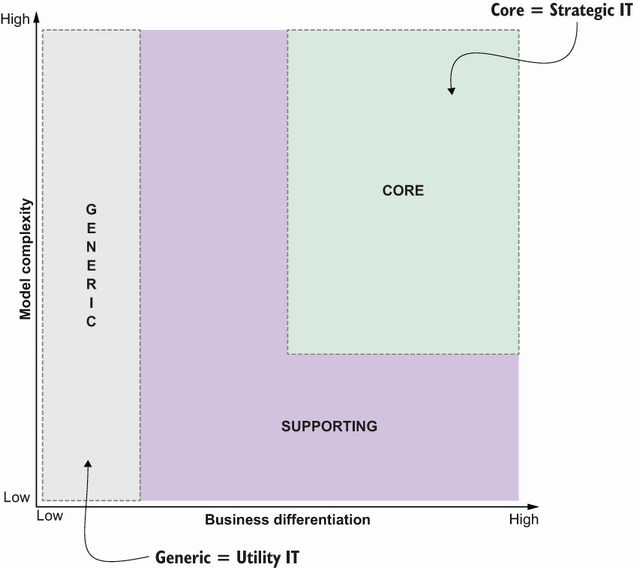
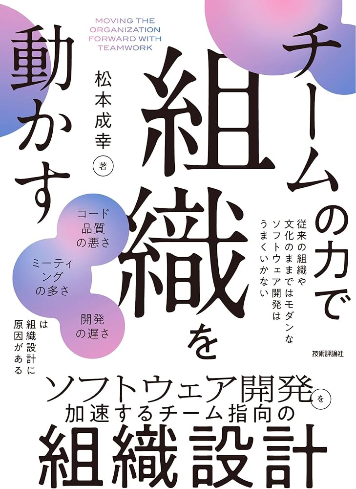

<!--
_backgroundColor: #0a1929
_color: white
_class: title dark
-->

# 技術的負債の泥沼から 組織を救う 3つの転換点

### アーキテクチャモダナイゼーションの実践知

2026/03/04 EM Conf 2026 ホールB 
@nwiizo 40min（16:00〜16:40）

---

<!-- _backgroundColor: white -->

## nwiizo

株式会社スリーシェイクでプロのソフトウェアエンジニアをやっているものです。「アーキテクチャモダナイゼーション」（Manning, 2024）の翻訳者。

技術書翻訳を手がけるたび、わかることが1つ増えるのと引き換えに、わからないことが3つ増えていく。全17章の翻訳を通じて得た**実践知**を、EMの言語に翻訳してお伝えします。

インターネット上では **nwiizo** を名乗り、ブログ「**じゃあ、おうちで学べる**」を運営しています。X / GitHub もこのIDでやっています。

---

## about 3-shake + Sreakeのお仕事

<strong>SRE/DevOps支援</strong>

- Kubernetes構築・運用
- クラウドネイティブ化推進
- Observability導入

<strong>アーキテクチャモダナイゼーション</strong>

- 現状分析・戦略策定
- 段階的な移行支援
- 内製化・伴走支援

<strong>データ活用支援</strong>

- データ基盤構築
- BigQuery/Snowflake
- 分析基盤最適化

ご依頼・ご相談お待ちしております 
https://sreake.com/

---

## この発表で解決できること

**こんな悩みを持っていませんか？**

- 技術的負債の投資を経営層にどう説明すれば？
- 「マイクロサービス化したい」という現場の声にどう応える？
- 優秀なエンジニアが負のサイクルで辞めていく
- 地味だが重要な仕事をどう評価すればいい？

**この発表で持ち帰れるもの**

- 技術的負債を**ビジネスリスク**として可視化する手法
- AMETによる**組織能力の育成**アプローチ
- **3-6ヶ月で成果を示す**学習サイクルの設計
- チーム構造をどう設計すべきかの判断軸

<strong>「技術の問題」を「組織の問題」として捉え直す3つの転換点</strong>

---

<!--
_backgroundColor: #0a1929
_color: white
_class: transition
-->

なぜ「技術的問題」では解けないのか

問題提起

---

## 私の失敗：2年間のマイクロサービス移行

**完了したとき、設計はすでに陳腐化していた**

2年間かけてマイクロサービスに移行した。技術的には「成功」だった。しかし完了した頃にはビジネス要件が変わり、サービス境界が実態と合わなくなっていた。

**何が間違っていたか**

技術的な正しさだけを追求した。ビジネスの変化速度を考慮しなかった。組織構造を変えずに技術だけ変えた。

**学んだこと**

技術・事業・組織の3つを同時に動かさなければ、モダナイゼーションは成功しない。

革命は負債の再生産。進化だけが持続する。

---

## 技術的負債は「負債」ではない — 事業成功の証拠

**「技術的負債がある」ということは、かつて事業が成功した証拠**

急成長するビジネスを支えるために、意図的にも無意図にもトレードオフが行われた。それ自体は合理的な判断だった。問題は、その負債を返済する仕組みが組織になかったこと。

訳者まえがきで書いたこと——「技術的負債は事業が成功した証拠」。日本の製造業が「カイゼン」で品質を維持し続けたように、ソフトウェアにも継続的な改善の仕組みが必要。**技術的負債の解消は「やり直し」ではなく「進化」**。

> Architecture Modernization（Nick Tune & Jean-Georges Perrin, 2024）訳者まえがきより

---

## 負のサイクル — 開発者時間の42%が浪費される

Figure 1.3 The negative cycle より引用

**Tornhill & Borgの研究（2022年）**

開発者の時間の**42%が技術的負債に関連する作業**で浪費されている。

レガシーシステム → 開発速度低下 → 優秀な人材の流出 → さらなる品質低下 → より深刻なレガシー化

**この負のサイクルは、技術だけでは断ち切れない。**

「技術的負債」は技術の問題ではない。組織の問題。

---

## 避けるべき3つの罠

**銀の弾丸の罠**

「この技術を入れれば解決する」。マイクロサービス、Kubernetes、クラウド移行——どれも手段であって目的ではない。

**構造の幻想の罠**

「組織図を書き換えれば変わる」。構造を変えてもプロセスと文化が追いつかなければ、新しい組織図の中で同じ問題が再現される。

**ボルトオンの罠**

既存システムの上に新技術を「貼り付ける」。根本原因に触れないまま複雑性だけが増す。

<strong>共通点：技術・構造・文化のどれか1つだけを変えようとしている</strong>

---

## 「マイクロサービスにすれば解決する」のか？

**最も多い「銀の弾丸」がマイクロサービス**

エンジニアから「マイクロサービスにしたい」という声が上がる。経営層は「それで何が解決するのか」と問う。答えに詰まるのは、問いの立て方が間違っているから。

**問い：マイクロサービスにすべきか？**

これは技術選定の問い。答えは「場合による」で終わる。

**正しい問い：独立してデプロイ・進化できる単位は？**

これはビジネスの問い。ドメイン境界、チーム構造、デプロイ戦略を同時に考えることになる。

「どう作るか」の前に「何を独立させるか」を問え。

---

## Building Microservicesも同じ結論に至っている

Sam Newman「Building Microservices」（第2版, 2021）もこう書いている：

**「マイクロサービスは目標ではなく手段。独立デプロイ可能性を達成する手段の一つに過ぎない」**

マイクロサービスの著者自身が、マイクロサービスを目的にするなと警告している。Architecture Modernizationも同じ方向を指している——**技術選定の前にドメイン戦略**。

---

## コンウェイの法則 — 古い組織構造が新システムを再び複雑にする

Figure 2.1 Conway's Law より引用

**「組織はそのコミュニケーション構造を反映したシステムを設計する」**（Melvin Conway, 1968）

システムをマイクロサービスに分割しても、組織が機能別サイロのままなら、サービス間の結合度は組織のサイロを反映する。**技術を変えても組織を変えなければ、同じ問題が形を変えて再現される。**

組織を変えずにアーキテクチャだけ変えたいは幻想。

---

## 「構造的無能化」はなぜ起きるのか

宇田川元一著（日経BP, 2024）

**「構造的無能化」（宇田川元一）** — 組織が成功し環境に適応すると、分業化・ルーティン化が進み、思考の幅と質が制約され、目先の問題解決を繰り返して疲弊していく現象。**誰かが悪いのではなく、成熟した組織にとって宿命。**

### 3つの症状とモダナイゼーションへの影響

| 症状 | 説明 | モダナイゼーションへの影響 |
|-----|------|------------------------|
| **断片化** | 分業化しすぎて縦割りに | チーム間の壁、サイロ化 |
| **不全化** | 変化を察知して自ら動けない | 「誰かが決めてくれる」待ち |
| **表層化** | 場当たり的な対応しか取れない | 銀の弾丸への期待 |

<strong>成功した組織ほどこの罠にはまる。乗り越える糸口は「対話」</strong>

---

## 「変化を嫌う人」を動かす — 魅力的な提案が受け入れられない4つの理由

モダナイゼーションの提案が正しくても、組織は動かない。Loran Nordgren & David Schonthalは「変化を嫌う人を動かす」で、**魅力を高めるだけでは不十分で、抵抗を理解し取り除く必要がある**と説く。

**1. 惰性による抵抗**

現状維持バイアス。「今のままでも動いている」という慣性。

**2. 労力による抵抗**

変化の実行コスト。「学び直し」への心理的負荷。

**3. 感情による抵抗**

否定的感情。「今までの自分の仕事を否定された」。

**4. 心理的反発**

変化への抵抗。「押し付けられた」と感じる反発。

提案の魅力を高めるな。抵抗を取り除け。

参考：「変化を嫌う人を動かす」 https://www.soshisha.com/book_wadai/books/2624.html

---

<!--
_backgroundColor: #0a1929
_color: white
_class: transition
-->

転換点1

AMETという触媒で組織能力を引き出す

---

## AMETとは — 答えを教えず、自律を促すイネーブリングチーム

Figure 15.1 AMET より引用

**Architecture Modernization Enabling Team**

外部から「正解」を持ち込むコンサルではない。組織が自ら発見し、自ら変わる力を引き出すイネーブリングチーム。

**AMETの原則**

- ファシリテーションが中心。答えを教えない
- EventStorming、Wardley Mappingなどの手法を教える
- チームの自律性を高め、自分たちで続けられる状態を目指す
- **支援の質は、支援が不要になる速さで測る**

---

## AMETの実践：EventStormingで「見える化」する

EventStorming Timeline

**ビジネスの全体像を、技術者とビジネス側が一緒に可視化する**

ドメインイベント（ビジネス上の出来事）を時系列に並べ、システムの全体像を「見える化」する。

**EMにとっての価値**

- サイロ化した部署間の**共通言語**が生まれる
- 「誰も全体像を知らない」状態が解消される
- ホットスポット（問題箇所）が自然に浮かび上がる
- **技術者だけの会議にならない** — ビジネス側も対等に参加

---

## AMETの実践：Wardley Mappingで戦略を可視化する

**「内製かSaaSか」を超えた戦略的判断を可能にする**

Wardley Mapは、ビジネスコンポーネントの進化段階を可視化するツール。「何を自社で持ち、何を外部に任せるか」をビジネス価値の文脈で判断できる。

**Genesis → Custom → Product → Commodity**

コンポーネントの進化段階に応じて、投資戦略が変わる。Genesisには実験的投資、Commodityには標準化。

**EMへのメッセージ**

技術選定を「好み」で議論するのをやめ、**進化段階に基づく合理的な判断基準**を組織に持たせる。

---

## 欧州テレコム企業の事例 — João Rosaのアプローチ

**書籍Ch.15で紹介される実践事例**

João Rosaが率いたAMETは、欧州の大手テレコム企業でアーキテクチャモダナイゼーションを支援した。外部コンサルとして「答え」を持ち込むのではなく、社内チームが自ら発見するプロセスをファシリテートした。

**やったこと**

EventStormingで現状を可視化し、Wardley Mappingで戦略を整理し、チームが自ら境界を見つけるプロセスを設計した。

**成果**

社内チームが自律的にモダナイゼーションを推進できる状態に。AMETが去った後も改善が継続した。

> Architecture Modernization Ch.15 — João Rosaの実践より

---

## AMETの成功と失敗 — 自立こそが成功

**成功パターン**

- 社内チームが手法を自分のものにする
- AMETがいなくてもEventStormingを自発的に開催
- 「次は自分たちでやれます」という言葉が出る
- 組織に学習する習慣が根付く

**失敗パターン**

- AMETに依存し続ける（永続的な外注化）
- 手法だけ導入してファシリテーションが機能しない
- 経営層のコミットメントなく始める
- 「やらされている」感がチームに広がる

支援の質は、支援が不要になる速さで測る。

---

<!--
_backgroundColor: #0a1929
_color: white
_class: transition
-->

転換点2

Core Domain Chartでビジネスの痛みを可視化する

---

## 経営層は「技術的負債」を理解しない — ビジネスリスクとして語れ

**「技術的負債があるので投資が必要です」——この説明で予算は取れない。**

経営層にとって「技術的負債」は意味不明な専門用語。彼らが理解するのは「リスク」「機会損失」「競争優位性」という言語。

**技術者の言語**

「コードが複雑で保守が困難」「テストがない」「デプロイに3日かかる」

**経営層の言語**

「新機能のリリースが競合より3ヶ月遅い」「障害で年間X億円の逸失利益」「採用で負けている」

翻訳者になれ。技術の痛みをビジネスリスクに翻訳せよ。

---

## Core Domain Chart — 差別化度×複雑性で整理する

Core Domain Chart

**2つの軸で全ドメインを整理する**

- **縦軸：差別化度** — 自社の競争優位性にどれだけ貢献するか
- **横軸：複雑性** — 技術的・ビジネス的な複雑性の度合い

**投資判断に使える**

- **Core Domain**（高差別化・高複雑性）→ 最も投資すべき
- **Supporting**（低差別化・高複雑性）→ 簡素化 or 外注
- **Generic**（低差別化・低複雑性）→ SaaS/OSSで済ませる

---

## 「年間XX億円の機会損失」として定量化する

Figure 10.4 より引用

**ビジネスケースの作り方**

Core Domain Chartで分類したら、次はそれぞれのコストとリスクを定量化する。経営層が判断できる「数字」に変換する。

**可視化すべき数字**

- 機能リリースまでのリードタイム
- 障害復旧時間（MTTR）
- 採用・定着のコスト
- 競合との機能リリース速度の差

**言い換えの例**

「デプロイに3日」→「年間60営業日が手動作業で失われている。人件費換算でXX万円」

「テストがない」→「本番障害の30%がリグレッション。対応コスト年間XX万円」

---

## 見えない仕事をどう評価するか

**人は「何ができるか」に注目し、「何を防いでいるか」を軽視する**

機能的価値（新機能、画面、API）は目に見える。非機能要件（セキュリティ、コンプライアンス、可用性、属人化リスク）は目に見えない。だが、システムの長期的な存続を決めるのは後者のほう。

**リスニングツアー、マッピングツアー、プロダクトタクソノミー** — これらはSNSでバズらない。カンファレンスのトレンドにもならない。「うちもやってます」とは言いにくい地味な作業。**そして四半期の評価に書きにくい。**

**EMが変えられること**

評価制度を変えられるのはEMの特権。「見えない仕事」を評価する仕組みを作れば、組織の行動が変わる。**持続可能性の観点を欠いた評価制度は、短期的成果への偏重を生む。**

<strong>「いくらかかるか」ではなく「何のリスクを誰が引き受けるか」で判断する</strong>

---

## 車輪を再発明しない勇気

**Core Domainに集中するとは、それ以外を「作らない」と決めること**

Generic Subdomainを自社で開発し続けることは、差別化に使えるリソースを浪費している。「自分たちで作れる」ことと「自分たちで作るべき」ことは違う。

車輪の再発明をやめてリソースが浮いた。そのリソースをどこに向けるか？ **「現状維持でよい」は選択肢にない。** 効率化には理論的上限があり、効率化だけを価値とするプロダクトは、より安い代替に置き換えられる運命にある。

「作れる」から作るのではない。「作るべきか」を問え。

---

<!--
_backgroundColor: #0a1929
_color: white
_class: transition
-->

転換点3

バリューストリームから小さく始める

---

## リーダーシップ5つの問い — 本気度を確認する

**書籍Ch.2で紹介される「リーダーシップのコミットメント」**

モダナイゼーションを始める前に、リーダーシップチームに5つの問いを投げかけてほしい。

1. **このモダナイゼーションのビジネス上の理由を明確に述べられるか？**
2. **3-6ヶ月間、専任チームを確保する覚悟はあるか？**
3. **組織構造の変更を許容できるか？**
4. **短期的な機能開発の遅延を受け入れられるか？**
5. **成果が見えるまで忍耐強く待てるか？**

<strong>5つのうち1つでもNoなら、始めないほうがいい。</strong>

---

## 一つのバリューストリームで3-6ヶ月の学習サイクル

Figure 1.11 Parallel value streams より引用

**全社一斉ではなく、一つのバリューストリームから始める**

最もビジネスインパクトが高く、かつチームの意欲がある領域を選ぶ。3-6ヶ月で成果を出し、学びを横展開する。

**3-6ヶ月のサイクル**

1. Discovery（2-4週間）：EventStorming + Wardley Mapping
2. Design（2-4週間）：境界の定義 + チーム設計
3. Execute（2-4ヶ月）：段階的な移行 + 学習
4. 振り返り：学びを言語化し、次のストリームに適用

---

## Team Topologiesでチーム再編を進める

Team Topologies — 4つのチームタイプ

**ドメイン境界に合わせてチームを設計する**

- **Stream-aligned Team**：ビジネスのバリューストリームに沿ったチーム
- **Platform Team**：内部サービスを提供するチーム
- **Enabling Team**：他チームの能力向上を支援（AMETもこれ）
- **Complicated-subsystem Team**：専門知識が必要な領域

**EMにとってのTeam Topologies**

「チーム構造をどうすべきか」の判断フレームワーク。認知負荷を基準にチームサイズと責任範囲を決める。

---

## 「チームの力で組織を動かす」

**松本成幸「チームの力で組織を動かす」（技術評論社, 2025）**

日本の組織コンテキストにTeam Topologiesの考え方を落とし込んだ実践書。EMが現場で遭遇する**16のアンチパターン**を具体的に示している。

**EMに刺さるポイント**

- 「10人のスターを集めても機能しないチーム」の構造的原因
- 「チームを育てる」と「人を育てる」の違い
- 組織変更なしにチーム間のインタラクションを改善する手法
- **評価制度がチームの行動を決める**という現実

---

## 小さく長寿命のチーム

**問い：1チームでどこまでの範囲を担当できるか？**

答えは「認知負荷の限界内」まで。ドメイン境界＝チーム境界にすることで自律性と疎結合を実現するが、チームが担当する範囲が広すぎれば機能しなくなる。

**DORA研究が示すエビデンス**

小さく長寿命のチームは、デプロイ頻度・変更リードタイム・障害復旧時間・変更障害率の全てで優れた成果を出す。

**EMのアクション**

プロジェクト単位の人員配置ではなく、チーム単位の長期的な運用を設計する。**人を「リソース」と呼ぶ組織は、チームを育てられない。**

チームの認知負荷を超えない範囲に留めよ。それが唯一の基準。

---

## モメンタムを維持する — Quick Wins / ショーケース / 学習成熟度

**モダナイゼーションの最大の敵は「飽き」と「忘れられること」**

3-6ヶ月の学習サイクルを維持するには、モメンタム（推進力）を意図的にデザインする必要がある。

**Quick Wins**

最初の2-4週間で「目に見える成果」を出す。小さくても構わない。経営層に「動いている」ことを示す。

**定期ショーケース**

2週間ごとにステークホルダーに進捗を見せる。デモが最も効果的。

**学習成熟度の追跡**

チームの自律度を可視化し、「支援が不要になる」進捗を測る。

---

<!--
_backgroundColor: #0a1929
_color: white
_class: transition
-->

失敗から学んだ罠

翻訳と実践の中で見えたもの

---

## 過度な細分化 — ドメイン境界を間違えると分散モノリスに

**Segment社の事例：2回の失敗**

Segmentは最初のマイクロサービス化で100以上のサービスに分割したが、チーム規模に対してサービス数が多すぎた。結果は分散モノリス——各サービスが密結合で、独立デプロイができない状態。

2回目はモノレポ+モジュラーモノリスに回帰。**境界の正しさは分割の数では決まらない。** チームが独立して意思決定できる単位が正しい境界。

<strong>分散モノリスは、モノリスの最悪の部分とマイクロサービスの最悪の部分を兼ね備える。</strong>

---

## 技術者のみの意思決定 — ビジネス不在のモダナイゼーションは根付かない

**技術者だけで決めた「正しい」アーキテクチャが、ビジネス側に理解されない**

EventStormingにビジネス側が参加しない。Core Domain Chartを技術者だけで描く。結果として、ビジネスの実態と乖離した設計が生まれ、誰も使わないシステムが完成する。

**EMの役割**

ビジネス側と技術側の間に立ち、共通言語を作る場を設計すること。EventStormingの場にプロダクトオーナーやドメインエキスパートを確実に巻き込むこと。**「技術的には正しい」を「ビジネス的に正しい」に繋げる橋渡し**がEMの仕事。

---

## ビッグバン — 2年計画は2年後に陳腐化する

**「3年計画を作ると大体失敗する」**

ビジネス環境は3年で大きく変わる。3年前に描いた設計図は、完成した頃には現実と乖離している。冒頭で話した私の失敗もこれ。

**ビッグバンの誘惑**

「一気にやったほうが効率的」「途中で止められない」「全体設計を先に完成させたい」——どれも直感的には正しく見えるが、不確実性を無視している。

**段階的アプローチ**

3-6ヶ月の学習サイクルを回す。各サイクルで学びを反映し、計画を修正する。Strangler Figパターンで既存システムを段階的に置き換える。

革命は負債の再生産。進化だけが持続する。

---

## 3つの転換点まとめ

| 転換点 | 何をするか | EMのアクション | 使うツール |
|--------|-----------|--------------|----------|
| **1. AMET** | 組織に学習する力を埋め込む | イネーブリングチームの設置・支援 | EventStorming, Wardley Mapping |
| **2. Core Domain** | ビジネスの痛みを可視化する | 経営層への翻訳、評価制度の見直し | Core Domain Chart, ビジネスケース |
| **3. バリューストリーム** | 小さく始めて横展開する | チーム設計、リソース確保 | Team Topologies, 学習サイクル |

**共通するメッセージ**

3つの転換点すべてに共通するのは、**技術・事業・組織を同時に動かす**こと。どれか1つだけ変えても持続しない。EMはこの3つの軸を調整できる稀有なポジションにいる。

---

## 今日から始められること

**今週できること**

- 自チームの「負のサイクル」を紙に書き出す
- 開発者の時間の何%が負債対応か計測する
- リーダーシップ5つの問いを自分に問う

**今月できること**

- Core Domain Chartを1つのプロダクトで描く
- 評価制度の「見えない仕事」枠を検討する
- EventStormingを1回やってみる

**今四半期できること**

- 1つのバリューストリームでパイロット開始
- AMETの設置を提案する
- 3-6ヶ月の学習サイクルを設計する

小さく始めよ。ただし、始めよ。

---

## 参考資料

- [Architecture Modernization](https://www.manning.com/books/architecture-modernization) - Nick Tune, Jean-Georges Perrin（Manning, 2024）
- [アーキテクチャモダナイゼーション](https://www.oreilly.co.jp/) - 日本語版、株式会社スリーシェイク訳
- [Team Topologies](https://teamtopologies.com/) - Matthew Skelton, Manuel Pais（IT Revolution, 2019）
- [チームの力で組織を動かす](https://gihyo.jp/book/2025/978-4-297-15064-8) - 松本成幸（技術評論社, 2025）
- [変化を嫌う人を動かす](https://www.soshisha.com/book_wadai/books/2624.html) - Loran Nordgren, David Schonthal（草思社）
- [Building Microservices, 2nd Edition](https://www.oreilly.com/library/view/building-microservices-2nd/9781492034018/) - Sam Newman（O'Reilly, 2021）
- [企業変革のジレンマ](https://bookplus.nikkei.com/atcl/catalog/24/06/14/01289/) - 宇田川元一（日経BP, 2024）
- [Domain-Driven Design](https://www.domainlanguage.com/ddd/) - Eric Evans（Addison-Wesley, 2003）
- [Sooner Safer Happier](https://www.soonersaferhappier.com/) - Jon Smart（IT Revolution, 2020）
- [Accelerate](https://itrevolution.com/product/accelerate/) - Nicole Forsgren, Jez Humble, Gene Kim（IT Revolution, 2018）

---

<!--
_backgroundColor: #0a1929
_color: white
_class: title dark
-->

# ありがとうございました

### @nwiizo

EM Conf 2026 / 2026-03-04 
技術的負債の泥沼から組織を救う3つの転換点

