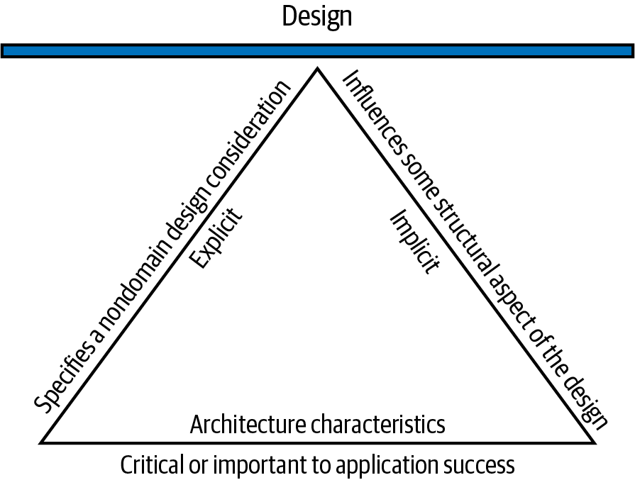
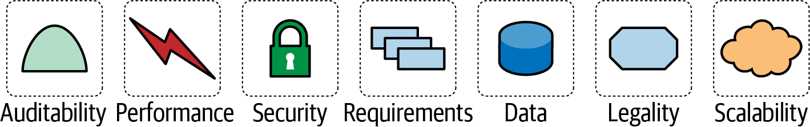
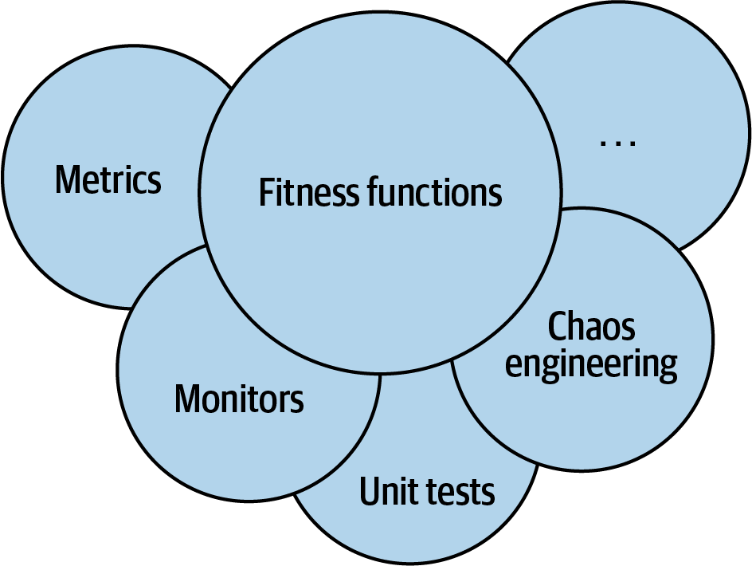
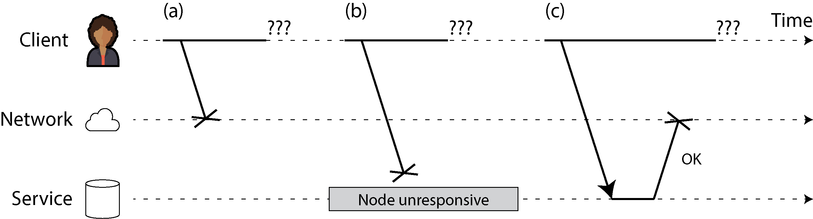
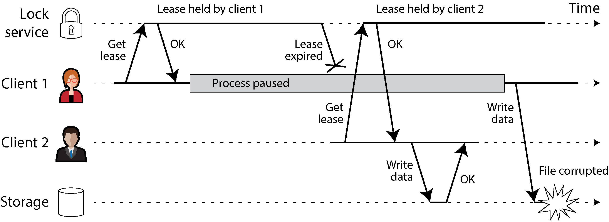
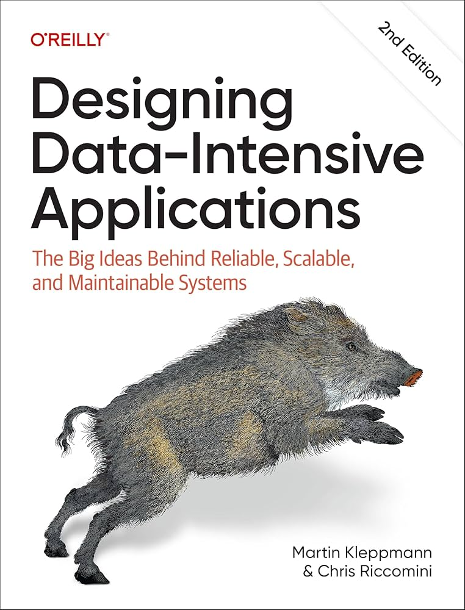

<!--
_backgroundColor: #0a1929
_color: white
_class: title dark
-->

# システムは「動く」だけでは 足りない

### 非機能要件・分散システム・トレードオフの基礎

2026/04/17 TECH BAR @NUTIC co-created with 3-shake 
@nwiizo 20min

---

<h2 id="nwiizo">nwiizo</h2>

株式会社スリーシェイクでプロのソフトウェアエンジニアをやっているものです。SREやクラウドネイティブ技術を専門にしています。

趣味は読書、格闘技、グラビアです。

インターネット上では <strong>nwiizo</strong> を名乗り、ブログ「<strong>じゃあ、おうちで学べる</strong>」を運営しています。X / GitHub もこのIDでやっています。

---

<h2 id="about-3-shake">about 3-shake</h2>

---

<h2 id="%E4%BB%8A%E6%97%A5%E3%81%8A%E8%A9%B1%E3%81%97%E3%81%99%E3%82%8B%E3%81%93%E3%81%A8">今日お話しすること</h2>

<ol>
<li><strong>非機能要件とは何か</strong> — 「動く」の先にあるもの</li>
<li><strong>分散システムという選択肢</strong> — なぜ分散し、何が難しいのか</li>
<li><strong>トレードオフという現実</strong> — 正解のない世界での判断</li>
</ol>

ソフトウェアエンジニアが日々向き合っている「設計の考え方」を、できるだけ身近な例で紹介します。授業や本で出てくる言葉が、実際の現場でどう使われるのかをイメージできるようになるのがゴールです。

この仕事の面白さは、正解を暗記することではなく、現実の制約の中で「なぜこの形にするのがよいか」を考え続けるところにあります。

---

<h2 id="%E3%81%93%E3%81%AE%E7%99%BA%E8%A1%A8%E3%81%A7%E8%A7%A3%E6%B1%BA%E3%81%A7%E3%81%8D%E3%82%8B%E3%81%93%E3%81%A8">この発表で解決できること</h2>

<strong>こんな疑問を持っていませんか？</strong>

<ul>
<li>「動けばOK」の先に何があるの？</li>
<li>分散システムって何がそんなに難しい？</li>
<li>設計の「良い・悪い」はどう決まる？</li>
</ul>

<strong>この発表で持ち帰れるもの</strong>

<ul>
<li>非機能要件という視点の獲得</li>
<li>分散システムの本質的な難しさの理解</li>
<li>「トレードオフで考える」という設計思考</li>
</ul>

目標：「なぜそう設計したのか」を語れるようになる

就職してから役に立つのは、ライブラリ名をいくつ知っているかより、<strong>理由を持って判断できるか</strong>です。そこがエンジニアの仕事の面白いところでもあります。

---

<h2 id="%E4%BB%8A%E6%97%A5%E3%81%AE%E8%A6%8B%E6%96%B9">今日の見方</h2>

この発表は、用語をたくさん覚えるためのものではありません。次の3つの感覚を持ち帰ってもらえれば十分です。

<strong>1. 動く</strong>

だけでは足りない

<strong>2. 分散</strong>

すると世界が変わる

<strong>3. 設計</strong>

は優先順位を決める仕事

---

<h2 id="span-stylecolor-white%E9%9D%9E%E6%A9%9F%E8%83%BD%E8%A6%81%E4%BB%B6%E3%81%A8%E3%81%AF%E4%BD%95%E3%81%8Bspan">非機能要件とは何か</h2>

「動く」は当たり前。問題は「どう動くか」

---

<h2 id="%E6%A9%9F%E8%83%BD%E8%A6%81%E4%BB%B6%E3%81%A8%E9%9D%9E%E6%A9%9F%E8%83%BD%E8%A6%81%E4%BB%B6%E3%81%AE%E9%81%95%E3%81%84">機能要件と非機能要件の違い</h2>

ECサイトの「商品検索」を例に考えてみます。

<strong>機能要件（What）</strong>

商品名で検索できる。カテゴリで絞り込める。検索結果を価格順に並べ替えられる。

→ <strong>システムが「何をするか」</strong>

<strong>非機能要件（How）</strong>

検索結果を0.5秒以内に返す。同時に1万人が使ってもダウンしない。24時間365日稼働する。

→ <strong>システムが「どう動くか」</strong>

機能が同じでも、非機能要件でシステムの設計はまったく変わる

---

<h2 id="%E4%BB%A3%E8%A1%A8%E7%9A%84%E3%81%AA%E9%9D%9E%E6%A9%9F%E8%83%BD%E8%A6%81%E4%BB%B6">代表的な非機能要件</h2>

<table>
<thead>
<tr>
<th>非機能要件</th>
<th>意味</th>
<th>身近な例</th>
</tr>
</thead>
<tbody>
<tr>
<td>可用性</td>
<td>止まらずに動き続ける</td>
<td>LINEが大晦日でも使える</td>
</tr>
<tr>
<td>性能</td>
<td>速く応答する</td>
<td>Google検索が0.3秒で返る</td>
</tr>
<tr>
<td>スケーラビリティ</td>
<td>負荷増加に耐える</td>
<td>セール開始でもECが落ちない</td>
</tr>
<tr>
<td>耐障害性</td>
<td>壊れても復旧する</td>
<td>サーバー1台壊れても全体は動く</td>
</tr>
<tr>
<td>一貫性</td>
<td>データが矛盾しない</td>
<td>振込後の残高が正しい</td>
</tr>
</tbody>
</table>

ここで大事なのは、これらを<strong>バラバラの単語として覚えないこと</strong>です。実際のシステムでは「速くしたい」「止めたくない」「ズレたくない」が同時に出てきて、そこで設計の悩みが始まります。

---

<h2 id="%E5%93%81%E8%B3%AA%E3%81%A9%E3%81%86%E3%81%97%E3%81%AF%E5%BC%95%E3%81%A3%E5%BC%B5%E3%82%8A%E5%90%88%E3%81%86">品質どうしは引っ張り合う</h2>

これらはそれぞれ別の話に見えますが、実際はつながっています。

たとえば「絶対に止めたくない」を優先すると、データの厳密さを少しゆるめることがある。

逆に「絶対にデータをズラしたくない」を優先すると、待ち時間が増えたり、止めざるをえないことがある。

この引っ張り合いが、あとで出てくるトレードオフです

---

<h2 id="%E3%81%BE%E3%81%9A%E6%8A%BC%E3%81%95%E3%81%88%E3%81%9F%E3%81%843%E3%81%A4%E3%81%AE%E5%93%81%E8%B3%AA%E8%BB%B8">まず押さえたい3つの品質軸</h2>

<strong>信頼性（Reliability）</strong>

想定外の入力や人為ミス、ハードウェア故障が起きても、システムが期待どおりに振る舞い続けること。

<strong>スケールしやすさ（Scalability）</strong>

利用者数やデータ量、トラフィックが増えても、破綻せずに伸ばしていけること。

<strong>保守性（Maintainability）</strong>

将来の変更、障害対応、機能追加を、チームが継続的に扱えること。

この3つは、長く使われるシステムを考えるときの基本の見方です。単に速いだけでも、単に止まらないだけでも足りません。<strong>あとから直せるか、育てられるか</strong>まで含めて考えないと、長く使うシステムは苦しくなります。

「今動くか」ではなく「壊れても、伸びても、変わっても耐えられるか」で見る

---

<h2 id="%E3%81%93%E3%81%93%E3%81%8B%E3%82%89%E3%81%AF%E8%A8%AD%E8%A8%88%E3%81%AE%E8%A8%80%E8%91%89%E3%81%A7%E8%A6%8B%E3%81%A6%E3%81%BF%E3%82%8B">ここからは「設計の言葉」で見てみる</h2>

ここまでは、速さ・止まりにくさ・直しやすさといった<strong>品質の話</strong>として見てきました。

では、エンジニアが実際に設計するときは、これらをどう扱うのでしょうか。

ここで出てくるのが、<strong>「非機能要件」よりも「アーキテクチャ特性」と呼ぶ見方</strong>です。言い換えると、「あとで気をつける品質」ではなく、最初から構造に入れるべき条件として見る、ということです。

---

<h2 id="%E9%9D%9E%E6%A9%9F%E8%83%BD%E8%A6%81%E4%BB%B6%E3%81%A7%E3%81%AF%E3%81%AA%E3%81%8F%E3%82%A2%E3%83%BC%E3%82%AD%E3%83%86%E3%82%AF%E3%83%81%E3%83%A3%E7%89%B9%E6%80%A7%E3%81%A8%E8%A6%8B%E3%82%8B">「非機能要件」ではなく「アーキテクチャ特性」と見る</h2>

出典: Fundamentals of Software Architecture, 2nd Edition, Figure 4-2 をもとに作成

ここでは、単なる「非機能要件」ではなく<strong>アーキテクチャ特性</strong>として見るほうがしっくりきます。

<ul>
<li>ドメイン機能そのものではない</li>
<li>構造設計に影響する</li>
<li>そのシステムの成功に重要である</li>
</ul>

つまり、可用性や性能は「あとで頑張る品質」ではなく、<strong>最初に構造へ織り込む判断材料</strong>です。ここを後回しにすると、実装が進むほど直しづらくなります。

---

<h2 id="%E3%82%B7%E3%82%B9%E3%83%86%E3%83%A0%E3%81%AF%E6%A9%9F%E8%83%BD%E3%81%A0%E3%81%91%E3%81%A7%E3%81%AF%E8%A8%AD%E8%A8%88%E3%81%A7%E3%81%8D%E3%81%AA%E3%81%84">システムは「機能」だけでは設計できない</h2>

出典: Fundamentals of Software Architecture, 2nd Edition, Figure 4-1 をもとに作成

私は、ソフトウェアの解決策は<strong>ドメイン要件</strong>と<strong>アーキテクチャ特性</strong>の両方でできていると考えています。

<ul>
<li>ドメイン要件: 商品を検索する、送金する、予約する</li>
<li>アーキテクチャ特性: 速い、止まらない、変更しやすい、守られている</li>
</ul>

機能だけ見ると「一応動くもの」は作れます。でも本番で遅い、よく落ちる、直しにくい、となりがちです。逆に品質の話だけしても、何を作りたいのかがぼやけます。<strong>やりたいことと、そのやり方の両方を見るのが設計</strong>です。

ここに、エンジニアリングの面白さがあります。コードを書く前に、どんな世界を作るかを考えているからです。

---

<h2 id="%E8%89%AF%E3%81%84%E7%89%B9%E6%80%A7%E3%81%AF%E6%B8%AC%E3%82%8C%E3%82%8B%E8%A8%80%E8%91%89%E3%81%AB%E7%BF%BB%E8%A8%B3%E3%81%99%E3%82%8B">良い特性は「測れる言葉」に翻訳する</h2>

ここで大事なのは、「いい感じに速い」みたいな曖昧な言い方では、設計の話が前に進まないということです。

<table>
<thead>
<tr>
<th>ふわっとした言葉</th>
<th>設計に使える言葉</th>
</tr>
</thead>
<tbody>
<tr>
<td>高速にしたい</td>
<td>p95 応答時間 300ms 以下</td>
</tr>
<tr>
<td>落ちにくくしたい</td>
<td>月間可用性 99.95%</td>
</tr>
<tr>
<td>変更しやすくしたい</td>
<td>1機能のリードタイムを 1 日以内</td>
</tr>
<tr>
<td>安全にしたい</td>
<td>個人情報アクセスは監査ログ必須</td>
</tr>
</tbody>
</table>

平均だけ見ると、たまにものすごく遅いケースが隠れてしまいます。だから「100回中95回はここまでに返る」のような、<strong>ばらつきが見える指標</strong>が大事になります。

---

<h2 id="%E7%89%B9%E6%80%A7%E3%81%AF%E5%AE%88%E3%82%8B%E4%BB%95%E7%B5%84%E3%81%BF%E3%81%BE%E3%81%A7%E5%90%AB%E3%82%81%E3%81%A6%E8%A8%AD%E8%A8%88%E3%81%99%E3%82%8B">特性は「守る仕組み」まで含めて設計する</h2>

出典: Fundamentals of Software Architecture, 2nd Edition, Figure 6-2 をもとに作成

性能やレイヤ分離、依存関係の制約は、会議で言うだけでは守られません。だから私は、こうしたものを<strong>「設計ルールを自動で確認する仕組み（fitness function）」</strong>として継続的に検証するのが大事だと思っています。

<ul>
<li>CIで循環依存を落とす</li>
<li>100回中95回の応答時間が基準を超えたら警告する</li>
<li>controller から repository 直参照を禁止する</li>
</ul>

大事なのは、<strong>良い設計を『みんな気をつけよう』だけで守らないこと</strong>です。

---

<h2 id="%E9%9D%9E%E6%A9%9F%E8%83%BD%E8%A6%81%E4%BB%B6%E3%82%92%E8%BB%BD%E8%A6%96%E3%81%99%E3%82%8B%E3%81%A8%E3%81%A9%E3%81%86%E3%81%AA%E3%82%8B%E3%81%8B">非機能要件を軽視するとどうなるか</h2>

<strong>ゲームのリリース日にサーバーが落ちる</strong> — スケーラビリティの見積もり不足。機能は完璧でも、ユーザーが殺到した瞬間に破綻する。発売日のSNSは阿鼻叫喚になる。

<strong>ECサイトの在庫が「あるのに買えない」</strong> — 一貫性の問題。2人が同時に最後の1個をカートに入れた。片方は決済後に「在庫切れ」と表示される。

<strong>ページ表示が3秒かかるとユーザーの53%が離脱する</strong> — 性能の問題。機能的には正しく動いている。ただ遅いだけ。それだけでサービスは死ぬ。

障害の多くは「機能のバグ」ではなく「非機能要件の敗北」

---

<h2 id="%E3%81%93%E3%81%93%E3%81%BE%E3%81%A7%E3%81%A7%E8%A6%8B%E3%81%88%E3%81%A6%E3%81%8D%E3%81%9F%E3%81%93%E3%81%A8">ここまでで見えてきたこと</h2>

<strong>ここまででわかったこと</strong>

機能が同じでも、速さ・止まりにくさ・直しやすさが違えば、設計は大きく変わる。

<strong>次の問い</strong>

「では、その品質を満たすために、システムの形はどう変わるのか？」 
→ 分散システムの話へ

---

<h2 id="span-stylecolor-white%E5%88%86%E6%95%A3%E3%82%B7%E3%82%B9%E3%83%86%E3%83%A0%E3%81%A8%E3%81%84%E3%81%86%E9%81%B8%E6%8A%9E%E8%82%A2span">分散システムという選択肢</h2>

非機能要件を満たすために、システムを「分ける」

---

<h2 id="%E3%81%AA%E3%81%9C%E3%82%B7%E3%82%B9%E3%83%86%E3%83%A0%E3%82%92%E5%88%86%E6%95%A3%E3%81%95%E3%81%9B%E3%82%8B%E3%81%AE%E3%81%8B">なぜシステムを分散させるのか</h2>

出典: Building Microservices, 2nd Edition, Figure 3.4 "Monolith vs Distributed" を引用

<strong>A: モノリス</strong> — 1台の箱にすべてが入っている。シンプルだが、CPUもメモリも物理的に上限がある。そしてその1台が壊れたら、すべてが止まる。

<strong>B: 分散システム</strong> — 複数のサービスがネットワークで繋がっている。見てわかるように、構造は一気に複雑になる。

分散の動機は3つ。<strong>スケーラビリティ</strong>（1台で足りなければ10台に）、<strong>可用性</strong>（1台壊れても残りが引き継ぐ）、<strong>地理的分散</strong>（ユーザーの近くにサーバーを置く）。

---

<h2 id="%E5%88%86%E6%95%A3%E3%81%97%E3%81%AA%E3%81%84%E3%81%A8%E3%81%84%E3%81%86%E9%81%B8%E6%8A%9E%E3%82%82%E7%AB%8B%E6%B4%BE%E3%81%AA%E8%A8%AD%E8%A8%88">分散しないという選択も立派な設計</h2>

分散システムは強力ですが、常に正義ではありません。

<strong>最初はモノリスで十分なケース</strong>

<ul>
<li>ユーザー数がまだ少ない</li>
<li>チームが 3〜5 人程度</li>
<li>ドメイン理解がまだ固まっていない</li>
<li>速く試して学ぶことが重要</li>
</ul>

<strong>分散のコスト</strong>

<ul>
<li>通信失敗の処理が必要</li>
<li>データ整合性が難しくなる</li>
<li>監視・デバッグが一気に複雑化</li>
<li>チーム間調整が増える</li>
</ul>

「分散できるか」ではなく「分散する理由があるか」で決める

---

<h2 id="%E5%88%86%E6%95%A3%E3%81%8C%E7%94%9F%E3%82%80%E6%96%B0%E3%81%97%E3%81%84%E9%9B%A3%E3%81%97%E3%81%95">分散が生む新しい難しさ</h2>

サーバーを分けると、1台で動かしていたときには考えなくてよかった問題が一気に増えます。

<strong>部分障害（Partial Failure）</strong> — 全部が止まるわけではなく、「一部だけ壊れる」状態です。10台のうち2台だけおかしい、ある画面だけ失敗する、という形で現れます。分散すると「完全に動く / 完全に止まる」の二択ではなくなります。

<strong>データの整合性</strong> — 同じデータを複数の場所に置くと、「どれが最新なの？」という問題が出ます。全員の足並みをそろえようとすると遅くなるし、急いで返そうとすると少し古い値を見ることがあります。

1台なら「fault = failure」。分散すると「fault ≠ failure」になる

---

<h2 id="%E3%83%8D%E3%83%83%E3%83%88%E3%83%AF%E3%83%BC%E3%82%AF%E3%81%AE%E4%B8%8D%E7%A2%BA%E5%AE%9F%E6%80%A7">ネットワークの不確実性</h2>

出典: Designing Data-Intensive Applications, 2nd Edition, Figure 9-1 を引用

リクエストを送って返事が来ない。原因は3つ考えられる。

<strong>(a)</strong> リクエストがネットワーク上で消えた 
<strong>(b)</strong> 相手のノードが落ちている 
<strong>(c)</strong> 処理は成功したがレスポンスが消えた

使う側から見ると、どれも同じ「返事が来ない」です。つまり、<strong>本当に失敗したのか、成功したけど返事だけ消えたのか、見分けがつかない。</strong>

この「不明」という第3の状態が分散システム最大の敵です。

---

<h2 id="%E5%A4%B1%E6%95%97%E3%82%92%E5%89%8D%E6%8F%90%E3%81%AB%E3%81%97%E3%81%9F%E5%9F%BA%E6%9C%AC%E6%88%A6%E7%95%A5">失敗を前提にした基本戦略</h2>

ネットワークやサーバーの失敗は、「たまに起きる事故」ではなく、「いつか必ず起きるもの」として考えるべきです。

<strong>待ちすぎない（Timeout）</strong>

永遠に待たない。失敗を検知する。

<strong>やり直す（Retry）</strong>

一時的障害なら再試行する。

まずは「永遠に待たない」「一時的ならやり直す」という基本を入れます。ただし、ここで新しい問題が出ます。

---

<h2 id="%E3%82%84%E3%82%8A%E7%9B%B4%E3%81%99%E3%81%AA%E3%82%89%E4%BA%8C%E9%87%8D%E5%AE%9F%E8%A1%8C%E3%82%92%E9%98%B2%E3%81%8C%E3%81%AA%E3%81%84%E3%81%A8%E3%81%84%E3%81%91%E3%81%AA%E3%81%84">やり直すなら「二重実行」を防がないといけない</h2>

やり直しを入れると、同じ処理が複数回送られる可能性があります。だから必要になるのが、<strong>何回送っても結果が壊れない性質（Idempotency）</strong>です。

たとえば「注文を作る」API が 2 回呼ばれても、注文が 2 件増えたら困る。 
同じリクエストIDなら 1 回分として扱う、という工夫が必要になります。

失敗に強くするには、やり直せるだけでなく、やり直しても壊れないことが必要

---

<h2 id="%E6%88%90%E5%8A%9F%E3%81%97%E3%81%9F%E3%81%8B%E4%B8%8D%E6%98%8E%E3%81%B8%E3%81%AE%E5%AF%BE%E5%87%A6">「成功したか不明」への対処</h2>

注文 API を呼んで 3 秒後にタイムアウトしたとします。このとき、クライアントには 3 つの可能性があります。

<ol>
<li>そもそも注文は作成されていない</li>
<li>注文は作成されたが、応答だけ失われた</li>
<li>DB には書かれたが後続処理が途中で止まった</li>
</ol>

だから設計では、「その場ですぐ白黒つかない」ことを前提にします。注文番号やリクエストIDで<strong>二重登録を防ぐ</strong>、あとで状態を確認できるようにする、必要ならやり直しや取り消しを用意する。こういう地味な工夫が本番の強さになります。

派手さはありませんが、こういう「事故を未然に防ぐ仕組み」を考えるのも、プロのエンジニアの面白さです。

---

<h2 id="%E5%88%86%E6%95%A3%E3%83%AD%E3%83%83%E3%82%AF%E3%81%AF%E6%83%B3%E5%83%8F%E3%82%88%E3%82%8A%E5%8D%B1%E3%81%AA%E3%81%84">分散ロックは想像より危ない</h2>

出典: Designing Data-Intensive Applications, 2nd Edition, Figure 9-4 を引用

「ロックを取ったからもう安全」と考えがちですが、ここには強い落とし穴があります。

<ul>
<li>クライアント1がロック取得</li>
<li>GC pause や stop-the-world で長時間停止</li>
<li>その間に lease が失効</li>
<li>クライアント2が新しいロック取得</li>
<li>クライアント1が復帰して古い前提で書き込み</li>
</ul>

つまり、「ちゃんとロックしていたはず」という前提が崩れることがある。<strong>分散システムでは、時間や実行順序を信じすぎない</strong>ことが大事です。

---

<h2 id="%E5%88%86%E6%95%A3%E3%82%B3%E3%83%B3%E3%83%94%E3%83%A5%E3%83%BC%E3%83%86%E3%82%A3%E3%83%B3%E3%82%B0%E3%81%AE8%E3%81%A4%E3%81%AE%E8%AA%A4%E8%AC%AC">分散コンピューティングの8つの誤謬</h2>

1991年にSun Microsystemsのエンジニアたちがまとめた、分散システム初心者が陥りがちな思い込みです。30年以上経った今でもまったく色褪せていない。

<ol>
<li>ネットワークは信頼できる</li>
<li>レイテンシはゼロ</li>
<li>帯域幅は無限</li>
<li>ネットワークは安全</li>
</ol>

<ol start="5">
<li>トポロジは変化しない</li>
<li>管理者は一人</li>
<li>転送コストはゼロ</li>
<li>ネットワークは均一</li>
</ol>

手元で関数を呼ぶときは、たいてい「成功」か「失敗」です。でもネットワーク越しだと「成功したかどうかわからない」が混ざります。この「わからない」が、分散システムを難しくします。

全部ウソ。だが全部、最初は本当だと思ってしまう

---

<h2 id="%E3%82%B5%E3%83%BC%E3%83%93%E3%82%B9%E3%82%92%E5%88%86%E3%81%91%E3%81%A6%E3%82%82%E7%B5%90%E5%90%88%E3%81%AF%E6%B6%88%E3%81%88%E3%81%AA%E3%81%84">サービスを分けても結合は消えない</h2>

ここでは、結合の強さを決める要因は<strong>共有ライフサイクル（shared lifecycle）</strong>と<strong>共有知識（shared knowledge）</strong>だと考えます。

<strong>共有ライフサイクル</strong>

一緒にテスト、一緒にデプロイ、一緒に障害対応が必要だと、実質的には近いまま。

<strong>共有知識</strong>

片方の内部モデルやDB都合をもう片方が知っていると、変更は連鎖する。

マイクロサービスに分けると、見た目は独立したように見えます。でも境界の切り方が雑だと、<strong>別サービスなのに毎回セットで直す</strong>ことになります。

---

<h2 id="%E9%9D%9E%E5%90%8C%E6%9C%9F%E3%81%AB%E3%81%99%E3%82%8C%E3%81%B0%E8%87%AA%E5%8B%95%E3%81%A7%E7%96%8E%E7%B5%90%E5%90%88%E3%81%AB%E3%81%AA%E3%82%8B%E3%82%8F%E3%81%91%E3%81%A7%E3%81%AF%E3%81%AA%E3%81%84">非同期にすれば自動で疎結合になるわけではない</h2>

イベント駆動やメッセージングは、確かに実行中の結びつき（runtime coupling）を下げます。送信側が一時停止しても、受信側はすぐには止まりません。

しかし、イベントに送信側の内部モデルがそのまま漏れていると、スキーマ変更のたびに受信側も巻き込まれます。

言い換えると、<strong>物理的な距離（distance）</strong>と<strong>結びつきの強さ（integration strength）</strong>は別物です。配置だけ分けても、共有知識が強ければ、結局は大きく絡み合った扱いにくいシステムになります。

---

<h2 id="%E3%81%93%E3%81%93%E3%81%BE%E3%81%A7%E3%81%A7%E8%A6%8B%E3%81%88%E3%81%A6%E3%81%8D%E3%81%9F%E3%81%93%E3%81%A8-1">ここまでで見えてきたこと</h2>

<strong>ここまででわかったこと</strong>

分散システムは便利だが、失敗・通信・結合の問題を自動で解決してくれるわけではない。

<strong>次の問い</strong>

「では、そんな中で何を優先して決めればいいのか？」 
→ トレードオフの話へ

---

<h2 id="span-stylecolor-white%E3%81%99%E3%81%B9%E3%81%A6%E3%81%AF%E3%83%88%E3%83%AC%E3%83%BC%E3%83%89%E3%82%AA%E3%83%95span">すべてはトレードオフ</h2>

"There are no solutions. There are only trade-offs." 
— Thomas Sowell

---

<h2 id="cap%E5%AE%9A%E7%90%86%E3%81%A8%E3%81%9D%E3%81%AE%E9%99%90%E7%95%8C">CAP定理とその限界</h2>

分散システムでは、以下の3つを同時に完全には満たせないとされています。

<strong>C: 一貫性（Consistency）</strong> 
すべてのノードが同じデータを返す

<strong>A: 可用性（Availability）</strong> 
すべてのリクエストに応答する

<strong>P: 分断耐性（Partition Tolerance）</strong> 
ネットワーク障害でも動く

ネットワーク分断（P）は現実に起きる。だからCとAのどちらを優先するかを選ぶことになります。ただし、CAP定理は「ネットワーク分断時」の話に限定されていて、レイテンシやスループットなど日常的なトレードオフはカバーしていない。実際の設計判断はCAPだけでは足りず、<strong>「分断がない平常時にも、一貫性とレイテンシのトレードオフがある」</strong>（PACELC）という視点が必要です。

---

<h2 id="%E4%B8%80%E8%B2%AB%E6%80%A7%E3%81%A8%E5%8F%AF%E7%94%A8%E6%80%A7%E3%81%AE%E9%81%B8%E6%8A%9E">一貫性と可用性の選択</h2>

同じ「データの書き込み」でも、サービスの性質によって正解が変わります。

<strong>銀行の送金 → 一貫性を優先</strong>

AさんからBさんへの10万円の送金。途中でネットワーク障害が起きたとき、「とりあえず両方の口座から引いておく」は許されない。一時的にサービスが止まっても、残高は正確でなければならない。

<strong>SNSの「いいね」→ 可用性を優先</strong>

投稿への「いいね」数が一瞬だけ99と100でずれても誰も困らない。それより「いいね」ボタンが押せない方が問題。多少の不整合は後から修正すればいい。

技術が同じでも、文脈が変われば最適解は変わる

---

<h2 id="%E5%90%8C%E6%9C%9F%E9%80%9A%E4%BF%A1%E3%81%A8%E9%9D%9E%E5%90%8C%E6%9C%9F%E9%80%9A%E4%BF%A1%E3%81%AE%E3%83%88%E3%83%AC%E3%83%BC%E3%83%89%E3%82%AA%E3%83%95">同期通信と非同期通信のトレードオフ</h2>

<strong>同期通信</strong>

<ul>
<li>呼び出し結果がすぐわかる</li>
<li>実装は比較的わかりやすい</li>
<li>相手が落ちると自分も巻き込まれやすい</li>
</ul>

<strong>非同期通信</strong>

<ul>
<li>障害伝播を抑えやすい</li>
<li>バッファリングしやすい</li>
<li>順序や重複の扱いが難しい</li>
</ul>

同期通信は「その場で返事がほしい」ときに向いています。非同期通信は「少し待ってもいいから、全体は止めたくない」ときに向いています。

---

<h2 id="%E9%9D%9E%E5%90%8C%E6%9C%9F%E9%80%9A%E4%BF%A1%E3%81%AB%E3%82%82%E5%88%A5%E3%81%AE%E9%9B%A3%E3%81%97%E3%81%95%E3%81%8C%E3%81%82%E3%82%8B">非同期通信にも別の難しさがある</h2>

私の見方では、同期通信は<strong>実行中の依存関係</strong>を強くします。つまり、相手がその場で生きていないと自分も困りやすい。

ただし、非同期通信も万能薬ではありません。 
イベントの順序が前後する、同じメッセージが重複する、送る側の都合が受け取る側に漏れる、といった別の難しさが出ます。

だから大事なのは「同期か非同期かの宗教」ではなく、<strong>何を優先したいからその通信方式を選ぶのか</strong>です。

---

<h2 id="cap%E3%81%A0%E3%81%91%E3%81%A7%E3%81%AF%E8%B6%B3%E3%82%8A%E3%81%AA%E3%81%84%E7%90%86%E7%94%B1">CAPだけでは足りない理由</h2>

CAP は有名ですが、これだけで実際の設計が全部決まるわけではありません。

<table>
<thead>
<tr>
<th>観点</th>
<th>CAP が教えてくれること</th>
<th>それでも残る問い</th>
</tr>
</thead>
<tbody>
<tr>
<td>分断時</td>
<td>C と A のどちらを優先するか</td>
<td>普段の遅さはどうする？</td>
</tr>
<tr>
<td>可用性</td>
<td>応答するかどうか</td>
<td>何秒で返すべきか？</td>
</tr>
<tr>
<td>一貫性</td>
<td>強いか弱いか</td>
<td>どの操作だけ強くするか？</td>
</tr>
</tbody>
</table>

現実の設計では、普段の速さ、運用の大変さ、チームが理解して扱えるかまで含めて判断します。だから「分断時」だけでなく「平常時にどれだけ遅くなるか」や「どこまで品質を約束するか」まで考える必要があります。

---

<h2 id="%E3%82%A2%E3%83%BC%E3%82%AD%E3%83%86%E3%82%AF%E3%83%81%E3%83%A3%E7%89%B9%E6%80%A7%E3%81%AF%E4%BA%92%E3%81%84%E3%81%AB%E5%B9%B2%E6%B8%89%E3%81%99%E3%82%8B">アーキテクチャ特性は互いに干渉する</h2>

アーキテクチャ特性は1個ずつ別々に最適化できず、<strong>お互いに影響し合う</strong>と私は考えています。

<strong>セキュリティを上げる</strong>

暗号化、認可、監査が増え、性能や操作性が下がることがある

<strong>可用性を上げる</strong>

冗長化や非同期化が増え、一貫性や理解容易性が下がることがある

<strong>保守性を上げる</strong>

抽象化が増え、短期的な実装速度や局所性能が落ちることがある

しかも、どの特性を重視するかは組織ごとに違います。だからこそ、チーム内で共通言語を持ち、<strong>測れる定義</strong>に落とすことが大事です。

---

<h2 id="%E3%83%88%E3%83%AC%E3%83%BC%E3%83%89%E3%82%AA%E3%83%95%E3%81%AF%E4%BD%95%E3%82%92%E8%AB%A6%E3%82%81%E3%82%8B%E3%81%8B%E3%81%AE%E9%81%B8%E6%8A%9E">トレードオフは「何を諦めるか」の選択</h2>

非機能要件の間には緊張関係があります。全部を同時に最高にすることはできません。

<table>
<thead>
<tr>
<th>トレードオフ</th>
<th>一方を追求すると</th>
<th>もう一方が</th>
</tr>
</thead>
<tbody>
<tr>
<td>一貫性  可用性</td>
<td>全ノード同期を待つ</td>
<td>レスポンスが遅くなる</td>
</tr>
<tr>
<td>性能  コスト</td>
<td>高速なハードウェアを使う</td>
<td>インフラ費用が膨らむ</td>
</tr>
<tr>
<td>シンプルさ  柔軟性</td>
<td>設定を少なくする</td>
<td>特殊なケースに対応できない</td>
</tr>
<tr>
<td>安全性  利便性</td>
<td>認証を厳しくする</td>
<td>ユーザー体験が悪化する</td>
</tr>
</tbody>
</table>

---

<h2 id="%E3%83%88%E3%83%AC%E3%83%BC%E3%83%89%E3%82%AA%E3%83%95%E3%81%AF%E3%81%97%E3%81%8B%E3%81%9F%E3%81%AA%E3%81%84%E3%81%A7%E3%81%AF%E3%81%AA%E3%81%8F%E8%85%95%E3%81%AE%E8%A6%8B%E3%81%9B%E3%81%A9%E3%81%93%E3%82%8D">トレードオフは「しかたない」ではなく「腕の見せどころ」</h2>

トレードオフは「しかたなく我慢すること」ではありません。<strong>限られた時間・お金・人の中で、何をいちばん大事にするかを決めること</strong>です。「全部大事です」は、まだ何も決めていないのと同じです。

言い換えると、目指すのは「完璧な設計」ではなく、<strong>今の条件でいちばん無理の少ない設計</strong>です。全部を満たす理想形ではなく、制約の中でいちばん納得できる形を選ぶ。英語で言えば、<strong>least worst architecture</strong> に近い考え方です。

ここがこの仕事の面白いところです。制約があるからこそ、エンジニアは考える余地があります。<strong>完璧な答えを当てる仕事ではなく、条件の中で最も納得できる答えを組み立てる仕事</strong>です。

---

<h2 id="%E5%85%B8%E5%9E%8B%E7%9A%84%E3%81%AA%E8%A8%AD%E8%A8%88%E5%88%A4%E6%96%AD%E3%81%AE%E6%AF%94%E8%BC%83">典型的な設計判断の比較</h2>

<table>
<thead>
<tr>
<th>場面</th>
<th>重視するもの</th>
<th>よくある選択</th>
</tr>
</thead>
<tbody>
<tr>
<td>銀行送金</td>
<td>正しさ、一貫性、監査性</td>
<td>同期確認、強い整合性、冪等キー</td>
</tr>
<tr>
<td>SNSタイムライン</td>
<td>可用性、応答速度</td>
<td>キャッシュ、非同期更新、結果整合性</td>
</tr>
<tr>
<td>ECカタログ</td>
<td>読み取り性能、検索性</td>
<td>検索インデックス、派生データ</td>
</tr>
<tr>
<td>管理画面</td>
<td>保守性、実装速度</td>
<td>単純なCRUD、過度な分散を避ける</td>
</tr>
</tbody>
</table>

ここで大事なのは、「どれが唯一の正解か」ではなく、<strong>自分たちが何を優先したのか</strong>を説明できることです。

同じ技術を使っていても、会社やサービスが違えば答えが変わる。そこにこの仕事の奥行きがあります。

---

<h2 id="%E5%AE%9F%E5%8B%99%E3%81%A7%E3%81%AF%E6%9C%80%E5%B0%8F%E9%99%90%E3%81%AE%E8%A4%87%E9%9B%91%E3%81%95%E3%82%92%E9%81%B8%E3%81%B6">実務では「最小限の複雑さ」を選ぶ</h2>

設計は、「将来あるかもしれない全部の問題」に先回りして、最初から難しくするゲームではありません。

将来あるかもしれない負荷のために今から Kafka と CQRS と 20 マイクロサービスを入れるより、今の課題に対して<strong>最小限で十分な複雑さ</strong>を選ぶほうが良いことが多い。

複雑さそのものがコストです。理解するのも、壊れたときに直すのも、新しく入った人に教えるのも大変になります。だから「すごそうな設計」より「今の課題にちょうどいい設計」のほうが強いことが多いです。

---

<h2 id="%E3%83%88%E3%83%AC%E3%83%BC%E3%83%89%E3%82%AA%E3%83%95%E3%82%92%E5%88%A4%E6%96%AD%E3%81%99%E3%82%8B3%E3%81%A4%E3%81%AE%E5%95%8F%E3%81%84">トレードオフを判断する3つの問い</h2>

設計判断に迷ったとき、自分に問いかける3つの質問があります。

<strong>1. 最悪の場合、何が起きるか？</strong>

一貫性を緩めたらデータが消える？表示が1秒ずれる？被害の大きさで優先度が決まる。

<strong>2. それはどれくらいの頻度で起きるか？</strong>

年に1回のネットワーク分断に備えて常時性能を犠牲にするのか。頻度とコストのバランスを見る。

<strong>3. そのとき、ユーザーは何を感じるか？</strong>

エンジニアの視点では「99.9%の可用性」。ユーザーの視点では「年に8時間使えない時間がある」。数字の裏にある体験を想像する。

---

<h2 id="%E3%81%93%E3%81%AE%E4%BB%95%E4%BA%8B%E3%81%AE%E4%BD%95%E3%81%8C%E9%9D%A2%E7%99%BD%E3%81%84%E3%81%AE%E3%81%8B">この仕事の何が面白いのか</h2>

<strong>答えが1つではない</strong>

数学の問題のように唯一の正解があるわけではなく、条件に応じて「よりよい答え」を探します。

<strong>技術と現実をつなぐ</strong>

速さ、使いやすさ、お金、運用のしやすさを全部見ながら形にしていきます。

<strong>自分の判断が残る</strong>

設計した構造や仕組みが、何年も後のチームやユーザー体験に影響します。

コードを書くことはもちろん大事です。でも、<strong>どんな失敗を防ぐか、何を優先するか、どこで複雑さを止めるか</strong>を考えるところに、ソフトウェアエンジニアの仕事の面白さがあります。

「実装する人」で終わらず、「なぜその形にするかを考える人」になれるのが面白い

---

<h2 id="%E3%81%BE%E3%81%A8%E3%82%81">まとめ</h2>

<strong>非機能要件</strong>はシステムの品質を定義する。「何をするか」だけでなく「どう動くか」まで設計しなければ、本番環境で破綻する。

<strong>分散システム</strong>は非機能要件を満たすための強力な手段だが、部分障害やネットワークの不確実性という新しい問題を持ち込む。銀の弾丸ではない。

<strong>トレードオフ</strong>はエンジニアリングの本質。すべてを同時に最適化はできない。大事なのは「何を選び、何を諦めたか」を説明できること。

<strong>面白さ</strong>は、正解の丸暗記ではなく、状況に応じて判断を組み立てること。だからソフトウェアエンジニアは、技術者であると同時に設計者でもあります。

「正解」はない。「この文脈で最も妥当な選択」があるだけ

---

<h2 id="%E3%82%82%E3%81%A3%E3%81%A8%E6%B7%B1%E3%81%8F%E5%AD%A6%E3%81%B6%E3%81%9F%E3%82%81%E3%81%AE%E6%9C%AC">もっと深く学ぶための本</h2>

<strong>ソフトウェアアーキテクチャの基礎</strong>（Mark Richards, Neal Ford）— 今日話した「非機能要件」を「アーキテクチャ特性」と呼び、体系的に分析する方法を解説。トレードオフ分析の章が秀逸。

<strong>Building Microservices, 2nd Edition</strong>（Sam Newman）— モノリスから分割する判断基準、サービス間通信、分散データの整合性など、分散システムの設計を実践的に解説。

<strong>Designing Data-Intensive Applications, 2nd Edition</strong>（Martin Kleppmann）— 今日の発表の骨格となった本。信頼性・スケーラビリティ・保守性の定義から、レプリケーション、CAP定理の批判的検討、分散合意まで。"There are no solutions. There are only trade-offs." を体現する一冊。

---

  

<h1 id="%E3%81%82%E3%82%8A%E3%81%8C%E3%81%A8%E3%81%86span-classhighlight-yellow%E3%81%94%E3%81%96%E3%81%84%E3%81%BE%E3%81%97%E3%81%9Fspan">ありがとうございました</h1>
<h3 id="%E3%81%94%E8%B3%AA%E5%95%8F%E3%83%BB%E3%81%94%E7%9B%B8%E8%AB%87%E3%81%AF%E3%81%8A%E6%B0%97%E8%BB%BD%E3%81%AB%E3%81%A9%E3%81%86%E3%81%9E">ご質問・ご相談はお気軽にどうぞ</h3>

@nwiizo | <a href="https://3-shake.com">https://3-shake.com</a>

