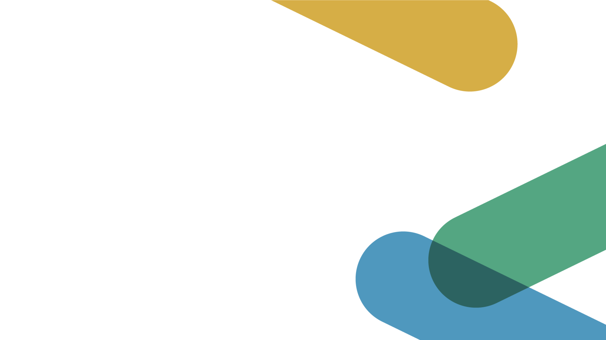
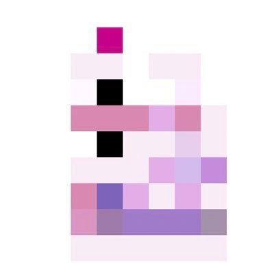
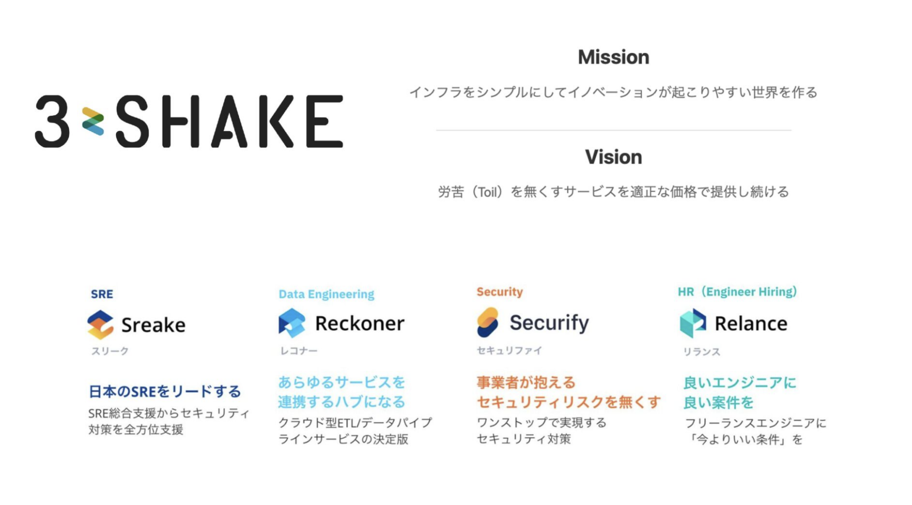
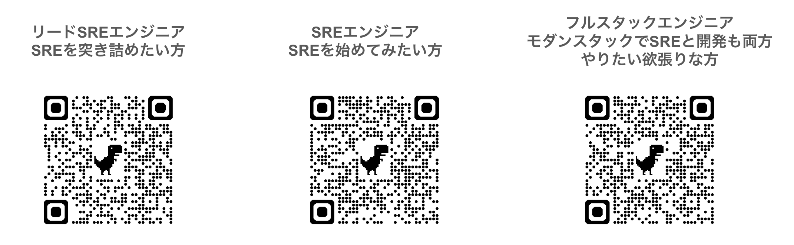

<!--
_backgroundColor: #0a1929
_color: white
_class: title dark
-->




<div class="title" style="text-align: left; margin-top: 100px; margin-left: 20px; padding-left: 0; max-width: 70%;">

# <span style="font-size: 1.2em;">プレゼンテーション</span></br><span class="highlight-yellow">タイトル</span>

### サブタイトル

</div>

<div class="author-info" style="text-align: left; padding-left: 0; text-indent: 0;">
2025/XX/XX イベント名</br>
@your_name 発表時間
</div>

---

<!-- _backgroundColor: white -->


## 自己紹介

<div class="info-box">
株式会社スリーシェイクで
ソフトウェアエンジニアをやっています
趣味や専門分野を記載してください
</div>

<p style="margin-top: 30px !important;">人生を通して大切にしていることを記載</p>

---

## about 3-shake

<div style="text-align: center; margin-top: 30px;">
  
</div>

---

## We are Hiring!!

<div style="text-align: center; margin-top: 30px;">

3-shakeは一緒にSRE界隈を盛り上げてくれる<strong>仲間を大募集中</strong>です！
Mobility、FinTech、通信など大規模SREを存分に経験できます
是非、カジュアル面談しましょう！

  
</div>

---

## 今日お話しすること

1. **セクション 1** - 概要説明
2. **セクション 2** - 詳細説明
3. **セクション 3** - 実践編
4. **まとめ**

---

## この発表で解決できること

### サブタイトル（対象者や目的）

<div style="font-size: 0.8em;">

<div style="display: flex; gap: 20px; margin-top: 15px;">
<div style="flex: 1; background-color: #f5f5f5; padding: 15px; border-radius: 8px;">

**こんな悩みを持っていませんか？**

- 悩み 1
- 悩み 2
- 悩み 3

</div>
<div style="flex: 1; background-color: #f5f5f5; padding: 15px; border-radius: 8px;">

**この発表で持ち帰れるもの**

- 得られること 1
- 得られること 2
- 得られること 3

</div>
</div>

<div style="margin-top: 15px; padding: 12px; background-color: #e0e0e0; border-radius: 5px; text-align: center;">
<span style="color: #e65100; font-weight: bold;">目標：この発表を聞いた人が〜できるようになる</span>
</div>

</div>

---

## <span class="highlight-blue">セクション 1</span>

<div style="background-color: #f5f5f5; padding: 15px; border-radius: 8px;">
このセクションについての重要情報をここに記載します。
</div>

* 要点 1
  * 詳細説明
  * 補足情報
* 要点 2
  * 詳細説明

---

## <span class="highlight-green">セクション 2</span>

### 2カラムレイアウト

<div style="font-size: 0.8em;">

<div style="display: flex; gap: 20px;">
<div style="flex: 1; background-color: #f5f5f5; padding: 15px; border-radius: 8px;">

**左カラム**
- 項目 1
- 項目 2
- 項目 3

</div>
<div style="flex: 1; background-color: #f5f5f5; padding: 15px; border-radius: 8px;">

**右カラム**
- 項目 A
- 項目 B
- 項目 C

</div>
</div>

</div>

---

<!--
_backgroundColor: #0a1929
_color: white
-->

<div style="display: flex; flex-direction: column; justify-content: center; align-items: center; height: 80%; text-align: center;">

<div style="font-size: 1.5em; font-weight: bold;">

セクション2はわかった。では、実践するには？

</div>

<div style="font-size: 0.9em; margin-top: 30px; color: #aaa;">

ここまでの内容を踏まえて<br/>
→ 具体的な実践方法を紹介

</div>

</div>

---

## <span class="highlight-yellow">セクション 3</span>

### テーブル（3〜4行程度に収める）

<div style="font-size: 0.8em;">

| 項目 | 説明 | 備考 |
|------|------|------|
| 項目 1 | 説明文 | - |
| 項目 2 | 説明文 | - |
| 項目 3 | 説明文 | - |

</div>

<div style="position: absolute; bottom: 30px; right: 80px; font-size: 0.5em; color: #666;">
<a href="https://example.com">参考: 出典元</a>
</div>

---

## 画像付きスライド

<div style="display: flex; gap: 40px;">
<div style="width: 35%;">

<div style="font-size: 0.7em; text-align: left; margin-top: 5px;">
画像の説明やソース
</div>
</div>

<div style="flex: 1;">
画像に関する説明文をここに記載します。</br></br>

1. **ポイント 1**
2. **ポイント 2**
3. **ポイント 3**
</div>
</div>

---

## コードブロック

```rust
fn main() {
    println!("Hello, 3-shake!");
}
```

<div style="margin-top: 30px; font-size: 0.9em;">
コードに関する補足説明を記載します
</div>

---

## まとめ

<div style="font-size: 0.8em;">

<div style="display: flex; gap: 20px;">
<div style="flex: 1; background-color: #f5f5f5; padding: 15px; border-radius: 8px;">

**本発表の要点**

- セクション 1のまとめ
- セクション 2のまとめ
- セクション 3のまとめ

</div>
<div style="flex: 1; background-color: #f5f5f5; padding: 15px; border-radius: 8px;">

**今後のアクション**

- 次にやること 1
- 次にやること 2
- 今後の展望

</div>
</div>

<div style="margin-top: 15px; padding: 12px; background-color: #e0e0e0; border-radius: 5px; text-align: center;">
<span style="color: #e65100; font-weight: bold;">最も伝えたいメッセージをここに</span>
</div>

</div>

---

## 参考資料

* [リンク 1](https://example.com)
* [リンク 2](https://example.com)
* [リンク 3](https://example.com)

---

<!--
_backgroundColor: #0a1929
_color: white
_class: title dark
-->


<!-- タイトルページ左上に大きなロゴを表示 -->
<div style="position: absolute !important; top: 5px !important; left: 5px !important; z-index: 9999 !important; margin: 0 !important; padding: 0 !important;">
  
</div>

<div style="text-align: center; margin-top: 200px;">

# ありがとう<span class="highlight-yellow">ございました</span>

### ご質問・ご相談はお気軽にお問い合わせください

@your_name | https://3-shake.com
</div>
