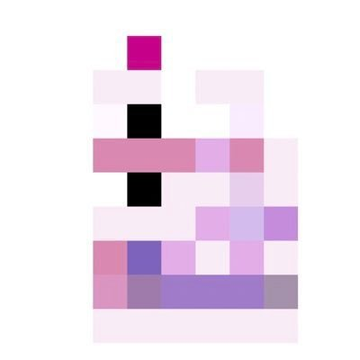
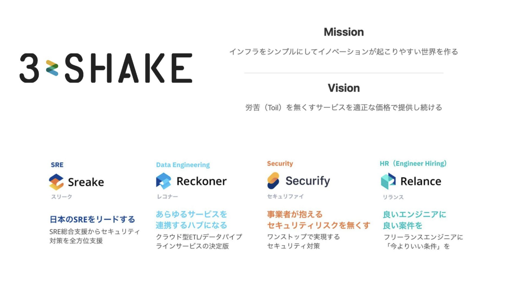
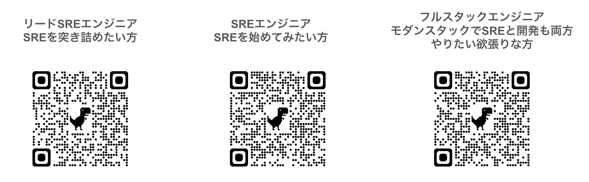

<!--
_backgroundColor: #0a1929
_color: white
_class: title dark
-->

# プレゼンテーション タイトル

### サブタイトル

2025/XX/XX イベント名 
@your_name 発表時間

---

<!-- _backgroundColor: white -->

## 自己紹介

株式会社スリーシェイクで
ソフトウェアエンジニアをやっています
趣味や専門分野を記載してください

人生を通して大切にしていることを記載

---

## about 3-shake

  

---

## We are Hiring!!

3-shakeは一緒にSRE界隈を盛り上げてくれる<strong>仲間を大募集中</strong>です！
Mobility、FinTech、通信など大規模SREを存分に経験できます
是非、カジュアル面談しましょう！

  

---

<!-- _backgroundColor: white -->

## アジェンダ

* 項目 1
* 項目 2
* 項目 3
* 項目 4
* 項目 5

---

<!-- _backgroundColor: white -->

## セクション 1

このセクションについての重要情報をここに記載します。

* 要点 1
* 要点 2
* 要点 3

---

<!-- _backgroundColor: white -->

## セクション 2

### 2カラムレイアウト

**左カラム**
- 項目 1
- 項目 2
- 項目 3

**右カラム**
- 項目 A
- 項目 B
- 項目 C

---

<!-- _backgroundColor: white -->

## セクション 3

| 項目 | 説明 |
|------|------|
| 項目 1 | 説明文 |
| 項目 2 | 説明文 |
| 項目 3 | 説明文 |

---

<!-- _backgroundColor: white -->

## 画像 + テキストレイアウト

画像の説明やソース

画像に関する説明文をここに記載します。  

1. **ポイント 1**
2. **ポイント 2**
3. **ポイント 3**

---

<!-- _backgroundColor: white -->

## 右側に画像配置

画像を右側に配置した場合のレイアウト例です。

* 要点 1
* 要点 2
* 要点 3

参考：ソース名やURL

---

<!-- _backgroundColor: white -->

## まとめ

本発表の要点をまとめます。

* セクション 1のまとめ
* セクション 2のまとめ
* セクション 3のまとめ
* 今後の展望と課題

---

## 参考資料

* [リンク 1](https://example.com)
* [リンク 2](https://example.com)
* [リンク 3](https://example.com)

---

<!--
_backgroundColor: #0a1929
_color: white
_class: title dark
-->

<!-- タイトルページ左上に大きなロゴを表示 -->

  

# ありがとうございました

### ご質問・ご相談はお気軽にお問い合わせください

@your_name | https://3-shake.com

